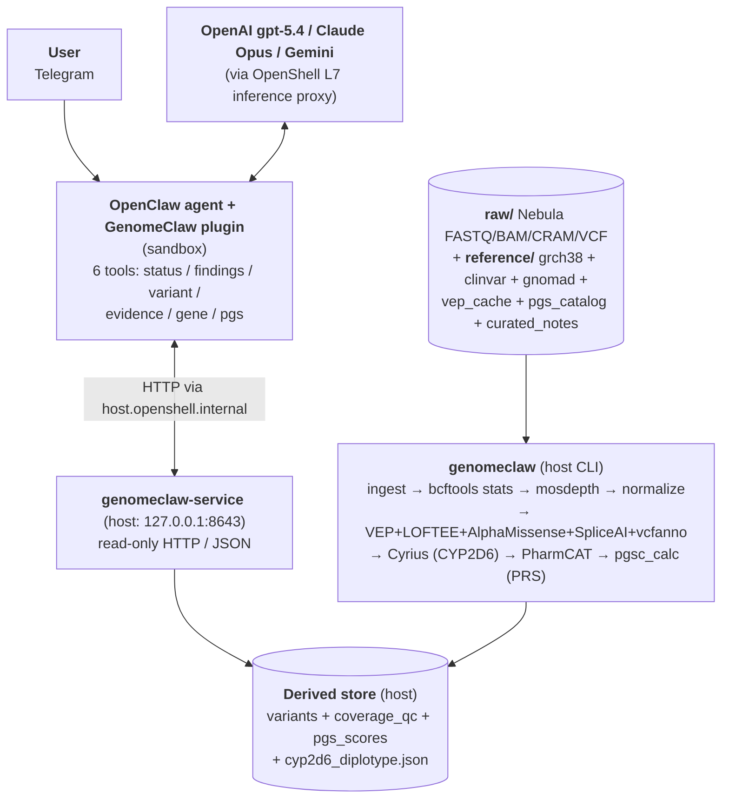

# GenomeClaw

> Privacy-first personal genomics CLI for NemoClaw agents.

GenomeClaw is a command-line toolkit for analyzing your own genomic data locally. It wraps standard bioinformatics tools, annotation databases, and evidence-retrieval workflows behind a single CLI surface that **NemoClaw agents** can drive on any Linux or macOS host where NemoClaw and the bioinformatics tools install.

It is designed for **one user at a time, on hardware they own, with their own data**. The user typically reaches the agent over **Telegram**; the agent calls GenomeClaw tools on the host. Genomic source files never leave the device. The NemoClaw agent driving the conversation may run on a cloud frontier model (OpenAI gpt-5.4, Claude Opus, Gemini, etc.) — it sees only the minimal-sufficient tool outputs needed to answer the current question, never bulk dumps.

---

## Status

Early-stage but progressing. The project rules, canonical invariants ([INVARIANTS v1.6](docs/reference/INVARIANTS.md)), planning protocol, plan templates, specialized subagent guides, and the [MVP plan](docs/plans/active/mvp/) (with all design decisions Q1–Q10 closed) are in place. Implementation is underway — the [MVP development plan](docs/plans/active/mvp/development-plan.md) lays out seven phases with strict TDD; Phases 1–3 (toolkit scaffolding + CI + `genomeclaw/toolkit` host image; `fetch` + `ingest` + `bcftools stats` + `mosdepth`; `normalize` + `materialize`) have landed against the project owner's real Nebula VCF. The full VEP-based annotation stack (Phase 4) is next. Storage architecture for CRAM-scale workloads — interactive `genomeclaw host setup`, host-side `doctor` / `eject` subcommands, `shard_scratch` / `atomic_promote` primitives, pre-flight assertions, and `INV-D003` (Heavy Scratch Is Separated From Authoritative Outputs) — landed via the now-completed [cram-scratch-strategy plan](docs/plans/completed/cram-scratch-strategy/).

If you are an agent or contributor working on GenomeClaw, start with [CLAUDE.md](CLAUDE.md), then [docs/reference/grand-plan.md](docs/reference/grand-plan.md), then [docs/plans/CLAUDE.md](docs/plans/CLAUDE.md). For the verified system shape, read [docs/reference/architecture.md](docs/reference/architecture.md). For the user journeys the system is built to support, read [docs/reference/user-stories.md](docs/reference/user-stories.md).

---

## Goals

- Make personal genomic data **explorable through an agentic interface** for **two distinct conversational tracks** — clinical questions (research framing + clinician-confirmation cues) and lifestyle questions about caffeine, diet, exercise, sleep, alcohol, recovery, etc. (direct, actionable guidance with calibrated evidence).
- **Preserve privacy by default** and minimize unnecessary external exposure.
- Keep raw genomic artifacts as the **authoritative source of truth**.
- Build derived stores that are fast for assistant queries but **fully rebuildable**.
- Support **cautious, evidence-traceable interpretation** rather than clinical over-claiming — *and* avoid the opposite failure mode of punting every lifestyle question to a clinician.
- Fit naturally into **NemoClaw's agentic local-tool workflow model**.

The canonical invariants behind these goals live in [docs/reference/INVARIANTS.md](docs/reference/INVARIANTS.md).

---

## What This Is, and What This Is Not

**What it is**: a research, exploration, *and lifestyle/wellbeing* assistant grounded in the user's own genome. The agent gives direct, evidence-calibrated guidance on lifestyle topics — caffeine metabolism (*CYP1A2*) and sleep, lactase persistence (*LCT/MCM6*) and dairy, alcohol flushing (*ALDH2*), alcohol metabolism (*ADH1B*), caffeine sensitivity (*ADORA2A*), Alzheimer's-risk disclosure (*APOE*), and *MTHFR* skeptical framing — without reflexively deferring to a clinician for what are lifestyle questions. Calibration is driven by user-authored markdown notes in `reference/curated_notes/<gene>.md` (per [MVP spec Q9](docs/plans/active/mvp/spec.md)); the agent reads the note and composes its response in the project owner's voice.

**What it is not**:

- **Not a clinical decision-support system.** Outputs are framed as research, education, or lifestyle guidance — never diagnosis, prescription, dose, or treatment changes. Anything *clinically* actionable carries a visible escalation marker and points to a clinician.
- **Not a hosted service.** GenomeClaw runs on the user's hardware; there is no GenomeClaw cloud.
- **Not a population-genomics tool.** It is single-user by design.
- **Not a replacement for professional clinical evaluation.** Clinical-actionability findings (ACMG SF, PharmCAT actionable haplotypes, etc.) carry visible escalation markers and are intended to prompt clinical confirmation.
- **Not an imputation / mass-analysis platform.**

---

## Designed For

- **Host**: any Linux or macOS environment with **Docker** (or compatible engine) and **NemoClaw**. The host pipeline ships as the `genomeclaw/toolkit` Docker image — pinned `bcftools` / `mosdepth` / `samtools` / `htslib` / VEP / Cyrius / `pgsc_calc` ride along with it, so there is no host-side bioinformatics install dance. A thin shim ([`bin/genomeclaw`](bin/genomeclaw)) wraps `docker run` so users type the same command across environments. See the [host-side packaging section](docs/reference/architecture.md#host-side-packaging--genomeclawtoolkit-docker-image) for the bind-mount discipline.
- **Agent runtime**: [NemoClaw](https://github.com/aerugo) / OpenShell agentic stack — agents call GenomeClaw subcommands as tools.
- **Primary data input**: [Nebula Genomics](https://nebula.org) WGS outputs (FASTQ, BAM/CRAM, VCF, gVCF). Other sources are extensible but not the initial focus.
- **Reference build**: GRCh38 initially.

---

## Storage planning

GenomeClaw's host pipeline needs four directories, each with a different lifecycle and size profile. Heavy intermediates can produce multi-tens-of-GB of transient scratch (Nextflow `work/`, DuckDB spill, sort temp), and Phase-5+ CRAM workloads push that into the hundreds of GB — an unplanned setup will fill the local boot disk and crash mid-run.

| Mount | Lifecycle | Size (one 30× WGS user) | Where to put it |
|-------|-----------|-------------------------|-----------------|
| `raw/` | Permanent — Nebula source-of-truth artifacts (FASTQ / BAM / CRAM / VCF) | 50–80 GB | Dedicated external drive |
| `reference/` | Slowly versioned — annotation datasets (GRCh38 ~3 GB, ClinVar ~250 MB, gnomAD v4.1 exomes ~200 GB, dbSNP ~25 GB, VEP cache ~75 GB, AlphaMissense ~1.5 GB, SpliceAI ~50 GB, PGS Catalog ~few GB, PGS Catalog HGDP+1KG ancestry bundle ~50–60 GB, Nextflow-materialised `pgsc_calc` conda envs ~few GB cached on first PRS compute) | ~350–410 GB once everything lands; gnomAD genomes (additional 563 GB) is a follow-up opt-in | Dedicated external drive |
| `derived/` | Per-run, authoritative — `<run-id>/` directories accumulate; provenance-tracked | 1–2 GB per run | Dedicated external drive |
| `_scratch/` | Ephemeral — sharded under `<step>/<run-id>/`; **nothing here is authoritative.** Wiping it between runs is normal hygiene. | Up to multi-tens-of-GB during `pgsc_calc`; multi-hundreds-of-GB for CRAM-scale | Dedicated external drive — physically separated from `derived/` (`INV-D003`) |

The canonical path on macOS Sequoia is the interactive one-time setup:

```bash
# Prerequisites (one-time, host-wide):
brew install colima docker

# Then the canonical setup:
bin/genomeclaw host setup
```

If `colima` or `docker` is missing from PATH, `host setup` fails fast with a one-line install hint instead of a deep traceback. On Linux, native `docker` is the only prerequisite; colima is macOS-only.

`setup` detects your external drive, validates the Nebula deliverable, calculates required free space, refuses if source and target share a parent disk, formats the target as APFS named `Genome_Work`, lays out the four canonical subdirs under `<drive>/genomeclaw/`, copies the Nebula files in with per-file SHA256 verification, edits `~/.colima/default/colima.yaml` to share the partition with the engine VM, and verifies the four bind mounts are RO/RO/RW/RW from inside a one-shot container. After it completes, the shim auto-detects the canonical layout — no env vars needed.

**`setup` is idempotent + self-healing.** Re-running it on an already-configured system is safe: it inspects current state and dispatches the right action automatically — `no-op` when everything's green, `reconfigure_colima` after a `colima delete` wiped the `mounts:` block, `recreate_layout` if a canonical subdir got removed, `start_colima` if it's just stopped. The destructive path (format-and-copy) fires only on a fresh drive or wrong-format partition, and still requires the typed-confirmation prompt. The decision tree is documented in [docs/plans/completed/smart-setup/spec.md § Seven defined states](docs/plans/completed/smart-setup/spec.md) (or `active/` if still in flight when you read this).

**Day-to-day commands** that complement `setup`:

- `bin/genomeclaw host doctor` — read-only diagnostic; checks the four canonical subdirs, surfaces the most recent `setup_completed` event, reports colima status, and **flags stale colima mounts** (configured drives that aren't currently plugged in — these block the next `colima start` until removed). Add `--json` for machine-readable output. Exit 0 iff every check passes.
- `bin/genomeclaw host eject` — stops colima, **removes the drive's entry from colima's mount config** (with a timestamped backup), then `diskutil eject`s the drive cleanly. Refuses if a toolkit container is still running (use `--force` to override; mid-run yank corrupts the in-flight pipeline). Always run this before unplugging — skipping eject leaves a stale mount entry that prevents colima from booting next time.

If you skipped eject and unplugged the drive (or replaced it), `bin/genomeclaw host doctor` will spot the stale entry and tell you exactly what to fix. The cycle of plug-in / unplug / replace is safe as long as you bracket it with `host eject` and `host setup`.

**Manual env-var path** (advanced; for non-Sequoia hosts or when `setup` is wrong for your topology):

```bash
export GENOMECLAW_RAW_DIR=/Volumes/MyUSB/genomeclaw/raw
export GENOMECLAW_REF_DIR=/Volumes/MyUSB/genomeclaw/reference
export GENOMECLAW_DERIVED_DIR=/Volumes/MyUSB/genomeclaw/derived
export GENOMECLAW_SCRATCH_DIR=/Volumes/MyUSB/genomeclaw/_scratch
```

The shim auto-creates `$GENOMECLAW_SCRATCH_DIR` and `$GENOMECLAW_SCRATCH_DIR/tmp` on first run (the latter is the in-image `$TMPDIR` target). The other three you stage yourself.

### macOS / colima users — engine-VM file sharing

Bind-mounts only work for paths the Docker engine VM can see. **colima 0.9.1** (the default on macOS Sequoia) shares `$HOME` by default *only on first start*; **passing `--mount` on a later `colima start` replaces the default mount list rather than appending to it**, so adding an external drive without re-listing `$HOME` makes `~/GitRepos`, `~/Documents`, etc. invisible inside the engine VM. The safest path is to edit the persisted config directly:

```bash
# 1. Edit ~/.colima/default/colima.yaml — find the `mounts:` section and
#    list every host path you want shared. For a typical USB-attached setup:
#
#    mounts:
#      - location: /Users/<your-username>
#        writable: true
#      - location: /Volumes/MyUSB
#        writable: true
#
# 2. Restart colima.
colima stop
colima start
```

(Docker Desktop has the same idea under Settings → Resources → File sharing.)

**A macOS Sequoia caveat**: even with `writable: true`, `$HOME` may be mounted **read-only** inside the container because Sequoia's privacy gates on VZ.framework virtiofs require the user to grant Full Disk Access to `limactl` in System Settings → Privacy & Security. External drives under `/Volumes/...` are not affected. The simplest workaround if you don't want to grant Full Disk Access: put **all four** GenomeClaw mounts on the external drive (`derived/` is small enough that the USB has plenty of room).

If `bin/genomeclaw` reports `bind source path does not exist` even though the host path is clearly there, the engine VM almost certainly can't see it — that's the symptom of a missing entry in `~/.colima/default/colima.yaml`'s `mounts:` list.

### `_scratch/` is always disposable

Nothing inside `$GENOMECLAW_SCRATCH_DIR` is authoritative. `rm -rf $GENOMECLAW_SCRATCH_DIR/*` between runs is normal hygiene. If a pipeline crashes mid-run, the next clean attempt starts from scratch — no state recovery in `_scratch/`. The shim refuses to start if `GENOMECLAW_SCRATCH_DIR` resolves under `GENOMECLAW_DERIVED_DIR`, enforcing `INV-D003` (heavy scratch is structurally separated from authoritative outputs).

For the deeper architectural rationale (per-mount sizing, invariant impact, lifecycle) see [docs/reference/architecture.md § Storage planning](docs/reference/architecture.md#storage-planning-where-to-put-each-mount).

---

## Architecture at a Glance

GenomeClaw splits across **two execution domains** (forced by `INV-D002`):



The verified component shape, file paths, network topology, and `INV-xxx` traceability live in [docs/reference/architecture.md](docs/reference/architecture.md). The strategic capability themes and roadmap horizons live in [docs/reference/grand-plan.md](docs/reference/grand-plan.md).

---

## Tooling

GenomeClaw **wraps, it doesn't reimplement**.

**Bioinformatics / file processing**
- `samtools`, `bcftools` (incl. `bcftools stats`), `tabix`, `bgzip`, `bedtools`
- **`mosdepth`** — per-gene mean coverage at ingest (per [MVP spec Q7](docs/plans/active/mvp/spec.md); closes the false-reassurance failure mode)

**Annotation** (per [MVP spec Q5](docs/plans/active/mvp/spec.md) — supersedes SnpEff)
- **VEP** (Variant Effect Predictor) with **MANE Select** transcript pinning
- **LOFTEE** — predicted-LoF confidence filter
- **AlphaMissense** — missense pathogenicity prediction
- **SpliceAI** — splice-altering variant predictor
- **vcfanno** — tabix-indexed overlay annotations (ClinVar, gnomAD v4 with per-population AFs, dbSNP)
- ~~`SnpEff`, `SnpSift`~~ — superseded by Q5; the host can keep them installed for ad-hoc use, but they are no longer the default annotation path.

**Pharmacogenomics** (per [MVP spec Q6](docs/plans/active/mvp/spec.md))
- **PharmCAT** — actionable PGx haplotypes
- **Cyrius** — CYP2D6 outside-call from BAM/CRAM (PharmCAT does not call CYP2D6 from VCF; Cyrius's diplotype feeds PharmCAT's outside-call interface)

**Polygenic risk scores** (per [MVP spec Q8](docs/plans/active/mvp/spec.md))
- **`pgsc_calc`** (PGS Catalog Calculator, Nextflow) with continuous-ancestry normalization against 1000G + HGDP. Initial three-trait panel: CAD, T2D, breast or prostate cancer.

**Programmatic / query layer**
- `cyvcf2`, `pysam`
- `DuckDB`
- `FastAPI` + `Uvicorn` for the host service

**Plugin (sandbox-side, TypeScript / Node.js)**
- `openclaw/plugin-sdk` (`registerTool` + TypeBox parameter schemas + `jsonResult`)

**Planned data sources**
- ClinVar, gnomAD v4 (with per-ancestry AFs), dbSNP
- PharmCAT / PharmGKB-related resources
- PGS Catalog scoring weights (deliberate, host-side, opt-in fetch only)
- User-authored `reference/curated_notes/` (lifestyle calibration, per [MVP spec Q9](docs/plans/active/mvp/spec.md))

Implementation languages: **Python** for the toolkit (`packages/toolkit/`), **TypeScript** for the plugin (`packages/nemoclaw-plugin/`).

---

## Privacy Posture

- **Genomic source files** (FASTQ, BAM/CRAM, VCF/gVCF) **never leave the device**, regardless of agent or integration configuration.
- The **NemoClaw agent** (typically a cloud frontier model such as OpenAI gpt-5.4, Claude Opus, or Gemini) is a *named, user-configured* egress destination. Tool outputs flowing to the agent are **minimal-sufficient**: scoped findings, scoped variants, scoped evidence — not bulk dumps. PRS responses include percentile + ancestry calibration warning, never raw PGS variant lists.
- Bulk transfer modes (shipping a whole VCF or a full annotation table to the agent) require explicit per-operation opt-in.
- Other remote integrations (literature lookups, alternative annotators) are **off by default** and gated behind per-operation opt-in. The PGS Catalog scoring-weights fetch (per [MVP spec Q8](docs/plans/active/mvp/spec.md)) is host-side, deliberate, opt-in only — no genomic data flows outbound.
- Secrets and credentials live outside the data directories and are never committed.
- Logs do not include sample identifiers or variant coordinates at default verbosity.
- Redaction happens **before** any payload destined for an external service is materialized.

Full privacy invariants: `INV-P001` and `INV-P002` in [docs/reference/INVARIANTS.md](docs/reference/INVARIANTS.md). Lifestyle / clinical-distinction invariant: `INV-C001` v1.5 (with curated-notes recognition).

---

## How NemoClaw Agents Use GenomeClaw

GenomeClaw is driven by agents, not humans. The user reaches the agent over **Telegram** (the canonical user surface; OpenShell pairs the Telegram channel into the agent's input). The agent calls GenomeClaw tools on the host. The integration shape:

- **One host CLI binary** (`genomeclaw`) with subcommands for each pipeline stage (`fetch`, `ingest`, `normalize`, `annotate`, `materialize`, `cyp2d6-call`, `pgs-compute`).
- **One host service** (`genomeclaw-service`, FastAPI on `127.0.0.1:8643`) exposing scoped read-only HTTP/JSON endpoints (`/v1/health`, `/v1/findings`, `/v1/findings/{id}`, `/v1/variants`, `/v1/variants/{key}`, `/v1/evidence/{ref}`, `/v1/provenance/{run-id}`, `/v1/gene/{symbol}`, `/v1/pgs/{trait}`).
- **One sandbox-side plugin** (`packages/nemoclaw-plugin/`) registering **six agent-callable tools**: `genomeclaw_status`, `genomeclaw_findings`, `genomeclaw_variant`, `genomeclaw_evidence`, `genomeclaw_gene`, `genomeclaw_pgs`. TypeBox parameter schemas; `jsonResult(...)` payloads with structured `details`.
- **Structured JSON output** on every tool call, suitable for agent tool-use.
- **Safe-by-default operations** vs. operations requiring explicit user opt-in (network calls, PGS Catalog weight fetches, alternative annotators). Agents must respect this distinction.
- **Provenance on every result** — every emitted record carries source identity, tool, version, and parameters (the seven canonical columns of `INV-R001`).

Detail in [docs/reference/architecture.md](docs/reference/architecture.md). Concrete user journeys (clinical, PGx, lifestyle, PRS) in [docs/reference/user-stories.md](docs/reference/user-stories.md).

---

## Repository Layout

GenomeClaw is structured as a workspace with **two packages, one per execution domain**. The `packages/` boundary **is** the deployment-domain boundary: `packages/toolkit/` is host-only (never installed in the sandbox image); `packages/nemoclaw-plugin/` is sandbox-only (never executed on the host except for the build step).

```text
GenomeClaw/
├── README.md                        # This file
├── CLAUDE.md                        # Project rules, invariants, architecture
├── .claude/
│   └── agents/                      # Specialized subagents
├── bin/
│   └── genomeclaw              # Host shim — wraps `docker run genomeclaw/toolkit:<tag>`
├── docs/
│   ├── reference/
│   │   ├── INVARIANTS.md            # Canonical invariant IDs (INV-D001 ...) — v1.6
│   │   ├── grand-plan.md            # Long-term roadmap & capability themes
│   │   ├── architecture.md          # Verified component shape, network topology, host image
│   │   └── user-stories.md          # User journeys + design-gap running list
│   ├── plans/
│   │   ├── CLAUDE.md                # Planning protocol (spec + TDD)
│   │   ├── templates/               # spec / development-plan / phase / work-notes
│   │   ├── active/                  # In-flight implementation plans (mvp/, ...)
│   │   └── completed/               # Finished plans
│   └── reports/                     # Curated user-facing report drafts
└── packages/
    ├── toolkit/                     # HOST-SIDE — Phase 1 scaffolding landed
    │   ├── pyproject.toml
    │   ├── uv.lock
    │   ├── Dockerfile               # Multi-stage `genomeclaw/toolkit` image (bioconda + uv)
    │   ├── .dockerignore
    │   ├── src/genomeclaw_toolkit/
    │   │   ├── cli.py               # `genomeclaw` entry point
    │   │   ├── prep/                # ingest|normalize|annotate|materialize|cyp2d6-call|pgs-compute
    │   │   ├── service/             # FastAPI host service (read-only)
    │   │   └── schemas/             # finding / evidence / provenance / coverage_qc / pgs_scores
    │   └── tests/                   # unit, integration, provenance, determinism, privacy, evidence, reports, invariants
    └── nemoclaw-plugin/             # SANDBOX-SIDE — scaffolding in place
        ├── package.json
        ├── tsconfig.json
        ├── openclaw.plugin.json     # plugin manifest + configSchema
        ├── policy-preset.yaml       # OpenShell network policy preset
        ├── src/index.ts             # registers 6 agent-callable tools (registerTool + TypeBox)
        └── sandbox/Dockerfile       # baked image consumed by `nemoclaw onboard --from`
```

The host-side data directories are **outside the repository**, mounted at deploy time:

```text
/mnt/genomeclaw/
├── raw/         (RO — Nebula FASTQ/BAM/CRAM/VCF; bind-mount-RO at every container entry)
├── reference/   (RO at runtime — grch38, clinvar, gnomad, dbsnp, vep_cache, pgs_catalog, curated_notes/)
├── derived/     (RW — pipeline writes <run-id>/ here; CURRENT symlink)
└── scratch/     (RW — heavy intermediates, sharded under <step>/<run-id>/; INV-D003)
```

(`packages/toolkit/`'s subpackages and tests are placeholders; the MVP plan lays out their phased implementation.)

---

## Getting Started

**Implementation is in progress** — MVP Phases 1–3 (toolkit scaffolding + CI + the `genomeclaw/toolkit` host Docker image; `fetch` + `ingest` + `bcftools stats` + `mosdepth`; `normalize` + `materialize`) have landed against the project owner's real Nebula VCF. Phase 4 (annotation via VEP + LOFTEE + AlphaMissense + SpliceAI + vcfanno), the host service, the plugin, and lifestyle / PRS / PGx work land across Phases 4–6 of the [MVP plan](docs/plans/active/mvp/). Storage architecture for CRAM-scale workloads (interactive `setup`, `doctor`, `eject`, `shard_scratch` / `atomic_promote` primitives, pre-flight assertions, `INV-D003`) shipped via the [cram-scratch-strategy plan](docs/plans/completed/cram-scratch-strategy/). Contributors picking up the work should follow the [planning protocol](docs/plans/CLAUDE.md) (strict TDD per phase).

### Build the host image (today)

```bash
# From the repo root
docker build --tag genomeclaw/toolkit:dev packages/toolkit
docker run --rm genomeclaw/toolkit:dev   # prints `genomeclaw --help`

# Or via the host shim — wraps docker run with the canonical bind-mounts.
bin/genomeclaw --help
```

The shim honors a few env vars:

- `GENOMECLAW_IMAGE` — image reference (default `genomeclaw/toolkit:dev`).
- `GENOMECLAW_RAW_DIR`, `GENOMECLAW_REF_DIR`, `GENOMECLAW_DERIVED_DIR`, `GENOMECLAW_SCRATCH_DIR` — host paths bind-mounted at `/mnt/genomeclaw/{raw(ro), reference(ro), derived(rw), scratch(rw)}`. See [Storage planning](#storage-planning) for what goes where. The shim auto-creates `GENOMECLAW_SCRATCH_DIR` on first run, and auto-detects defaults under `/Volumes/Genome_Work/genomeclaw/` after `genomeclaw host setup` lays out the canonical layout.
- `GENOMECLAW_OFFLINE=1` — pass `--network none` (forbids egress; useful for ingest/normalize/annotate, breaks `fetch`).
- `GENOMECLAW_NATIVE=1` — bypass Docker; invoke a locally installed `genomeclaw` (inner-loop dev with `uv run`).

### Intended onboarding once the MVP lands (sketched from [Story 1](docs/reference/user-stories.md))

```bash
# 0. Build the toolkit image once (or pull a tagged release).
docker build --tag genomeclaw/toolkit:dev packages/toolkit

# 1. Fetch reference data (host-side, deliberate, opt-in)
bin/genomeclaw refs fetch --source clinvar
bin/genomeclaw refs fetch --source gnomad
bin/genomeclaw refs fetch --source dbsnp

# 2. Ingest your genome (VCF + BAM/CRAM both required for coverage_qc + Cyrius).
#    Paths below resolve INSIDE the container; the shim's bind-mounts map
#    /mnt/genomeclaw/{raw,reference,derived} to your host paths.
bin/genomeclaw pipeline ingest \
  --sample-id <your-sample-id> \
  --reference /mnt/genomeclaw/reference/grch38/ \
  --vcf       /mnt/genomeclaw/raw/<sample-id>/sample.vcf.gz \
  --bam       /mnt/genomeclaw/raw/<sample-id>/sample.bam
# Pipeline: integrity → bcftools stats → mosdepth → normalize →
#   VEP+LOFTEE+AlphaMissense+SpliceAI+vcfanno → Cyrius → materialize.

# 3. Compute polygenic risk scores (host-side, opt-in egress for PGS Catalog)
bin/genomeclaw pgs-compute \
  --traits cad,t2d,prostate \
  --bam /mnt/genomeclaw/raw/<sample-id>/sample.bam

# 4. Start the host service (reads the active run via the CURRENT symlink).
#    Lands in Phase 5; will run inside the same `genomeclaw/toolkit` image.
docker run -d --rm \
  --name genomeclaw-service \
  -p 127.0.0.1:8643:8643 \
  -v /mnt/genomeclaw/reference:/mnt/genomeclaw/reference:ro \
  -v /mnt/genomeclaw/derived:/mnt/genomeclaw/derived \
  genomeclaw/toolkit:dev genomeclaw-service start --port 8643

# 5. Onboard the sandbox plugin (one-time)
nemoclaw onboard --from packages/nemoclaw-plugin/sandbox/Dockerfile

# 6. Talk to the agent over Telegram. The agent calls the six GenomeClaw
#    tools (status / findings / variant / evidence / gene / pgs) as needed.
```

Until the rest of the MVP lands, contributors should pick up the [MVP plan](docs/plans/active/mvp/) at the next pending phase (Phase 4 — the full VEP-based annotation stack — as of this writing).

---

## Where to Read Next

- [CLAUDE.md](CLAUDE.md) — project rules and invariants in plain prose.
- [docs/reference/INVARIANTS.md](docs/reference/INVARIANTS.md) — canonical invariant IDs (`INV-D001`, `INV-E001`, `INV-P001`, `INV-R001`, `INV-C001`).
- [docs/reference/grand-plan.md](docs/reference/grand-plan.md) — long-term roadmap and capability themes.
- [docs/plans/CLAUDE.md](docs/plans/CLAUDE.md) — planning protocol (spec + phased + strict TDD).
- [docs/plans/templates/](docs/plans/templates/) — plan templates.
- [.claude/agents/](.claude/agents/) — specialized subagent guides.

---

## Contributing

1. Read [CLAUDE.md](CLAUDE.md), [INVARIANTS.md](docs/reference/INVARIANTS.md), and the [planning protocol](docs/plans/CLAUDE.md).
2. Pick or open a plan under `docs/plans/active/<feature>/`.
3. Follow strict TDD inside each phase.
4. Cite `INV-xxx` IDs in plans, tests, and pull requests.

---

## License

License pending. Until a license is committed at the project root, treat this repository as **all rights reserved**.
