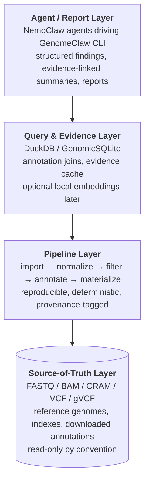

# GenomeClaw

> Privacy-first personal genomics CLI for NemoClaw agents.

GenomeClaw is a command-line toolkit for analyzing your own genomic data locally. It wraps standard bioinformatics tools, annotation databases, and evidence-retrieval workflows behind a single CLI surface that **NemoClaw agents** can drive on any Linux or macOS host where NemoClaw and the bioinformatics tools install.

It is designed for **one user at a time, on hardware they own, with their own data**. Genomic source files never leave the device. The NemoClaw agent driving the conversation may run on a cloud frontier model (Claude Opus, Gemini, etc.) — it sees only the minimal-sufficient tool outputs needed to answer the current question, never bulk dumps.

---

## Status

Early scaffolding. The project rules, canonical invariants, planning protocol, plan templates, and specialized subagent guides are in place. Implementation of the CLI, pipelines, and query layer is upcoming.

If you are an agent or contributor working on GenomeClaw, start with [CLAUDE.md](CLAUDE.md), then [docs/reference/grand-plan.md](docs/reference/grand-plan.md), then [docs/plans/CLAUDE.md](docs/plans/CLAUDE.md).

---

## Goals

- Make personal genomic data **explorable through an agentic interface** for **two distinct conversational tracks** — clinical questions (research framing + clinician-confirmation cues) and lifestyle questions about caffeine, diet, exercise, sleep, alcohol, recovery, etc. (direct, actionable guidance with calibrated evidence).
- **Preserve privacy by default** and minimize unnecessary external exposure.
- Keep raw genomic artifacts as the **authoritative source of truth**.
- Build derived stores that are fast for assistant queries but **fully rebuildable**.
- Support **cautious, evidence-traceable interpretation** rather than clinical over-claiming — *and* avoid the opposite failure mode of punting every lifestyle question to a clinician.
- Fit naturally into **NemoClaw's agentic local-tool workflow model**.

The canonical invariants behind these goals live in [docs/reference/INVARIANTS.md](docs/reference/INVARIANTS.md).

---

## What This Is, and What This Is Not

**What it is**: a research, exploration, *and lifestyle/wellbeing* assistant grounded in the user's own genome. The agent will give direct, evidence-calibrated guidance on lifestyle topics (caffeine and sleep, lactase persistence and dairy, ACTN3 and training emphasis, alcohol metabolism, circadian preference, etc.) without reflexively deferring to a clinician for what are lifestyle questions.

**What it is not**:

- **Not a clinical decision-support system.** Outputs are framed as research, education, or lifestyle guidance — never diagnosis, prescription, dose, or treatment changes. Anything *clinically* actionable carries a visible escalation marker and points to a clinician.
- **Not a hosted service.** GenomeClaw runs on the user's hardware; there is no GenomeClaw cloud.
- **Not a population-genomics tool.** It is single-user by design.
- **Not a replacement for professional clinical evaluation.** Clinical-actionability findings (ACMG SF, PharmCAT actionable haplotypes, etc.) carry visible escalation markers and are intended to prompt clinical confirmation.
- **Not an imputation / mass-analysis platform.**

---

## Designed For

- **Host**: any Linux or macOS environment where NemoClaw runs and where the standard bioinformatics tools install. The project is deliberately agnostic about the specific hardware — if NemoClaw and the toolchain run there, GenomeClaw runs there.
- **Agent runtime**: [NemoClaw](https://github.com/aerugo) / OpenShell agentic stack — agents call GenomeClaw subcommands as tools.
- **Primary data input**: [Nebula Genomics](https://nebula.org) WGS outputs (FASTQ, BAM/CRAM, VCF, gVCF). Other sources are extensible but not the initial focus.
- **Reference build**: GRCh38 initially.

---

## Architecture at a Glance



Long-form description in [docs/reference/grand-plan.md](docs/reference/grand-plan.md).

---

## Tooling

GenomeClaw **wraps, it doesn't reimplement**.

**Bioinformatics / file processing**
- `samtools`, `bcftools`, `tabix`, `bgzip`, `bedtools`

**Annotation**
- `SnpEff`, `SnpSift`
- optional: `VEP`, `vcfanno`, `bcftools csq`

**Programmatic / query layer**
- `cyvcf2`, `pysam`
- `DuckDB`
- optional: `GEMINI`, `GenomicSQLite`

**Planned data sources**
- ClinVar, gnomAD, dbSNP
- PharmCAT / PharmGKB-related resources

Implementation language: **Python** is the leading candidate, driven by the tooling ecosystem.

---

## Privacy Posture

- **Genomic source files** (FASTQ, BAM/CRAM, VCF/gVCF) **never leave the device**, regardless of agent or integration configuration.
- The **NemoClaw agent** (typically a cloud frontier model such as Claude Opus or Gemini) is a *named, user-configured* egress destination. Tool outputs flowing to the agent are **minimal-sufficient**: scoped findings, scoped variants, scoped evidence — not bulk dumps.
- Bulk transfer modes (shipping a whole VCF or a full annotation table to the agent) require explicit per-operation opt-in.
- Other remote integrations (literature lookups, alternative annotators) are **off by default** and gated behind per-operation opt-in.
- Secrets and credentials live outside `data/` and are never committed.
- Logs do not include sample identifiers or variant coordinates at default verbosity.
- Redaction happens **before** any payload destined for an external service is materialized.

Full privacy invariants: `INV-P001` and `INV-P002` in [docs/reference/INVARIANTS.md](docs/reference/INVARIANTS.md).

---

## How NemoClaw Agents Use GenomeClaw

GenomeClaw is intended to be driven by agents, not humans, most of the time. The integration shape:

- **One CLI binary** with subcommands for each pipeline stage and each query operation.
- **Structured JSON output** on every command, suitable for agent tool-use.
- **A capability manifest** so agents can discover available subcommands and their argument shapes.
- **Safe-by-default operations** vs. operations requiring explicit user opt-in (network calls, optional remote models). Agents must respect this distinction.
- **Provenance on every result** — every emitted record carries source identity, tool, version, and parameters.

Detail in the **CLI surface** section of [docs/reference/grand-plan.md](docs/reference/grand-plan.md).

---

## Repository Layout

```text
GenomeClaw/
├── README.md                        # This file
├── CLAUDE.md                        # Project rules, invariants, architecture
├── .claude/
│   └── agents/                      # Specialized subagents
│       ├── bioinformatics-pipeline.md
│       ├── docs-navigator.md
│       ├── privacy-safety-reviewer.md
│       ├── report-generator.md
│       └── test-engineer.md
├── docs/
│   ├── reference/
│   │   ├── INVARIANTS.md            # Canonical invariant IDs (INV-D001 ...)
│   │   └── grand-plan.md            # Long-term roadmap & capability themes
│   ├── plans/
│   │   ├── CLAUDE.md                # Planning protocol (spec + TDD)
│   │   ├── templates/               # spec / development-plan / phase / work-notes
│   │   ├── active/                  # In-flight implementation plans
│   │   └── completed/               # Finished plans
│   └── reports/                     # Curated user-facing report drafts
├── pipelines/                       # Import / normalize / annotate workflows
├── src/                             # CLI + core application code
├── tests/                           # Unit, integration, provenance, privacy, ...
├── data/
│   ├── raw/                         # Source genomic artifacts (read-only)
│   ├── reference/                   # Reference builds + annotation datasets
│   └── derived/                     # Rebuildable materialized outputs
└── notebooks/  or  scratch/         # Exploratory work, clearly separated
```

(Some directories are placeholders for the implementation phase.)

---

## Getting Started

The CLI is not yet implemented. Once it is:

```bash
# placeholder — to be defined in Horizon 1 of the grand plan
genomeclaw --help
genomeclaw ingest --vcf path/to/your.vcf.gz
genomeclaw annotate --source clinvar
genomeclaw findings --evidence
```

Until then, contributors should follow the planning protocol to land a feature: see [docs/plans/CLAUDE.md](docs/plans/CLAUDE.md).

---

## Where to Read Next

- [CLAUDE.md](CLAUDE.md) — project rules and invariants in plain prose.
- [docs/reference/INVARIANTS.md](docs/reference/INVARIANTS.md) — canonical invariant IDs (`INV-D001`, `INV-E001`, `INV-P001`, `INV-R001`, `INV-C001`).
- [docs/reference/grand-plan.md](docs/reference/grand-plan.md) — long-term roadmap and capability themes.
- [docs/plans/CLAUDE.md](docs/plans/CLAUDE.md) — planning protocol (spec + phased + strict TDD).
- [docs/plans/templates/](docs/plans/templates/) — plan templates.
- [.claude/agents/](.claude/agents/) — specialized subagent guides.

---

## Contributing

1. Read [CLAUDE.md](CLAUDE.md), [INVARIANTS.md](docs/reference/INVARIANTS.md), and the [planning protocol](docs/plans/CLAUDE.md).
2. Pick or open a plan under `docs/plans/active/<feature>/`.
3. Follow strict TDD inside each phase.
4. Cite `INV-xxx` IDs in plans, tests, and pull requests.

---

## License

License pending. Until a license is committed at the project root, treat this repository as **all rights reserved**.
