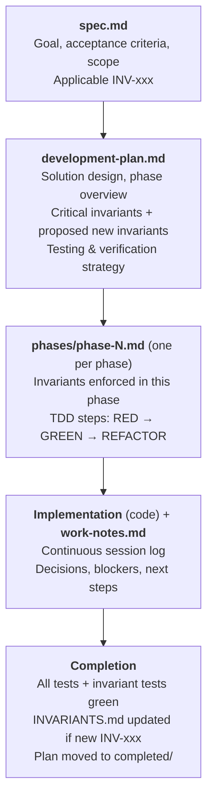

# GenomeClaw Planning Protocol

This directory is where AI agents and contributors create, track, and complete implementation plans for GenomeClaw features, pipelines, schemas, agent flows, and documentation efforts.

> **Read first**:
> - Root [CLAUDE.md](../../CLAUDE.md) for invariants in plain prose
> - [docs/reference/INVARIANTS.md](../reference/INVARIANTS.md) for canonical invariant IDs (e.g., `INV-D001`)
> - The relevant `.claude/agents/*.md` for the subsystem you are touching

> **Two non-negotiables**:
> 1. **Plan before you mutate**: any non-trivial change to a pipeline, schema, evidence flow, or user-facing report goes through this protocol first.
> 2. **TDD inside every phase**: tests describing the desired behavior are written and seen to fail *before* implementation. Invariants are enforced by tests, not by hope.

---

## Directory Structure

```text
docs/plans/
├── CLAUDE.md                       # This file — the planning protocol
├── templates/                      # Templates for new plans
│   ├── spec-template.md
│   ├── development-plan-template.md
│   ├── phase-template.md
│   └── work-notes-template.md
├── active/                         # Plans currently being implemented
│   └── <feature-name>/
│       ├── spec.md                 # Feature specification (required)
│       ├── development-plan.md     # Phased implementation plan (required)
│       ├── work-notes.md           # Session log + progress (required)
│       ├── initial_findings.md     # Optional: research/discovery notes
│       ├── doc-draft.md            # Optional: drafts for docs/reference/
│       └── phases/
│           ├── phase-1.md
│           ├── phase-2.md
│           └── ...
└── completed/                      # Finished plans (kept for reference)
    └── <feature-name>/
        └── ...
```

Small efforts (a one-file fix, a doc clarification) may live as a single markdown file under `docs/plans/active/<short-name>.md`. Anything that touches more than one subsystem, alters a derived store, changes provenance/egress behavior, or modifies user-facing report wording **must** use the full directory layout.

---

## The Loop in One Picture



---

## Starting a New Implementation

### 1. Understand the Project Context

Before writing code or changing pipeline behavior:

- **Read** the root [CLAUDE.md](../../CLAUDE.md) and the rules under "Critical Invariants".
- **Read** [docs/reference/INVARIANTS.md](../reference/INVARIANTS.md) end-to-end. List the `INV-xxx` IDs that apply.
- **Read** the relevant `.claude/agents/*.md` for the subsystem (e.g., `bioinformatics-pipeline.md` for ingest, `report-generator.md` for reports, `privacy-safety-reviewer.md` for any change that affects egress).
- **Skim** existing `docs/reference/` documents related to the subsystem.
- **Inspect the current state** of files you plan to modify before changing them.

### 2. Create the Feature Specification

Save to `docs/plans/active/<feature-name>/spec.md` using [templates/spec-template.md](templates/spec-template.md).

The spec is a **statement of intent** that can be reviewed before any code is written. It should be readable on its own and complete enough that a second contributor could plan from it.

A spec must include:

- **Goal** — one sentence
- **Background** — why this is needed; what's broken / missing
- **Acceptance criteria** — specific, testable bullets (each maps to one or more tests)
- **Applicable invariants** — list of `INV-xxx` IDs from `INVARIANTS.md` and how each constrains the work
- **Proposed new invariants** — if any
- **Out of scope** — explicit boundaries
- **Privacy & safety considerations** — what data crosses what boundary
- **Open questions** — unresolved before implementation can start

### 3. Create the Development Plan

Save to `docs/plans/active/<feature-name>/development-plan.md` using [templates/development-plan-template.md](templates/development-plan-template.md).

The development plan is the **chosen solution**. It includes:

- A **Critical Invariants to Respect** section citing IDs from `INVARIANTS.md` *and* explaining how each constrains this implementation.
- A **Proposed New Invariants** section if applicable.
- **Current State Analysis** — what exists, what's missing.
- **Solution Design** — interfaces, data flow, schema/migration impact.
- **Phase Overview** — ordered phases with TDD focus and test counts.
- **Testing Strategy** by category (unit, integration, provenance, determinism, privacy, evidence-binding, report rendering, invariant).
- **Documentation Updates Required** — including potential `INVARIANTS.md` changes.

### 4. Create Work Notes

Save to `docs/plans/active/<feature-name>/work-notes.md` using [templates/work-notes-template.md](templates/work-notes-template.md).

Work notes are **append-only** and updated continuously as implementation proceeds. Each session adds a dated block with: context reviewed, applicable invariants reaffirmed, completed tasks, blockers, and next steps.

### 5. Create Phase Plans

For each phase, create `docs/plans/active/<feature-name>/phases/phase-N.md` using [templates/phase-template.md](templates/phase-template.md).

A phase plan is the **TDD scaffold** for one slice of work. It must include:

- **Invariants enforced in this phase** — which `INV-xxx` are verified by tests *here*.
- **TDD Steps**:
  - Step N.1 — RED: list test cases by name, sketch the failing tests.
  - Step N.2 — GREEN: minimal implementation to make tests pass.
  - Step N.3 — REFACTOR: clarity, types, comments only where the *why* is non-obvious.
- **Files** — CREATE / MODIFY table.
- **Verification** — exact commands to run.
- **Completion criteria** — concrete checkboxes including the invariant tests.

---

## Execution Workflow

### Starting Each Session

1. **Read `work-notes.md`** to recover context.
2. **Re-read `INVARIANTS.md`** if the work touches privacy, provenance, or evidence surfaces.
3. **Open the current `phase-N.md`** and confirm which step you are on.
4. **Run the test suite** to confirm the current pass/fail state matches what work-notes claims.
5. **Continue from the documented next step** — do not start a parallel thread of work without updating the plan.

### Working Through Each Phase (TDD)

GenomeClaw uses **strict Red-Green-Refactor**.

1. **RED — write failing tests**
   - Cover the acceptance criteria for this phase.
   - Cover the invariants this phase is responsible for (cite the `INV-xxx` in the test name or comment).
   - Run the tests and confirm they fail for the intended reason.
2. **GREEN — minimal implementation**
   - Write the smallest amount of code that turns the tests green.
   - Resist the urge to add fields, branches, or abstractions not exercised by a test.
3. **REFACTOR — clean up while green**
   - Tighten types, names, structure.
   - Add comments only where the *why* is non-obvious.
   - Re-run tests after each refactor step.

While inside a phase, **update `work-notes.md` continuously**: what tests went red, what implementation made them green, what design decisions were taken, what blockers appeared.

### Completing a Phase

1. All phase tests pass; all previously-green tests still pass.
2. Static checks for the language at hand pass (type checker, lint).
3. The phase's invariant assertions are exercised by at least one test referencing the `INV-xxx` ID.
4. Update phase status in `development-plan.md`.
5. Append a **Phase N: complete** block to `work-notes.md` with summary, decisions, and links to commits.
6. Create `phase-(N+1).md` if more phases remain.

### Completing the Implementation

1. Run the **full** test suite (unit + integration + invariant).
2. Re-confirm privacy-default tests pass with default configuration.
3. If new invariants were introduced, **update [docs/reference/INVARIANTS.md](../reference/INVARIANTS.md)**:
   - Assign IDs in the appropriate category.
   - Fill out Rule / Requirements / Where it applies / How to verify.
   - Bump the Version and Last Updated fields.
   - Add an entry to the Invariant Index table.
4. Update other `docs/reference/` pages from `doc-draft.md`.
5. Run the final review checklist (below).
6. **Move the plan to `docs/plans/completed/<feature-name>/`** with `development-plan.md` reflecting the *final* implemented design (not the original guess).

---

## Invariant Management

### Referencing Existing Invariants

Always cite invariants by their canonical ID from [docs/reference/INVARIANTS.md](../reference/INVARIANTS.md). In plans:

```markdown
## Critical Invariants to Respect

- **INV-D001** Raw Genomic Files Are Source-of-Truth — this pipeline writes
  exclusively under `data/derived/<run-id>/` and never opens raw files for write.
- **INV-R001** Rebuildability — every emitted row records `source_path`,
  `source_sha256`, `tool`, `tool_version`, `params_json`, `schema_version`,
  `created_at`.
- **INV-P001** Privacy Default — annotation joins are local only; this phase
  introduces no network calls.
```

In tests:

```python
def test_invD001_raw_vcf_unchanged_after_import(tmp_raw_vcf):
    """INV-D001: importing a raw VCF must not modify the source file."""
    ...
```

### Introducing New Invariants

When a plan introduces a project-wide constraint that should outlive the feature:

1. **Propose** it in `development-plan.md` under **Proposed New Invariants** with rule + rationale.
2. **Implement tests** that would fail if the rule is broken.
3. **After tests are green**, update `docs/reference/INVARIANTS.md`:
   - Pick the next number in the appropriate category (`INV-D`, `INV-E`, `INV-P`, `INV-R`, `INV-C`).
   - Fill in Rule / Requirements / Where it applies / How to verify.
   - Increment Version + Last Updated.
   - Append to the Invariant Index.
4. **Note adoption** in the plan's `work-notes.md`.

If the proposal is rejected during review, record the rejection and reasoning in `work-notes.md` and remove the **Proposed New Invariants** entry from the plan.

---

## TDD Principles for GenomeClaw

### Red-Green-Refactor

1. **RED**: write a test that fails for the right reason.
2. **GREEN**: write the minimum code that turns it green.
3. **REFACTOR**: improve structure with the test still green.

### Test Categories

GenomeClaw treats several test categories as **first-class**, not afterthoughts:

| Category | Purpose | Example |
|----------|---------|---------|
| Unit | Pure-function / class behavior | normalize a VCF record |
| Integration | Modules cooperating | ingest → annotate → store |
| **Provenance** | Every derived row carries required provenance columns | `tool_version` populated on every annotation row |
| **Determinism** | Pipeline reruns are byte-equivalent given fixed inputs/tools | run import twice, diff outputs |
| **Privacy default** | No outbound network call in default config | full assistant flow with mocked egress, asserts zero calls |
| **Evidence binding** | Every interpretation cites a source record | finding rejection without `evidence_ref` |
| **Report rendering** | Snapshot/structural tests for user-facing output | renders include citations + caution markers |
| **Invariant** | One or more `INV-xxx` enforced as cross-cutting checks | walks all annotation rows and asserts schema version present |

When a phase touches one of these categories, the phase plan must include the corresponding tests under **Step N.1**.

### Test File Conventions

- Co-locate unit tests with source where the language convention supports it.
- Place broader tests under `tests/` with subdirectories matching category (`tests/integration/`, `tests/invariants/`, `tests/provenance/`, `tests/privacy/`, `tests/determinism/`).
- Name invariant tests so the `INV-xxx` ID appears in the test name or docstring.
- Keep fixtures tiny and synthetic; **never** commit real human genomic data into the repo.

> **Tooling**: Specific test-runner / type-checker / linter commands depend on the eventual GenomeClaw stack. Each plan's **Verification** section spells out the exact commands. Until the stack is fixed, use placeholders like `<test-runner>` and document the resolution in the plan.

---

## Planning Standards

### A. Plans must be concrete

Avoid:
- "improve pipeline"
- "add genomics support"

Prefer:
- "import normalized VCF records into DuckDB `variant` table with provenance columns"
- "add ClinVar annotation join stage and evidence citation rendering in report summaries"

### B. Name data boundaries explicitly

Plans must say:
- what inputs exist and where they live
- what derived artifacts are produced and where they land
- where sensitive data crosses a trust boundary
- what is cached and how it is invalidated / rebuilt

### C. Track provenance and rebuildability explicitly

For any change that creates or alters a derived store, the plan states:
- source inputs (path + identity / checksum)
- transformation tools and their versions
- schema version impact
- rebuild procedure (the command(s) to recreate the store from scratch)

### D. Separate exploration from implementation

Use `initial_findings.md` for research notes and rejected approaches.
Keep `development-plan.md` focused on the **chosen** solution.

### E. Prefer phased delivery

Break work into small reviewable slices that can be validated independently.
A phase that is too small is fine; a phase that is too large is a rewrite waiting to happen.

### F. Privacy and safety are upfront, not last-minute

If a plan touches egress, secrets, phenotype-linked content, or report wording, the **Privacy & Safety Considerations** section is filled in *before* the **Solution Design** section is finalized, and the `privacy-safety-reviewer` agent is invoked at least once.

---

## Required Verification Gates

Every plan defines the smallest meaningful gates before claiming success. Pull from these as appropriate:

- Schema migration applies cleanly on an empty store and on the most recent prior schema.
- Import pipeline runs to completion on a fixture VCF.
- Determinism: rerunning the pipeline against the fixture produces byte-equivalent derived outputs.
- Provenance columns populated on every emitted row.
- Default-config run produces zero outbound calls carrying sensitive payloads.
- Report rendering includes evidence citations and clinical-escalation markers where applicable.
- Tests cover happy path *and* the riskiest edge case.

---

## When to Update an Existing Plan

Update the plan when:

- Scope changes materially.
- A new subsystem is affected.
- A design decision changes.
- An invariant risk is discovered.
- Verification strategy changes.
- The implementation diverges from the plan.

A stale plan is worse than no plan. If the plan and the code disagree, fix the plan in the same change as the code.

---

## Agent Handoff Commands

These are reusable prompts for steering an implementation across sessions or agents.

### Start a new feature

```text
Plan this feature according to docs/plans/CLAUDE.md. Produce spec.md,
development-plan.md, work-notes.md, and phases/phase-1.md under
docs/plans/active/<feature-name>/. Reference applicable invariants from
docs/reference/INVARIANTS.md by ID.
```

### Begin implementation

```text
Implement phases/phase-1.md under docs/plans/active/<feature-name>/.
Follow strict TDD: write the failing tests first, run them red, then
implement to green, then refactor. Update work-notes.md continuously.
```

### Resume work

```text
Resume work on docs/plans/active/<feature-name>/. Read work-notes.md
to recover context, run the test suite to confirm state, and continue
from the documented next step.
```

### Audit progress

```text
Did you follow the plan, or did you diverge? If you diverged, where
and why? Reconcile work-notes.md and development-plan.md with what is
actually in the code.
```

### Privacy/safety pass

```text
Run the privacy-safety-reviewer agent on the diff for
docs/plans/active/<feature-name>/. Cite which INV-Pxxx / INV-Cxxx /
INV-Exxx apply.
```

### Hand a blocker to maintainers

```text
This plan is blocked. Document the blocker in work-notes.md, summarize
what's needed, and stop implementation. Do not paper over with a
workaround that violates an invariant.
```

---

## Checklists

### Pre-Implementation Checklist

- [ ] Read [root CLAUDE.md](../../CLAUDE.md)
- [ ] Read [docs/reference/INVARIANTS.md](../reference/INVARIANTS.md)
- [ ] Read relevant `.claude/agents/*.md`
- [ ] Listed applicable `INV-xxx` IDs in `spec.md`
- [ ] Identified privacy / egress boundaries
- [ ] Studied at least one similar existing implementation (if any)
- [ ] `spec.md` created
- [ ] `development-plan.md` created
- [ ] `work-notes.md` created
- [ ] `phases/phase-1.md` created

### Phase Completion Checklist

- [ ] All phase tests pass (RED → GREEN → REFACTOR cycle visible in commits)
- [ ] Static checks pass (type, lint as defined for the stack)
- [ ] At least one test references each `INV-xxx` enforced by this phase
- [ ] `work-notes.md` updated for this session
- [ ] Phase status updated in `development-plan.md`
- [ ] If new invariant proposed: tests cover it before promotion

### Implementation Completion Checklist

- [ ] Full test suite green (unit + integration + invariant + privacy default + determinism + provenance)
- [ ] No raw genomic data, secrets, or sample identifiers committed
- [ ] [docs/reference/INVARIANTS.md](../reference/INVARIANTS.md) updated if new invariants were promoted
- [ ] Other `docs/reference/` docs updated from `doc-draft.md`
- [ ] `development-plan.md` reflects the final implemented design (not the initial guess)
- [ ] `work-notes.md` reflects actual work performed
- [ ] Plan moved from `docs/plans/active/` to `docs/plans/completed/`
- [ ] Open follow-ups explicitly listed

---

*This protocol is itself a living document. Improvements to the protocol should follow the protocol — file a small plan, propose the change, land it.*
