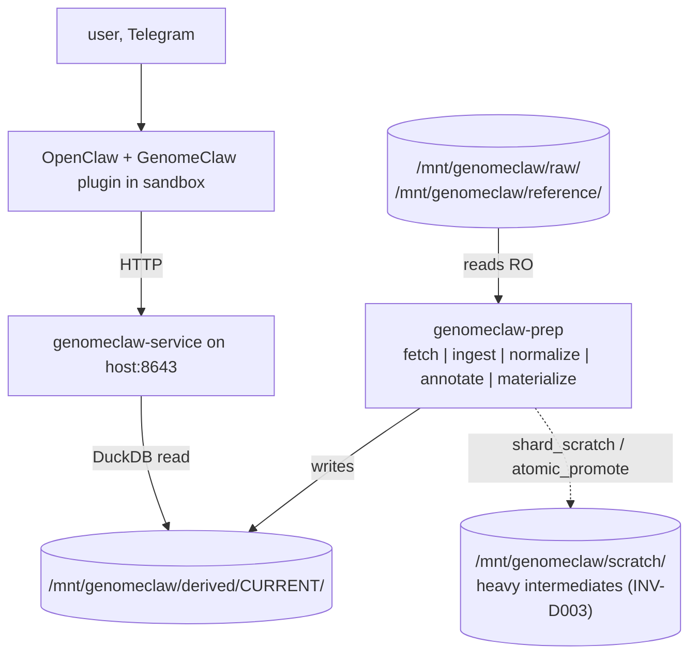

# MVP — Development Plan

**Status**: Active — Phases 1–3 complete; storage architecture from the [cram-scratch-strategy plan](../../completed/cram-scratch-strategy/) landed alongside; Phase 4 (full VEP annotation stack) next
**Created**: 2026-05-06
**Last Updated**: 2026-05-09
**Branch**: `feature/mvp` (target — not yet created)
**Spec**: [spec.md](spec.md)

---

## Summary

Seven sequential phases that take the repo from "scaffolding only" to "a NemoClaw agent over Telegram answers real clinical and lifestyle questions about a real Nebula genome." Each phase is reviewable independently and ships its own RED → GREEN → REFACTOR test cycle.

## Critical Invariants to Respect

The MVP is the first place all canonical invariants land in code. Every phase enforces a subset; the full set is enforced by the end of Phase 7.

- **INV-D001** Raw genomic files source-of-truth — Phase 2 introduces it; every later phase preserves it. Bind-mount-RO is enforced by the host shim (`bin/genomeclaw-prep`) and reasserted in-container by `preflight.assert_raw_readonly()` at every orchestrator entry.
- **INV-D002** Raw artifacts host-side only — Phase 5 lands the sandbox image with no bioinformatics binaries; smoke test enforces.
- **INV-D003** Heavy scratch is separated from authoritative outputs — already enforced (promoted to INVARIANTS.md v1.6 via the [cram-scratch-strategy plan](../../completed/cram-scratch-strategy/)). Every MVP orchestrator that emits multi-GB intermediates allocates them via `shard_scratch(...)` and promotes final artifacts via `atomic_promote(...)`; pre-flight assertions run at every entry.
- **INV-E001** Evidence traceability — Phase 6 lands the finding schema requirement.
- **INV-P001** Privacy default — Phases 4 and 5 land the network policy preset and the integration tests.
- **INV-P002** Agent egress is named, minimal-sufficient — Phases 4, 5, 6 each contribute a layer.
- **INV-R001** Rebuildability — Phases 2 and 3 introduce provenance columns and the determinism test. `atomic_promote` strengthens the rebuild guarantee: an interrupted promotion leaves `derived/` byte-identical to the prior state.
- **INV-C001** Clinical / lifestyle distinction — Phase 6 lands the four-category schema and `evidence_quality` field.

## Proposed New Invariants

None. `INV-D003` was promoted into INVARIANTS.md v1.6 by the cram-scratch-strategy plan; the MVP exercises it but does not propose it.

## Current State Analysis

### What exists today (post-Phase-3 + cram-scratch-strategy interlude)

- `packages/toolkit/` — Phases 1–3 landed:
  - `cli.py` with `fetch`, `ingest`, `normalize`, `materialize` subcommands wired through to real handlers; `setup`, `eject`, `doctor` host-environment subcommands also wired (shipped via the [cram-scratch-strategy plan](../../completed/cram-scratch-strategy/)).
  - `prep/` modules: `fetch.py`, `ingest.py`, `normalize.py`, `materialize.py`, plus subprocess wrappers `_bcftools.py`, `_bcftools_norm.py`, `_bcftools_stats.py`, `_mosdepth.py`, `_vcf.py`, `_versions.py`, plus storage-architecture modules `preflight.py`, `scratch.py`, `setup/`, `eject.py`, `doctor.py`, `reference_build.py`, `run_id.py`, `store.py`. Annotate landed in interim form (`bcftools annotate` against ClinVar) ahead of the full Phase-4 VEP stack.
  - `tests/` populated across the seven first-class categories. 148 tests green at the close of the cram-scratch-strategy plan.
- `bin/genomeclaw-prep` — host shim wraps `docker run genomeclaw/toolkit:<tag> ...`; auto-routes `setup` / `eject` / `doctor` host-native; auto-detects the canonical layout under `/Volumes/Genome_Work/genomeclaw/` after `setup` completes; refuses to start when scratch nests under derived (one of the three `INV-D003` enforcement layers).
- `packages/toolkit/Dockerfile` — multi-stage `genomeclaw/toolkit` image (bioconda + uv).
- `.github/workflows/test.yml` — two-job CI: host-venv pytest + ruff; toolkit-image build + `needs_bio` markers.
- `packages/nemoclaw-plugin/` — TypeScript plugin skeleton, manifest, policy preset, sandbox `Dockerfile`. **Still no live build, no integration tested.**
- `docs/` — full reference set: invariants (v1.6), grand plan, architecture, user stories, planning protocol, agents.
- `.claude/agents/` — six specialized subagents.

### What's missing

- **Phase 4** — full VEP + LOFTEE + AlphaMissense + SpliceAI + vcfanno annotation stack with MANE Select transcript pinning. The interim ClinVar overlay (real Nebula baseline at 4,870,517 variants / 42,885 ClinVar matches) confirms the storage architecture is sound but does not satisfy MVP Phase 4's correctness bar.
- **Phase 5** — `genomeclaw-service` FastAPI app, plugin migration to `registerTool`, sandbox image build, `INV-D002` smoke test.
- **Phase 6** — finding/evidence schemas, four-category clinical/lifestyle distinction, Cyrius CYP2D6 outside-call, `pgsc_calc` PRS panel, `reference/curated_notes/` evidence resolver + 7 gene notes + `topic:hard-genes`.
- **Phase 7** — end-to-end agent loop demo + invariant sweep on the project owner's actual genome.

### Files to Modify

| File | Current State | Planned Changes |
|------|---------------|-----------------|
| `packages/nemoclaw-plugin/src/index.ts` | TS skeleton with placeholders | Phase 5 — wire to live host service, add JSON-encoded responses, run against real sandbox |
| `packages/nemoclaw-plugin/openclaw.plugin.json` | Manifest with config schema | Phase 5 — possibly extend `configSchema` if Phase 5 surfaces gaps |
| `packages/nemoclaw-plugin/policy-preset.yaml` | Read-only paths whitelisted | Phase 4/5 — verify final endpoint list matches host service routes |

### Files to Create (high-level)

| Path | Purpose |
|------|---------|
| `packages/toolkit/pyproject.toml` | Python package (uv-managed) |
| `packages/toolkit/src/genomeclaw_toolkit/cli.py` | `genomeclaw-prep` entrypoint |
| `packages/toolkit/src/genomeclaw_toolkit/prep/` | ingest / normalize / annotate / materialize |
| `packages/toolkit/src/genomeclaw_toolkit/service/` | FastAPI host service |
| `packages/toolkit/src/genomeclaw_toolkit/schemas/` | finding / evidence / provenance Pydantic models |
| `packages/toolkit/tests/` | unit + integration + provenance + determinism + privacy tests |
| `.github/workflows/test.yml` | CI |

## Solution Design

The two-domain architecture in [architecture.md](../../reference/architecture.md) is the design. The MVP doesn't reinvent it — it implements it.

### Key Design Decisions

1. **Python + uv for the toolkit** — matches the bioinformatics ecosystem (`cyvcf2`, `pysam`, DuckDB Python bindings, PharmCAT bindings). Already a Decision Taken in [grand-plan.md](../../reference/grand-plan.md).
2. **FastAPI for the host service** — minimal, async, fits the host service's small surface area and shapes minimal-sufficient JSON cleanly with Pydantic.
3. **VEP + LOFTEE + AlphaMissense + SpliceAI + vcfanno as the default annotation stack for the MVP** *(per [spec.md](spec.md) Q5 — supersedes Q1's SnpEff)*. **MANE Select** transcript pinning; HGVSc and HGVSp emitted server-side. The recommendations report demonstrates SnpEff's pathogenicity-call divergence is unsafe for clinical-track findings; VEP's plugin ecosystem closes the gap. vcfanno covers ClinVar + gnomAD v4 (per-population AFs) + dbSNP overlays.
4. **Seven lifestyle findings via `reference/curated_notes/`** *(per [spec.md](spec.md) Q9)* — LCT, CYP1A2, ADORA2A, ALDH2, ADH1B, APOE, MTHFR. Lifestyle calibration is driven by user-authored markdown notes retrieved via `genomeclaw_evidence(ref="gene_note:<gene>")`; the structured `evidence_quality` field is preserved for future-proofing but is not the primary surface in v0. PER3, CLOCK, ACTN3 are dropped (not deferred).
5. **The `CURRENT` symlink resolves the active run** — atomic update by `genomeclaw-prep`, the host service reads the symlink target on startup and on `SIGHUP`.
6. **Cyrius + PharmCAT outside-call for CYP2D6** *(per [spec.md](spec.md) Q6)* — Cyrius runs against the BAM at ingest, produces a star-allele diplotype, feeds PharmCAT's outside-call interface. Without this, the PGx track is unsafe for any CYP2D6-relevant prescription (codeine, SSRIs, tamoxifen, etc.).
7. **Coverage-aware gene queries via mosdepth + `genomeclaw_gene` (5th tool)** *(per [spec.md](spec.md) Q7)* — `mosdepth` runs at ingest against the BAM/CRAM and materializes per-gene mean coverage into `coverage_qc`. The agent reads `mean_coverage` and `low_coverage_exons` from `genomeclaw_gene` and grounds negative answers (closes the false-reassurance failure mode).
8. **PRS panel via `pgsc_calc` + `genomeclaw_pgs` (6th tool)** *(per [spec.md](spec.md) Q8)* — three initial traits (CAD, T2D, breast or prostate); ancestry-normalized via `pgsc_calc --run_ancestry`; PGS Catalog scoring weights fetched host-side, opt-in, deliberate. Findings classified `clinical-non-actionable`; no `clinical_escalation` marker; calibration warning surfaced structurally.
9. **Defer-by-default scope discipline** *(per [spec.md](spec.md) Q10)* — HLA typing, structural variants, repeat expansions, mtDNA, population-specific reference panels, eval harness, additional PRS traits, citation stripping, tool-use forcing, deterministic findings cards, etc., are deferred behind specific trigger conditions. The bar is observed need, not anticipated need.
10. **Toolkit + bioinformatics binaries packaged as a single `genomeclaw/toolkit` Docker image** *(Decision Taken 2026-05-08)* — `genomeclaw-prep` and `genomeclaw-service` both run inside one image alongside their pinned dependencies (`bcftools`, `mosdepth`, `samtools`, and later VEP / Cyrius / `pgsc_calc` / PharmCAT). Bind-mounts (`/mnt/genomeclaw/raw` RO, `/mnt/genomeclaw/reference` RO, `/mnt/genomeclaw/derived` RW, `/mnt/genomeclaw/scratch` RW) preserve the on-disk layout the architecture already describes. Large reference data (VEP cache, AlphaMissense, gnomAD slices, PGS Catalog weights) lives on the bind-mounted `reference/` volume, **never baked into the image**. A thin host shim (`bin/genomeclaw-prep`) delegates to `docker run` so users type the same command as before. Strengthens `INV-R001` (pinned tool versions); does not affect `INV-D002` (which only forbids bio binaries in the **sandbox** image, not on the host). CI builds the same image and tests against it, removing the "install bcftools on the runner" foot-gun from Phase 2 onward.
11. **Storage architecture for CRAM-scale workloads delivered via the cram-scratch-strategy plan** *(landed 2026-05-09; plan now in `docs/plans/completed/cram-scratch-strategy/`)*. The MVP plan inherits a four-mount canonical layout (`<drive>/genomeclaw/{raw,reference,derived,_scratch}/`), an interactive one-shot `genomeclaw-prep setup` that detects + validates + repartitions the user's external drive (APFS, named `Genome_Work`), host-side `doctor` (read-only diagnostic) and `eject` (refuses-when-running) subcommands, the `preflight` assertion library that runs at every orchestrator entry, and the scratch-primitives library (`shard_scratch(...)` context manager + `atomic_promote(...)` for crash-safe artifact promotion). The new `INV-D003` (Heavy Scratch Is Separated From Authoritative Outputs) was promoted into INVARIANTS.md v1.6. MVP Phase 2 was retrofitted onto these primitives during the cram-scratch-strategy plan: the original `GENOMECLAW_WORK_DIR` env var was renamed to `GENOMECLAW_SCRATCH_DIR`; in-container `/mnt/genomeclaw/work` was renamed to `/mnt/genomeclaw/scratch`; orchestrators allocate scratch through `shard_scratch(...)` rather than ad-hoc `tempfile.TemporaryDirectory(dir="/tmp")`. Phase 4+ orchestrators inherit these primitives from day one.

### Schema / Provenance Impact

- **Schema v0.1** introduced (Phase 2/3 deliverable). Host service refuses to load anything not v0.1.
- **Schema v0.2 reserved** for the Q5 / Q7 / Q8 additions, landed by Phase 4 / 6:
  - `variants` table gains: zygosity, depth (DP), allele balance, FILTER, ClinVar classification + review status, gnomAD popmax + per-ancestry AFs, gene LOEUF, **MANE Select HGVSc and HGVSp**, **AlphaMissense score + class**, **SpliceAI max delta**, **LOFTEE high-confidence flag**.
  - New table **`coverage_qc`** populated by `mosdepth` at ingest (per Q7); gene-keyed; `mean_depth`, `low_coverage_exons`.
  - New table **`pgs_scores`** populated by `pgsc_calc` (per Q8); trait-keyed; `percentile_in_user_ancestry`, `raw_score`, `source_pgs_id`, `study_population`, `calibration_warning`.
  - New per-run artifact **`cyp2d6_diplotype.json`** (per Q6) consumed by PharmCAT outside-call in `annotate`.
  - `manifest.json` adds `qc.bcftools_stats` block (per Q5 / Phase 2 deliverable 5).
- Provenance columns required on every derived row: `source_path`, `source_sha256`, `tool`, `tool_version`, `params_json`, `schema_version`, `created_at`. New tables (`coverage_qc`, `pgs_scores`) inherit these.

### Privacy & Egress Impact

- **New egress points**: agent → OpenAI (managed by OpenShell, not by GenomeClaw); plugin → host service (whitelisted by policy preset); `genomeclaw-prep fetch` → annotation source URLs (host-side, deliberate); **`pgsc_calc` → PGS Catalog (host-side, deliberate, opt-in; per Q8)**. The PGS Catalog fetch fetches scoring weights only; no genomic data traverses the boundary.
- **No new secret-handling surfaces** in the MVP — credentials for OpenAI live in the OpenShell gateway store; `fetch` uses no auth for ClinVar/gnomAD/dbSNP/PGS-Catalog downloads.
- **Redaction**: not strictly needed for the MVP because the host service constructs minimal-sufficient JSON from a curated finding schema. The redaction utility lands when the first non-curated path appears (post-MVP). The two new endpoints (`/v1/gene/{symbol}`, `/v1/pgs/{trait}`) inherit the minimal-sufficient response-shape discipline; PRS responses never include raw PGS variant lists.

## Phase Overview

| Phase | Description | TDD Focus | Est. Tests |
|-------|-------------|-----------|------------|
| 1 | Repo scaffolding & test infrastructure | smoke + import + CI shape | ~5 |
| 2 | Host CLI: ingest + reference fetch + minimal derived store + **`bcftools stats` + `mosdepth`** *(per Q7)* | provenance, integrity checks, source-RO, coverage QC | ~21 |
| 3 | Host pipeline: normalize + materialize | determinism, provenance | ~12 |
| 4 | Host pipeline: annotate (**VEP + LOFTEE + AlphaMissense + SpliceAI + vcfanno** with **MANE Select** transcript pinning; ClinVar + gnomAD v4 + dbSNP via vcfanno) *(per Q5)* | annotation correctness, determinism, provenance | ~12 |
| 5 | Host service + plugin wiring + sandbox image; tool count **6** with `genomeclaw_gene` *(per Q7)* + new `/v1/gene/{symbol}` endpoint | privacy default, policy preset, plugin round-trip | ~15 |
| 6 | Findings + evidence + lifestyle support: **Cyrius + PharmCAT outside-call** *(per Q6)*, **`pgsc_calc` PRS panel + `genomeclaw_pgs`** *(per Q8)*, **`reference/curated_notes/` evidence resolver + 7 gene notes + `topic:hard-genes`** *(per Q9)* | evidence binding, escalation markers, lifestyle calibration via curated notes, PRS classification | ~18 |
| 7 | End-to-end MVP demo + invariant sweep | full agent flow, all invariants live | ~10 |

Total estimated tests: ~93, distributed across the first-class categories. (Was ~80 before Phase 2 absorbed Q7 deliverables 5/6 with 3 new test cases.)

---

## Phase 1: Repo scaffolding & test infrastructure

**Goal**: a working `packages/toolkit/` Python package with a test harness, a `genomeclaw-prep --help` command that prints, and a CI workflow that runs the test suite.
**Detailed Plan**: [phases/phase-1.md](phases/phase-1.md)

### Deliverables
1. `packages/toolkit/pyproject.toml`
2. `packages/toolkit/src/genomeclaw_toolkit/{cli,prep,service,schemas}/`
3. `packages/toolkit/tests/test_smoke.py`
4. `.github/workflows/test.yml`

### Invariants Enforced Here
None of `INV-Dxxx` / `INV-Exxx` / `INV-Pxxx` / `INV-Cxxx` yet — this phase is foundations. The smoke test only asserts the package imports and the entrypoint runs.

### Success Criteria
- [ ] `uv run pytest` passes on a fresh clone.
- [ ] `uv run genomeclaw-prep --help` prints subcommand list.
- [ ] CI workflow runs the test suite and lint.

## Phase 2: Host CLI — ingest + reference fetch + minimal derived store

**Goal**: `genomeclaw-prep ingest` and `genomeclaw-prep fetch` work against fixtures; a derived store with provenance columns is produced.

### Deliverables
1. `genomeclaw-prep ingest` subcommand (integrity checks + indexing + reference-build sniffing).
2. `genomeclaw-prep fetch --source clinvar|gnomad|dbsnp` subcommand.
3. Minimal DuckDB derived store with provenance columns + `manifest.json` + `provenance.json`.
4. `CURRENT` symlink semantics.
5. **`bcftools stats`** invoked at ingest; summary written into `manifest.json` under `qc.bcftools_stats` *(per [spec.md](spec.md) Q5 / Q12)*. Ts/Tv ratio is the headline sanity-check value.
6. **`mosdepth`** invoked at ingest against the BAM/CRAM read-only; per-gene mean coverage materialized into a `coverage_qc` table within the derived store *(per [spec.md](spec.md) Q7)*. The seven canonical provenance columns are populated on every `coverage_qc` row.

### Invariants Enforced Here
- **INV-D001** — pipeline tests assert source files unchanged after a run **including BAM/CRAM unchanged after `mosdepth`** (test case 21).
- **INV-R001** — provenance columns populated; `created_at` recorded; tool versions pinned in the manifest including `bcftools` (now also captured via `bcftools stats`) and `mosdepth`. `coverage_qc` rows inherit the seven canonical provenance columns (test case 20).

### Success Criteria
- [ ] Fixture ingest produces a populated derived store with all seven provenance columns.
- [ ] Source file SHA256 unchanged after `ingest`. BAM SHA256 unchanged after `mosdepth` (test case 21).
- [ ] `CURRENT` symlink atomically updated.
- [ ] `manifest.json` carries a `qc.bcftools_stats` block with sane Ts/Tv ratio (test case 19).
- [ ] `coverage_qc` table populated with at least one row per gene in the fixture's gene list (BRCA1, BRCA2, CYP2D6, etc.) (test case 20).

## Phase 3: Host pipeline — normalize + materialize

**Goal**: VCF normalization (left-align, split multi-allelics, canonical representation) and materialization into the DuckDB store. Determinism test passes.

### Deliverables
1. `genomeclaw-prep normalize` subcommand wrapping `bcftools norm`.
2. `genomeclaw-prep materialize` subcommand producing the canonical `variants` table.

### Invariants Enforced Here
- **INV-R001** — determinism test runs the pipeline twice and diffs byte-for-byte.

### Success Criteria
- [ ] Normalization is deterministic against a fixture.
- [ ] Two consecutive `materialize` runs produce byte-equivalent DuckDB files (modulo declared non-determinism — none expected).

## Phase 4: Host pipeline — annotate (VEP + LOFTEE + AlphaMissense + SpliceAI + vcfanno)

**Goal**: Annotation against ClinVar + gnomAD v4 + dbSNP via the **VEP + LOFTEE + AlphaMissense + SpliceAI** stack with **MANE Select** transcript pinning, plus **vcfanno** for tabix-indexed overlay sources (per [spec.md](spec.md) Q5 — supersedes Q1's SnpEff). Annotated variants land in the derived store with provenance for each annotation source. Schema bumps from v0.1 → v0.2 to absorb the new annotation columns.

### Deliverables
1. `genomeclaw-prep annotate` subcommand wrapping VEP (with `--mane_select`, `--hgvs`, plus the LOFTEE / AlphaMissense / SpliceAI plugins) and vcfanno.
2. Annotation source resolution from `/mnt/genomeclaw/reference/{vep_cache,clinvar,gnomad,dbsnp}/`.
3. Annotation columns extending the canonical `variants` table: zygosity, depth (DP), allele balance, FILTER, ClinVar classification + review status, gnomAD popmax + per-ancestry AFs, gene LOEUF, **MANE Select HGVSc and HGVSp**, **AlphaMissense score + class**, **SpliceAI max delta**, **LOFTEE high-confidence flag**.
4. Schema bump from v0.1 → v0.2; host service refuses to load < v0.2 after this phase.

### Invariants Enforced Here
- **INV-R001** — annotation step is deterministic; VEP cache + LOFTEE + AlphaMissense + SpliceAI + vcfanno versions pinned in `manifest.json`.
- **INV-D001** — annotation files under `reference/{vep_cache,clinvar,gnomad,dbsnp}/` are not mutated.

### Success Criteria
- [ ] Fixture VCF annotates against fixture ClinVar / gnomAD / dbSNP slices using VEP + plugins + vcfanno.
- [ ] MANE Select transcript pinning verified: HGVSc / HGVSp populated against the canonical transcript for each fixture gene.
- [ ] AlphaMissense / SpliceAI / LOFTEE columns populated where applicable.
- [ ] Annotation versions appear in the run's `manifest.json`.
- [ ] Annotation tables include provenance columns (`INV-R001`).

## Phase 5: Host service + plugin migration to `registerTool` + sandbox image

**Goal**: A live network round-trip from a NemoClaw sandbox to the host service, with the plugin's tool surface migrated to OpenClaw's published agent-tool API (`registerTool`). The privacy posture is enforced for the first time.

### Deliverables
1. `genomeclaw-service` FastAPI app: `/v1/health`, `/v1/variants`, `/v1/variants/{key}`, `/v1/provenance/{run-id}`, **`/v1/gene/{symbol}`** *(per [spec.md](spec.md) Q7)*. (Phase 6 lands `/v1/findings`, `/v1/findings/{id}`, `/v1/evidence/{ref}`, `/v1/pgs/{trait}`.)
2. **Plugin migration from `registerCommand` to `registerTool`** (per spec Q2 — Decision Taken):
   - Rewrite handlers in [packages/nemoclaw-plugin/src/index.ts](../../../packages/nemoclaw-plugin/src/index.ts) to call `api.registerTool(...)` for **five** of the six tools owned by Phase 5: `genomeclaw_status`, `genomeclaw_findings`, `genomeclaw_variant`, `genomeclaw_evidence`, **`genomeclaw_gene`** *(per spec Q7)*. (Per spec Q3 — Decision Taken: `genomeclaw_report` is dropped; the existing block in `src/index.ts` is removed during the rewrite. Phase 6 adds the 6th tool, `genomeclaw_pgs`, per Q8.)
   - Define TypeBox parameter schemas per tool (per spec Q4 — Decision Taken: filter-by-collection tools use **typed arrays**; single-record lookups stay scalar). Concretely:
     - `genomeclaw_status` — `Type.Object({})`.
     - `genomeclaw_findings` — `Type.Object({ category: Type.Optional(Type.Union([Type.Literal('clinical-actionable'), Type.Literal('clinical-non-actionable'), Type.Literal('lifestyle'), Type.Literal('mixed')])), genes: Type.Optional(Type.Array(Type.String(), { minItems: 1 })), drugs: Type.Optional(Type.Array(Type.String(), { minItems: 1 })), limit: Type.Optional(Type.Integer({ minimum: 1, maximum: 200 })) })`.
     - `genomeclaw_variant` — `Type.Object({ key: Type.String({ minLength: 1 }) })` (single canonical key like an rsid or chr-pos-ref-alt).
     - `genomeclaw_evidence` — `Type.Object({ ref: Type.String({ minLength: 1 }) })` (per Q9 the resolver accepts variant-keyed and `gene_note:<gene>` / `topic:<topic>` forms).
     - `genomeclaw_gene` — `Type.Object({ gene: Type.String({ minLength: 1 }) })` *(per Q7)*.
   - Replace the v0 text-encoding helpers (`encodeResult`, `encodeError`, the `GENOMECLAW_JSON:` / `GENOMECLAW_ERROR:` markers, `parseArgs`) with `jsonResult(payload)` / `failedTextResult(text, details)` from `openclaw/plugin-sdk`.
   - Add `@sinclair/typebox` to `packages/nemoclaw-plugin/package.json` dependencies.
3. Wired plugin calling the live host service via the new `registerTool` handlers.
4. Sandbox image built from `packages/nemoclaw-plugin/sandbox/Dockerfile`; onboarded via `nemoclaw onboard --from`.
5. `INV-D002` smoke test on the built image (no bioinformatics binaries present — including no `mosdepth`, no Cyrius, no `pgsc_calc`).
6. **Live tool-result verification**: in the project owner's sandbox, exercise each registered tool through the agent and confirm the LLM (a) sees JSON-shaped tool results in the `content[].text` block, (b) addresses returned fields by name in follow-up tool calls, (c) does not require any prefix-marker parsing.
7. Policy preset (`packages/nemoclaw-plugin/policy-preset.yaml`) GET-path allowlist updated to include `/v1/gene/*`. (`/v1/pgs/*` lands in Phase 6.)

### Invariants Enforced Here
- **INV-D002** — sandbox image inspection.
- **INV-P001** — privacy-default integration test asserts the plugin reaches only the host service and `inference.local`.
- **INV-P002** — policy preset enforced; live-test asserts SSRF guard rejects un-allowlisted hosts/ports; minimal-sufficient JSON shape verified at the host service AND at the plugin's `jsonResult(...)` payload.

### Success Criteria
- [ ] Plugin uses `registerTool` exclusively for the **five** tools (no remaining `registerCommand` calls for agent-callable surfaces). Phase 6 adds the 6th tool `genomeclaw_pgs`.
- [ ] Tool parameters are validated by TypeBox schemas; invalid params are rejected by the SDK before reaching the handler.
- [ ] Tool results are produced via `jsonResult(payload)`; the structured object is preserved in `result.details`.
- [ ] `genomeclaw_status` and `genomeclaw_gene` round-trips work from inside the sandbox; the LLM correctly references at least one returned field by name in a follow-up message.
- [ ] Sandbox image has no `samtools` / `bcftools` / `bgzip` / `mosdepth` / `cyrius` / `pgsc_calc` / VEP / vcfanno on PATH.
- [ ] Live policy probe: sandbox reaches only the configured host:port.

## Phase 6: Findings + evidence + lifestyle support (curated_notes/) + Cyrius CYP2D6 outside-call + PRS

**Goal**: The lifestyle and clinical tracks both work. The agent can answer Story 2, Story 4, Story 9, and Story 10 questions correctly. (Per spec Q3: no `/v1/report` endpoint; the agent assembles reports from primitives + its own framing.)

### Deliverables
1. Finding schema (`category`, `clinical_escalation`, `evidence_quality`).
2. Evidence record schema (variant-keyed kinds, plus `gene_note:<gene>` and `topic:<topic>` per [spec.md](spec.md) Q9).
3. Initial finding set: ACMG SF + PharmCAT actionable (with **Cyrius**-derived CYP2D6 diplotype fed via PharmCAT's outside-call interface, per [spec.md](spec.md) Q6) + the seven lifestyle gene findings via `reference/curated_notes/` (LCT, CYP1A2, ADORA2A, ALDH2, ADH1B, APOE, MTHFR; per [spec.md](spec.md) Q9). PER3, CLOCK, ACTN3 are **not** shipped (dropped per Q9).
4. `/v1/findings`, `/v1/findings/{id}`, `/v1/evidence/{ref}` (with `gene_note:<gene>` / `topic:<topic>` resolver accepting reads from `reference/curated_notes/`), **`/v1/pgs/{trait}`** *(per Q8)*.
5. Plugin tools `genomeclaw_findings`, `genomeclaw_variant`, `genomeclaw_evidence` wired and returning structured payloads via `jsonResult(...)`. Add **`genomeclaw_pgs`** as the 6th tool *(per Q8)*; TypeBox `Type.Object({ trait: Type.String({ minLength: 1 }) })`.
6. **Cyrius `cyp2d6-call` subcommand** *(per Q6)*: invoked at ingest time (separate run from `genomeclaw-prep ingest` if Phase 6 doesn't fold it in; otherwise extends `ingest`'s side-effects). Writes `derived/<run-id>/cyp2d6_diplotype.json`; `annotate` consumes it for PharmCAT outside-call.
7. **`pgsc_calc pgs-compute` subcommand** *(per Q8)*: fetches scoring weights from PGS Catalog (host-side, deliberate, opt-in egress); ancestry-normalizes via `--run_ancestry`; writes the `pgs_scores` table.
8. **`reference/curated_notes/` directory** *(per Q9)* with seven gene notes (`lct.md`, `cyp1a2.md`, `adora2a.md`, `aldh2.md`, `adh1b.md`, `apoe.md`, `mthfr.md`) plus `topics/hard-genes.md`. Each note is user-authored Markdown carrying the project owner's calibrated framing of the variant's effect. **The privacy-safety-reviewer agent reviews curated-note diffs before merge** (per `INV-C001` v1.5).
9. Policy preset (`packages/nemoclaw-plugin/policy-preset.yaml`) GET-path allowlist extended to `/v1/findings/*`, `/v1/findings/{id}`, `/v1/evidence/*`, `/v1/pgs/*`.

### Invariants Enforced Here
- **INV-E001** — every finding has an evidence reference; schema rejects findings without one. Lifestyle findings cite `gene_note:<gene>`; PRS findings cite `pgs_catalog:<id>`.
- **INV-C001** v1.5 — `clinical_escalation` set on `clinical-actionable`; lifestyle findings cite a `gene_note:<gene>` evidence reference and the agent's prose tracks the curated note's framing without over-extending or ignoring it; over-deferral and over-claim snapshot tests pass on agent-rendered prose against fixture conversations (Story 2 + Story 4 + Story 9 + Story 10). PRS findings carry `category: clinical-non-actionable`, no `clinical_escalation` marker, calibration warning surfaced structurally.
- **INV-P001** — PGS Catalog fetch is host-side, deliberate, opt-in (`pgsc_calc fetch-weights` is a separate user invocation, not background).
- **INV-P002** — bulk-class endpoints wired but disabled in the MVP; reject-with-error tests confirm. PRS responses never include raw PGS variant lists.

### Success Criteria
- [ ] Snapshot tests pass for the four reference user-stories conversations (Story 2, Story 4 *(including the CYP2D6 sub-conversation)*, Story 9, Story 10). The agent assembles its own report-shaped responses; tests assert structural correctness (escalation markers surfaced, evidence refs cited, no forbidden phrases, curated-note framing tracked, PER3/CLOCK gracefully declined) of the agent's output.
- [ ] *CYP1A2* lifestyle finding renders with `gene_note:CYP1A2` evidence reference; agent's prose tracks the note's framing.
- [ ] *CYP2D6* `*1/*4` PGx finding (or whatever Cyrius returns for the project owner's BAM) renders with `clinical_escalation` set; PharmCAT outside-call output surfaces the metabolizer phenotype.
- [ ] BRCA2 pathogenic finding (if present in fixture) renders with `clinical_escalation` set.
- [ ] CAD PRS finding renders with `clinical-non-actionable` category, calibration warning surfaced, no `clinical_escalation` marker.
- [ ] All seven curated-notes files exist and pass the `privacy-safety-reviewer` agent review.

## Phase 7: End-to-end MVP demo + invariant sweep

**Goal**: All seven AC items from `spec.md` pass on the project owner's actual hardware with a real Nebula VCF.

### Deliverables
1. Full ingest → normalize → annotate → materialize → query → finding loop on the project owner's actual genome.
2. A live conversation transcript demonstrating Stories 2, 4, 9 (clinical-actionable + PGx + lifestyle).
3. Final invariant sweep: all `INV-xxx` tests green together.
4. Documentation updates: any architecture.md drift discovered during implementation lands here.

### Invariants Enforced Here
**All canonical invariants together**, in a single integration sweep.

### Success Criteria
- [ ] All seven `spec.md` ACs check off.
- [ ] All `tests/invariants/test_invXxxx_*.py` pass.
- [ ] No outbound calls observed except to the configured agent endpoint and host service.
- [ ] Plan moves to `docs/plans/completed/mvp/`.

---

## Testing Strategy

### Unit Tests (co-located)
- `packages/toolkit/src/genomeclaw_toolkit/**/*_test.py`: pure-function behavior on each pipeline step.

### Integration Tests
- `packages/toolkit/tests/integration/`: ingest → normalize → annotate → materialize → query end-to-end against fixture data.

### Provenance Tests
- `packages/toolkit/tests/provenance/`: every emitted derived row carries the seven canonical columns; manifest.json carries tool versions.

### Determinism Tests
- `packages/toolkit/tests/determinism/`: pipeline run twice on the same fixture; diff byte-for-byte.

### Privacy-Default Tests
- `packages/toolkit/tests/privacy/`: simulate full agent flow under default config; assert outbound calls limited to the configured agent endpoint and the configured host service.

### Evidence-Binding Tests
- `packages/toolkit/tests/evidence/`: every finding emitted by the host service has a non-null evidence reference; deleting an evidence record marks dependent findings stale on next rebuild.

### Report Rendering Tests
- `packages/toolkit/tests/reports/`: integration-level snapshot tests on the **agent's rendered prose** against fixture conversations (Story 2, Story 4, Story 6, Story 9). Over-claim and over-deferral both fail. Report assembly happens at the agent layer — there is no host-service `/v1/report` endpoint in the MVP (see spec Q3).

### Invariant Tests
- `packages/toolkit/tests/invariants/test_invXxxx_*.py`: one or more tests per `INV-xxx`, named so the ID appears in the test name.

---

## Documentation Updates

After Phase 7 lands:

- [ ] [docs/reference/INVARIANTS.md](../../reference/INVARIANTS.md) — only if Phase 7's invariant sweep surfaces a needed new invariant; not expected.
- [ ] [docs/reference/architecture.md](../../reference/architecture.md) — update any drift discovered during implementation.
- [ ] [docs/reference/grand-plan.md](../../reference/grand-plan.md) — update Horizon 1–3 to "delivered" status; advance the deferred-decision rows where applicable.
- [ ] [docs/reference/user-stories.md](../../reference/user-stories.md) — mark resolved gap-analysis items.
- [ ] [README.md](../../../README.md) — replace "Getting Started" placeholder with the real ingest + service-start commands.

---

## Progress Tracking

| Phase | Status | Started | Completed | Notes |
|-------|--------|---------|-----------|-------|
| Phase 1 | Complete | 2026-05-08 | 2026-05-08 | Scaffold + smoke tests + CI workflow landed; 4/4 smoke tests green; ruff clean. |
| Phase 2 | Complete | 2026-05-08 | 2026-05-09 | All 21 cases green; 95 in-image tests; ingest verified end-to-end against the project owner's real Nebula VCF in 1m 17s. |
| Phase 3 | Complete | 2026-05-09 | 2026-05-09 | normalize + materialize subcommands; full pipeline 1m45s on real Nebula (26s normalize + 1m19s materialize); 4.79M → 4.87M rows after multi-allelic split; 115 in-image tests. |
| **cram-scratch-strategy interlude** | Complete | 2026-05-09 | 2026-05-09 | Storage architecture landed out-of-band via [its own 5-phase plan](../../completed/cram-scratch-strategy/): `setup` / `eject` / `doctor` subcommands, scratch primitives (`shard_scratch` / `atomic_promote`), pre-flight assertions, `_scratch/` rename, `INV-D003` promoted to INVARIANTS.md v1.6. Interim ClinVar overlay annotation (via `bcftools annotate`) shipped against real Nebula: 4,870,517 variants / 42,885 ClinVar matches / schema v0.2; 148 tests green at the close of the plan. **Not** the MVP Phase-4 deliverable (which is the full VEP + LOFTEE + AlphaMissense + SpliceAI + vcfanno stack); it is the scaffolding Phase 4+ orchestrators will build on. |
| Phase 4 | Pending — full VEP stack | | | |
| Phase 5 | Pending | | | |
| Phase 6 | Pending | | | |
| Phase 7 | Pending | | | |

---

## Open Risks & Follow-ups

- **Plugin tool-return shape** (spec Q2) is unresolved until live-tested in Phase 5. If structured JSON returns aren't supported, the v0 `GENOMECLAW_JSON:` text-encoding ships and the work to upgrade is filed under a follow-up plan.
- ~~**Annotator choice** (spec Q1) — SnpEff is the default; if Phase 4 shows it's too slow on the project owner's host, switch decision happens during Phase 4.~~ ✅ Resolved by spec Q5: VEP + LOFTEE + AlphaMissense + SpliceAI + vcfanno is the default annotation stack; SnpEff is superseded.
- ~~**Storage architecture for CRAM-scale workloads** — the original Phase 2 plan routed transient I/O through `GENOMECLAW_WORK_DIR`; the cram-scratch-strategy plan discovered Phase-4A virtiofs + exFAT failure modes (vcfanno deadlock, RO `work` mount, USB-3 throughput collapse) that required a deeper rework.~~ ✅ Resolved by the [cram-scratch-strategy plan](../../completed/cram-scratch-strategy/): four-mount canonical layout, `_scratch/` rename, scratch primitives (`shard_scratch` / `atomic_promote`), pre-flight assertions, host-side `setup` / `doctor` / `eject` subcommands, `INV-D003` promoted to INVARIANTS.md v1.6. Phase 4+ orchestrators inherit these primitives.
- **AlphaMissense + SpliceAI dataset sizes** *(per spec Q5)* — best-in-class but the dataset files are non-trivial. Phase 4 implementer must validate against the personal-host resource envelope (per the grand-plan's "Personal-host performance" strategic constraint). Mitigation candidates if budget exceeded: drop AlphaMissense data files to a smaller subset; pre-filter against gnomAD AF before running plugins.
- **Cyrius dependency** *(per spec Q6)* — adds a Python tool + ~50 lines of glue at Phase 6. Independent benchmarking shows 96.5–99.3% concordance on the GeT-RM truth set; Aldy is the next-best alternative if Cyrius regresses.
- **PGS Catalog fetch** *(per spec Q8)* — new deliberate, opt-in egress at Phase 6. No genomic data flows outbound; only scoring weights flow inbound. Documented in Privacy & Egress Impact. Nextflow `-work-dir` for `pgsc_calc` lands under `/mnt/genomeclaw/scratch/pgsc_calc/<run-id>/` per `INV-D003`.
- **Curated-notes editorial discipline** *(per spec Q9 + INVARIANTS v1.5)* — the seven curated notes (LCT, CYP1A2, ADORA2A, ALDH2, ADH1B, APOE, MTHFR) plus `topic:hard-genes` are user-authored. The privacy-safety-reviewer agent reviews each note before merge. Note content drift over time is expected and welcomed; revisits land in `work-notes.md` of subsequent plans, not in this MVP plan.
- **Sandbox image size** — bioinformatics deps are absent (per `INV-D002`), so the image stays small. But Node + the plugin's runtime deps still inflate it. Worth measuring in Phase 5.
- **Real-genome fixture in CI** — the project owner's actual Nebula VCF must never be committed. CI uses a small synthetic fixture; end-to-end on the real genome is run locally in Phase 7.
- **Phase 4+ tripwires inherited from cram-scratch-strategy** — the Option-A virtiofs-everywhere bet rests on three concrete escalation conditions (vcfanno-class deadlock, sustained throughput < 100 MB/s, EIO under load) being absent on APFS. None fired during the Phase-3 retrofit (real-data smoke green); Phase 4's full VEP stack is the next stress test. If any tripwire fires, Option B (direct lima for `additionalDisks` block-device passthrough) is documented in the cram-scratch-strategy report.
