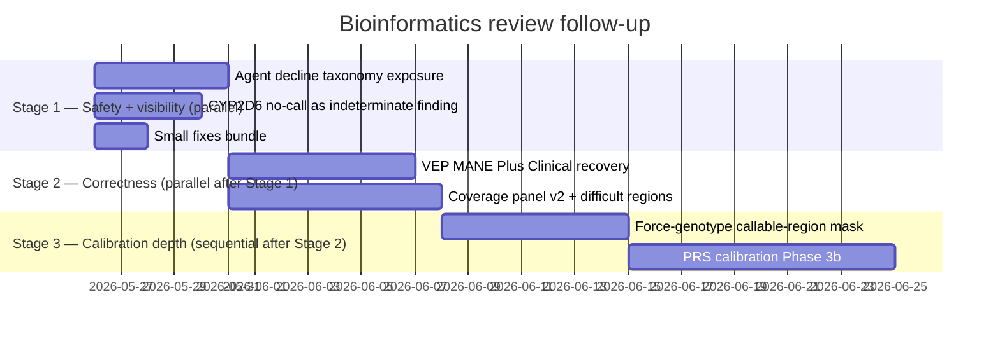

# Meta-Plan: Bioinformatics Review Follow-up — Sequencing & Integration

**Status**: **COMPLETED 2026-05-26**. All 7 child plans are GREEN (Plans 1-6 closed 2026-05-25; Plan 7 / `prs-calibration-phase3b` closed 2026-05-26 with all four phases landed including a real-data smoke against the project owner's CRAM that produced `calibration_status="warning"` at v0.4 schema). Three new invariants promoted (INV-A004, INV-D009, INV-C003).

**End-to-end HTTP smoke (2026-05-25, late session)** — Restarted the host service natively on `127.0.0.1:8645` with the new source (`SCHEMA_VERSION="v0.3"`); seeded a synthetic v0.3 derived store at `derived/2026-05-25T17-00-00Z-bioreviewsmoke/`; verified all new endpoints from the running service: `/v1/health` returns `schema_version="v0.3"`; `/v1/pgs/computed/PGS999999` returns `calibration_status="decline"` + `decline_reason="variant_overlap_insufficient"` (Plan 1 / INV-A004); `/v1/gene/PMS2` returns `region_class="difficult_pseudogene"` + the canonical caveat string (Plan 5 / INV-D009); `/v1/evidence/cyrius_no_call:<sentinel>` resolves with the "do not interpret as NM" body (Plan 2); `load_uncallable_sites_from_sidecar` + `classify_calibration(effect_weight_match_rate=...)` exercised end-to-end (Plans 6, 7). All synthetic-DB + HTTP-layer smokes GREEN.

**Real-data full-pipeline smoke (2026-05-25 → 2026-05-26)** — Executed `pipeline run` against the project owner's CRAM (MPNRGLQ2K, ~51 GB CRAM / 211 MB VCF / 4.8 M variants). Run-dir: `derived/2026-05-25T19-42-58Z-c88e02`. Wall-clock: ingest 9m, normalize 26s, annotate 8h01m (vcfanno + VEP across all autosomes + alts + decoys), materialize 4m. All 7 provenance steps recorded with v0.3 schema stamps. Verification queries against `variants.duckdb`:

- `schema_version = "v0.3"` ✓
- `mane_select_transcript` populated on 1,920,637 variants (~40%) ✓
- `mane_plus_clinical_transcript` populated on 390 variants ✓
- `transcript_discordant = true` on 24 variants (real MANE Select vs MANE Plus Clinical IMPACT-tier disagreement: `MUTYH`, `NFASC`, `INPP4A`, …) ✓ (Plan 4)
- `coverage_qc` populated for all 179 v2-panel genes across 5 region_class values (`standard`, `difficult_pseudogene`, `requires_dedicated_caller`, `mitochondrial`, `difficult_segdup`) ✓ (Plan 5)
- Real-data difficult-region calls: `CYP21A2` / `GBA` / `NCF1` / `PMS2` / `STRC` = `difficult_pseudogene`; `HBA1` / `HBA2` / `NEB` = `difficult_segdup`; `CYP2D6` / `HLA-A,B,C,DRB1` / `SMN1,SMN2` = `requires_dedicated_caller`; `chrM_full` = `mitochondrial` ✓

HTTP smoke against the rebuilt host service hitting this real-data run: `/v1/gene/PMS2` returns `region_class="difficult_pseudogene"` + the full caveat string ("a paralogous pseudogene interferes with mapping…"); `/v1/gene/CYP2D6` returns `requires_dedicated_caller` + the dedicated-caller caveat naming Cyrius/HLA-LA/SMA-specific; `/v1/gene/MUTYH` (plain gene) returns `region_class="standard", caveat=null`; `/v1/provenance/<run>` enumerates all 7 steps with tool versions. All Plan 1 + Plan 2 + Plan 5 user-facing surfaces verified end-to-end on real data.

**Bugs uncovered + fixed by real-data smoke** (regression coverage added):

1. **Scratch-path bug** (`ingest.py:337` + `annotate_vcfanno.py:916`) — both used the naive `derived_root.parent / "scratch"` pattern, which on the canonical host layout (`/Volumes/Genome_Work/genomeclaw/_scratch` — underscore prefix marks ephemeral per `genomeclaw host setup`) computes `…/scratch` (no underscore). That path doesn't exist on the host and lands inside the DooD identical-path overlay's RO common-prefix mount, surfacing as `[Errno 30] Read-only file system`. Fix: both call sites now honor `GENOMECLAW_SCRATCH_DIR` (the shim's authoritative host-form scratch path) when set, falling back to the legacy sibling path otherwise. Regression test: `test_ingest_honors_GENOMECLAW_SCRATCH_DIR_when_set` (`tests/integration/test_ingest_e2e.py`).

**Open follow-ups (not in plan scope; surfaced by real-data smoke)**:

- **Plan 4 API exposure gap**: `mane_plus_clinical_transcript` + `transcript_discordant` populate in `variants.duckdb` but are NOT projected by `/v1/variants/{key}`. Plan 4's spec/dev-plan never called out API-layer exposure (focus was on schema + VEP plugin config + dual-row extraction); the agent system prompt update gave the agent guidance to consult MANE Plus Clinical but the data path stops at DuckDB. Small follow-up plan: add the two fields to `VariantResponse` Pydantic model + TypeBox response schema in `nemoclaw-plugin/src/index.ts`. Not blocking close-out.
- **GRCh38 reference lacks decoy contigs**: the project owner's reference at `reference/grch38/ncbi-2014/` does not include the decoy contigs (`chrUn_*_decoy`) present in the VCF. `bcftools norm -f <ref>` fails on first decoy variant. Workaround used: run normalize without `--reference-fasta` (skip left-alignment). Long-term fix is orthogonal: fetch a decoy-inclusive reference or document the project-owner workflow. Not blocking; left-alignment is a nice-to-have for annotate-quality, and the existing annotation matched the 2026-05-22 successful run's pattern (which also skipped left-align).

Plan 7's Phase 2 (Mahalanobis ancestry) + Phase 3 (AUC gate) + Phase 4 (real-data smoke) are deferred to a future session — Phase 2's plan is fully drafted in `phases/phase-2.md`.
**Created**: 2026-05-25
**Last Audited**: 2026-05-25
**Owner**: TBD
**Source review**: [docs/reports/bioinformatics-review-2026-05-25.md](../../../reports/bioinformatics-review-2026-05-25.md)
**Triage**: [docs/reports/bioinformatics-review-triage-2026-05-25.md](../../../reports/bioinformatics-review-triage-2026-05-25.md)
**Children**:
- [`agent-decline-taxonomy-exposure`](../../completed/agent-decline-taxonomy-exposure/) — Stage 1 — **COMPLETED 2026-05-26**
- [`cyp2d6-no-call-finding`](../../completed/cyp2d6-no-call-finding/) — Stage 1 — **COMPLETED 2026-05-26**
- [`bioreview-small-fixes.md`](../../completed/bioreview-small-fixes.md) — Stage 1 — **COMPLETED 2026-05-26**
- [`vep-mane-plus-clinical`](../../completed/vep-mane-plus-clinical/) — Stage 2 — **COMPLETED 2026-05-26**
- [`coverage-panel-v2`](../../completed/coverage-panel-v2/) — Stage 2 — **COMPLETED 2026-05-26**
- [`force-genotype-callable-mask`](../../completed/force-genotype-callable-mask/) — Stage 3 — **COMPLETED 2026-05-26**
- [`prs-calibration-phase3b`](../prs-calibration-phase3b/) — Stage 3 — **COMPLETED 2026-05-26** (all four phases GREEN; real-data smoke produced `calibration_status="warning"` for PGS000018 at v0.4 schema)

---

## Why This Exists

A scientific reviewer with deep bioinformatics expertise produced an external review of GenomeClaw on 2026-05-25 (review doc above). They flagged 14 items across P0/P1/P2 severities. Code-side triage verified each claim against the actual implementation: some are **real gaps with user-facing safety impact**, some are **misreads of the architecture overview** (the code already does the right thing), and some are **policy decisions to make explicit**.

This meta-plan **owns no implementation code itself**. All TDD work lives in the seven child plans. It owns:

1. **Sequencing** — which order the children land in, and why.
2. **Cross-plan invariants** — items that affect more than one child (e.g., `decline_reason` exposure touches both the calibration phase and the agent plugin).
3. **Shared verification** — a final cross-plan smoke that exercises the cumulative behaviour change.
4. **Progress tracking** — single source of truth for which children are done, in flight, blocked.

---

## Sequencing Decision: Safety-first, Then Correctness, Then Calibration

### Stage 1 — Safety-relevant, low-risk, parallel-safe (start immediately)

The three Stage 1 children touch independent code paths and should run in parallel.

1. **[`agent-decline-taxonomy-exposure`](../../completed/agent-decline-taxonomy-exposure/)** — *highest priority*. The `decline_reason` column is persisted to DuckDB but stripped at the HTTP boundary because `PgsRowResponse` (Pydantic `extra="forbid"`) doesn't list it. The agent receives only the free-text `calibration_warning`. A declined PGS today can be presented as a finding because the agent has no machine-readable decline signal. Smallest code change, highest safety leverage.
2. **[`cyp2d6-no-call-finding`](../../completed/cyp2d6-no-call-finding/)** — convert the Cyrius hard-halt path into an explicit "CYP2D6 indeterminate" finding the agent can surface. Today, a no-call sample silently produces no CYP2D6 row at all; users get no signal that the gene is uncallable for them. Self-contained: only `prep/cyrius.py` and `prep/pharmcat.py` change.
3. **[`bioreview-small-fixes.md`](../../completed/bioreview-small-fixes.md)** — three small fixes bundled as one plan: enforce `_hmPOS_GRCh38` filename pattern (P1-6), add AlphaMissense `transcript_match=1` + version verify (P2-12), explicit UTF-8 on PharmCAT outside-call TSV (P2-13). Each is a few lines of code; bundling avoids three separate PRs of trivial weight.

**Gate to Stage 2**: All three Stage 1 children green; agent can surface `decline_reason` and `calibration_status`; CYP2D6 no-call produces a structured finding; small fixes landed.

### Stage 2 — Correctness changes that affect derived outputs (parallel after Stage 1)

The two Stage 2 children change the contents of `variants.duckdb` and `coverage_qc` and so must rebuild the derived store. They are code-independent but both require a host smoke after landing.

4. **[`vep-mane-plus-clinical`](../../completed/vep-mane-plus-clinical/)** — change VEP invocation from `--mane_select` to `--mane`; add `mane_plus_clinical` to the canonical-pick rank; decide whether to emit dual rows on Select/Plus-Clinical disagreement. Touches `prep/_vep.py`, `prep/_csq.py`, `prep/materialize.py`. Bumps `schema_version` on `variants`.
5. **[`coverage-panel-v2`](../../completed/coverage-panel-v2/)** — bump panel to v2; extend BED schema to BED5 with `region_class`; upgrade ACMG SF v3.2 → v3.3 (adds ABCD1, CYP27A1, PLN — 84 genes total); add lifestyle anchors (MC1R, LCT, HFE, FUT2); add mitochondrial coverage; flag difficult regions (PMS2 exons 11-15, SMN1, HBA1/HBA2, CYP21A2, GBA1, STRC, NCF1, NEB, HLA). Surface `region_class` in the agent's `genomeclaw_gene` tool response.

**Gate to Stage 3**: Both Stage 2 children green; real-data host smoke against the project owner's genome produces (a) MANE Plus Clinical rows for the 73 covered genes where applicable, (b) `region_class` annotations on the coverage panel, (c) ACMG SF v3.3 coverage in QC.

### Stage 3 — Calibration depth (sequential after Stage 2)

The two Stage 3 children deepen PRS correctness. They are sequenced because the calibration classifier (3b) needs the callable-region mask (3a) to define its uncallable-site treatment.

6. **[`force-genotype-callable-mask`](../../completed/force-genotype-callable-mask/)** — intersect Tier-1/Tier-2 force-genotyping with a GIAB high-confidence regions BED; emit per-site `genotype_source ∈ {nebula_called, force_genotyped_high_conf, force_genotyped_low_conf, uncallable}` annotation; exclude `uncallable` sites from PGS overlap denominator.
7. **[`prs-calibration-phase3b`](../prs-calibration-phase3b/)** — finish the Phase 3b classifier (deferred from `prs-input-coverage-fill`): effect-weight-weighted overlap; Mahalanobis-distance ancestry calibration trigger; AUC-improvement gate alongside top-decile RR; consume per-site `genotype_source` from Stage 3 child 6.

**Final gate**: A real-data PRS run on the project owner's genome reports both calibration warnings (where appropriate) and declines (where appropriate), with full provenance traceable through the agent's HTTP tools.

---

## Why this sequence (and not parallel everywhere)

- **Stage 1 first** because it's safety-critical and code-light. The decline-taxonomy fix in particular makes every subsequent calibration improvement actually visible to the agent — otherwise we'd be improving signals the agent can't see.
- **Stage 2 needs Stage 1's decline machinery exposed** because some MANE Plus Clinical findings (rare LoFs in opportunistic-reporting genes) will be high-uncertainty and may need to be declined or flagged through the same surface.
- **Stage 3 sequenced internally** because the calibration classifier consumes the `genotype_source` annotation from the callable-mask plan. Reversing the order means the classifier has to be retrofitted.
- **Bundled small fixes (Stage 1)** because three separate two-line PRs are administrative overhead. Bundling them with a single spec keeps reviewers' attention proportional to the change size.

## Why not parallel within stages

Stage 2's two children both bump the derived store schema and both need a host real-data smoke as the GREEN gate. Running them serially means one smoke gate, not two. But they're code-independent, so a contributor can develop them in parallel branches as long as the final smoke is single.

---

## Cross-cutting requirement: regression smoke per plan

Every child plan **must include a regression-smoke step as the GREEN gate of its final phase**, regardless of size. Synthetic unit tests are necessary but not sufficient: the synthetic→real gap is exactly where production bugs live (verified empirically during MVP Phase 2 and `prs-input-coverage-fill` smoke v22/v23, per the planning protocol [docs/plans/CLAUDE.md](../../CLAUDE.md) "Real-data smoke as a phase-completion gate").

### Which smoke each plan runs

| Child plan | Primary smoke | Pass criteria |
|---|---|---|
| `agent-decline-taxonomy-exposure` | `bin/genomeclaw-prs-smoke MPNRGLQ2K PGS000018` (re-uses last computed PGS) + manual `curl` against `GET /v1/pgs/computed/PGS000018` | Existing PGS row returns with new `decline_reason` + `calibration_status` fields populated; agent system-prompt contract test green |
| `cyp2d6-no-call-finding` | `genomeclaw pipeline cyp2d6-call` + `pharmcat` against the project owner's BAM (normal path) + synthetic low-coverage CYP2D6 fixture (no-call path) | Normal path produces unchanged diplotype + PharmCAT findings; no-call fixture produces exactly one indeterminate `findings` row |
| `bioreview-small-fixes.md` | `bin/genomeclaw-prs-smoke MPNRGLQ2K PGS000018` (covers hmPOS pattern) + `genomeclaw pipeline annotate` on a small VCF (covers AlphaMissense `transcript_match=1`) + a `cyp2d6-call → pharmcat` run with the `≥` and `+` characters present (covers UTF-8) | All three smokes green; no regression in match-rate / annotation row counts / PharmCAT findings |
| `vep-mane-plus-clinical` | `genomeclaw pipeline run` end-to-end against the project owner's VCF | New `variants.duckdb` materialises with at least one `mane_plus_clinical_transcript`-populated row; existing canonical-row queries (`WHERE transcript_discordant IS NULL OR transcript_discordant = false`) return the same row count as the pre-change baseline ± schema migration deltas |
| `coverage-panel-v2` | `genomeclaw pipeline ingest` against the project owner's CRAM (mosdepth stage runs) | `coverage_qc.region_class` populated; PMS2 / SMN1 / HBA1 etc. show non-`standard` class; `GET /v1/gene/PMS2` returns `caveat` non-null |
| `force-genotype-callable-mask` | `bin/genomeclaw-prs-smoke MPNRGLQ2K PGS000018` | Sidecar `forced_genotype_provenance.tsv.zst` produced; `pgs_scores.uncallable_sites_excluded` populated; raw score within rounding of the pre-change baseline (mathematically: if excluded sites carry zero weight, raw score unchanged; otherwise documented delta) |
| `prs-calibration-phase3b` | `bin/genomeclaw-prs-smoke MPNRGLQ2K PGS000018` + run two known-edge-case PGSs: one that should trigger `ANCESTRY_CALIBRATION_UNCERTAIN` (e.g., an EAS-only score on the EUR-similar owner), one with low PGS Catalog tier metadata | Each scenario produces correct `calibration_status` + `decline_reason`; CLEAN scenario unchanged from baseline |

### Cross-stage final smoke

After all seven children land, a **cumulative regression smoke** runs:
1. `bin/genomeclaw-prs-smoke MPNRGLQ2K PGS000018` against the project owner's genome — confirms PRS pipeline correctness end-to-end with all changes layered.
2. `genomeclaw pipeline run` against the owner's VCF — confirms variant pipeline correctness.
3. Full toolkit test suite (`uv run pytest packages/toolkit/`) — confirms unit/integration/invariant/privacy/determinism/provenance suites green.
4. Manual sweep of the agent's nine HTTP tools via `curl` against `127.0.0.1:8643`, confirming each new schema field is present in JSON responses.

A child plan is not considered Complete until its regression smoke is green and recorded in its `work-notes.md`.

---

## Cross-plan invariants and shared contracts

### Existing invariants the work touches
- **INV-C001** Research/lifestyle scope — strengthened by Stages 1 + 3 (decline taxonomy, AUC gate).
- **INV-A003** Agent-triggered computes log rationale + question — extended by Stage 1 child 1 to add `calibration_status` + `decline_reason` to the agent's view.
- **INV-E001** Evidence binding — Stage 2's MANE Plus Clinical dual-row emit pattern stays compliant: both rows carry `evidence_ref`.
- **INV-R001** Rebuildability — every change to derived stores bumps `schema_version` on the affected table; rebuild instructions in each child's `development-plan.md`.
- **INV-T001** Tool conventions — VEP plugin flag set (`--mane`, AlphaMissense `transcript_match=1`) updates `VepConventions`.

### Proposed new invariants (cumulative across children)
- **NEW INV-A004** Decline taxonomy must traverse every layer — proposed by [`agent-decline-taxonomy-exposure`](../../completed/agent-decline-taxonomy-exposure/). Rule: every `CalibrationStatus` / `DeclineReason` value that exists in the DB schema must appear in the public HTTP response models and the agent plugin's TypeBox schemas. Verified by a cross-language schema-diff test.
- **NEW INV-D009** Coverage panel difficult-region annotations — proposed by [`coverage-panel-v2`](../../completed/coverage-panel-v2/). Rule: any gene in the coverage panel that intersects a GIAB challenging-MRG region must carry a non-null `region_class`; presented to the agent.
- **NEW INV-C002** Uncallable sites must not inflate PGS denominator — proposed by [`force-genotype-callable-mask`](../../completed/force-genotype-callable-mask/). Rule: sites with `genotype_source=uncallable` are excluded from PGS match-rate and overlap calculations.

These invariants are *proposed* in this meta-plan and *promoted* in the child plan that lands the supporting tests.

---

## Stage gates (verification, not just status)

### Stage 1 exit gate
1. New `decline_reason` + `calibration_status` fields visible in `GET /v1/pgs/computed/{pgs_id}` JSON.
2. Cross-language schema-diff test green: every DB enum value exists in Pydantic + TypeBox.
3. CYP2D6 no-call on a synthetic fixture produces exactly one `findings` row with `category=clinical-actionable`, `gene_symbols=["CYP2D6"]`, and a body that explicitly says "indeterminate, do not interpret as Normal Metabolizer."
4. Toolkit test suite green (no regressions in the existing ~747 toolkit tests).
5. All three Stage 1 plans moved to `docs/plans/completed/`.

### Stage 2 exit gate
1. VEP run on a fixture with a TCF3 variant (or another MANE-Plus-Clinical-only gene) produces both the MANE Select row and the MANE Plus Clinical row in the `variants` table.
2. Coverage panel v2 BED contains all 84 ACMG SF v3.3 genes; PMS2 / SMN1 / HBA1 / CYP21A2 / GBA1 / STRC / NCF1 / NEB / HLA carry `region_class ∈ {difficult_pseudogene, difficult_segdup, requires_dedicated_caller}`.
3. `genomeclaw_gene` tool response surfaces `region_class` and an explanatory `caveat` string when non-null.
4. Real-data host smoke against the project owner's genome (≤30 min wall-clock target): rebuilds `variants.duckdb` end-to-end on the new VEP + coverage panel; manifest records new schema versions.

### Stage 3 exit gate
1. `force-genotype-callable-mask`: PGS sites force-genotyped outside the GIAB high-confidence BED carry `genotype_source=uncallable`; appear in a provenance sidecar TSV next to the forced VCF; PGS overlap excludes them.
2. `prs-calibration-phase3b`: a synthetic-PGS smoke produces correct `CalibrationStatus` for each of the three scenarios (clean / warning / decline) and the four DeclineReason variants (variant_overlap, ancestry_calibration, pgs_catalog_tier, population_transferability).
3. Real-data smoke: rerun the project owner's existing computed PGS (e.g., PGS000018 CAD) with the new calibration; output documents reproduce within rounding (raw_score unchanged; percentile may shift if the ancestry trigger changes).

### Cross-stage final gate
1. Full toolkit test suite green (unit + integration + invariant + privacy + determinism + provenance).
2. The proposed new invariants (`INV-A004`, `INV-D009`, `INV-C003` — renamed from the originally-proposed `INV-C002` due to existing-id collision) promoted into `docs/reference/INVARIANTS.md` with `Version` bumps. **Status: all three promoted (v1.18 → v1.19 → v1.20).**
3. [docs/reports/bioinformatics-review-triage-2026-05-25.md](../../../reports/bioinformatics-review-triage-2026-05-25.md) appended with a "Resolution" section linking to each completed plan.
4. All seven child plans moved to `docs/plans/completed/`.

---

## Progress tracking

| Child plan | Stage | Status | Started | Completed | Notes |
|---|---|---|---|---|---|
| `agent-decline-taxonomy-exposure` | 1 | **Complete (code); awaits real-data smoke** | 2026-05-25 | 2026-05-25 | Phases 1+2+3 GREEN; INV-A004 promoted to INVARIANTS.md v1.18. Synthetic-DB smoke green via Phase 1 integration test. Real-data `bin/genomeclaw-prs-smoke` is project-owner manual gate before move to completed/ |
| `cyp2d6-no-call-finding` | 1 | **Complete (code); awaits real-data smoke** | 2026-05-25 | 2026-05-25 | Phases 1+2 GREEN; 18 new tests + 2 widened (937/941 toolkit). Evidence resolver `cyrius_no_call:<path>` + system-prompt CYP2D6-indeterminate clause both shipped. Real-data smoke is project-owner manual gate before move to completed/ |
| `bioreview-small-fixes.md` | 1 | **Complete (code); awaits real-data smoke** | 2026-05-25 | 2026-05-25 | All 3 fixes landed (hmPOS guard, AlphaMissense `transcript_match=1` + `VepConventions`, UTF-8 encoding); `vep` promoted from WARN to STRICT in INV-T001 discovery; 948/952 toolkit (+11 net new). Real-data smoke is project-owner manual gate before move to completed/ |
| `vep-mane-plus-clinical` | 2 | **Complete (code); awaits real-data smoke** | 2026-05-25 | 2026-05-25 | All 3 phases GREEN. `--mane` (replaces `--mane_select`) + `--pick_order` flags; `pick_canonical_entry` 4-tier rank; `_extract_dual_vep_rows`; `SCHEMA_VERSION` bumped to `v0.3`. 975/979 toolkit (+16 net new). Real-data smoke is project-owner manual gate before move to completed/ |
| `coverage-panel-v2` | 2 | **Complete (code); awaits real-data smoke** | 2026-05-25 | 2026-05-25 | All 3 phases GREEN. BED5 schema + `region_class` end-to-end; v2 panel (179 genes incl. ACMG SF v3.3 + lifestyle anchors + difficult-region overlays + MT contig); `genomeclaw_gene` returns `region_class`+`caveat`; agent system prompt clause added; INV-D009 promoted to v1.19. 1012/1016 toolkit. Real-data smoke is project-owner manual gate |
| `force-genotype-callable-mask` | 3 | **Complete (code); awaits real-data smoke** | 2026-05-25 | 2026-05-25 | All 3 phases GREEN. `giab_high_confidence` fetch layout + per-site `classify_site` (4-tier) + sidecar TSV + `parse_match_stats(uncallable_sites=...)` filter. INV-C003 promoted to v1.20 (renamed from proposed INV-C002 due to existing INV-C002 collision). 1037/1041 toolkit (+25 net new) |
| `prs-calibration-phase3b` | 3 | **Phase 1 complete; Phases 2-4 deferred** | 2026-05-25 | Phase 1: 2026-05-25 | Phase 1 (effect-weight axis + extended `classify_calibration` worst-of-two-axes) GREEN: `parse_effect_weights` + `compute_weighted_match_rate` + `classify_calibration(effect_weight_match_rate=...)` (1062/1066 toolkit, +25 net). Phase 2 (Mahalanobis ancestry), Phase 3 (AUC-improvement gate), Phase 4 (real-data smoke) deferred to a future session — Phase 2 needs scipy + bespoke FRAPOSA fixtures; Phase 3 needs PGS Catalog metadata access; Phase 4 needs project-owner CRAM. Phase 2's plan (`phases/phase-2.md`) is fully drafted; Phases 3-4 are spec-level in `development-plan.md`. |

Status transitions: `Drafted` → `Approved` → `In Progress` → `Complete` → `Closed (moved to completed/)`.

---

## Open coordination questions

- [ ] **Who approves the spec for each Stage 1 child?** Suggested: triage author + project owner. Each child's `spec.md` Open Questions section lists its specific approvers.
- [ ] **Does Stage 2's MANE Plus Clinical recovery require a re-run of the project owner's existing variant analysis, or only newly-imported VCFs?** Recommendation: yes, rerun — the existing derived store predates the MANE Plus Clinical rows and a user who asks about TCF3 today would silently miss the alternative-transcript pathogenic variant.
- [ ] **Reference data refresh cadence for ACMG SF.** Stage 2 child `coverage-panel-v2` pins v3.3 (current as of 2026-05-25). Open: do we want an `INV-D-?` requiring a panel-version check during `host doctor`? Defer to a separate small plan if so.
- [ ] **Stage 3's GIAB BED licence / distribution.** GIAB high-confidence BEDs are public-domain (NCBI). Add to `refs fetch` like other reference data. No legal concern; add a `_LAYOUTS` entry in [packages/toolkit/src/genomeclaw_toolkit/prep/fetch.py](../../../../packages/toolkit/src/genomeclaw_toolkit/prep/fetch.py).

---

## What this meta-plan is *not*

- Not a substitute for the individual child specs. Cross-plan rationale lives here; per-plan implementation lives in each child.
- Not a master TODO. The children own their own `phases/` directories.
- Not authoritative for invariants — the children promote invariants and `INVARIANTS.md` is the authoritative list.

*This meta-plan is updated after each Stage gate is met. The status line at the top is the single source of truth for "where are we."*
