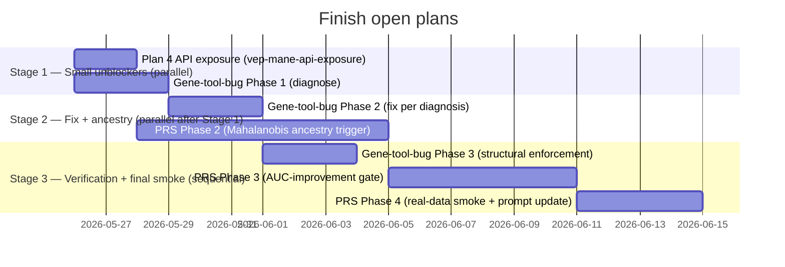

# Meta-Plan: Finish Open Plans — Sequencing & Integration

**Status**: **COMPLETED 2026-05-26**. All three open plan stacks closed:
- `vep-mane-api-exposure` closed 2026-05-26 (Plan 4 API-exposure gap fixed).
- `investigate-genomeclaw-gene-tool-bug` closed 2026-05-26 (3 phases GREEN; INV-A005 promoted).
- `prs-calibration-phase3b` closed 2026-05-26 (all four phases GREEN; real-data smoke against the project owner's CRAM produced `calibration_status="warning"` at v0.4 schema; +50 new tests).

Original framing (kept for history): sequenced the three open plan stacks that remained after the [bioreview-followup-meta](../bioreview-followup-meta/meta-plan.md) close-out — 6 of 7 children there had completed; the seventh (`prs-calibration-phase3b`) had Phase 1 GREEN only.

**Created**: 2026-05-26
**Last Audited**: 2026-05-26
**Owner**: TBD
**Children**:
- [`vep-mane-api-exposure`](../../completed/vep-mane-api-exposure/) — Stage 1 — **COMPLETED 2026-05-26**
- [`investigate-genomeclaw-gene-tool-bug`](../../completed/investigate-genomeclaw-gene-tool-bug/) — Stages 1b/2a/3a — **COMPLETED 2026-05-26** (Phases 1+2+3 all GREEN; INV-A005 promoted; live re-verification deferred)
- [`prs-calibration-phase3b`](../prs-calibration-phase3b/) — Stages 2-3 — **COMPLETED 2026-05-26** (all four phases GREEN; real-data smoke produced `calibration_status="warning"` for PGS000018 at v0.4 schema)

---

## Why This Exists

The bioreview-followup-meta close-out left three threads open:

1. **A small API-exposure gap** for Plan 4. The schema layer (Pydantic + DuckDB column) and the materialize-time extraction landed for `mane_plus_clinical_transcript` + `transcript_discordant`, and real-data smoke confirmed 390 + 24 rows populate respectively. The agent system prompt was updated to consult MANE Plus Clinical guidance. But the HTTP boundary (`/v1/variants/{key}` → `VariantResponse`) doesn't project the two new fields, so the agent can't actually read them. Pure follow-up scope; tiny code change; high agent-safety leverage because it closes a "data exists but isn't reachable" gap.

2. **An open investigation** into the `genomeclaw_gene` argument-serialization narrative the agent occasionally produces. The plan is drafted (3 phases: reproduce → fix → structurally enforce); execution hasn't begun. Phase 1 is investigation-only (no code change); Phase 2 branches on the diagnosis (server-side, plugin-side, or system-prompt fix); Phase 3 promotes the structural invariant + does live verification.

3. **Plan 7's deferred phases** (Mahalanobis ancestry trigger, AUC-improvement gate, real-data smoke + system-prompt update). Phase 1 is GREEN; Phase 2 is fully drafted in `phases/phase-2.md` and was originally gated on `force-genotype-callable-mask` GREEN — which landed in the bioreview-followup close-out, so the gate is satisfied. The remaining work is substantial: FRAPOSA ancestry projection + Mahalanobis distance trigger, then a held-out-cohort AUC gate, then the cross-cutting real-data smoke.

This meta-plan owns no implementation code. It owns sequencing, cross-stack invariants, and progress tracking. All TDD work lives in the child plans.

---

## Sequencing Decision: Unblockers First, Then Investigation, Then Calibration Depth

### Stage 1 — Small unblockers (parallel-safe, start immediately)

The two Stage 1 items touch independent code paths. Run in parallel.

1. **[`vep-mane-api-exposure`](../../completed/vep-mane-api-exposure/)** — *new child plan, COMPLETED 2026-05-26*. Project the two columns added by `vep-mane-plus-clinical` (`mane_plus_clinical_transcript`, `transcript_discordant`) into `VariantDetail` + `_DETAIL_EXTRA_COLUMNS`. Real-data probe surfaced a related dual-row visibility issue (the `LIMIT 1` in `query_variant_by_key` returned the canonical sibling, hiding the discordant view); scope expanded to add `ORDER BY transcript_discordant DESC NULLS LAST`. Plugin TypeBox response schema was *not* added (the plugin's variant tool flows raw JSON via `safeCall`; only PGS endpoints have TypeBox response schemas — out of plan scope per pre-existing convention).

2. **[`investigate-genomeclaw-gene-tool-bug`](../investigate-genomeclaw-gene-tool-bug/) Phase 1** — *investigation-only*. Run the per-gene probe across the 2026-05-24 + 2026-05-25 demo gene sets, walk the trace JSON for confabulation evidence, inspect the code path + system prompt, and pin one of the six hypotheses. No code change; the output is a documented hypothesis that Phase 2 acts on. Can run alongside any code work since it touches the running host service + trace dir only.

**Gate to Stage 2**: API-exposure smoke green against the real-data run dir (`derived/2026-05-25T19-42-58Z-c88e02`); gene-tool-bug Phase 1 conclusion recorded in work-notes with the diagnosed branch (S = server-side, P = plugin-side, A = system-prompt).

### Stage 2 — Fix + ancestry (parallel after Stage 1)

3. **`investigate-genomeclaw-gene-tool-bug` Phase 2** — *land the fix per the Phase 1 diagnosis*. Branch S touches `service/app.py`; Branch P touches the plugin tool-response handler; Branch A updates `packages/nemoclaw-plugin/sandbox/agent-system-prompt.md`. Phase plan covers all three branches; execution picks one.

4. **`prs-calibration-phase3b` Phase 2** — *Mahalanobis ancestry trigger*. Add FRAPOSA continuous-ancestry projection (PCA on 1000G + HGDP reference) + Mahalanobis distance from user PCs to each ancestry's cluster centroid; route the PGS QC's `effective_rate` through ancestry-conditioned thresholds. New module: `prep/_pgs_fraposa.py`. Schema impact: `pgs_scores` gains `ancestry_label` + `ancestry_mahalanobis` columns (DDL bump, no `schema_version` change yet — Phase 4 bumps once all calibration columns land). Drafted in detail at `prs-calibration-phase3b/phases/phase-2.md`. The original gate (`force-genotype-callable-mask` GREEN) is satisfied; this is unblocked now.

**Gate to Stage 3**: gene-tool-bug fix landed + invariant-test commits visible; Plan 7 Phase 2 GREEN against synthetic + small real-data FRAPOSA fixture; provenance-test asserts new columns + their sources.

### Stage 3 — Verification + final smoke (sequential)

5. **`investigate-genomeclaw-gene-tool-bug` Phase 3** — *structural enforcement + live verification*. Promote `INV-A004` "Tool-Failure Narratives Match Trace Evidence" if hypothesis #6 confirmed (cross-link with the prior `investigate-pgs-compute-ack-without-row` plan). Add the date-gated invariant test that scans trace JSONs ≥ 2026-05-26 for forbidden phrasing without supporting failure events. Live verification against fresh agent traces using the demo gene-question set.

6. **`prs-calibration-phase3b` Phase 3** — *AUC-improvement gate*. Decline / warn a PGS unless held-out-cohort AUC improvement over a simple baseline (sex + age + family-history when available) clears a configurable threshold. Requires PGS Catalog metadata fetch (small, deliberate egress) for per-PGS validation cohort AUC ranges. Pure decision logic; no derived-store impact beyond `pgs_scores.calibration_warning` text.

7. **`prs-calibration-phase3b` Phase 4** — *real-data smoke + system-prompt update*. Run `bin/genomeclaw-prs-smoke MPNRGLQ2K PGS000018` against the bioreview-followup real-data run dir (`derived/2026-05-25T19-42-58Z-c88e02`); verify all three calibration axes (effect-weight match rate, Mahalanobis ancestry trigger, AUC gate) produce the documented outputs. Then bump `schema_version` to `v0.4`. Then update the agent system prompt's PGS-handling section with the Phase 2 + 3 decision rules. This is the only stage with a wall-clock commitment (the smoke is ~4-6 h).

---

## Cross-stack invariants

- **`INV-A004`** Decline taxonomy must traverse every layer (already promoted by `agent-decline-taxonomy-exposure`; v0.4 schema bump must keep the new calibration columns reachable through `/v1/pgs/computed/{pgs_id}` + the TypeBox response schema).
- **Proposed `INV-A005`** Tool-Failure Narratives Match Trace Evidence — to be promoted by `investigate-genomeclaw-gene-tool-bug` Phase 3 if hypothesis #6 confirmed. (Naming: `A004` is taken; the gene-tool-bug plan's draft uses `INV-A004` and must be renumbered when the plan executes.)
- **`INV-R001`** Rebuildability — Plan 7 Phase 4's `schema_version` bump to `v0.4` must include a rebuild-from-source instruction in the manifest + a single-command rebuild path documented in `README.md`'s storage section.
- **`INV-D006`** DooD-safe path annotation — Plan 7 Phase 2's FRAPOSA wrapper spawns nextflow siblings; every host path threaded into siblings must go through `as_sibling_mountable(...)` (the bioreview-followup scratch bug is a cautionary precedent).

---

## Shared verification (after Stage 3)

A single cumulative-behaviour smoke at the end of Stage 3 covers all stacks:

1. **API exposure** — `curl /v1/variants/<key for transcript_discordant=true row>` returns the two new fields, populated.
2. **Gene-tool-bug** — fresh agent trace captured after Phase 2's fix; the date-gated invariant test passes; no `argument-serialization bug` prose in the agent's narrative unless a real tool error is in the trace.
3. **PRS calibration v0.4** — `/v1/pgs/computed/PGS000018` returns `calibration_status` + `decline_reason` + the new `ancestry_label`, `ancestry_mahalanobis`, `auc_improvement_vs_baseline` fields, all populated; the agent system prompt's updated PGS-handling section appears in the sandbox's baked-in prompt.

Synthetic-DB + HTTP-layer smokes for each child run inside their own plan's verification gates; this cross-stack smoke is the close-out gate before all three plans move to `docs/plans/completed/`.

---

## Open follow-ups inherited from bioreview-followup-meta (out of scope for this meta-plan)

- **GRCh38 reference lacks decoy contigs** — workaround in place (skip `bcftools norm -f`). Long-term fix is acquisition of a decoy-inclusive reference; documented but not actioned. If a future plan needs `bcftools norm -f` left-alignment for a specific downstream consumer, surface the dependency there.
- **Pre-existing test failures** (4 unrelated tests: 8643→8645 port drift × 2; second `fetch()` site in plugin source × 2). Discovered during bioreview-followup close-out; not introduced by any in-flight plan; left for a dedicated cleanup commit.

---

## Progress tracking

Update this table as phases land. Single source of truth for "what's done, what's in flight, what's blocked."

| Stack | Phase | Status | Notes |
|-------|-------|--------|-------|
| `vep-mane-api-exposure` | (single) | **COMPLETED 2026-05-26** | 3 new tests; `VariantDetail` + `_DETAIL_EXTRA_COLUMNS` + dual-row ORDER BY; real-data MUTYH + NFASC verified |
| `investigate-genomeclaw-gene-tool-bug` | Phase 1 | **COMPLETED 2026-05-26** | Hypothesis #6 (agent confabulation) pinned. Per-gene probe + trace walk + code-path + system-prompt inspection all agree. |
| `investigate-genomeclaw-gene-tool-bug` | Phase 2 | **COMPLETED 2026-05-26** | Branch A system-prompt fix landed; `test_invA005_system_prompt_*` contract test pins the additions; RCA brief (143 lines) at `docs/reports/genomeclaw-gene-tool-bug-rca.md`. |
| `investigate-genomeclaw-gene-tool-bug` | Phase 3 | **COMPLETED 2026-05-26** | Structural enforcement via `test_invA005_no_serialization_bug_confabulation.py` (14 historical traces skip cleanly; date-gated to bind from 2026-05-26). `INV-A005` promoted in INVARIANTS.md v1.21. Live re-verification deferred. |
| `prs-calibration-phase3b` | Phase 1 | GREEN | Landed 2026-05-25 (bioreview-followup); 25 new tests |
| `prs-calibration-phase3b` | Phase 2 | GREEN | Landed 2026-05-26; `_pgs_fraposa.py` + ancestry branch; 23 new tests |
| `prs-calibration-phase3b` | Phase 3 | GREEN | Landed 2026-05-26; `_pgs_catalog_meta.py` + AUC gate; 19 new tests (incl. real-pgsc_calc-v2.2.0 array-shape fix) |
| `prs-calibration-phase3b` | Phase 4 | GREEN | Landed 2026-05-26; v0.4 schema bump + image rebuild + real-data smoke produced `calibration_status="warning"` for PGS000018; `find_pgsc_calc_log_csv` discovery bug surfaced + fixed |
