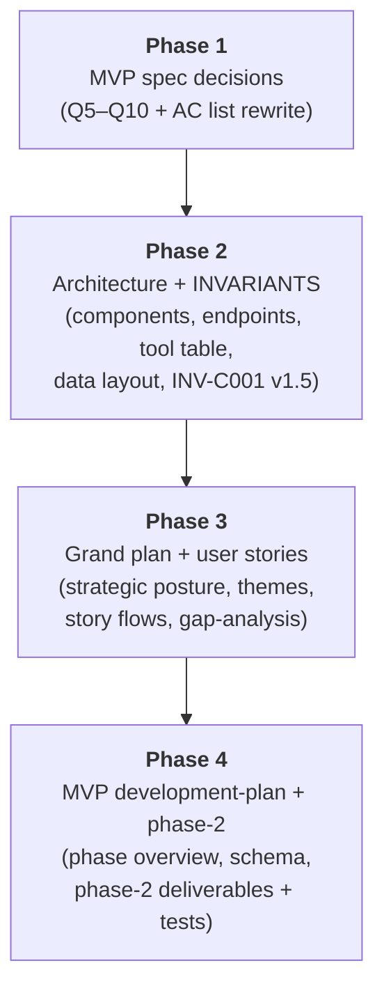

# POC Pipeline Recommendations — Development Plan

**Status**: Complete
**Created**: 2026-05-08
**Completed**: 2026-05-08
**Branch**: `feature/poc-pipeline-recommendations` (target — not yet created; doc-only plan, no code branch needed)
**Spec**: [spec.md](spec.md)

---

## Summary

Four sequential doc-only phases that propagate the POC-stage pipeline recommendations (VEP-based annotation stack, Cyrius for CYP2D6, coverage-aware gene queries, PRS panel via `pgsc_calc`, curated-notes-driven lifestyle calibration, defer-by-default trigger list) across the spec, development-plan, phase-2, architecture, INVARIANTS, grand-plan, and user-stories documents. No code lands; every change is a doc edit, and every phase ends with a structural review confirming no canonical invariant was weakened.

## Critical Invariants to Respect

This plan is doc-only, but it edits the documents that *define* the invariants and the architecture that enforces them. Any phase that drifts from the canonical seven invariants is a failed phase.

- **INV-D001** Raw Genomic Files Are Source-of-Truth — the architecture edits in Phase 2 explicitly state that the new host-side tools (`mosdepth`, `Cyrius`, `bcftools stats`, `pgsc_calc`) read source artifacts read-only and emit derived outputs only. The phase-2.md edit in Phase 4 adds an `INV-D001` test case for BAM-immutability post-`mosdepth`.
- **INV-D002** Raw Artifacts Host-Side Only — the architecture edits in Phase 2 reaffirm that all four new tools are host-side; sandbox image content is not affected. The plugin tools (`genomeclaw_gene`, `genomeclaw_pgs`) reach the host service over HTTP; they do not invoke binaries in the sandbox.
- **INV-E001** Assistant Claims Must Be Traceable to Evidence — Phase 1 (spec) and Phase 2 (architecture) both name `gene_note:<gene>` and `topic:hard-genes` as recognized evidence reference forms. Phase 3 (user stories) demonstrates the agent citing these references in lifestyle and false-reassurance-prevention conversations.
- **INV-P001** Privacy Is the Default Operating Mode — Phase 2 (architecture) documents PGS Catalog fetch as a deliberate host-side opt-in egress; the network topology diagram and the privacy posture note both call it out explicitly. No new background or automatic remote calls.
- **INV-P002** Agent Egress Is a Named, Minimal-Sufficient Boundary — Phase 1 (spec AC list) and Phase 2 (architecture component table) both encode the `output_class: summary` default for the two new tools and enumerate their minimal-sufficient response shapes.
- **INV-R001** Derived Stores Must Stay Rebuildable — Phase 4 (development-plan + phase-2) names the new derived tables (`coverage_qc`, `pgs_scores`) and confirms they carry the seven canonical provenance columns. Determinism testing is inherited from MVP Phase 2/3 discipline.
- **INV-C001** Separate Research Assistance from Clinical Advice — Phase 2 (INVARIANTS edit) **strengthens** INV-C001's lifestyle track: `reference/curated_notes/` is named as a recognized calibration surface; the over-deferral failure mode named in INV-C001 v1.4 is preserved (curated notes carry the user's calibrated voice, so the agent stays direct on lifestyle questions). INVARIANTS bumps to v1.5.

## Proposed New Invariants

**None.** This plan exercises and clarifies the existing seven canonical invariants; it does not promote a new one. (See `spec.md` § Proposed New Invariants for the rationale and the future-INV-C002 candidate that this plan deliberately does not promote.)

## Current State Analysis

### What exists today

- **MVP plan** under `docs/plans/active/mvp/` — spec.md (Q1 SnpEff, Q2 registerTool, Q3 no /v1/report, Q4 typed arrays), development-plan.md (7 phases, 4 tools), phase-1.md (foundations, fully scoped), phase-2.md (ingest + fetch, fully scoped).
- **Reference docs** — grand-plan.md (Themes A–I, Horizons 1–8 with Theme H = lifestyle, Horizon 6 = lifestyle), architecture.md (4 components, 4 tools), INVARIANTS.md v1.4 (7 canonical invariants), user-stories.md (9 stories, gap-analysis with several items already resolved by MVP spec Q1–Q4).
- **Plugin scaffolding** under `packages/nemoclaw-plugin/` — manifest, policy preset, sandbox Dockerfile, TS skeleton.
- **Toolkit scaffolding** — none yet (Phase 1 of MVP is unstarted).

### What's missing

- The doc-level reflection of the recommendations report. Every doc above is internally consistent against the *old* (Q1 SnpEff, four-tool surface, structured-evidence-quality lifestyle approach) decision set. None of them reflects the recommendations report's two non-negotiable changes (VEP stack, Cyrius), the high-value additions (coverage tool, PRS), or the lifestyle reframe (curated notes).
- A trigger-driven defer list as a strategic constraint in `grand-plan.md` (the recommendations report introduces this discipline; the project has not yet codified it).
- An `INV-C001` recognition of `curated_notes/` as a calibration surface.

### Files to Modify

| File | Current State | Planned Changes |
|------|---------------|-----------------|
| `docs/plans/active/mvp/spec.md` | Q1–Q4 Decisions Taken; AC1–AC7; tool count 4 | **Phase 1**: add Q5–Q10 Decisions Taken; mark Q1 superseded; expand AC list to ~12; tool count 4 → 6 |
| `docs/reference/INVARIANTS.md` | v1.4; INV-C001 mentions structured `evidence_quality` | **Phase 2**: bump to v1.5; INV-C001 Requirements + "Where it applies" recognize `curated_notes/` |
| `docs/reference/architecture.md` | 4 components, 4 tools, no curated-notes path | **Phase 2**: add `mosdepth`/`Cyrius`/`pgsc_calc`/`bcftools stats` to Component 1; new endpoints to Component 2; tool table 4→6; layered diagram + data layout + network topology updates |
| `docs/reference/grand-plan.md` | Theme B SnpEff-flavored; Theme G PharmCAT only; Theme H structured-evidence-quality lifestyle; no defer-by-default constraint | **Phase 3**: Theme B VEP stack + false-reassurance bullet; Theme G expanded; Theme H reframed; new Strategic Constraint; Decisions tables refreshed |
| `docs/reference/user-stories.md` | Stories 1, 3, 4, 9 currently consistent with the old decisions | **Phase 3**: Stories 1/3/4/9 updated to demonstrate new tools and curated notes; new short PRS story; gap-analysis updates |
| `docs/plans/active/mvp/development-plan.md` | 7 phases, 4 tools, SnpEff in Phase 4 | **Phase 4**: Phase Overview tool count 6; Phase 4 deliverables VEP-flavored; Phase 5 adds `genomeclaw_gene`; Phase 6 adds Cyrius/`pgsc_calc`/`genomeclaw_pgs`/curated-notes; Schema/Privacy sections updated |
| `docs/plans/active/mvp/phases/phase-2.md` | 18 test cases; ingest + fetch deliverables | **Phase 4**: add `bcftools stats` + `mosdepth` deliverables; +3 test cases (Ts/Tv sanity, per-gene coverage table populated, BAM unchanged post-mosdepth) |

### Files to Create

| File | Purpose |
|------|---------|
| `docs/plans/active/poc-pipeline-recommendations/spec.md` | This plan's spec (already created) |
| `docs/plans/active/poc-pipeline-recommendations/development-plan.md` | This plan (the file you're reading) |
| `docs/plans/active/poc-pipeline-recommendations/work-notes.md` | Session log; archives the recommendations report verbatim for reproducibility |
| `docs/plans/active/poc-pipeline-recommendations/phases/phase-1.md` | Phase 1 detailed plan |
| `docs/plans/active/poc-pipeline-recommendations/phases/phase-2.md` | Phase 2 detailed plan (created at end of Phase 1, per protocol) |
| `docs/plans/active/poc-pipeline-recommendations/phases/phase-3.md` | Phase 3 detailed plan (created at end of Phase 2) |
| `docs/plans/active/poc-pipeline-recommendations/phases/phase-4.md` | Phase 4 detailed plan (created at end of Phase 3) |

## Solution Design

The solution is a strict per-document-family phasing. Each phase produces a coherent, reviewable diff confined to one or two related documents. No phase touches both spec and architecture in the same diff; this keeps reviews self-contained and lets the author of each phase recover context cleanly.

The order is **deliberate and the dependencies run forward**:
- Phase 1's decisions (spec) are cited by Phase 2's reference-doc edits.
- Phase 2's tool list and endpoint shapes are cited by Phase 3's user-stories rewrites.
- Phase 3's strategic posture is cited by Phase 4's MVP development-plan updates.
- A phase that runs out of order produces a doc set that briefly disagrees with itself; the linear order keeps every intermediate state internally coherent.

### Key Design Decisions

1. **Per-document-family phasing, not per-topic.** Bundling all annotator-stack changes (spec + architecture + grand-plan + dev-plan) into one phase would create a four-document diff per phase. That's hard to review and easy to drift. Per-document-family phasing keeps each diff to one or two related docs and lets each phase end with a structural assertion ("the architecture doc lists exactly six tools").
2. **Q1 marked superseded, not deleted.** When Q5 supersedes Q1's SnpEff decision, the original Q1 entry stays in `mvp/spec.md` with a `**Superseded by Q5 on 2026-05-08**` annotation and a one-line summary of why. Historical context survives; readers can see the decision evolution.
3. **No early authoring of phase-3 through phase-7 detail plans.** Per the existing planning protocol those are authored by their predecessor's exit gate. This plan ensures `mvp/development-plan.md`'s phase summaries carry enough delta context for the future authors. Authoring all detail plans up front would freeze design choices that should remain open as Phase 2 / 3 / 4 ship.
4. **INVARIANTS bumps to v1.5, not v2.0.** No invariant is added or removed; INV-C001's Requirements + Where-it-applies sections gain a recognition of `curated_notes/`. That's a clarifying revision, not a rewrite; v1.5 is appropriate.
5. **The recommendations report is archived verbatim in `work-notes.md`.** Future contributors should be able to see *exactly* what the source motivation was without depending on a conversation transcript. The archive lives in this plan's `work-notes.md`, not in a separate file.
6. **The plan does **not** preemptively author the seven curated notes.** That work belongs in MVP Phase 6, where the user has the context (their own genotype, their own questions) to write each note in their own voice. This plan documents the directory's existence, naming convention, and resolver path; the notes themselves are user-authored content, not plan-authored content.

### Schema / Provenance Impact

This plan has **no application schema impact** — it's doc-only. It *describes* the schema impact of the underlying recommendations:

- New / changed schemas (described, not implemented):
  - `variants` table gains MANE Select transcript pinning, HGVSc, HGVSp, AlphaMissense score + class, SpliceAI max delta, LOFTEE high-confidence flag, gnomAD per-ancestry AFs, gene LOEUF.
  - New `coverage_qc` table.
  - New `pgs_scores` table.
  - New manifest fields capturing Cyrius diplotype + tool version, `pgsc_calc` version + PGS IDs.
- Schema version bump: `schema_version` reserved at `v0.2` for the MVP Phase 4/6 implementation that lands these. Phase 4 of *this* plan adds a one-line note in `mvp/development-plan.md`'s Schema/Provenance Impact section; the actual bump happens in code.
- Provenance columns: unchanged. The seven canonical columns continue to apply to every new table.
- Rebuild procedure: unchanged. New tools (`mosdepth`, `Cyrius`, `pgsc_calc`) inherit the existing `genomeclaw-prep` rebuild discipline.

### Privacy & Egress Impact

- **New network egress points (described, not introduced)**:
  - `pgsc_calc` fetches PGS scoring weights from the PGS Catalog over HTTPS, host-side, on deliberate user invocation only. Documented in Phase 2's architecture network-topology section.
- **No new secret-handling surfaces.** PGS Catalog is unauthenticated.
- **No redaction needed.** No new genomic data egresses; the plugin tools added (`genomeclaw_gene`, `genomeclaw_pgs`) shape minimal-sufficient JSON by construction.

## Phase Overview

| Phase | Description | TDD Focus | Est. Tests |
|-------|-------------|-----------|------------|
| 1 | MVP spec decision capture (Q5–Q10, AC list rewrite) | structural: spec contains six new decisions; tool count 6; ACs map to tests | ~6 doc-checks |
| 2 | Architecture + INVARIANTS (components, endpoints, tool table, data layout, INV-C001 v1.5) | structural: architecture lists six tools and two new endpoints; INVARIANTS v1.5 | ~8 doc-checks |
| 3 | Grand plan + user stories (themes, strategic posture, story flows, gap-analysis) | structural: grand-plan defer-by-default constraint present; user-stories Story 9 references curated note; new PRS story exists | ~7 doc-checks |
| 4 | MVP development-plan + phase-2 (phase overview, schema, phase-2 deliverables + 3 new test cases) | structural: development-plan tool count 6; phase-2 lists three new tests by name | ~5 doc-checks |

Total estimated doc-checks: ~26. These are not pytest-style tests; they are small grep / regex / file-existence assertions captured in this plan's `work-notes.md` per phase. Phase 4 *describes* three new pytest-style test cases that the MVP Phase 2 implementation will write — those are not run by this plan.

## Phase 1: MVP spec decision capture

**Goal**: `docs/plans/active/mvp/spec.md` carries six new Decisions Taken (Q5–Q10), Q1 is annotated as superseded, the AC list reflects six tools and the new pipeline steps.
**Detailed Plan**: [phases/phase-1.md](phases/phase-1.md)

### Deliverables

1. `docs/plans/active/mvp/spec.md` — Decisions Taken section gains six new entries (Q5–Q10) following the existing Q1–Q4 format (Decided / Decision / Rationale / Revisit when / Affected files).
2. `docs/plans/active/mvp/spec.md` — Q1 entry annotated with a `**Superseded by Q5 on 2026-05-08**` line directly under the `**Decided**: 2026-05-06.` line; original rationale preserved verbatim.
3. `docs/plans/active/mvp/spec.md` — Acceptance Criteria section rewritten: AC2 endpoint list adds `/v1/gene/{symbol}` and `/v1/pgs/{trait}`; AC3 tool count 4 → 6 (`genomeclaw_status`, `genomeclaw_findings`, `genomeclaw_variant`, `genomeclaw_evidence`, **`genomeclaw_gene`**, **`genomeclaw_pgs`**); two new ACs for the `coverage_qc` table populated and the `pgs_scores` table populated for three initial traits; AC5 (lifestyle) updated to reference `gene_note:CYP1A2` retrieval.
4. `docs/plans/active/mvp/spec.md` — Technical Requirements section updates: Source Data Inputs gains the BAM/CRAM input (existing) plus PGS scoring weights from PGS Catalog; Schema/Migration Impact reserves `schema_version: v0.2`; External Dependencies lists VEP, LOFTEE, AlphaMissense, SpliceAI, vcfanno, Cyrius, `pgsc_calc`, `mosdepth`.
5. `docs/plans/active/mvp/spec.md` — Out of Scope updated: lifestyle finding catalog now shows the curated set of seven (LCT, CYP1A2, ADORA2A, ALDH2, ADH1B, APOE, MTHFR) plus `hard-genes.md`; PER3, CLOCK, ACTN3 are explicitly listed as **dropped from the lifestyle track**, not deferred to a later horizon.
6. `docs/plans/active/poc-pipeline-recommendations/work-notes.md` — Phase 1 block: doc-checks captured, sections touched, any tensions surfaced.

### Invariants Enforced Here

- **INV-C001** — Q9 in the spec encodes the curated-notes lifestyle track; the lifestyle gene shortlist replaces the PER3/CLOCK/ACTN3 set. Spec doc-checks confirm Q9 is present and references `gene_note:<gene>`.
- **INV-E001** — Q9 in the spec encodes `gene_note:<gene>` and `topic:hard-genes` as recognized evidence-reference forms. Spec doc-checks confirm.
- **INV-P002** — Q7 and Q8 in the spec each encode `output_class: summary` for the new tools. Spec doc-checks confirm.

### Success Criteria

- [ ] `mvp/spec.md` has Decisions Taken Q5, Q6, Q7, Q8, Q9, Q10 (grep for each).
- [ ] `mvp/spec.md` Q1 carries a "Superseded by Q5" annotation (grep).
- [ ] `mvp/spec.md` AC list mentions both `genomeclaw_gene` and `genomeclaw_pgs` (grep).
- [ ] `mvp/spec.md` AC2 endpoint list includes `/v1/gene/{symbol}` and `/v1/pgs/{trait}` (grep).
- [ ] `mvp/spec.md` Out of Scope section explicitly drops PER3, CLOCK, ACTN3 from the lifestyle track (grep).
- [ ] `work-notes.md` Phase 1 block lists every section touched and confirms no canonical invariant was weakened.

## Phase 2: Architecture + INVARIANTS

**Goal**: `docs/reference/architecture.md` reflects six tools, two new endpoints, four new host-side pipeline steps, the curated-notes data path, and the PGS Catalog egress; `docs/reference/INVARIANTS.md` bumps to v1.5 with INV-C001 recognizing `curated_notes/`.
**Detailed Plan**: [phases/phase-2.md](phases/phase-2.md) (authored at end of Phase 1)

### Deliverables

1. `docs/reference/architecture.md` Component 1 (`genomeclaw-prep`) responsibility paragraph adds `bcftools stats`, `mosdepth`, `Cyrius`, `pgsc_calc` to the tool list.
2. `docs/reference/architecture.md` Component 2 (`genomeclaw-service`) endpoint list adds:
   - `GET /v1/gene/{symbol}` — gene-level facts (top user variants, LOEUF, OMIM disease + inheritance, mean coverage from BAM).
   - `GET /v1/pgs/{trait}` — PRS results (percentile, raw score, source PGS ID, study population, calibration warning).
3. `docs/reference/architecture.md` Component 3 (plugin) tool table updated to six entries.
4. `docs/reference/architecture.md` Layered diagram (mermaid) updated to mention the six tools.
5. `docs/reference/architecture.md` Data layout updated: `reference/curated_notes/<gene>.md`, `reference/curated_notes/topics/hard-genes.md`, `derived/<run-id>/coverage_qc.duckdb` (or table within `variants.duckdb`), `derived/<run-id>/pgs_scores.duckdb` (or table within `variants.duckdb`).
6. `docs/reference/architecture.md` Network topology gains a third path: `genomeclaw-prep pgs --fetch-weights` → PGS Catalog HTTPS endpoint, host-side, deliberate user invocation only.
7. `docs/reference/architecture.md` "Why this shape — invariant traceability" table gains a row for INV-E001 noting that `gene_note:<gene>` and `topic:<topic>` are recognized evidence reference forms.
8. `docs/reference/INVARIANTS.md` version bumped to v1.5; Last Updated 2026-05-08.
9. `docs/reference/INVARIANTS.md` INV-C001 Requirements section adds a bullet recognizing `reference/curated_notes/<gene>.md` as a calibration surface; "Where it applies" lists curated-notes editing as in-scope (so it's reviewed by the privacy-safety-reviewer agent before user-facing copy changes).
10. `docs/reference/INVARIANTS.md` invariant index table refreshed if needed; Promoting a New Invariant section unchanged.
11. `work-notes.md` — Phase 2 block: doc-checks, sections touched, INVARIANTS diff summary.

### Invariants Enforced Here

- **INV-D001 / INV-D002** — Architecture edits state explicitly that `mosdepth`, `Cyrius`, `bcftools stats`, `pgsc_calc` are host-side and read source artifacts read-only.
- **INV-E001** — Architecture invariant-traceability table explicitly recognizes `gene_note:<gene>` and `topic:<topic>` as evidence reference forms; INV-C001 in INVARIANTS gains the curated-notes recognition.
- **INV-P001 / INV-P002** — Architecture network topology adds the PGS Catalog egress as a deliberate, host-side, opt-in path; tool table encodes `output_class: summary` defaults for the two new tools.
- **INV-C001** — INVARIANTS v1.5 strengthens the lifestyle track recognition.

### Success Criteria

- [ ] `architecture.md` Component 1 mentions `bcftools stats`, `mosdepth`, `Cyrius`, `pgsc_calc` (grep all four).
- [ ] `architecture.md` Component 2 endpoint list includes `/v1/gene/{symbol}` and `/v1/pgs/{trait}` (grep).
- [ ] `architecture.md` plugin tool table has exactly six rows (count).
- [ ] `architecture.md` data layout mentions `curated_notes/`, `coverage_qc`, `pgs_scores` (grep all three).
- [ ] `architecture.md` network topology mentions PGS Catalog HTTPS as a host-side opt-in path (grep "PGS Catalog").
- [ ] `INVARIANTS.md` header version reads `v1.5` (grep).
- [ ] `INVARIANTS.md` INV-C001 Requirements section mentions `curated_notes/` (grep).
- [ ] `work-notes.md` Phase 2 block confirms every existing INV-xxx is preserved (manual diff review captured).

## Phase 3: Grand plan + user stories

**Goal**: `docs/reference/grand-plan.md` and `docs/reference/user-stories.md` reflect the strategic posture (defer-by-default), the capability-theme reshape (Themes B, G, H), and the user-facing demonstration of the new tools and curated-notes lifestyle approach.
**Detailed Plan**: [phases/phase-3.md](phases/phase-3.md) (authored at end of Phase 2)

### Deliverables

1. `docs/reference/grand-plan.md` Theme B updated: VEP + LOFTEE + AlphaMissense + SpliceAI + vcfanno noted as the annotation stack; new bullet "False-reassurance prevention via coverage-aware queries" added.
2. `docs/reference/grand-plan.md` Theme G expanded: PharmCAT + **Cyrius outside-call** for CYP2D6; **PRS via `pgsc_calc`** with continuous-ancestry normalization.
3. `docs/reference/grand-plan.md` Theme H reframed: `reference/curated_notes/` as the calibration mechanism; gene shortlist (LCT, CYP1A2, ADORA2A, ALDH2, ADH1B, APOE, MTHFR); PER3, CLOCK, ACTN3 dropped (with one-line rationale: "non-replication and unreliable short-read VNTR calls").
4. `docs/reference/grand-plan.md` Strategic Constraints gains a new entry: **"Defer-by-default"** — the trigger-driven scope discipline; explicit list of deferred features (HLA, SV, repeats, mtDNA, population panels, eval harness, additional PRS traits, citation-stripping, tool-use forcing).
5. `docs/reference/grand-plan.md` Decisions Taken table gains rows for VEP stack, Cyrius, mosdepth, `pgsc_calc`, curated_notes; Decisions Deferred table updates revisit-criteria for HLA, SV, repeat expansions, mtDNA, population-specific panels, eval harness.
6. `docs/reference/user-stories.md` Story 1 ingest sketch updated: includes `bcftools stats`, `mosdepth`, `Cyrius`, `pgsc_calc` invocations alongside `ingest`/`normalize`/`annotate`/`materialize`.
7. `docs/reference/user-stories.md` Story 3 (BRCA1) updated: agent's reply references coverage from `genomeclaw_gene(gene="BRCA1")`; specific exon-coverage caveat surfaces naturally; the "could it be hiding in a region the WGS misses?" follow-up is more concrete.
8. `docs/reference/user-stories.md` Story 4 (clopidogrel) extended with a CYP2D6 sub-question (codeine or tramadol) demonstrating the Cyrius diplotype call and PharmCAT outside-call output.
9. `docs/reference/user-stories.md` Story 9 (caffeine) updated: agent retrieves `genomeclaw_evidence(ref="gene_note:CYP1A2")` and composes the answer from the user's variant + the note's framing; PER3/CLOCK follow-up gracefully declined ("not in our curated set; I won't make something up"); new sub-question or paragraph exercising `gene_note:ADORA2A`.
10. `docs/reference/user-stories.md` — new short story or sub-story (Story 10 or appended to an existing story) exercising `genomeclaw_pgs(trait="CAD")` or `genomeclaw_pgs(trait="T2D")`; demonstrates the percentile + ancestry-calibration response shape.
11. `docs/reference/user-stories.md` Surfaced design gaps section: items resolved by this plan are marked ✅ Resolved; defer-by-default-related items added to the gap list with a Horizon pointer.
12. `work-notes.md` — Phase 3 block: doc-checks, sections touched, story-flow review notes.

### Invariants Enforced Here

- **INV-C001** — User-stories Story 9 demonstrates the curated-notes lifestyle track in action; gap analysis is updated to reflect the resolution. Story 4 (CYP2D6 extension) demonstrates the clinical-track escalation marker pattern with a Cyrius-derived diplotype.
- **INV-E001** — User-stories Story 9 explicitly cites `gene_note:CYP1A2` as the evidence reference; the agent does not improvise lifestyle framing.
- **INV-P002** — User-stories new PRS story demonstrates the minimal-sufficient response shape (percentile + ancestry-calibration string, no raw PGS variant lists).

### Success Criteria

- [ ] `grand-plan.md` Themes B, G, H all updated (grep for "VEP", "Cyrius", "curated_notes/").
- [ ] `grand-plan.md` Strategic Constraints section contains "Defer-by-default" (grep).
- [ ] `user-stories.md` Story 9 references `gene_note:CYP1A2` (grep).
- [ ] `user-stories.md` Story 3 references `genomeclaw_gene` (grep).
- [ ] `user-stories.md` Story 4 includes a Cyrius / CYP2D6 sub-conversation (grep "CYP2D6" near "Cyrius" or "diplotype").
- [ ] `user-stories.md` contains a PRS story or sub-story exercising `genomeclaw_pgs` (grep).
- [ ] `work-notes.md` Phase 3 block confirms the strategic posture is internally consistent across grand-plan and architecture.

## Phase 4: MVP development-plan + phase-2

**Goal**: `docs/plans/active/mvp/development-plan.md` carries the Phase Overview / Schema / Privacy updates that the spec, architecture, and grand-plan now require; `docs/plans/active/mvp/phases/phase-2.md` adds `bcftools stats` + `mosdepth` deliverables and three new test cases.
**Detailed Plan**: [phases/phase-4.md](phases/phase-4.md) (authored at end of Phase 3)

### Deliverables

1. `docs/plans/active/mvp/development-plan.md` Phase Overview table updated: tool count 4 → 6; Phase 4 description rewritten around the VEP stack; Phase 5 description names `genomeclaw_gene` as a deliverable; Phase 6 description names Cyrius, `pgsc_calc`, `genomeclaw_pgs`, and the `curated_notes/` evidence resolver.
2. `docs/plans/active/mvp/development-plan.md` Solution Design section updated: Key Design Decision #3 rewritten ("**VEP + LOFTEE + AlphaMissense + SpliceAI + vcfanno** as the annotation stack — replaces SnpEff per spec Q5"); Schema / Provenance Impact section enumerates the new derived columns and tables (MANE Select HGVSc/HGVSp, AlphaMissense score+class, SpliceAI max delta, LOFTEE flag, gnomAD per-ancestry AFs, gene LOEUF, `coverage_qc`, `pgs_scores`); Privacy & Egress Impact section documents PGS Catalog fetch.
3. `docs/plans/active/mvp/development-plan.md` Phase 4 / 5 / 6 detail sections (the inline summaries before each "Detailed Plan" pointer) updated to match.
4. `docs/plans/active/mvp/development-plan.md` Open Risks & Follow-ups updated: Cyrius is named as a new dependency; AlphaMissense + SpliceAI dataset sizes flagged for personal-host resource budget review at Phase 4 implementation start; PGS Catalog fetch flagged as a new (deliberate, opt-in) egress.
5. `docs/plans/active/mvp/phases/phase-2.md` Deliverables list gains:
   - **Deliverable 5**: `bcftools stats` invoked at ingest; summary written into `manifest.json` under a `qc.bcftools_stats` key. Ts/Tv ratio (~2.0–2.1 genome-wide, ~3.0 in coding) is the headline sanity-check value.
   - **Deliverable 6**: `mosdepth` invoked at ingest against the BAM/CRAM; per-gene mean coverage materialized into a `coverage_qc` table within the derived store, with the seven canonical provenance columns.
6. `docs/plans/active/mvp/phases/phase-2.md` TDD Steps Test cases section gains three new cases:
   - **Case 19**: `test_invR001_bcftools_stats_in_manifest` — `manifest.json` has a `qc.bcftools_stats` block with `ts_tv_ratio`, `n_snps`, `n_indels`; values are within sane ranges for a 30× WGS fixture.
   - **Case 20**: `test_coverage_qc_table_populated` — after `ingest`, the derived store has a `coverage_qc` table with at least one row per gene in a small fixture-defined gene list (e.g., BRCA1, BRCA2, CYP2D6); `mean_depth` is a non-negative real.
   - **Case 21**: `test_invD001_bam_unchanged_after_mosdepth` — capture BAM SHA256 before `ingest`; rerun SHA256 after; assert equal. Same for the BAM index if present.
7. `docs/plans/active/mvp/phases/phase-2.md` Files table updated: `prep/_mosdepth.py`, `prep/_bcftools_stats.py`, fixture additions (`tests/fixtures/tiny.bam`, `tests/fixtures/tiny.bam.bai`), test files for cases 19–21.
8. `docs/plans/active/mvp/phases/phase-2.md` Verification section gains a `mosdepth --version` check and a sketch of the new tests' expected output.
9. `docs/plans/active/mvp/phases/phase-1.md` reviewed; confirmed no edits required (foundations only — none of the recommendations affect Phase 1's repo-scaffolding scope). Confirmation captured in `work-notes.md`.
10. `work-notes.md` — Phase 4 block: doc-checks, sections touched, the three new test cases captured by name and intent, plan moved to "ready to close" or "complete" status.

### Invariants Enforced Here

- **INV-D001** — Phase-2 test case 21 (`test_invD001_bam_unchanged_after_mosdepth`) is added by name; `mosdepth` invocations are configured to read-only.
- **INV-R001** — Phase-2 test case 20 confirms the `coverage_qc` table inherits the seven canonical provenance columns; case 19 confirms tool versions are recorded in the manifest.
- **INV-P001** — Development-plan privacy & egress section documents the PGS Catalog fetch (described, not introduced in Phase 2; Phase 6 owns it).

### Success Criteria

- [ ] `mvp/development-plan.md` Phase Overview table tool count is 6 (grep).
- [ ] `mvp/development-plan.md` mentions VEP, Cyrius, `pgsc_calc`, `mosdepth`, and `curated_notes/` (grep all five).
- [ ] `mvp/phases/phase-2.md` Deliverables list contains items 5 and 6 (`bcftools stats`, `mosdepth`).
- [ ] `mvp/phases/phase-2.md` TDD test list contains cases 19, 20, 21 by name (grep).
- [ ] `mvp/phases/phase-1.md` is unchanged (`git diff --stat` shows zero lines).
- [ ] `work-notes.md` Phase 4 block confirms a final invariant-diff review: every canonical INV-xxx is preserved or strengthened, none weakened.

---

## Testing Strategy

This plan is doc-only. "Tests" are structural doc-checks captured in this plan's `work-notes.md` per phase. They are not automated yet — automation belongs in a future plan if doc-drift becomes a recurring problem.

### Doc-checks (per phase)

Each phase ends with a `work-notes.md` block that captures:
1. **Grep checks**: every grep listed in the phase's Success Criteria run against the relevant file; output captured.
2. **Counted checks**: every counted assertion (e.g., "tool table has exactly six rows") run; output captured.
3. **Reading-test checks**: a short paragraph confirming, after a manual reading, that the doc reads coherently end-to-end with the new edits in place.
4. **Invariant-diff checks**: a paragraph confirming that no canonical INV-xxx in `INVARIANTS.md` was weakened by the phase's edits. For Phase 2 this is a direct INVARIANTS diff review; for other phases this is a careful reading.

### Cross-phase coherence checks

After Phase 4 completes, before the plan is moved to `completed/`:
- Tool count in `mvp/spec.md` AC list, `architecture.md` plugin tool table, `mvp/development-plan.md` Phase Overview table all read **6** (grep each, confirm match).
- VEP stack named consistently (`VEP + LOFTEE + AlphaMissense + SpliceAI + vcfanno`) across `mvp/spec.md` Q5, `architecture.md` Component 1, `grand-plan.md` Theme B, `mvp/development-plan.md` Phase 4 description.
- Curated-notes path (`reference/curated_notes/`) named consistently across `mvp/spec.md` Q9, `INVARIANTS.md` INV-C001 v1.5, `architecture.md` data layout, `grand-plan.md` Theme H, `user-stories.md` Story 9.
- "Defer-by-default" strategic constraint and the trigger list cited identically in `grand-plan.md` and `mvp/spec.md` Q10.

### Privacy-default checks

- After Phase 2: `architecture.md` network topology section names exactly three egress paths (inference, host service, PGS Catalog fetch). No fourth path snuck in.
- After Phase 3: `grand-plan.md` Strategic Constraints "Privacy by named-boundary default" entry preserved; PGS Catalog described as deliberate / opt-in / host-side, not as background or automatic.

### Evidence-binding checks

- After Phase 2: `architecture.md` invariant-traceability table row for INV-E001 names `gene_note:<gene>` and `topic:<topic>` as recognized evidence reference forms.
- After Phase 3: `user-stories.md` Story 9 explicitly cites `gene_note:CYP1A2`; no lifestyle prose without the curated-note backing.

### Report-rendering checks

Not applicable — no host service is implemented yet. Report-rendering tests live in MVP Phase 6.

### Invariant doc-checks

- After Phase 2: `INVARIANTS.md` Invariant Index table still lists exactly seven canonical IDs (`INV-D001`, `INV-D002`, `INV-E001`, `INV-P001`, `INV-P002`, `INV-R001`, `INV-C001`). No invariant added or removed.
- After Phase 4: Every phase's work-notes block contains an "invariants preserved" paragraph; no INV-xxx is weakened.

---

## Documentation Updates

This plan **is** a documentation update. After it lands:

- [x] [docs/reference/INVARIANTS.md](../../../reference/INVARIANTS.md) — bumped to v1.5 (Phase 2).
- [x] [docs/reference/architecture.md](../../../reference/architecture.md) — components, endpoints, tool table, data layout, network topology (Phase 2).
- [x] [docs/reference/grand-plan.md](../../../reference/grand-plan.md) — Themes B, G, H; Strategic Constraints; Decisions tables (Phase 3).
- [x] [docs/reference/user-stories.md](../../../reference/user-stories.md) — Stories 1, 3, 4, 9; new PRS story; gap-analysis (Phase 3).
- [x] [docs/plans/active/mvp/spec.md](../../active/mvp/spec.md) — Q5–Q10 + AC list (Phase 1).
- [x] [docs/plans/active/mvp/development-plan.md](../../active/mvp/development-plan.md) — Phase Overview, Schema, Privacy (Phase 4).
- [x] [docs/plans/active/mvp/phases/phase-2.md](../../active/mvp/phases/phase-2.md) — `bcftools stats` + `mosdepth` deliverables; cases 19–21 (Phase 4).
- [ ] Root [CLAUDE.md](../../../CLAUDE.md) — **NOT updated** (no top-level invariant or domain term changed; INV-C001 v1.5 is a clarifying revision pulled from INVARIANTS.md by reference).
- [ ] `.claude/agents/*.md` — **NOT updated** (no specialist agent's responsibilities shifted; the privacy-safety-reviewer agent still owns INV-C001 review including the new curated-notes surface, but its existing scope already covers user-facing copy).
- [ ] [README.md](../../../README.md) — **NOT updated** (the README freshening change-set listed in `user-stories.md` § Plan stays a separate plan; this plan is scoped to plan/spec/reference docs only).

---

## Progress Tracking

| Phase | Status | Started | Completed | Notes |
|-------|--------|---------|-----------|-------|
| Phase 1 | Complete | 2026-05-08 | 2026-05-08 | Q5–Q10 + AC list landed; 18/18 doc-checks GREEN |
| Phase 2 | Complete | 2026-05-08 | 2026-05-08 | Architecture + INVARIANTS v1.5 landed; 20/20 doc-checks GREEN; INV-Index preserved at 7 |
| Phase 3 | Complete | 2026-05-08 | 2026-05-08 | Grand plan Themes B/E/G/H + Strategic Constraints + Decisions tables; user-stories Stories 1/3/4/9 updated, new Story 10 (PRS); gap-analysis refreshed |
| Phase 4 | Complete | 2026-05-08 | 2026-05-08 | MVP development-plan Phase Overview + Solution Design + Phases 2/4/5/6 inline summaries + Open Risks; phase-2 deliverables 5/6 + test cases 19/20/21 + Files table + Verification + Completion Criteria. phase-1 reviewed unchanged. 16/16 doc-checks + 4/4 cross-phase coherence checks GREEN. Plan ready to move to `completed/`. |

---

## Open Risks & Follow-ups

- **Risk: doc-drift between phases.** A change to `mvp/spec.md` in Phase 1 might be inconsistent with a later edit to `architecture.md` in Phase 2 if the phase boundaries blur. Mitigation: each phase ends with a structural doc-check captured in `work-notes.md`, and Phase 4's exit gate runs a cross-phase coherence check (see Testing Strategy above).
- **Risk: `phases/phase-3.md` through `phases/phase-7.md` for the MVP plan are not authored by this plan.** Their authors will inherit the Phase 4 deliverables. If they author against an earlier (pre-Q5) understanding of Phase 4/5/6 deliverables, the doc-set drifts. Mitigation: Phase 4 of this plan rewrites the MVP `development-plan.md` Phase 4/5/6 inline summaries thoroughly enough that the future phase-N.md authors have everything they need.
- **Follow-up: README freshening.** The `user-stories.md` § Plan change-set 5 (README freshening) is *not* in scope for this plan. After this plan lands, a small follow-up plan should cover README architecture diagram + Repository Layout + privacy-posture mention of OpenAI gpt-5.4 + Telegram + Getting Started.
- **Follow-up: privacy-safety-reviewer agent invocation.** Per `INV-C001` v1.5, `curated_notes/` editing is in-scope for the privacy-safety-reviewer agent. The first time MVP Phase 6 lands a curated note, the agent should be invoked. Capture this in MVP Phase 6's exit criteria when its phase-6.md is authored.
- **Follow-up: candidate INV-C002.** If the curated-notes pattern stabilizes, a future plan may promote a structural rule ("every shipped lifestyle finding must have a corresponding `gene_note:<gene>` curated note") into a new INV-C002. Not promoted here; the bar is "tests cover it before promotion" per the existing planning protocol, and there are no tests yet.
- **Follow-up: AlphaMissense + SpliceAI dataset size.** The recommendations report names these as best-in-class but does not pin dataset sizes. Phase 4 of this plan flags them in `mvp/development-plan.md` Open Risks for the future MVP Phase 4 implementer to validate against the personal-host resource envelope (per the grand-plan's "Personal-host performance" strategic constraint).
