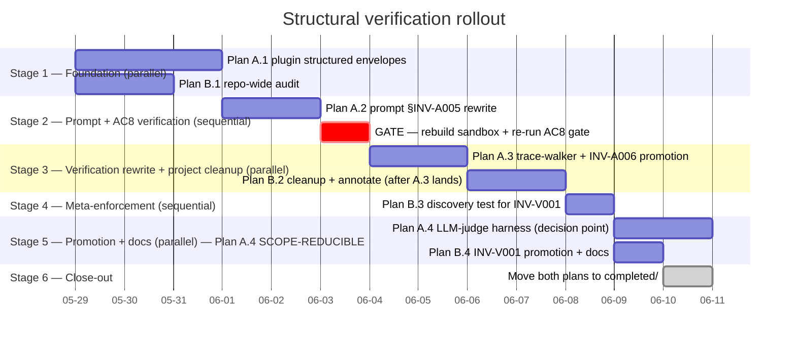

# Meta-Plan: Structural Verification — Sequencing & Integration

**Status**: Filed 2026-05-28; pending execution
**Created**: 2026-05-28
**Owner**: aerugo
**Children**:
- [`inv-a005-structural-faithfulness`](../inv-a005-structural-faithfulness/) — Plan A (canonical pilot: replace INV-A005 phrase-list with structural envelopes + LLM-judge)
- [`eliminate-forbidden-phrase-enumeration`](../eliminate-forbidden-phrase-enumeration/) — Plan B (project-wide cleanup + `INV-V001` promotion)

This meta-plan owns no implementation code. It owns sequencing, validation gates between stages, cross-plan invariant coordination, and progress tracking.

---

## Why This Exists

The 2026-05-28 AC8 manual gate of [agent-stale-memory-and-failure-mode-confabulation](../../completed/agent-stale-memory-and-failure-mode-confabulation/) made two things empirically clear:

1. Substring-list enumeration of forbidden phrases (`_FORBIDDEN_PHRASES` + the §INV-A005 catalogue) **cannot cover the agent's paraphrase-space** — the agent invented "object-shape serialization error" within hours of the catalogue shipping.
2. The trace-walker's licensing-signal predicate became **structurally circular** under `openclaw agent --json` output, because the only payload IS the agent's reply — the predicate read the reply to decide whether the reply is allowed.

User verdict (2026-05-28): *"this phrase matching methodology seems useless"* + *"never rely on enumeration of 'forbidden phrases'"* + *"rely on the OpenClaw agent to receive raw returns and evaluate multi-turn on a loop, calling more tools as it needs more info."*

Two plans split the work cleanly:

- **Plan A** does the *canonical fix*: change the plugin to return structured `{error_type, ...}` envelopes, rewrite the §INV-A005 prompt section to teach the agent to read `error_type` + quote structured fields verbatim + investigate multi-turn under unfamiliar shapes, replace the trace-walker with structural inspection.
- **Plan B** *generalizes the discipline*: audit the rest of the repo, annotate non-load-bearing substring backstops, add a meta-discovery test, promote `INV-V001` as the project-wide rule + update planning protocol + test-engineer skill.

The two plans are tightly coupled. Plan A is the load-bearing fix; Plan B prevents the methodology from sneaking back in elsewhere. They share scope, share invariants (`INV-A006` + `INV-V001`), and have inter-dependencies between phases. **This meta-plan tells you which phase to run when, and what gate must pass before the next phase starts.**

---

## Sequencing Decision: Architectural fix first, then prompt + verification rewrite, then project-wide enforcement



### Stage 1 — Foundation (parallel-safe)

Two independent threads kick off together:

1. **[Plan A — Phase 1](../inv-a005-structural-faithfulness/phases/phase-1.md)**: Change three failure-path helpers in [packages/nemoclaw-plugin/src/index.ts](../../../../packages/nemoclaw-plugin/src/index.ts) to return `ToolFailureEnvelope` structured envelopes with an `error_type` discriminator (`placeholder_rejected`, `host_failure`, `network_error`, `http_error`). Prose moves to a non-load-bearing `advisory` field. Update [packages/nemoclaw-plugin/tests/index.test.ts](../../../../packages/nemoclaw-plugin/tests/index.test.ts) assertions.

2. **[Plan B — Phase 1](../eliminate-forbidden-phrase-enumeration/phases/phase-1.md)**: Audit-only. Produce `phases/phase-1-audit-findings.md` with a file-by-file inventory of every substring/regex enumeration touching agent output. Categorize each site as **primary** / **backstop** / **structural** / **future-plan**.

**Why parallel-safe**: Plan A.1 changes plugin TypeScript; Plan B.1 reads + categorizes. No file overlap.

**Gate to Stage 2**:
- ✅ `npm run typecheck` + `npm run build` + `npm test` clean in `packages/nemoclaw-plugin/`.
- ✅ Plan B's audit report exists with categorized findings.
- ✅ Confirm the audit's "primary load-bearing" count matches Plan A's scope (sister plan must cover all of them). If not, **stop and re-scope**.

### Stage 2 — Prompt rewrite + behavioural verification

3. **[Plan A — Phase 2](../inv-a005-structural-faithfulness/phases/phase-2.md)**: Rewrite the §INV-A005 prompt section. **Remove** the 5-row catalogue table, the decompose-rule's enumeration form, the parametrized `_CATALOGUE_ROWS` contract test, and the decompose-rule contract test. **Add** rule-based guidance: agent reads `error_type` (now exists per A.1), quotes structured fields verbatim, calls additional tools multi-turn when shapes are unfamiliar. Add three new rule-form contract tests (error_type-mention + quote-verbatim + multi-turn investigation present in the prompt).

4. **GATE — Rebuild sandbox + re-run AC8 manual gate**:
   ```bash
   ./scripts/sandbox-up.sh --rebuild
   # Send the verbatim muscle question per CLAUDE.md § Running the Agent Locally.
   # Capture the trace under docs/reports/demo-2026-05-29-logs/manual-ac8-post-stage2.trace.json.
   ```
   **Pass criteria**:
   - Agent reply contains `error_type:` literally (one or more of the four enum values).
   - Reply quotes at least one structured field value verbatim (in backticks).
   - Reply decomposes failures per-tool (no homogenization across clusters into a single failure phrase).
   - Reply does NOT invent a paraphrase that doesn't match any envelope (e.g., no "object-shape serialization error").

   **Failure mode**: if the agent still confabulates, the prompt rewrite needs another pass (return to Stage 2 step 3) before proceeding. Stage 3's structural walker depends on the agent quoting `error_type` correctly.

   **Decision point**: if the AC8 gate passes cleanly, Plan A Phase 4 (LLM-judge harness) is a candidate for deferral — note the result and revisit at Stage 5.

### Stage 3 — Verification rewrite + project-wide cleanup (parallel-safe AFTER Stage 2 gate)

5. **[Plan A — Phase 3](../inv-a005-structural-faithfulness/phases/phase-3.md)**: Delete `_FORBIDDEN_PHRASES`, `_STRUCTURAL_FAILURE_SIGNALS`, `_GENOMECLAW_HTTP_ERROR_PATTERN` from [test_invA005_no_serialization_bug_confabulation.py](../../../../packages/toolkit/tests/invariants/test_invA005_no_serialization_bug_confabulation.py). Replace with a structural walker (asserts every failure-narrative paragraph quotes an `error_type`). Create `test_invA006_plugin_returns_structured_envelopes.py` discovery test. Promote `INV-A006` in `INVARIANTS.md` v1.22; rewrite `INV-A005` rule text v1.22.

   **Resolve Open Question A.Q1 before starting**: does the trace expose per-tool-call records? Three resolution paths in [Plan A phase-3.md](../inv-a005-structural-faithfulness/phases/phase-3.md). Default fallback: `toolSummary.failures > 0` aggregate.

6. **[Plan B — Phase 2](../eliminate-forbidden-phrase-enumeration/phases/phase-2.md)** (depends on A.3 landing): For every site in B.1's audit, add the inline annotation comment (`# INV-V001-backstop:` for non-load-bearing sanity checks; `# INV-V001-allow:` for structural anti-pattern regex like INV-P003's argv-leak detection). Replace any newly-discovered primary site that A.3 didn't cover (expectation: none, since B.1's audit caught them all).

**Why B.2 sequences AFTER A.3, not in parallel with it**: A.3 deletes `_FORBIDDEN_PHRASES` + `_CATALOGUE_ROWS` + `_STRUCTURAL_FAILURE_SIGNALS` + `_GENOMECLAW_HTTP_ERROR_PATTERN`. If B.2 ran in parallel, it might try to annotate sites that A.3 is about to delete — wasted work + merge friction.

**Gate to Stage 4**:
- ✅ `grep -rn '_FORBIDDEN_PHRASES\|_CATALOGUE_ROWS\|_STRUCTURAL_FAILURE_SIGNALS' packages/toolkit/tests/` returns empty.
- ✅ Every remaining string-tuple touching agent output has an `INV-V001-{backstop,allow}:` annotation.
- ✅ `INV-A006` discovery test green.
- ✅ Full invariants suite green.

### Stage 4 — Meta-enforcement (sequential)

7. **[Plan B — Phase 3](../eliminate-forbidden-phrase-enumeration/phases/phase-3.md)**: Implement `test_invV001_no_phrase_enumeration_in_agent_output_gates.py` discovery test. Walks test + prompt files; fails on any string-tuple touching agent output that lacks an `INV-V001-{backstop,allow}:` annotation. Two confidence-check tests verify the walker correctly flags un-annotated synthetic violations and accepts annotated sites.

**Gate to Stage 5**:
- ✅ Discovery test passes against the post-B.2 repo state.
- ✅ Confidence checks pass.

### Stage 5 — Promotion + docs (parallel; Plan A.4 scope-reducible)

8. **[Plan B — Phase 4](../eliminate-forbidden-phrase-enumeration/phases/phase-4.md)**: Land `INV-V001` formally in `INVARIANTS.md` with new `INV-V*` (Verification Methodology) category. Update [docs/plans/CLAUDE.md](../CLAUDE.md) Planning Standards section G + [.claude/agents/test-engineer.md](../../../../.claude/agents/test-engineer.md) Test Priorities + Anti-Patterns entries. Bump `INVARIANTS.md` v1.22 → v1.23.

9. **[Plan A — Phase 4](../inv-a005-structural-faithfulness/phases/phase-4.md)** — **DECISION POINT (revisit Stage 2 AC8 result)**:
   - **If Stage 2's AC8 gate passed cleanly with the agent reliably quoting `error_type` verbatim + decomposing per-tool**: defer A.4 (LLM-judge harness) to a separate follow-up plan. The structural walker + prompt discipline are sufficient. File the deferral note in Plan A's work-notes.
   - **If Stage 2 showed marginal cases** (agent quoted some `error_type`s but missed others, or homogenized in edge cases): ship A.4 as defense-in-depth. The judge catches semantic drift the structural walker can't.

**Gate to Stage 6**:
- ✅ `INVARIANTS.md` v1.23 contains both `INV-A006` (Plan A.3) and `INV-V001` (Plan B.4) with all template sections.
- ✅ Planning protocol + test-engineer skill carry the rule.
- ✅ Discovery test continues to pass.
- ✅ A.4 either green (if shipped) or deferred with documented trigger conditions.

### Stage 6 — Close-out

10. **Move both child plans** from `docs/plans/active/` to `docs/plans/completed/`. **Move the superseded** [agent-replay-harness-for-prompt-regression.md](../agent-replay-harness-for-prompt-regression.md) stub to `completed/` with its supersession note (a write was already prepended in [Plan A's documented deliverables](../inv-a005-structural-faithfulness/phases/phase-3.md)). **Move this meta-plan** to `completed/structural-verification-meta/` once both children land.

---

## Cross-plan invariants

- **`INV-A005`** Tool-Failure Narratives Match Trace Evidence — Plan A.3 rewrites the rule text v1.21.1 → v1.22 (mechanism changes from phrase-list to structural).
- **NEW `INV-A006`** Plugin Tool-Result Returns Structured Envelopes — Plan A.3 promotes; required by Plan A.1's type changes.
- **NEW `INV-V001`** Verification Mechanisms Must Not Enumerate Forbidden Phrases for Agent Output — Plan B.4 promotes; enforced by Plan B.3's discovery test.
- **`INV-A002`** Synthesis Reasoning Floor v1.8 bullet 3 — Step 3 capability-claim bullet from the parent plan stays untouched. Both plans respect.
- **`INV-P001`** Privacy Default — Plan A.4's optional LLM-judge gated by env var; default-skip preserved.
- **`INV-P003`** Secrets Pass via stdin or env, Never via argv — Plan B.2's annotation of [test_invP003_*](../../../../packages/toolkit/tests/invariants/test_invP003_onboard_script_no_secrets_in_argv.py) confirms that plan's structural regex stays in place (different class from paraphrase enumeration).

---

## Open Questions across the meta-plan

- **Meta-Q1 — Resolution of Plan A.Q1 (per-tool-call records in trace)**: blocks Plan A.3. Default fallback (use `toolSummary.failures` aggregate only) is acceptable but coarser than ideal. **Resolve before Stage 3.**
- **Meta-Q2 — Plan A.4 LLM-judge ship-or-defer**: decided at Stage 5 based on Stage 2 AC8 result. No need to pre-resolve.
- **Meta-Q3 — `INV-V*` category placement in INVARIANTS.md**: cosmetic; Plan B.4 handles. Default: new top-level category section above `INV-T*`.

---

## Shared verification (after Stage 5, before Stage 6)

A single cumulative-behaviour smoke before closing both plans:

1. **Structural envelopes in the plugin** — `npm run build` + `npm test` clean in `packages/nemoclaw-plugin/`; `INV-A006` discovery test green.
2. **Prompt discipline** — re-run the AC8 manual gate one more time against the final state. Reply quotes `error_type` + structured fields verbatim + decomposes per-tool. Capture trace under `docs/reports/demo-<date>-logs/` for the historical record.
3. **Structural walker** — `test_invA005_no_serialization_bug_phrasing_without_real_failure` rewritten; runs against the new AC8 trace + passes.
4. **Project-wide enforcement** — `test_invV001_no_phrase_enumeration_in_agent_output_gates.py` passes; `grep -rn '_FORBIDDEN_PHRASES\|_CATALOGUE_ROWS' packages/toolkit/tests/` returns empty.
5. **INV docs current** — `INVARIANTS.md` v1.23 lists `INV-A005` v1.22, `INV-A006`, `INV-V001` with full template sections + Invariant Index updated.
6. **Planning protocol + test-engineer skill** — both teach `INV-V001`'s three preferred alternatives (structural / semantic / quote-verbatim).
7. **Memory consistency** — `feedback_no_phrase_enumeration.md` references the now-landed plans + `INV-V001`.

---

## Progress Tracking

| Stage | Phase | Plan | Status | Started | Completed | Notes |
|-------|-------|------|--------|---------|-----------|-------|
| 0 | A.Q1 resolution (trajectory file source) | A | **Resolved** | 2026-05-28 | 2026-05-28 | `<run-id>.trajectory.jsonl` exposes `messagesSnapshot` with per-call records (toolName, content, isError) |
| 1 | A.1 plugin structured envelopes | A | **Complete** | 2026-05-28 | 2026-05-28 | 31/31 plugin tests; typecheck + build clean; `ToolFailureEnvelope` discriminated union landed |
| 1 | B.1 repo-wide audit | B | **Complete** | 2026-05-28 | 2026-05-28 | Findings filed at [phase-1-audit-findings.md](../eliminate-forbidden-phrase-enumeration/phases/phase-1-audit-findings.md); 4 primary sites all sister-plan scope; ~26 Phase-2 annotation candidates |
| 2 | A.2 prompt §INV-A005 rewrite | A | **Complete** | 2026-05-28 | 2026-05-28 | 4 v1.21 catalogue tests deleted; 3 new rule-form tests pass; §INV-A005 rewritten end-to-end to reference `error_type` + quote-verbatim + multi-turn investigation |
| 2 | **GATE** — AC8 re-run | meta | **PASS** | 2026-05-28 | 2026-05-28 | All 4 criteria met. Trace at `stage2-gate-muscle-question.trace.json`. Plan A.4 → deferral candidate. |
| 3 | A.3 trace-walker + INV-A006 promotion | A | **Complete** | 2026-05-28 | 2026-05-28 | Structural walker reads trajectory file; 3 INV-A006 discovery cases pass; INV-A005 rule rewrite v1.22 + INV-A006 entry in INVARIANTS.md |
| 3 | B.2 cleanup + annotate | B | **Complete** | 2026-05-28 | 2026-05-28 | 3 sites annotated (file-level backstop on contract; per-site allow on argv regex; per-site backstop on live-agent tuple + HTTP-422 pin) |
| 4 | B.3 INV-V001 discovery test | B | **Complete** | 2026-05-28 | 2026-05-28 | 4 tests pass (primary + 3 confidence checks); annotation-based, 15-line lookback or file-level header |
| 5 | A.4 LLM-judge harness | A | **Deferred** | 2026-05-28 | n/a | Gate passed cleanly → defer per Stage-5 rubric; trigger conditions documented |
| 5 | B.4 INV-V001 promotion + docs | B | **Complete** | 2026-05-28 | 2026-05-28 | INV-V001 in INVARIANTS.md v1.23 (new INV-V* category); planning protocol section G + test-engineer skill updated |
| 6 | Close-out (move plans to completed) | meta | **In progress** | 2026-05-28 | | |

---

## Open Risks across the meta-plan

- **R1 — Stage 2 gate failure**: if the AC8 re-run after Plan A.1+A.2 shows the agent still confabulating, the prompt rewrite needs iteration. Likely a couple of cycles. Don't proceed to Stage 3 until the gate passes — the structural walker depends on the agent quoting `error_type` reliably.
- **R2 — Plan A.Q1 unresolvable**: if per-tool-call records can't be surfaced in the trace AND upstream openclaw won't expose them, Plan A.3's structural walker is coarser than the design wants. Plan A.4's LLM-judge becomes more important (semantic, not structural; handles the gap).
- **R3 — Sister-plan merge conflicts**: both plans touch [test_agent_system_prompt_contract.py](../../../../packages/toolkit/tests/invariants/test_agent_system_prompt_contract.py) — A.2 removes `_CATALOGUE_ROWS` + parametrized contract test; B.2 annotates the remaining backstop assertions. Sequenced (A.2 before B.2) to avoid conflict, but watch for the case where B.1's audit identifies sites A.2 also intends to touch — coordinate at Stage 3 start.
- **R4 — Annotation discipline lag**: developers adding new tests during the rollout may introduce un-annotated substring tuples. Mitigation: Plan B.4's planning-protocol + test-engineer-skill updates teach the rule, but only land in Stage 5. Bridge period (Stages 1–4) relies on this meta-plan being visible + active PR review.
- **R5 — Wall-clock estimate**: gantt above assumes ~12 working days end-to-end. Stage 2 gate iterations could push this; Plan A.4 if shipped adds ~2 days; if deferred, saves ~2 days.

---

## Sequence-and-Stop guide for the implementer

Print-and-pin this list. At each step, do exactly the action; do not skip ahead.

1. Read both children's `spec.md` + `development-plan.md` end-to-end. Confirm the high-level architecture matches your understanding before any code work.
2. Resolve Plan A's Open Q1 (per-tool-call records in trace) — investigate `openclaw agent --json` output + the embedded-runner alternative. Record the resolution in Plan A's `work-notes.md`.
3. **Stage 1 start**: in parallel, open a TypeScript editor on `index.ts` (Plan A.1) AND a terminal at the repo root (Plan B.1's grep-based audit).
4. **Plan A.1 RED → GREEN → REFACTOR** per [phase-1.md](../inv-a005-structural-faithfulness/phases/phase-1.md). Stop when `npm run typecheck`, `npm run build`, `npm test` all green.
5. **Plan B.1**: produce `phases/phase-1-audit-findings.md`. Cross-check that primary sites count matches Plan A's scope.
6. **Stage 1 gate** ✓ — if both green, proceed.
7. **Plan A.2 RED → GREEN → REFACTOR** per [phase-2.md](../inv-a005-structural-faithfulness/phases/phase-2.md). Stop when the three new rule-form contract tests pass + old catalogue contract test + decompose-rule contract test are **deleted**.
8. **Stage 2 GATE — AC8 re-run**: `./scripts/sandbox-up.sh --rebuild` + send the verbatim muscle question + capture trace + verify the four pass criteria. If pass: ✓. If fail: iterate on Plan A.2 (Stage 2 step 7) and re-gate.
9. **Stage 3 start**: Plan A.3 first (sequential, not parallel with B.2).
10. **Plan A.3 RED → GREEN → REFACTOR** per [phase-3.md](../inv-a005-structural-faithfulness/phases/phase-3.md). Promote `INV-A006`. Confirm `grep -rn '_FORBIDDEN_PHRASES' packages/toolkit/tests/` returns empty.
11. **Plan B.2** per [phase-2.md](../eliminate-forbidden-phrase-enumeration/phases/phase-2.md): annotate every site from B.1's audit. Confirm the full test suite still passes.
12. **Stage 3 gate** ✓ — both A.3 + B.2 green.
13. **Plan B.3 RED → GREEN → REFACTOR** per [phase-3.md](../eliminate-forbidden-phrase-enumeration/phases/phase-3.md). Discovery test passes + confidence checks pass.
14. **Stage 5 decision point** — revisit the Stage 2 AC8 result. Ship Plan A.4 or defer? Document the decision in Plan A's work-notes.
15. **Plan B.4** per [phase-4.md](../eliminate-forbidden-phrase-enumeration/phases/phase-4.md). Promote `INV-V001`. Update planning protocol + test-engineer skill. In parallel, ship or defer Plan A.4.
16. **Stage 6 close-out**: shared-verification checks (above). Move both plans + this meta-plan + the superseded replay-harness stub to `completed/`. Update the [GenomeClaw root CLAUDE.md](../../../CLAUDE.md) only if a top-level domain term changed (don't expect any).

If you get stuck at any step, **stop and write a blocker note in the affected plan's `work-notes.md`** before improvising. The plans + this meta-plan are the durable record; the human reviewer (you, future-you, or another contributor) reads them to decide what to do.
