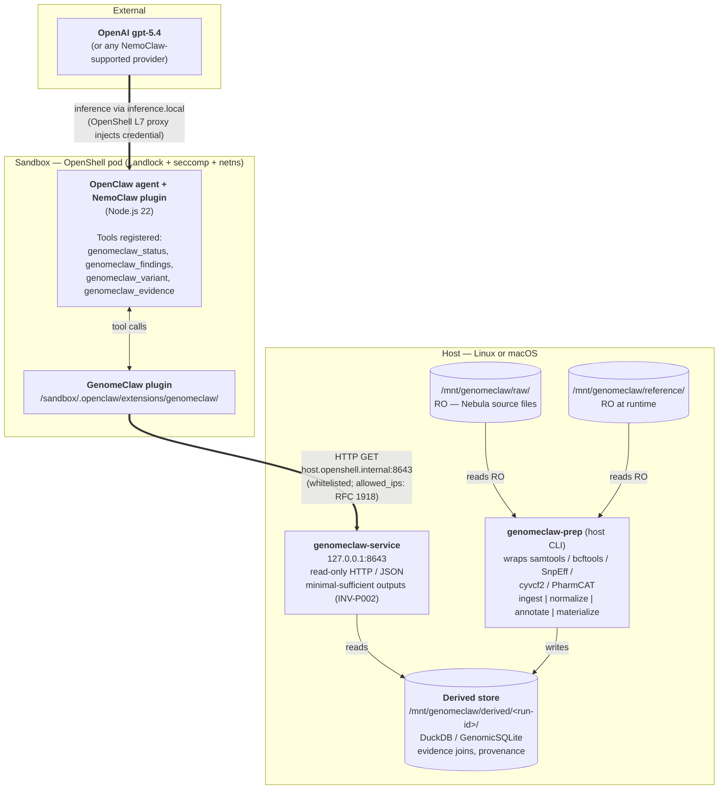
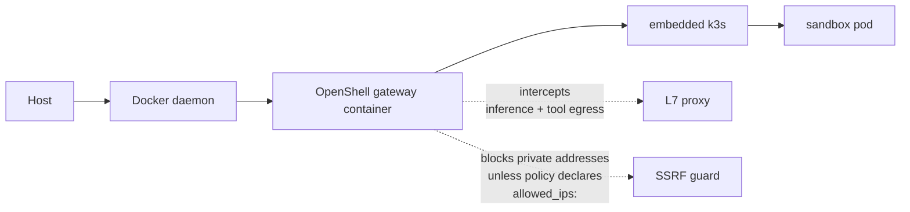

# GenomeClaw Architecture

**Status**: Living document
**Companion to**: [INVARIANTS.md](INVARIANTS.md), [grand-plan.md](grand-plan.md)
**Last Updated**: 2026-05-06

This document describes the **verified deployment shape** of GenomeClaw against the NemoClaw / OpenClaw / OpenShell stack. The host can be any Linux or macOS environment where NemoClaw and the standard bioinformatics tools install. This document is the operational counterpart to the strategic [grand plan](grand-plan.md).

Every architectural choice here was confirmed by inspecting a running NemoClaw sandbox; the relevant NemoClaw / OpenShell / OpenClaw file paths are cited inline.

---

## Stack overview

GenomeClaw is **not** a fork of NemoClaw, OpenClaw, or OpenShell. It is composed of four artifacts that plug into those layers via their published extension surfaces:

| Artifact | Where it lives | What it is | Consumes |
|----------|---------------|------------|----------|
| **Host pipeline CLI** (`genomeclaw-prep`) | host process | Heavyweight bioinformatics pipeline (samtools/bcftools/SnpEff/cyvcf2/PharmCAT). Reads raw artifacts, writes derived store. | Raw FASTQ/BAM/VCF |
| **Host service** (`genomeclaw-service`) | host process | Small read-only HTTP/JSON API exposing minimal-sufficient queries against the derived store. | Derived store |
| **NemoClaw plugin** (`@genomeclaw/nemoclaw-plugin`) | inside OpenShell sandbox at `/sandbox/.openclaw/extensions/genomeclaw/` | TypeScript OpenClaw plugin registering agent-callable commands. Calls the host service over HTTP. | Host service |
| **OpenShell policy preset** (`genomeclaw.yaml`) | merged into NemoClaw blueprint at onboard time | Network egress rule whitelisting `host.openshell.internal:<port>` for the plugin's binaries. | n/a |

---

## Repo layout

GenomeClaw is structured as a workspace with two packages, one per execution domain. The `packages/` boundary **is** the deployment-domain boundary: `packages/toolkit/` is host-only and never installed in the sandbox image; `packages/nemoclaw-plugin/` is sandbox-only and never executed on the host (except for the build step).

```text
GenomeClaw/
├── README.md
├── CLAUDE.md
├── docs/
│   ├── reference/
│   │   ├── INVARIANTS.md           Canonical INV-xxx rules
│   │   ├── grand-plan.md           Strategic vision
│   │   └── architecture.md         (this file)
│   └── plans/                      Per-feature plans (CLAUDE.md, templates/, active/, completed/)
├── .claude/
│   └── agents/                     Specialized subagent guides
└── packages/
    ├── toolkit/                    HOST-SIDE — pending implementation
    │   ├── pyproject.toml
    │   ├── src/genomeclaw_toolkit/
    │   │   ├── prep/               ingest|normalize|annotate|materialize CLI
    │   │   ├── service/            FastAPI host service (read-only)
    │   │   └── schemas/            finding / evidence / provenance schemas
    │   └── tests/                  unit, integration, provenance, determinism, privacy
    └── nemoclaw-plugin/            SANDBOX-SIDE — scaffolding in place
        ├── README.md
        ├── package.json
        ├── tsconfig.json
        ├── openclaw.plugin.json    plugin manifest + configSchema
        ├── policy-preset.yaml      OpenShell network policy preset
        ├── src/index.ts            plugin entrypoint (registers tools, HTTP client)
        └── sandbox/Dockerfile      bake-in image consumed by `nemoclaw onboard --from`
```

The two packages share `docs/reference/INVARIANTS.md` and the planning protocol. They are kept separable so a future split into two repositories is cheap (see [grand-plan.md](grand-plan.md#decisions-deferred)).

---

## Layered diagram



---

## Components — per-package responsibilities

### 1. Host pipeline CLI — `genomeclaw-prep`

**Lives**: host process, no sandbox.
**Implementation**: Python (driven by ecosystem: `cyvcf2`, `pysam`, DuckDB Python bindings, PharmCAT).
**Responsibility**: ingest → normalize → filter → annotate → materialize. Reads from `/mnt/genomeclaw/raw/` and `/mnt/genomeclaw/reference/`; writes to `/mnt/genomeclaw/derived/<run-id>/` with full provenance columns.
**Why host-side**: `INV-D002`. Bioinformatics tools are heavy, host-native, and must never be reachable from the agent.

### 2. Host service — `genomeclaw-service`

**Lives**: host process, listens on `127.0.0.1:8643` by default.
**Implementation**: Python (FastAPI/Uvicorn or similar) — TBD in toolkit phase.
**Responsibility**: read-only HTTP/JSON API serving queries against the most recent derived store run. Endpoints (initial set):

- `GET /v1/health` — liveness + active run-id + schema version + annotation source versions.
- `GET /v1/findings` — scoped findings list (summary class). Query parameters:
  - `category` (one of `clinical-actionable | clinical-non-actionable | lifestyle | mixed`).
  - `genes` — **repeated query parameter** for multi-gene filter (`?genes=CYP1A2&genes=ADORA2A`); typed `list[str]` server-side.
  - `drugs` — **repeated query parameter** for drug-keyed PGx filter (`?drugs=clopidogrel`); typed `list[str]`.
  - `limit` — integer, 1–200.
  - All four are optional; an empty list is rejected with a clear error.
- `GET /v1/findings/{id}` — single finding with bound evidence references.
- `GET /v1/variants` — scoped variant query (summary class). Same `genes` / `rsids` repeated-query-parameter shape as `/v1/findings`.
- `GET /v1/variants/{key}` — single variant lookup by canonical key (rsid or `chr-pos-ref-alt`).
- `GET /v1/evidence/{ref}` — evidence record fetch.
- `GET /v1/provenance/{run-id}` — provenance envelope for a run.

(Per MVP spec Q3 — Decision Taken: there is no `/v1/report` endpoint. Report-shaped responses are assembled by the agent from `/v1/findings` + `/v1/health` + its training.)

**Output shape**: minimal-sufficient by default (`INV-P002`). A future `?class=bulk` opt-in is reserved but not enabled in v0. Per MVP spec Q4: array-shaped query parameters use the FastAPI repeated-query-parameter convention (`?genes=A&genes=B`), not comma-separated strings.

### 3. NemoClaw plugin — `@genomeclaw/nemoclaw-plugin`

**Lives**: inside OpenShell sandbox at `/sandbox/.openclaw/extensions/genomeclaw/`.
**Implementation**: TypeScript, OpenClaw plugin SDK (`openclaw/plugin-sdk`), Node.js 22.
**Responsibility**: registers agent-callable commands and proxies them to the host service. Re-shapes responses to enforce the plugin-level part of `INV-P002`. Never reads files; never spawns bioinformatics subprocesses.
**Configuration**: read from `api.pluginConfig`, sourced from `plugins.entries.genomeclaw.config.*` in the sandbox's `openclaw.json`. Mutable post-install via host-side `nemoclaw <sandbox> config set --key plugins.entries.genomeclaw.config.<dotpath> --value '...' --restart`.

### 4. OpenShell policy preset — `genomeclaw.yaml`

**Lives**: `packages/nemoclaw-plugin/policy-preset.yaml`, intended to be merged into NemoClaw's blueprint at onboard time alongside other presets.
**Modeled on**: [`nemoclaw-blueprint/policies/presets/local-inference.yaml`](https://github.com/NVIDIA/NemoClaw/blob/main/nemoclaw-blueprint/policies/presets/local-inference.yaml) — the canonical "sandbox reaches host service" pattern.
**Responsibility**: tells the OpenShell L7 proxy that the plugin's Node binary may reach `host.openshell.internal:8643` for specific GET paths only. Includes the `allowed_ips:` RFC 1918 allowlist required to bypass OpenShell's SSRF guard for private host-gateway addresses.

---

## Data layout

```text
/mnt/genomeclaw/
├── raw/         (RO — Nebula FASTQ/BAM/VCF; chmod-enforced read-only)
├── reference/   (RO at runtime; written only by `genomeclaw-prep fetch`)
└── derived/     (RW; pipeline writes <run-id>/ here)
    └── <run-id>/
        ├── manifest.json             (run identity, schema version, tool versions)
        ├── variants.duckdb
        ├── annotations/
        ├── evidence/
        └── provenance.json
```

Raw and reference are mounted read-only at the OS layer. Derived is the only writable surface. The sandbox sees **none** of these paths directly.

---

## Network topology (verified)



Two paths cross trust boundaries:

1. **Inference** (sandbox → cloud): plugin/agent → `https://inference.local/...` → OpenShell L7 proxy → OpenAI (or other configured provider). API keys never enter the sandbox; they're injected at the proxy.
2. **Host service** (sandbox → host): plugin → `http://host.openshell.internal:8643/v1/...` → Docker bridge → host's `127.0.0.1:8643`. Whitelisted by the GenomeClaw policy preset.

`host.openshell.internal` resolves to the Docker host (`172.17.0.1` or equivalent). Confirmed live in a NemoClaw sandbox:

```text
$ getent hosts host.openshell.internal
172.17.0.1      host.docker.internal host.openshell.internal
```

---

## Configuration flow

### Plugin install

The plugin is **image-baked**:

```bash
nemoclaw onboard --from ./packages/nemoclaw-plugin/sandbox/Dockerfile
```

The Dockerfile inherits from `ghcr.io/nvidia/nemoclaw/sandbox-base:latest`, copies the plugin into `/sandbox/.openclaw/extensions/genomeclaw/`, and runs `openclaw doctor --fix` to register it.

### Plugin config

Plugin config is **runtime-mutable** via host-side `nemoclaw <sandbox> config set --restart`. In-sandbox `openclaw config set` is intercepted because changes there don't survive a rebuild.

Example: change the host service URL without rebuilding the sandbox image:

```bash
nemoclaw <sandbox> config set \
  --key plugins.entries.genomeclaw.config.hostService.baseUrl \
  --value '"http://host.openshell.internal:8643"' \
  --restart
```

The plugin reads its config from `api.pluginConfig` at registration time; the keys live under `plugins.entries.genomeclaw.config.*` in the sandbox `openclaw.json`.

### Policy preset

The policy preset is selected during `nemoclaw onboard` (interactive) or applied via the host-side preset selection mechanism. The preset is checked into the repo at `packages/nemoclaw-plugin/policy-preset.yaml` so it can travel with the plugin source.

---

## Why this shape — invariant traceability

| Invariant | How this architecture enforces it |
|-----------|-----------------------------------|
| `INV-D001` | Raw artifacts live under chmod-RO host paths; pipeline writes to a separate derived path. |
| `INV-D002` | Raw artifacts have no path into the sandbox at all — neither bind mount nor HTTP route. |
| `INV-E001` | The host service binds every emitted finding/observation to an evidence reference; the plugin forwards the reference verbatim. |
| `INV-P001` | Genomic source files never traverse any boundary; only minimal-sufficient JSON crosses to the agent. |
| `INV-P002` | Three enforcement layers: host service shaping, plugin re-shaping, OpenShell policy + SSRF guard. The plugin's binary is policy-denied any host or port other than the configured host service. |
| `INV-R001` | Derived stores carry provenance columns (run-id, source paths/hashes, tool versions). The host service exposes `/v1/provenance/{run-id}` so the agent can cite provenance. |
| `INV-C001` | Report tools render clinical-escalation markers from finding records; the host service's finding schema includes the marker as a structural field. |

---

## Open / deferred questions

These are tracked in [grand-plan.md](grand-plan.md#decisions-deferred) under deferred decisions; revisit when the conditions are met.

| Open question | Why it's open | Revisit when |
|---------------|---------------|--------------|
| Whether OpenClaw plugin command handlers can return **structured JSON** (rather than text) to the agent | Investigation showed `PluginCommandResult` has only `text`/`mediaUrl` fields; v0 plugin encodes JSON inside the text field with a marker prefix | OpenClaw SDK exposes a structured-return API, or after live testing confirms text-encoded JSON is acceptable to the agent in practice |
| Whether `nodeHostCommands` (an internal OpenClaw SDK mechanism) could remove the host HTTP service | Mechanism exists in `openclaw/plugin-sdk/src/plugins/types.d.ts` but is undocumented for third-party use | After v1 ships and only if the host HTTP service becomes painful |
| Whether GenomeClaw needs platform support beyond what NemoClaw already provides | NemoClaw supports Linux, macOS, and WSL2 per its inference-options matrix; GenomeClaw inherits that envelope. Anything more specific is unclear until a deployment surfaces it | A second deployment surfaces a platform gap |

---

## Cross-references

- Repo layout / extension points: [`packages/nemoclaw-plugin/README.md`](../../packages/nemoclaw-plugin/README.md)
- Plugin manifest: [`packages/nemoclaw-plugin/openclaw.plugin.json`](../../packages/nemoclaw-plugin/openclaw.plugin.json)
- Policy preset: [`packages/nemoclaw-plugin/policy-preset.yaml`](../../packages/nemoclaw-plugin/policy-preset.yaml)
- Sandbox Dockerfile: [`packages/nemoclaw-plugin/sandbox/Dockerfile`](../../packages/nemoclaw-plugin/sandbox/Dockerfile)
- NemoClaw upstream architecture (for comparison): [`docs/reference/architecture.md` in NVIDIA/NemoClaw](https://github.com/NVIDIA/NemoClaw/blob/main/docs/reference/architecture.md)
