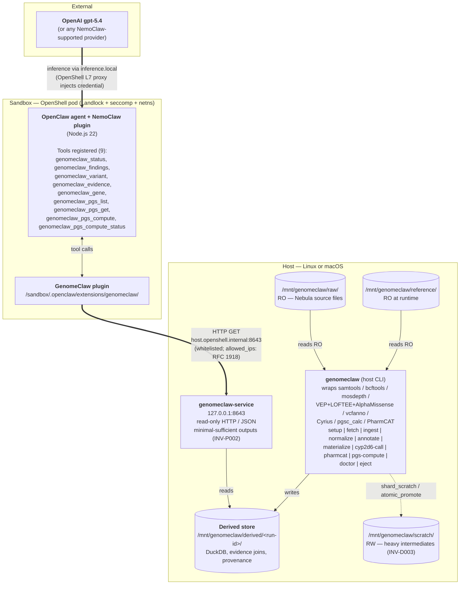
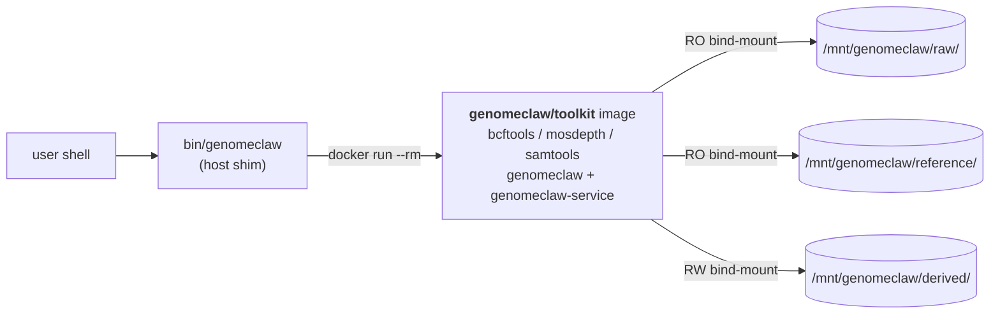
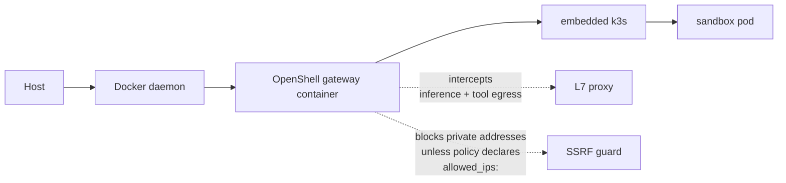

# GenomeClaw Architecture

**Status**: Living document
**Companion to**: [INVARIANTS.md](INVARIANTS.md), [grand-plan.md](grand-plan.md)
**Last Updated**: 2026-05-22 (MVP Phase 6 close — Slice D Cyrius + Slice D' PharmCAT + Slice F live agent sweep all shipped)

This document describes the **verified deployment shape** of GenomeClaw against the NemoClaw / OpenClaw / OpenShell stack. The host can be any Linux or macOS environment with Docker and NemoClaw — bioinformatics binaries ride inside the [`genomeclaw/toolkit`](#host-side-packaging--genomeclawtoolkit-docker-image) host image, not on the bare host. This document is the operational counterpart to the strategic [grand plan](grand-plan.md).

Every architectural choice here was confirmed by inspecting a running NemoClaw sandbox; the relevant NemoClaw / OpenShell / OpenClaw file paths are cited inline.

---

## Stack overview

GenomeClaw is **not** a fork of NemoClaw, OpenClaw, or OpenShell. It is composed of four artifacts that plug into those layers via their published extension surfaces:

| Artifact | Where it lives | What it is | Consumes |
|----------|---------------|------------|----------|
| **Host pipeline CLI** (`genomeclaw`) | inside the `genomeclaw/toolkit` Docker image, on the host (see [Host-side packaging](#host-side-packaging--genomeclawtoolkit-docker-image)) | Heavyweight bioinformatics pipeline (samtools/bcftools/mosdepth/VEP/Cyrius/`pgsc_calc`/PharmCAT, with `cyvcf2`/`pysam`/DuckDB Python on top). Reads raw artifacts read-only, writes derived store. | Raw FASTQ/BAM/VCF |
| **Host service** (`genomeclaw-service`) | inside the same `genomeclaw/toolkit` image; published as `127.0.0.1:8643` from the container | Small read-only HTTP/JSON API exposing minimal-sufficient queries against the derived store. | Derived store |
| **Host shim** (`bin/genomeclaw`) | host filesystem, on PATH | Thin Bash wrapper around `docker run --rm genomeclaw/toolkit:<tag> genomeclaw ...` with the canonical bind-mounts. Optional inner-loop bypass via `GENOMECLAW_NATIVE=1`. | n/a |
| **NemoClaw plugin** (`@genomeclaw/nemoclaw-plugin`) | inside OpenShell sandbox at `/sandbox/.openclaw/extensions/genomeclaw/` | TypeScript OpenClaw plugin registering agent-callable commands. Calls the host service over HTTP. | Host service |
| **OpenShell policy preset** (`genomeclaw.yaml`) | merged into NemoClaw blueprint at onboard time | Network egress rule whitelisting `host.openshell.internal:<port>` for the plugin's binaries. | n/a |

---

## Repo layout

GenomeClaw is structured as a workspace with two packages, one per execution domain. The `packages/` boundary **is** the deployment-domain boundary: `packages/toolkit/` is host-only and never installed in the sandbox image; `packages/nemoclaw-plugin/` is sandbox-only and never executed on the host (except for the build step).

```text
GenomeClaw/
├── README.md
├── CLAUDE.md
├── bin/
│   └── genomeclaw             Host shim (docker run wrapper); GENOMECLAW_NATIVE=1 bypass
├── docs/
│   ├── reference/
│   │   ├── INVARIANTS.md           Canonical INV-xxx rules
│   │   ├── grand-plan.md           Strategic vision
│   │   └── architecture.md         (this file)
│   └── plans/                      Per-feature plans (CLAUDE.md, templates/, active/, completed/)
├── .claude/
│   └── agents/                     Specialized subagent guides
├── .github/workflows/
│   └── test.yml                    Two jobs: host-venv pytest + ruff; toolkit-image build + needs_bio
└── packages/
    ├── toolkit/                    HOST-SIDE — Phase 1 scaffolding landed
    │   ├── pyproject.toml
    │   ├── uv.lock
    │   ├── Dockerfile              Multi-stage `genomeclaw/toolkit` image (bioconda + uv)
    │   ├── .dockerignore
    │   ├── src/genomeclaw_toolkit/
    │   │   ├── cli.py              `genomeclaw` entry point
    │   │   ├── prep/               ingest|normalize|annotate|materialize|cyp2d6-call|pgs-compute
    │   │   ├── service/            FastAPI host service (read-only)
    │   │   └── schemas/            finding / evidence / provenance / coverage_qc / pgs_scores
    │   └── tests/                  unit, integration, provenance, determinism, privacy, evidence, reports, invariants
    └── nemoclaw-plugin/            SANDBOX-SIDE — scaffolding in place
        ├── README.md
        ├── package.json
        ├── tsconfig.json
        ├── openclaw.plugin.json    plugin manifest + configSchema
        ├── policy-preset.yaml      OpenShell network policy preset
        ├── src/index.ts            plugin entrypoint (registers tools, HTTP client)
        └── sandbox/Dockerfile      bake-in image consumed by `nemoclaw onboard --from`
```

The two packages share `docs/reference/INVARIANTS.md` and the planning protocol. They are kept separable so a future split into two repositories is cheap (see [grand-plan.md](grand-plan.md#decisions-deferred)).

---

## Layered diagram



---

## Components — per-package responsibilities

### 1. Host pipeline CLI — `genomeclaw`

**Lives**: host process, no sandbox. Shipped as the `genomeclaw/toolkit` Docker image alongside its pinned bioinformatics binaries (see [Host-side packaging](#host-side-packaging--genomeclawtoolkit-docker-image)).
**Implementation**: Python (driven by ecosystem: `cyvcf2`, `pysam`, DuckDB Python bindings). Wraps the bioinformatics tools that live alongside it in the image.
**Responsibility**: ingest → normalize → filter → annotate → materialize, plus per-Q7 **`mosdepth`** (per-gene mean coverage from BAM/CRAM, materialized into the `coverage_qc` table), per-Q5 **VEP + LOFTEE + AlphaMissense + vcfanno** annotation (with **MANE Select** transcript pinning; HGVSc and HGVSp emitted server-side, never constructed by the LLM; SpliceAI dropped per Q5 amendment 2026-05-13), per-Q6 **Cyrius** (CYP2D6 diplotype call from BAM/CRAM, fed into PharmCAT's outside-call interface; shipped MVP Phase 6 Slice D 2026-05-22 — see [phase-6-slice-d.md](../plans/active/mvp/phases/phase-6-slice-d.md)), per-Q5 **`bcftools stats`** summary written into `manifest.json` under `qc.bcftools_stats`, per-Q8 **`pgsc_calc`** (agent-triggered PRS computation against PGS Catalog scoring weights, materialized into the `pgs_scores` table), and **PharmCAT v3.2.0** (PGx recommendations consuming the VCF + Cyrius outside-call; shipped MVP Phase 6 Slice D' 2026-05-22 — see [phase-6-slice-d-prime.md](../plans/active/mvp/phases/phase-6-slice-d-prime.md)). Reads from `/mnt/genomeclaw/raw/` and `/mnt/genomeclaw/reference/`; writes to `/mnt/genomeclaw/derived/<run-id>/` with full provenance columns.
**Subcommand surface** (per [MVP spec](../plans/active/mvp/spec.md) Q5–Q8 + Phase 2/4/6 deliverables): pipeline subcommands `fetch`, `ingest`, `normalize`, `annotate`, `materialize`, plus Phase-6-owned `cyp2d6-call`, `pharmcat`, and `pgs-compute`. Host-environment subcommands (shipped via the [completed cram-scratch-strategy plan](../plans/completed/cram-scratch-strategy/)) auto-route host-native (no docker): `setup` (interactive one-time external-drive layout), `doctor` (read-only host-side diagnostic — existence + write-probe of the four canonical subdirs, `_scratch/setup.log` surface, colima version + status), `eject` (refuses if a toolkit container is running, then `colima stop` + `diskutil eject`).
**Why host-side**: `INV-D002`. Bioinformatics tools are heavy, host-native, and must never be reachable from the agent.

### 2. Host service — `genomeclaw-service`

**Lives**: host process, listens on `127.0.0.1:8643` by default. Runs inside the same `genomeclaw/toolkit` image as `genomeclaw`, with `127.0.0.1:8643:8643` published from the container.
**Implementation**: Python (FastAPI/Uvicorn or similar) — TBD in toolkit phase.
**Responsibility**: read-only HTTP/JSON API serving queries against the most recent derived store run. Endpoints (initial set):

- `GET /v1/health` — liveness + active run-id + schema version + annotation source versions.
- `GET /v1/findings` — scoped findings list (summary class). Query parameters:
  - `category` (one of `clinical-actionable | clinical-non-actionable | lifestyle | mixed`).
  - `genes` — **repeated query parameter** for multi-gene filter (`?genes=CYP1A2&genes=ADORA2A`); typed `list[str]` server-side.
  - `drugs` — **repeated query parameter** for drug-keyed PGx filter (`?drugs=clopidogrel`); typed `list[str]`.
  - `limit` — integer, 1–200.
  - All four are optional; an empty list is rejected with a clear error.
- `GET /v1/findings/{id}` — single finding with bound evidence references.
- `GET /v1/variants` — scoped variant query (summary class). Same `genes` / `rsids` repeated-query-parameter shape as `/v1/findings`.
- `GET /v1/variants/{key}` — single variant lookup by canonical key (rsid or `chr-pos-ref-alt`).
- `GET /v1/evidence/{ref}` — evidence record fetch. **Variant-keyed kinds only** *(v1.6; per [agent-research-and-synthesis spec](../plans/active/agent-research-and-synthesis/spec.md))*: `clinvar:<id>` joins the variants table on `clinvar_id`; `pgs_catalog:<id>` joins the pgs_scores table; `pharmgkb:<id>` joins the PharmCAT outside-call output. The `gene_note:<gene>` and `topic:<topic>` kinds previously documented under MVP spec Q9 have been **retired** — lifestyle calibration now flows through the agent's research-and-synthesis pattern (memory + reasoned research at max reasoning), not via host-side curated markdown notes. Agent-side citation forms `memory:<file>#<anchor>` and `web:<url>` are agent-workspace concerns; the host service does not resolve them.
- `GET /v1/provenance/{run-id}` — provenance envelope for a run.
- `GET /v1/gene/{symbol}` — gene-level facts (per MVP spec Q7): `{top_user_variants, gene_loeuf, omim_disease, omim_inheritance, mean_coverage, low_coverage_exons}`. `mean_coverage` is a scalar (number, scaled to 1× depth); `low_coverage_exons` is a list of exon IDs whose mean depth fell below a configurable threshold (default 10×). Defaults to active run.
- **PRS endpoints** *(v1.6; per [MVP spec Q8 v1.6](../plans/active/mvp/spec.md) + [agent-driven PRS report](../reports/agent-driven-prs-computation.md))*. Four endpoints, keyed by PGS Catalog ID (not by curator-named trait):
  - `GET /v1/pgs/computed` — list of all PRSs the agent has computed for this user. Each row: `{pgs_id, trait_label, percentile_in_user_ancestry, calibration_warning, freshness, agent_choice_rationale_preview}`.
  - `GET /v1/pgs/computed/{pgs_id}` — single PRS in full: `{pgs_id, trait_label, percentile_in_user_ancestry, raw_score, source_pgs_id, study_population, calibration_warning, agent_choice_rationale, requested_for_question, superseded_by}`.
  - `POST /v1/pgs/compute` — agent-triggered async compute. Body: `{pgs_id, trait_label, rationale, requested_for_question}`. Returns `{task_id, status}` where status is one of `queued | running`. Bounded by a host-side concurrency cap (1 in-flight). A kill-switch — `genomeclaw config set pgs.compute_enabled false` — revokes the path entirely; with the kill-switch active, returns `status=failed` immediately with error `compute_path_disabled`.
  - `GET /v1/pgs/compute/{task_id}` — poll status: `queued | running | done | failed`. When `done`, the result is fetchable via `/v1/pgs/computed/{pgs_id}`.

  Consent for PGS Catalog egress is one-time at install per `INV-P001` (not per-compute); the agent's choice rationale is persisted per `INV-A003`; the PRS-decline pattern in `INV-C001` v1.7 prevents computes against immature literature.

(Per MVP spec Q3 — Decision Taken: there is no `/v1/report` endpoint. Report-shaped responses are assembled by the agent from `/v1/findings` + `/v1/health` + its training.)

**Output shape**: minimal-sufficient by default (`INV-P002`). A future `?class=bulk` opt-in is reserved but not enabled in v0. Per MVP spec Q4: array-shaped query parameters use the FastAPI repeated-query-parameter convention (`?genes=A&genes=B`), not comma-separated strings.

### 3. NemoClaw plugin — `@genomeclaw/nemoclaw-plugin`

**Lives**: inside OpenShell sandbox at `/sandbox/.openclaw/extensions/genomeclaw/`.
**Implementation**: TypeScript, OpenClaw plugin SDK (`openclaw/plugin-sdk`), Node.js 22.
**Responsibility**: registers agent-callable tools (per MVP spec Q2 — `registerTool` with TypeBox parameter schemas) and proxies them to the host service. Re-shapes responses to enforce the plugin-level part of `INV-P002`. Never reads files; never spawns bioinformatics subprocesses.
**Tool surface** (nine tools, per MVP spec Q3 / Q7 / Q8 v1.6):

| Tool | Parameters (TypeBox) | Endpoint | Output class |
|------|----------------------|----------|--------------|
| `genomeclaw_status` | `Type.Object({})` | `/v1/health` | `summary` |
| `genomeclaw_findings` | `category` enum + `genes: string[]` + `drugs: string[]` + `limit` | `/v1/findings` | `summary` |
| `genomeclaw_variant` | `key: string` | `/v1/variants/{key}` | `summary` |
| `genomeclaw_evidence` | `ref: string` (variant-keyed kinds only: `clinvar:` / `pgs_catalog:` / `pharmgkb:`) | `/v1/evidence/{ref}` | `summary` |
| `genomeclaw_gene` *(per Q7)* | `gene: string` | `/v1/gene/{symbol}` | `summary` |
| `genomeclaw_pgs_list` *(per Q8 v1.6)* | `Type.Object({})` | `/v1/pgs/computed` | `summary` |
| `genomeclaw_pgs_get` *(per Q8 v1.6)* | `pgs_id: string` | `/v1/pgs/computed/{pgs_id}` | `summary` |
| `genomeclaw_pgs_compute` *(per Q8 v1.6)* | `pgs_id: string` + `trait_label: string` + `rationale: string` *(minLength 50)* + `requested_for_question: string` | `POST /v1/pgs/compute` | `summary` |
| `genomeclaw_pgs_compute_status` *(per Q8 v1.6)* | `task_id: string` | `/v1/pgs/compute/{task_id}` | `summary` |

The four PRS tools replace the single `genomeclaw_pgs(trait)` tool from the v1.5 design (retired per Q8 v1.6 — the static-panel framing recapitulated the v1.5 curated_notes mistake in PRS form; see [agent-driven PRS report](../reports/agent-driven-prs-computation.md)). PRS computation is **agent-triggered async**: the agent decides which PGS Catalog scorefile to compute (reasoning at the model's ceiling per `INV-A002`), persists the choice rationale per `INV-A003`, and either polls `_compute_status` until done or surfaces an in-flight message and resumes on the next turn. The decline pattern in `INV-C001` v1.7 prevents computes against immature literature.

**Configuration**: read from `api.pluginConfig`, sourced from `plugins.entries.genomeclaw.config.*` in the sandbox's `openclaw.json`. Mutable post-install via host-side `nemoclaw <sandbox> config set --key plugins.entries.genomeclaw.config.<dotpath> --value '...' --restart`.

### 4. OpenShell policy preset — `genomeclaw.yaml`

**Lives**: `packages/nemoclaw-plugin/policy-preset.yaml`, intended to be merged into NemoClaw's blueprint at onboard time alongside other presets.
**Modeled on**: [`nemoclaw-blueprint/policies/presets/local-inference.yaml`](https://github.com/NVIDIA/NemoClaw/blob/main/nemoclaw-blueprint/policies/presets/local-inference.yaml) — the canonical "sandbox reaches host service" pattern.
**Responsibility**: tells the OpenShell L7 proxy that the plugin's Node binary may reach `host.openshell.internal:8643` for specific GET paths only. Includes the `allowed_ips:` RFC 1918 allowlist required to bypass OpenShell's SSRF guard for private host-gateway addresses.

### 5. Agent cognition layer — research, memory, synthesis *(v1.6+)*

**Lives**: inside the OpenShell sandbox, owned by OpenClaw + the configured agent. Not GenomeClaw code per se — but the GenomeClaw architecture depends on it being correctly configured.

**Three OpenClaw built-in primitives** the agent uses, beyond the GenomeClaw plugin tools:

| Primitive | OpenClaw plugin / mechanism | Egress | Default |
|-----------|------------------------------|--------|---------|
| **Memory** | `memory-core` (bundled) — `memory_search`, `memory_get` over `MEMORY.md` + `memory/YYYY-MM-DD.md` in the agent workspace | none (in-sandbox) | enabled |
| **Reasoned research** | `web_search` (bundled managed tool; provider-pluggable) + provider-native variants (e.g. OpenAI Responses `web_search`) — combines model training knowledge with current online sources via extended reasoning | new named egress destination per `INV-P001` | **disabled** (user opts in via `tools.web.search.enabled: true` + provider config) |
| **Extended reasoning effort** | Per-message `thinking` parameter on the agent's inference calls (model-supported levels: `off | minimal | low | medium | high | xhigh | adaptive | max`) | n/a | agent default |

**The research-and-synthesis pattern** *(per [agent-research-and-synthesis spec](../plans/active/agent-research-and-synthesis/spec.md))*:

```
┌─────────────────────────────────────────────────────────────────────────┐
│ User question arrives                                                    │
└───────────────────────────────┬─────────────────────────────────────────┘
                                │
        ┌───────────────────────▼─────────────────────────┐
        │ Four inputs the agent can draw from              │
        │                                                  │
        │   ① Model training knowledge   (vast; cheap)     │
        │   ② Online sources             (current; web)    │
        │   ③ Memory                     (prior synthesis) │
        │   ④ GenomeClaw host service    (user's genome)   │
        └───────────────────────┬─────────────────────────┘
                                │
         ┌──────────────────────┴──────────────────────┐
         │                                             │
         ▼                                             ▼
  ┌───────────────────────┐               ┌──────────────────────────┐
  │ Research phase        │               │ Synthesis phase           │
  │                       │               │                           │
  │ reasoning: medium/high│               │ reasoning: MAX            │
  │ tools: memory_search, │               │   (per INV-A002 for       │
  │        web_search,    │  ───────────► │    health-interpretation  │
  │        genomeclaw_*   │               │    turns only)            │
  │                       │               │                           │
  │ goal: gather widely   │               │ "Simulate being a         │
  │                       │               │  bioinformatician in      │
  │                       │               │  healthcare."             │
  └───────────────────────┘               └──────────────────────────┘
                                                       │
                                                       ▼
                              ┌──────────────────────────────────────┐
                              │ Memory note (per INV-A001)            │
                              │ + user-facing reply                    │
                              └──────────────────────────────────────┘
```

Lifestyle calibration — the project owner's calibrated stance on what each gene means in practice — is **not** pre-codified in a static markdown file. It emerges from the agent's research + the user's directional feedback, persisted in the agent's workspace memory, refreshed when stale. The previous v1.5 design (`reference/curated_notes/<gene>.md` with `gene_note:<gene>` evidence references) is retired in v1.6.

---

## Data layout

```text
/mnt/genomeclaw/
├── raw/         (RO — Nebula FASTQ/BAM/CRAM/VCF; bind-mount-RO at every container entry)
├── reference/   (RO at runtime; written only by `genomeclaw refs fetch` and `pgsc_calc fetch-weights`)
│   ├── grch38/
│   ├── clinvar/
│   ├── gnomad/                          (per Q5 — gnomAD v4 with per-population AFs)
│   ├── dbsnp/
│   ├── vep_cache/                       (per Q5 — VEP + LOFTEE + AlphaMissense + SpliceAI data files)
│   └── pgs_catalog/                     (per Q8 — PGS Catalog scoring weights for the three initial traits)
│       (Note: a `reference/curated_notes/` subtree was documented in earlier
│        drafts per MVP spec Q9, including a `topics/hard-genes.md` companion
│        note. As of v1.6 lifestyle calibration + the hard-genes blind-spot
│        framing live in the AGENT'S WORKSPACE MEMORY inside the sandbox,
│        NOT on the host filesystem. See:
│          docs/plans/active/agent-research-and-synthesis/spec.md
│          INVARIANTS.md § INV-C001 v1.6, INV-A001, INV-A002.)
├── derived/     (RW; pipeline writes <run-id>/ here — authoritative)
│   └── <run-id>/
│       ├── manifest.json                (run identity, schema version, tool versions, qc.bcftools_stats per Q5)
│       ├── variants.duckdb              (canonical variants table + Q5 annotation columns + coverage_qc + pgs_scores tables;
│       │                                 pgs_scores is keyed by PGS Catalog ID per Q8 v1.6 — not by curator-named trait;
│       │                                 carries agent_choice_rationale + requested_for_question columns per INV-A003)
│       ├── pgs_compute_tasks.sqlite     (per Q8 v1.6 — small SQLite holding queued | running | done | failed status for
│       │                                 in-flight + completed agent-triggered pgs_compute requests; concurrency cap (1
│       │                                 in-flight) enforced from this table; kill-switch via `pgs.compute_enabled` config)
│       ├── cyp2d6_diplotype.json        (per Q6 — Cyrius diplotype, consumed by PharmCAT outside-call)
│       ├── annotations/
│       ├── evidence/
│       └── provenance.json
└── _scratch/    (RW; ephemeral scratch — bcftools sort -T, DuckDB temp_directory,
                  Nextflow -work-dir, generic $TMPDIR. Sharded under
                  <step>/<run-id>/ via shard_scratch(...); cleaned on context-
                  manager exit. Safe to delete between runs. Nothing here is
                  authoritative. See "Storage planning" below.)
```

Whether `coverage_qc` and `pgs_scores` are separate `.duckdb` files or tables inside `variants.duckdb` is a Phase-4/6 implementation choice; this layout sketch keeps the option open. Each new derived artifact inherits the seven canonical provenance columns (`INV-R001`).

Raw and reference are mounted read-only at the OS layer. Derived and `_scratch` are the writable surfaces — `derived/` is authoritative (provenance-tracked, never deleted by the toolkit), `_scratch/` is ephemeral (the toolkit may delete contents at any time; users may `rm -rf` between runs without losing anything that matters). The structural separation is enforced by `INV-D003`: heavy intermediates target `_scratch/`, never `derived/`, and final artifacts cross the boundary only via `atomic_promote(src, dst)` (copy + fsync + within-FS rename + fsync parent) so derived/ never observes a partial file. The sandbox sees **none** of these paths directly.

---

## Host-side packaging — `genomeclaw/toolkit` Docker image

*Decision Taken 2026-05-08: package the toolkit + its bioinformatics binaries as a single host-side Docker image.* Both `genomeclaw` and `genomeclaw-service` ship inside one image (`genomeclaw/toolkit:<tag>`) alongside their pinned native dependencies (`bcftools`, `mosdepth`, `samtools`/`htslib`, and later VEP / Cyrius / `pgsc_calc` / PharmCAT). This keeps tool versions reproducible, removes per-host install drift (Linux vs. macOS, brew vs. apt vs. conda), and lets CI run the same image the user runs.



**What's inside the image**: the toolkit Python venv + the small native binaries listed above + (post-2026-05-22 `prs-bootstrap-meta` Stage 2) the PRS pipeline runtime: **Nextflow + JRE 17 + mamba (for conda-staged pgsc_calc deps) + Docker CLI (for `pgsc_calc` DooD sibling-container spawning) + the `pgsc_calc` Nextflow pipeline pre-warmed at `/opt/pgsc_calc/`**. `plink2` / `plink` / R / Bioconductor materialise per-process on first invocation into `reference/nextflow-cache/conda/` rather than baking into the image (arm64 conda availability gap; image delta stays ~1.07 GB vs. the ~400 MB estimate before the architectural pivot). **What's not**: the heavy reference data — VEP cache, AlphaMissense, gnomAD slices, PGS Catalog scoring weights, the 16 GB compressed / 28 GB extracted HGDP+1kGP ancestry bundle — which all live on the bind-mounted `/mnt/genomeclaw/reference/` volume so the image stays small and the data stays user-owned.

**Bind-mount discipline** (four canonical mounts):
- `/mnt/genomeclaw/raw` — `:ro` (preserves `INV-D001`).
- `/mnt/genomeclaw/reference` — `:ro` at runtime; the only paths that may write here are `genomeclaw refs fetch ...` and `pgsc_calc fetch-weights ...`, each invoked deliberately.
- `/mnt/genomeclaw/derived` — `:rw`. Authoritative output: per-run `<run-id>/` directories with provenance. The toolkit never deletes anything here.
- `/mnt/genomeclaw/scratch` — `:rw`. Ephemeral scratch — temp files, `bcftools sort -T`, DuckDB `PRAGMA temp_directory`, Nextflow `-work-dir`, generic `$TMPDIR`. **Nothing inside `_scratch/` is authoritative.** The toolkit may delete contents at any time; users may safely `rm -rf $GENOMECLAW_SCRATCH_DIR/*` between runs. The image's `ENV TMPDIR=/mnt/genomeclaw/scratch/tmp` makes any subprocess that respects `$TMPDIR` write here automatically. Per-step shards live under `<scratch>/<step>/<run-id>/<shard>/` and are allocated via the `shard_scratch(...)` context manager (cleanup on `__exit__`, including on exception, so zombie scratch dirs cannot accumulate). The shim auto-detects the canonical default at `<drive>/genomeclaw/_scratch` once `genomeclaw host setup` has run, and refuses to start if `GENOMECLAW_SCRATCH_DIR` resolves under `GENOMECLAW_DERIVED_DIR` — scratch and authoritative outputs must live on separate trees (`INV-D003`).

**Host shim**: `bin/genomeclaw` (and later `bin/genomeclaw-service`) wraps `docker run` so the user types the same command across environments. The shim is a developer convenience — invoking `docker run --rm genomeclaw/toolkit:<tag> genomeclaw ...` directly is equivalent.

**Invariant impact**:
- `INV-D002` is unaffected — the prohibition is on the **sandbox** image (Phase 5), not the host image.
- `INV-R001` is strengthened — `manifest.json` records the image digest in addition to per-tool versions, so a derived store always names the exact image that produced it. The four-mount discipline also keeps scratch out of `derived/<run-id>/`, so authoritative outputs are never confused with temp files.
- `INV-D001` is enforced at the OS layer by the `:ro` mount on `raw/` rather than by chmod alone.
- `INV-D003` (Heavy Scratch Is Separated From Authoritative Outputs) is enforced at three layers: (1) the shim refuses to start when `GENOMECLAW_SCRATCH_DIR` is nested under `GENOMECLAW_DERIVED_DIR`; (2) `shard_scratch(...)` and `atomic_promote(...)` are the only sanctioned APIs orchestrators use to allocate scratch and promote artifacts; (3) `assert_derived_writable` and `assert_scratch_writable` run at every orchestrator entry.

### Storage planning (where to put each mount)

The four mounts have very different lifecycles and sizing profiles. On hardware with limited local SSD (e.g. 30 GB free, multi-tens-of-GB CRAMs on an external drive — the project owner's setup) the user must place them deliberately, or a single `pgsc_calc` Nextflow run can fill the engine VM disk and crash mid-pipeline.

| Mount | Lifecycle | Typical size (one user, 30× WGS) | Recommended placement when local SSD is small |
|-------|-----------|----------------------------------|------------------------------------------------|
| `raw/` | Permanent (the source-of-truth artifacts) | 50–80 GB (FASTQ + BAM/CRAM + VCF) | External drive (USB / NAS — read sequentially, slow tier OK) |
| `reference/` | Slowly versioned (annotation downloads) | 50–100 GB once VEP cache + AlphaMissense + gnomAD slices + PGS Catalog land | External drive |
| `derived/` | Per-run, additive (each `<run-id>/` is a new dir) | 1–2 GB per run; many runs coexist comfortably | Local SSD acceptable; external also fine |
| `_scratch/` | Ephemeral (deleted at user's discretion) | Up to multi-tens-of-GB during `pgsc_calc` Nextflow runs; multi-hundreds-of-GB for CRAM-scale variant calling | External drive — physically separated from `derived/` per `INV-D003` |

**Lifetime check**: `du -sh /mnt/genomeclaw/{raw,reference,derived,scratch}` (or, on the host, the user's chosen paths).

The canonical onboarding path on macOS Sequoia is `bin/genomeclaw host setup` — one interactive command that detects the external drive, validates the Nebula deliverable, formats a dedicated APFS partition named `Genome_Work`, lays out `<drive>/genomeclaw/{raw,reference,derived,_scratch}/`, copies the Nebula files in with per-file SHA256 verification, and edits `~/.colima/default/colima.yaml` so the engine VM can see the partition. After `setup` completes, the shim auto-detects the canonical layout — no env vars needed. For non-Sequoia hosts or non-canonical topologies the four env vars (`GENOMECLAW_RAW_DIR`, `GENOMECLAW_REF_DIR`, `GENOMECLAW_DERIVED_DIR`, `GENOMECLAW_SCRATCH_DIR`) override the auto-detected defaults.

`bin/genomeclaw host doctor` is the read-only diagnostic — host-native, no docker — for the layout the user can fix. It checks each of the four canonical subdirs (existence + host-write probes for the writable ones), reads `_scratch/setup.log` for the most recent `setup_completed` event, and surfaces colima version + status. Default text output, `--json` for scripts, exit 0 iff every check passes.

`bin/genomeclaw host eject` cleanly stops colima and `diskutil eject`s the drive — refusing if a toolkit container is still running, with a `--force` escape hatch for zombie containers. Run before disconnecting the external drive; a yank during a live pipeline corrupts the in-flight run (APFS journals back cleanly on next mount, but the run is lost).

**Engine VM file-sharing (macOS Sequoia + colima 0.9.1, verified 2026-05-08)**: bind-mounts only work for paths the engine VM can see. The actual behavior is more nuanced than the upstream docs suggest:

- `$HOME` is shared by **default on first VM creation**, but **`colima start --mount X:w` on a later run replaces the persisted mounts list rather than appending to it** — adding an external drive that way silently drops `$HOME` and makes `~/GitRepos`, `~/Documents`, etc. invisible inside the engine VM. The fix is to edit `~/.colima/default/colima.yaml` directly and list every path explicitly under `mounts:`.
- Even with `writable: true` set, `$HOME` mounts on Sequoia VZ.framework virtiofs are **read-only inside the container** unless the user grants Full Disk Access to `limactl` in System Settings → Privacy & Security. External drives under `/Volumes/...` are not affected by this gate. The simplest workaround for users who haven't granted that permission: put all four GenomeClaw mounts on the external drive.
- Other paths (notably the system temp dir under `/var/folders/...`) are not shared at all by default. `mktemp -d` on the host produces paths that are invisible inside the container, which is why test fixtures use `~/.genomeclaw-test/...` instead.

A working `~/.colima/default/colima.yaml` for a typical USB-attached setup:

```yaml
mounts:
  - location: /Users/<your-username>
    writable: true
  - location: /Volumes/MyUSB
    writable: true
```

After editing, `colima stop && colima start`. (Docker Desktop has the same idea under Settings → Resources → File sharing.)

**Cleanup discipline**: `rm -rf $GENOMECLAW_SCRATCH_DIR/*` between runs is normal hygiene — nothing inside `_scratch/` survives across the lifetime of a pipeline run by design. `derived/` is never deleted by the toolkit; the user prunes old `<run-id>/` directories manually when they want to. `raw/` and `reference/` are user-managed.

### Path-crossing layers (DooD discipline)

Some toolkit subcommands — `pipeline prs-compute` is the canonical example — spawn **sibling containers** via Docker-out-of-Docker (DooD). The toolkit container has `/var/run/docker.sock` mounted; when its inside-container code calls `docker run` (via pgsc_calc's Nextflow processes), the host daemon launches the new container as a **peer**, not nested. Sibling containers' `-v <host>:<container>` arguments are resolved by the host daemon against the host filesystem, NOT against the parent container's view.

This invisibly turned six Phase-5 smoke failures into hours of debugging across two days. The three invariants below close the gap at three layers; see [docs/reports/path-crossing-discipline.md](../reports/path-crossing-discipline.md) for the postmortem that motivates them.

| Layer | Concern | Invariant | Implementation |
|-------|---------|-----------|----------------|
| Shim (host) | Pass identical-path bind mounts to the toolkit container so its inside-container view matches the host path | **INV-D005** | [bin/genomeclaw](../../bin/genomeclaw) auto-detects DooD subcommands and adds an additive identical-path overlay mount of `${canonical_root}`. Also threads `GENOMECLAW_HOST_ROOTS` through so the inside-container factory knows the visible prefixes. |
| Wrapper boundary | Reject container-local paths BEFORE any DooD subprocess fires | **INV-D006** | [`SiblingMountablePath`](../../packages/toolkit/src/genomeclaw_toolkit/prep/_paths.py) (a validated `Path` subclass) annotates wrapper parameters; `as_sibling_mountable(p)` raises `DooDPathError` for non-host-visible paths (the smoke v3 reproducer fails fast here). |
| Tool contract | A pgsc_calc / VEP / similar pin bump produces a typed test failure when its argv contract changes | **INV-T001** | `<Tool>Conventions` frozen dataclass per wrapper (e.g., [`_pgsc_calc_conventions.py`](../../packages/toolkit/src/genomeclaw_toolkit/prep/_pgsc_calc_conventions.py)) with `verified_against_version` tracking `_versions.py`; field values mirror an empirical [probe-output.txt](../../tools/pgsc_calc/probe-output.txt) baseline. |

The three layers compose: the shim establishes host-visible mounts (D005), the wrappers refuse to write non-host-visible paths into sibling argv (D006), and the conventions dataclass catches "the flag the tool used to accept" drift before it surfaces as a confusing rc=1 (T001). The `ephemeral_scratch_base()` path (`/tmp/genomeclaw-scratch/...`) is the canonical INV-D006 negative case — its docstring is the authoritative warning that it's NOT sibling-mountable.

### PRS pipeline operational reality (non-imputed single-sample WGS)

The agent-triggered PRS path (`prep/pgs.py` + `prep/coverage_fill.py` + sibling-spawned `pgsc_calc`) has subsystem-specific operational reality that is not derivable from the wrapper code or `pgsc_calc`'s defaults. The May 2026 real-data smoke runs (v1 through v21 against the project owner's Nebula 30× WGS `MPNRGLQ2K.cram` + PGS000018 / PGS001229) exposed it; an external research validation pass (2026-05-20, captured in [docs/reports/prs-real-data-smoke-research-findings.md](../reports/prs-real-data-smoke-research-findings.md)) confirmed it is bioinformatically standard for this input class.

**Empirical match-rate ceiling**. Non-imputed single-sample WGS (variant-sites-only VCF) against a dense imputed PGS Catalog scoring file (e.g. PGS001229 — snpnet/LASSO with 51,209 SNPs from UK Biobank imputed) yields a **45–65% match rate** in the published literature. The 28%–53% range observed across the smoke runs is healthy for this input class. **A 0-record match is degenerate** (refused at the wrapper layer by `INV-R002`); a 47%-match-rate is the expected ceiling.

**The 0.75 default `--min_overlap` is calibrated on cohort-imputed data**. Lambert et al. 2024 (*Nature Genetics*) — the `pgsc_calc` methodology paper — selected the threshold on the basis of multi-sample studies where each individual is imputed to HapMap3+ or 1000G-Phase3 density. The threshold is **not calibrated** for non-imputed single-sample WGS. Comparable tools (PRSice-2, LDpred2, PLINK2 `--score`) are permissive on low-overlap inputs by default.

**Structural ~47% missingness decomposes** (validated against the literature; numbers shift modestly with scorefile density):

| Cause | Approximate share | Mitigation |
|-------|-------------------|------------|
| Ambiguous (A/T + C/G palindromic) SNPs | ~15% | `--keep_ambiguous false` (load-bearing; flipping it to `true` recovers the share at the cost of systematic strand-error on ~half of recovered weights — a *worse* score with a happier gate) |
| Multi-allelic / complex records | ~10% | `bcftools norm -m -any` upstream of the wrapper (decomposes multi-allelics so each scoring-weight position has the expected single-record shape) |
| Rare variants / coverage dropout (REF/REF sites unwritten by the variant-sites-only VCF) | ~22% | Tier 1 + Tier 2 force-genotyping in `coverage_fill.py` (the canonical local-zero-dosage imputation path — recovers a portion; cannot fully close without cohort imputation, which is out per `INV-P001`) |

**Configuration knobs (per-input-class, not global)**:

| Knob | Default for non-imputed single-sample WGS | Default for a future imputation-using ingest path |
|------|-------------------------------------------|---------------------------------------------------|
| `--min_overlap` | **`0.5`** (overrides pgsc_calc's 0.75) | `0.75` (pgsc_calc's published default; safe on imputed cohort-style inputs) |
| `--keep_ambiguous` | **`false`** (load-bearing — see above) | `false` (unchanged; strand-error risk is independent of input class) |
| `bcftools norm -m -any` upstream | **on** | on (always safe to decompose multi-allelics) |
| Scorefile preference | HapMap3+ / C+T (clumping + thresholding) | any (incl. snpnet / LASSO / imputation-dependent) |

The chosen `--min_overlap` is persisted in `pgs_scores.params_json` per `INV-R001` so a downstream report can show the threshold was overridden. When **only** an imputation-dependent scorefile is available for a trait, that becomes a fifth named reason to consider declining under the `INV-C001` v1.7 PRS-decline pattern.

---

## Network topology (verified)



Three paths cross trust boundaries:

1. **Inference** (sandbox → cloud): plugin/agent → `https://inference.local/...` → OpenShell L7 proxy → OpenAI (or other configured provider). API keys never enter the sandbox; they're injected at the proxy.
2. **Host service** (sandbox → host): plugin → `http://host.openshell.internal:8643/v1/...` → Docker bridge → host's `127.0.0.1:8643`. Whitelisted by the GenomeClaw policy preset.
3. **PGS Catalog scoring weights fetch** (host → catalog) *(v1.6, per Q8 v1.6)*: `pgsc_calc fetch-weights` → `https://www.pgscatalog.org/...` (HTTPS). Host-side; INV-P001 install-time consent; no per-fetch user approval. **Triggered indirectly by the agent**: each `genomeclaw_pgs_compute` request the agent makes (after the agent picked a PGS Catalog ID per `INV-A003`) drives a host-side `pgsc_calc` invocation which fetches the scoring weights for that ID and caches them under `<reference_root>/pgs_catalog/PGS<id>/`. Bounded by a host-side concurrency cap (1 in-flight `pgsc_calc` at a time) + a kill-switch (`genomeclaw config set pgs.compute_enabled false`). **No genomic data traverses this boundary; only PGS scoring weights flow inbound.** Same egress destination class as `genomeclaw refs fetch --source clinvar`. The sandbox has no path to this egress; the policy preset does not need to allow it.

`host.openshell.internal` resolves to the Docker host (`172.17.0.1` or equivalent). Confirmed live in a NemoClaw sandbox:

```text
$ getent hosts host.openshell.internal
172.17.0.1      host.docker.internal host.openshell.internal
```

---

## Configuration flow

### Plugin install

The plugin is **image-baked**:

```bash
nemoclaw onboard --from ./packages/nemoclaw-plugin/sandbox/Dockerfile
```

The Dockerfile inherits from `ghcr.io/nvidia/nemoclaw/sandbox-base:latest`, copies the plugin into `/sandbox/.openclaw/extensions/genomeclaw/`, and runs `openclaw doctor --fix` to register it.

### Plugin config

Plugin config is **runtime-mutable** via host-side `nemoclaw <sandbox> config set --restart`. In-sandbox `openclaw config set` is intercepted because changes there don't survive a rebuild.

Example: change the host service URL without rebuilding the sandbox image:

```bash
nemoclaw <sandbox> config set \
  --key plugins.entries.genomeclaw.config.hostService.baseUrl \
  --value '"http://host.openshell.internal:8643"' \
  --restart
```

The plugin reads its config from `api.pluginConfig` at registration time; the keys live under `plugins.entries.genomeclaw.config.*` in the sandbox `openclaw.json`.

### Policy preset

The policy preset is selected during `nemoclaw onboard` (interactive) or applied via the host-side preset selection mechanism. The preset is checked into the repo at `packages/nemoclaw-plugin/policy-preset.yaml` so it can travel with the plugin source.

---

## Why this shape — invariant traceability

| Invariant | How this architecture enforces it |
|-----------|-----------------------------------|
| `INV-D001` | Raw artifacts are bind-mounted `:ro` at every container entry by [`bin/genomeclaw`](../../bin/genomeclaw); the in-container `preflight` module asserts `assert_raw_readonly()` on every orchestrator entry. Pipeline writes to a separate derived path. |
| `INV-D002` | Raw artifacts have no path into the sandbox at all — neither bind mount nor HTTP route. |
| `INV-D003` | Heavy intermediates target `/mnt/genomeclaw/scratch` (host-side `_scratch/`), structurally separated from `/mnt/genomeclaw/derived`. Three enforcement layers: (1) the shim refuses to start when `GENOMECLAW_SCRATCH_DIR` nests under `GENOMECLAW_DERIVED_DIR`; (2) `shard_scratch(...)` and `atomic_promote(...)` are the only sanctioned APIs orchestrators use to allocate scratch and promote artifacts; (3) `assert_derived_writable` and `assert_scratch_writable` run at every orchestrator entry. |
| `INV-D005` *(v1.12)* | The host shim ([bin/genomeclaw](../../bin/genomeclaw)) auto-detects DooD-spawning subcommands and adds an additive identical-path overlay mount of `${canonical_root}` (plus per-subdir fallback for split-tree layouts). The overlay is layered on top of the canonical `/mnt/genomeclaw/...` mounts (docker accepts overlapping sources with matching RO flags); paths under the overlay resolve identically inside the toolkit container and on the host. The shim also threads `GENOMECLAW_HOST_ROOTS` through to the container so `INV-D006`'s factory can recognise the host prefixes. |
| `INV-D006` *(v1.12)* | DooD-bound wrappers annotate `SiblingMountablePath` parameters; `as_sibling_mountable(p)` rejects container-local paths (`/tmp/genomeclaw-scratch/...` is the canonical negative case) and any path not under a host-visible prefix. The check fires at the orchestrator boundary BEFORE any subprocess runs (`subprocess.run.call_count == 0` verified in the integration test). `ephemeral_scratch_base()` keeps its bare `Path` return type and carries an explicit "NOT sibling-mountable" docstring; production callers must pick `shard_scratch(...)` or `work_dir` instead. |
| `INV-E001` | The host service binds every emitted finding/observation to an evidence reference; the plugin forwards the reference verbatim. The evidence resolver accepts **variant-keyed kinds only** *(v1.6)*: `clinvar:<id>`, `pgs_catalog:<id>`, `pharmgkb:<id>`. Agent-side citation forms `memory:<file>#<anchor>` and `web:<url>` are resolved inside the sandbox by the agent's memory + research tools, not by the host service. |
| `INV-P001` | Genomic source files never traverse any boundary; only minimal-sufficient JSON crosses to the agent. **Three** named user-configured egress destinations *(v1.6)*: the agent provider, the host service, and an optional web_search provider for the agent's research-and-synthesis pattern (off by default; opt-in via `tools.web.search.enabled: true`). The PGS Catalog fetch path is host-side, deliberate, opt-in. The web_search query payload contains only topic-term strings — never user-identifying genomic data. |
| `INV-P002` | Three enforcement layers: host service shaping, plugin re-shaping, OpenShell policy + SSRF guard. **Nine** plugin tools (per Q7 / Q8 v1.6) each carry an `output_class` declaration; default is `summary`, which is what `genomeclaw_gene` and the four `genomeclaw_pgs_*` tools ship with. The plugin's binary is policy-denied any host or port other than the configured host service. |
| `INV-R001` | Derived stores carry provenance columns (run-id, source paths/hashes, tool versions). The host service exposes `/v1/provenance/{run-id}` so the agent can cite provenance. New derived tables `coverage_qc` (per Q7), `pgs_scores` (per Q8 v1.6 — keyed by PGS Catalog ID, with `agent_choice_rationale` + `requested_for_question` columns per `INV-A003`), and `cyp2d6_diplotype.json` (per Q6) inherit the seven canonical provenance columns. |
| `INV-C001` *(v1.7)* | Report tools render clinical-escalation markers from finding records; the host service's finding schema includes the marker as a structural field. **Lifestyle calibration flows through agent research-and-synthesis**, not host-side curated notes: lifestyle findings cite `memory:<id>` (prior agent synthesis) or `web:<url>` (current online source); the agent composes responses at the maximum reasoning level the configured model supports (`INV-A002`). PRS findings (per Q8 v1.6) carry `category: clinical-non-actionable` and no `clinical_escalation` marker; the `calibration_warning` string makes ancestry-normalization explicit. **PRS-decline pattern** *(v1.7)*: the agent declines a `pgs_compute` request with two named reasons when the literature is too immature (top-decile RR < ~1.5× / no independent replication / ancestry-calibration failure / no biologically-grounded polygenic basis) — peer to the existing hard-genes decline pattern. |
| `INV-A003` *(v1.11)* | Every row in a derived-store table populated by agent-triggered compute (currently: `pgs_scores`; future: any other agent-triggered compute table) carries `agent_choice_rationale` + `requested_for_question` columns; every such compute is paired with a memory note carrying the agent's reasoning trail. Decline-pattern enforcement: the agent system prompt documents the per-compute-class decline criteria + the two-named-reasons rule; declines are themselves persisted as memory notes. Verified by schema column-existence gate + prompt-content gate + a `live_llm` decline behavioural test. |
| `INV-A001` *(v1.8)* | Every memory note written by the agent's research-and-synthesis pattern records: the question, tool calls + result sources, reasoning levels for both research and synthesis phases, the synthesis verdict + confidence, and a freshness date. Inspectable via the agent's `memory_get` tool or by reading the workspace directly. |
| `INV-A002` *(v1.8)* | Health-interpretation turns compose at the maximum reasoning level the configured model supports. The agent self-classifies the turn type via its system prompt; conversational / recall turns are exempt. Verified by inspection of `executionTrace.thinking` in live-LLM snapshot tests. |
| `INV-T001` *(v1.12 / v1.14 tighten)* | External-tool wrappers capture the tool's argv / samplesheet / file-format conventions in a `<Tool>Conventions` frozen dataclass with `verified_against_version` tracking the pin in `_versions.py`. *(v1.14)* per-flag value-type descriptors (e.g., `run_ancestry_value_pattern = r".*\.tar\.zst$"`) pin not just the flag name but the KIND of artifact the flag accepts; a unit test asserts the wrapper's emitted argv value matches the pattern. Phase 2 shipped `pgsc_calc` (strict); `bcftools`, `bgzip`, `mosdepth`, `vcfanno`, `vep` are warn-only (backfill queue). |
| `INV-R002` *(v1.14)* | Wrappers that cache derived artifacts (e.g., the Tier 1 + Tier 2 force-genotyped VCFs in `coverage_fill.py`) MUST validate non-degeneracy before promoting to cache. The `_count_vcf_records()` helper counts non-header records; if 0, the wrapper raises `BcftoolsError` with an actionable diagnostic (chr-prefix mismatch / build mismatch / empty sites / no coverage) and refuses to `atomic_promote`. Smoke v15 surfaced the canonical case: a degenerate Tier 2 cache poisoned every subsequent rebuild; the eventual symptom (pgsc_calc match rate 2.9%) was 4 layers downstream from the root cause. |
| `INV-D008` *(v1.14)* | Pipelines that spawn DooD siblings (currently only pgsc_calc via Nextflow) MUST use COPY-mode staging for tool inputs, not symlink. The default symlink staging dereferences to parent-container-local paths (e.g., `/opt/nextflow/assets/...`) that don't exist in the sibling's namespace. The wrapper writes `nextflow.config` with `process.stageInMode = 'copy'` into the work-dir and passes `-c <config>` to nextflow. Smoke v14 surfaced this as `plink2: Failed to open high-LD-regions-hg38-GRCh38.txt` — the file existed but only at a parent-container path the sibling couldn't follow. |

---

## Open / deferred questions

These are tracked in [grand-plan.md](grand-plan.md#decisions-deferred) under deferred decisions; revisit when the conditions are met.

| Open question | Why it's open | Revisit when |
|---------------|---------------|--------------|
| Whether OpenClaw plugin command handlers can return **structured JSON** (rather than text) to the agent | Investigation showed `PluginCommandResult` has only `text`/`mediaUrl` fields; v0 plugin encodes JSON inside the text field with a marker prefix | OpenClaw SDK exposes a structured-return API, or after live testing confirms text-encoded JSON is acceptable to the agent in practice |
| Whether `nodeHostCommands` (an internal OpenClaw SDK mechanism) could remove the host HTTP service | Mechanism exists in `openclaw/plugin-sdk/src/plugins/types.d.ts` but is undocumented for third-party use | After v1 ships and only if the host HTTP service becomes painful |
| Whether GenomeClaw needs platform support beyond what NemoClaw already provides | NemoClaw supports Linux, macOS, and WSL2 per its inference-options matrix; GenomeClaw inherits that envelope. Anything more specific is unclear until a deployment surfaces it | A second deployment surfaces a platform gap |

---

## Cross-references

- Repo layout / extension points: [`packages/nemoclaw-plugin/README.md`](../../packages/nemoclaw-plugin/README.md)
- Plugin manifest: [`packages/nemoclaw-plugin/openclaw.plugin.json`](../../packages/nemoclaw-plugin/openclaw.plugin.json)
- Policy preset: [`packages/nemoclaw-plugin/policy-preset.yaml`](../../packages/nemoclaw-plugin/policy-preset.yaml)
- Sandbox Dockerfile: [`packages/nemoclaw-plugin/sandbox/Dockerfile`](../../packages/nemoclaw-plugin/sandbox/Dockerfile)
- NemoClaw upstream architecture (for comparison): [`docs/reference/architecture.md` in NVIDIA/NemoClaw](https://github.com/NVIDIA/NemoClaw/blob/main/docs/reference/architecture.md)
