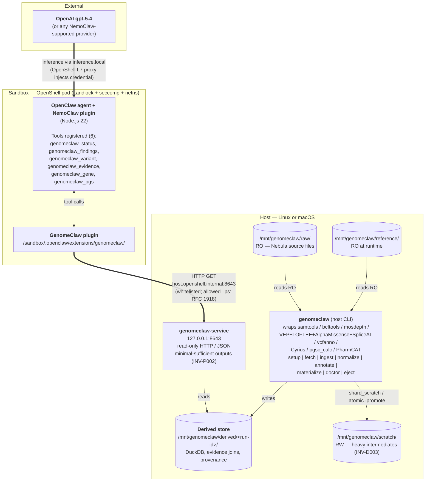
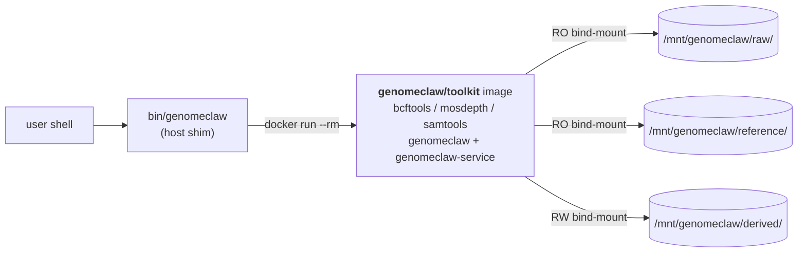
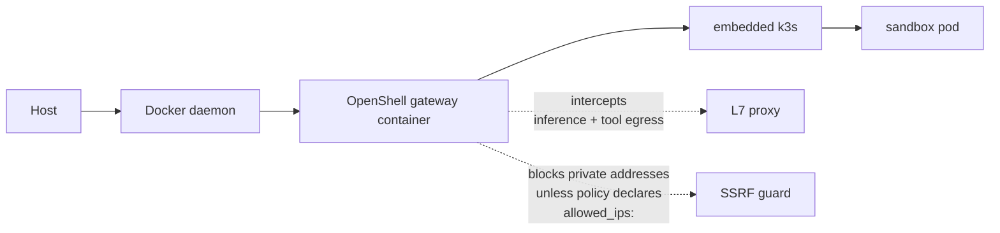

# GenomeClaw Architecture

**Status**: Living document
**Companion to**: [INVARIANTS.md](INVARIANTS.md), [grand-plan.md](grand-plan.md)
**Last Updated**: 2026-05-09

This document describes the **verified deployment shape** of GenomeClaw against the NemoClaw / OpenClaw / OpenShell stack. The host can be any Linux or macOS environment with Docker and NemoClaw — bioinformatics binaries ride inside the [`genomeclaw/toolkit`](#host-side-packaging--genomeclawtoolkit-docker-image) host image, not on the bare host. This document is the operational counterpart to the strategic [grand plan](grand-plan.md).

Every architectural choice here was confirmed by inspecting a running NemoClaw sandbox; the relevant NemoClaw / OpenShell / OpenClaw file paths are cited inline.

---

## Stack overview

GenomeClaw is **not** a fork of NemoClaw, OpenClaw, or OpenShell. It is composed of four artifacts that plug into those layers via their published extension surfaces:

| Artifact | Where it lives | What it is | Consumes |
|----------|---------------|------------|----------|
| **Host pipeline CLI** (`genomeclaw`) | inside the `genomeclaw/toolkit` Docker image, on the host (see [Host-side packaging](#host-side-packaging--genomeclawtoolkit-docker-image)) | Heavyweight bioinformatics pipeline (samtools/bcftools/mosdepth/VEP/Cyrius/`pgsc_calc`/PharmCAT, with `cyvcf2`/`pysam`/DuckDB Python on top). Reads raw artifacts read-only, writes derived store. | Raw FASTQ/BAM/VCF |
| **Host service** (`genomeclaw-service`) | inside the same `genomeclaw/toolkit` image; published as `127.0.0.1:8643` from the container | Small read-only HTTP/JSON API exposing minimal-sufficient queries against the derived store. | Derived store |
| **Host shim** (`bin/genomeclaw`) | host filesystem, on PATH | Thin Bash wrapper around `docker run --rm genomeclaw/toolkit:<tag> genomeclaw ...` with the canonical bind-mounts. Optional inner-loop bypass via `GENOMECLAW_NATIVE=1`. | n/a |
| **NemoClaw plugin** (`@genomeclaw/nemoclaw-plugin`) | inside OpenShell sandbox at `/sandbox/.openclaw/extensions/genomeclaw/` | TypeScript OpenClaw plugin registering agent-callable commands. Calls the host service over HTTP. | Host service |
| **OpenShell policy preset** (`genomeclaw.yaml`) | merged into NemoClaw blueprint at onboard time | Network egress rule whitelisting `host.openshell.internal:<port>` for the plugin's binaries. | n/a |

---

## Repo layout

GenomeClaw is structured as a workspace with two packages, one per execution domain. The `packages/` boundary **is** the deployment-domain boundary: `packages/toolkit/` is host-only and never installed in the sandbox image; `packages/nemoclaw-plugin/` is sandbox-only and never executed on the host (except for the build step).

```text
GenomeClaw/
├── README.md
├── CLAUDE.md
├── bin/
│   └── genomeclaw             Host shim (docker run wrapper); GENOMECLAW_NATIVE=1 bypass
├── docs/
│   ├── reference/
│   │   ├── INVARIANTS.md           Canonical INV-xxx rules
│   │   ├── grand-plan.md           Strategic vision
│   │   └── architecture.md         (this file)
│   └── plans/                      Per-feature plans (CLAUDE.md, templates/, active/, completed/)
├── .claude/
│   └── agents/                     Specialized subagent guides
├── .github/workflows/
│   └── test.yml                    Two jobs: host-venv pytest + ruff; toolkit-image build + needs_bio
└── packages/
    ├── toolkit/                    HOST-SIDE — Phase 1 scaffolding landed
    │   ├── pyproject.toml
    │   ├── uv.lock
    │   ├── Dockerfile              Multi-stage `genomeclaw/toolkit` image (bioconda + uv)
    │   ├── .dockerignore
    │   ├── src/genomeclaw_toolkit/
    │   │   ├── cli.py              `genomeclaw` entry point
    │   │   ├── prep/               ingest|normalize|annotate|materialize|cyp2d6-call|pgs-compute
    │   │   ├── service/            FastAPI host service (read-only)
    │   │   └── schemas/            finding / evidence / provenance / coverage_qc / pgs_scores
    │   └── tests/                  unit, integration, provenance, determinism, privacy, evidence, reports, invariants
    └── nemoclaw-plugin/            SANDBOX-SIDE — scaffolding in place
        ├── README.md
        ├── package.json
        ├── tsconfig.json
        ├── openclaw.plugin.json    plugin manifest + configSchema
        ├── policy-preset.yaml      OpenShell network policy preset
        ├── src/index.ts            plugin entrypoint (registers tools, HTTP client)
        └── sandbox/Dockerfile      bake-in image consumed by `nemoclaw onboard --from`
```

The two packages share `docs/reference/INVARIANTS.md` and the planning protocol. They are kept separable so a future split into two repositories is cheap (see [grand-plan.md](grand-plan.md#decisions-deferred)).

---

## Layered diagram



---

## Components — per-package responsibilities

### 1. Host pipeline CLI — `genomeclaw`

**Lives**: host process, no sandbox. Shipped as the `genomeclaw/toolkit` Docker image alongside its pinned bioinformatics binaries (see [Host-side packaging](#host-side-packaging--genomeclawtoolkit-docker-image)).
**Implementation**: Python (driven by ecosystem: `cyvcf2`, `pysam`, DuckDB Python bindings, PharmCAT). Wraps the bioinformatics tools that live alongside it in the image.
**Responsibility**: ingest → normalize → filter → annotate → materialize, plus per-Q7 **`mosdepth`** (per-gene mean coverage from BAM/CRAM, materialized into the `coverage_qc` table), per-Q5 **VEP + LOFTEE + AlphaMissense + SpliceAI + vcfanno** annotation (with **MANE Select** transcript pinning; HGVSc and HGVSp emitted server-side, never constructed by the LLM), per-Q6 **Cyrius** (CYP2D6 diplotype call from BAM/CRAM, fed into PharmCAT's outside-call interface), per-Q5 **`bcftools stats`** summary written into `manifest.json` under `qc.bcftools_stats`, and per-Q8 **`pgsc_calc`** (PRS computation against PGS Catalog scoring weights, materialized into the `pgs_scores` table). Reads from `/mnt/genomeclaw/raw/` and `/mnt/genomeclaw/reference/`; writes to `/mnt/genomeclaw/derived/<run-id>/` with full provenance columns.
**Subcommand surface** (per [MVP spec](../plans/active/mvp/spec.md) Q5–Q8 + Phase 2/4/6 deliverables): pipeline subcommands `fetch`, `ingest`, `normalize`, `annotate`, `materialize`, plus Phase-6-owned `cyp2d6-call` and `pgs-compute`. Host-environment subcommands (shipped via the [completed cram-scratch-strategy plan](../plans/completed/cram-scratch-strategy/)) auto-route host-native (no docker): `setup` (interactive one-time external-drive layout), `doctor` (read-only host-side diagnostic — existence + write-probe of the four canonical subdirs, `_scratch/setup.log` surface, colima version + status), `eject` (refuses if a toolkit container is running, then `colima stop` + `diskutil eject`).
**Why host-side**: `INV-D002`. Bioinformatics tools are heavy, host-native, and must never be reachable from the agent.

### 2. Host service — `genomeclaw-service`

**Lives**: host process, listens on `127.0.0.1:8643` by default. Runs inside the same `genomeclaw/toolkit` image as `genomeclaw`, with `127.0.0.1:8643:8643` published from the container.
**Implementation**: Python (FastAPI/Uvicorn or similar) — TBD in toolkit phase.
**Responsibility**: read-only HTTP/JSON API serving queries against the most recent derived store run. Endpoints (initial set):

- `GET /v1/health` — liveness + active run-id + schema version + annotation source versions.
- `GET /v1/findings` — scoped findings list (summary class). Query parameters:
  - `category` (one of `clinical-actionable | clinical-non-actionable | lifestyle | mixed`).
  - `genes` — **repeated query parameter** for multi-gene filter (`?genes=CYP1A2&genes=ADORA2A`); typed `list[str]` server-side.
  - `drugs` — **repeated query parameter** for drug-keyed PGx filter (`?drugs=clopidogrel`); typed `list[str]`.
  - `limit` — integer, 1–200.
  - All four are optional; an empty list is rejected with a clear error.
- `GET /v1/findings/{id}` — single finding with bound evidence references.
- `GET /v1/variants` — scoped variant query (summary class). Same `genes` / `rsids` repeated-query-parameter shape as `/v1/findings`.
- `GET /v1/variants/{key}` — single variant lookup by canonical key (rsid or `chr-pos-ref-alt`).
- `GET /v1/evidence/{ref}` — evidence record fetch.
  - Recognized non-variant-keyed reference forms (per MVP spec Q9 / `INV-E001`): `gene_note:<gene>` (resolves to `reference/curated_notes/<gene>.md`), `topic:<topic>` (resolves to `reference/curated_notes/topics/<topic>.md`; e.g., `topic:hard-genes` per Q7 / Q9). Variant-keyed forms (ClinVar IDs, gnomAD records, PMIDs, internal record IDs) are unchanged.
- `GET /v1/provenance/{run-id}` — provenance envelope for a run.
- `GET /v1/gene/{symbol}` — gene-level facts (per MVP spec Q7): `{top_user_variants, gene_loeuf, omim_disease, omim_inheritance, mean_coverage, low_coverage_exons}`. `mean_coverage` is a scalar (number, scaled to 1× depth); `low_coverage_exons` is a list of exon IDs whose mean depth fell below a configurable threshold (default 10×). Defaults to active run.
- `GET /v1/pgs/{trait}` — PRS results (per MVP spec Q8): `{percentile_in_user_ancestry, raw_score, source_pgs_id, study_population, calibration_warning}`. `trait` is one of the three initial traits (CAD, T2D, breast or prostate cancer in v0). Defaults to active run.

(Per MVP spec Q3 — Decision Taken: there is no `/v1/report` endpoint. Report-shaped responses are assembled by the agent from `/v1/findings` + `/v1/health` + its training.)

**Output shape**: minimal-sufficient by default (`INV-P002`). A future `?class=bulk` opt-in is reserved but not enabled in v0. Per MVP spec Q4: array-shaped query parameters use the FastAPI repeated-query-parameter convention (`?genes=A&genes=B`), not comma-separated strings.

### 3. NemoClaw plugin — `@genomeclaw/nemoclaw-plugin`

**Lives**: inside OpenShell sandbox at `/sandbox/.openclaw/extensions/genomeclaw/`.
**Implementation**: TypeScript, OpenClaw plugin SDK (`openclaw/plugin-sdk`), Node.js 22.
**Responsibility**: registers agent-callable tools (per MVP spec Q2 — `registerTool` with TypeBox parameter schemas) and proxies them to the host service. Re-shapes responses to enforce the plugin-level part of `INV-P002`. Never reads files; never spawns bioinformatics subprocesses.
**Tool surface** (six tools, per MVP spec Q3 / Q7 / Q8):

| Tool | Parameters (TypeBox) | Endpoint | Output class |
|------|----------------------|----------|--------------|
| `genomeclaw_status` | `Type.Object({})` | `/v1/health` | `summary` |
| `genomeclaw_findings` | `category` enum + `genes: string[]` + `drugs: string[]` + `limit` | `/v1/findings` | `summary` |
| `genomeclaw_variant` | `key: string` | `/v1/variants/{key}` | `summary` |
| `genomeclaw_evidence` | `ref: string` (variant-keyed or `gene_note:<gene>` / `topic:<topic>` per Q7 / Q9) | `/v1/evidence/{ref}` | `summary` |
| `genomeclaw_gene` *(per Q7)* | `gene: string` | `/v1/gene/{symbol}` | `summary` |
| `genomeclaw_pgs` *(per Q8)* | `trait: string` | `/v1/pgs/{trait}` | `summary` |

**Configuration**: read from `api.pluginConfig`, sourced from `plugins.entries.genomeclaw.config.*` in the sandbox's `openclaw.json`. Mutable post-install via host-side `nemoclaw <sandbox> config set --key plugins.entries.genomeclaw.config.<dotpath> --value '...' --restart`.

### 4. OpenShell policy preset — `genomeclaw.yaml`

**Lives**: `packages/nemoclaw-plugin/policy-preset.yaml`, intended to be merged into NemoClaw's blueprint at onboard time alongside other presets.
**Modeled on**: [`nemoclaw-blueprint/policies/presets/local-inference.yaml`](https://github.com/NVIDIA/NemoClaw/blob/main/nemoclaw-blueprint/policies/presets/local-inference.yaml) — the canonical "sandbox reaches host service" pattern.
**Responsibility**: tells the OpenShell L7 proxy that the plugin's Node binary may reach `host.openshell.internal:8643` for specific GET paths only. Includes the `allowed_ips:` RFC 1918 allowlist required to bypass OpenShell's SSRF guard for private host-gateway addresses.

---

## Data layout

```text
/mnt/genomeclaw/
├── raw/         (RO — Nebula FASTQ/BAM/CRAM/VCF; bind-mount-RO at every container entry)
├── reference/   (RO at runtime; written only by `genomeclaw refs fetch` and `pgsc_calc fetch-weights`)
│   ├── grch38/
│   ├── clinvar/
│   ├── gnomad/                          (per Q5 — gnomAD v4 with per-population AFs)
│   ├── dbsnp/
│   ├── vep_cache/                       (per Q5 — VEP + LOFTEE + AlphaMissense + SpliceAI data files)
│   ├── pgs_catalog/                     (per Q8 — PGS Catalog scoring weights for the three initial traits)
│   └── curated_notes/                   (per Q9 — host-side, user-authored markdown notes)
│       ├── lct.md
│       ├── cyp1a2.md
│       ├── adora2a.md
│       ├── aldh2.md
│       ├── adh1b.md
│       ├── apoe.md
│       ├── mthfr.md
│       └── topics/
│           └── hard-genes.md            (per Q7 — systematic short-read-WGS blind-spot caveat)
├── derived/     (RW; pipeline writes <run-id>/ here — authoritative)
│   └── <run-id>/
│       ├── manifest.json                (run identity, schema version, tool versions, qc.bcftools_stats per Q5)
│       ├── variants.duckdb              (canonical variants table + Q5 annotation columns + coverage_qc + pgs_scores tables)
│       ├── cyp2d6_diplotype.json        (per Q6 — Cyrius diplotype, consumed by PharmCAT outside-call)
│       ├── annotations/
│       ├── evidence/
│       └── provenance.json
└── _scratch/    (RW; ephemeral scratch — bcftools sort -T, DuckDB temp_directory,
                  Nextflow -work-dir, generic $TMPDIR. Sharded under
                  <step>/<run-id>/ via shard_scratch(...); cleaned on context-
                  manager exit. Safe to delete between runs. Nothing here is
                  authoritative. See "Storage planning" below.)
```

Whether `coverage_qc` and `pgs_scores` are separate `.duckdb` files or tables inside `variants.duckdb` is a Phase-4/6 implementation choice; this layout sketch keeps the option open. Each new derived artifact inherits the seven canonical provenance columns (`INV-R001`).

Raw and reference are mounted read-only at the OS layer. Derived and `_scratch` are the writable surfaces — `derived/` is authoritative (provenance-tracked, never deleted by the toolkit), `_scratch/` is ephemeral (the toolkit may delete contents at any time; users may `rm -rf` between runs without losing anything that matters). The structural separation is enforced by `INV-D003`: heavy intermediates target `_scratch/`, never `derived/`, and final artifacts cross the boundary only via `atomic_promote(src, dst)` (copy + fsync + within-FS rename + fsync parent) so derived/ never observes a partial file. The sandbox sees **none** of these paths directly.

---

## Host-side packaging — `genomeclaw/toolkit` Docker image

*Decision Taken 2026-05-08: package the toolkit + its bioinformatics binaries as a single host-side Docker image.* Both `genomeclaw` and `genomeclaw-service` ship inside one image (`genomeclaw/toolkit:<tag>`) alongside their pinned native dependencies (`bcftools`, `mosdepth`, `samtools`/`htslib`, and later VEP / Cyrius / `pgsc_calc` / PharmCAT). This keeps tool versions reproducible, removes per-host install drift (Linux vs. macOS, brew vs. apt vs. conda), and lets CI run the same image the user runs.



**What's inside the image**: the toolkit Python venv + the small native binaries listed above. **What's not**: the heavy reference data — VEP cache, AlphaMissense, gnomAD slices, PGS Catalog scoring weights — which all live on the bind-mounted `/mnt/genomeclaw/reference/` volume so the image stays small and the data stays user-owned.

**Bind-mount discipline** (four canonical mounts):
- `/mnt/genomeclaw/raw` — `:ro` (preserves `INV-D001`).
- `/mnt/genomeclaw/reference` — `:ro` at runtime; the only paths that may write here are `genomeclaw refs fetch ...` and `pgsc_calc fetch-weights ...`, each invoked deliberately.
- `/mnt/genomeclaw/derived` — `:rw`. Authoritative output: per-run `<run-id>/` directories with provenance. The toolkit never deletes anything here.
- `/mnt/genomeclaw/scratch` — `:rw`. Ephemeral scratch — temp files, `bcftools sort -T`, DuckDB `PRAGMA temp_directory`, Nextflow `-work-dir`, generic `$TMPDIR`. **Nothing inside `_scratch/` is authoritative.** The toolkit may delete contents at any time; users may safely `rm -rf $GENOMECLAW_SCRATCH_DIR/*` between runs. The image's `ENV TMPDIR=/mnt/genomeclaw/scratch/tmp` makes any subprocess that respects `$TMPDIR` write here automatically. Per-step shards live under `<scratch>/<step>/<run-id>/<shard>/` and are allocated via the `shard_scratch(...)` context manager (cleanup on `__exit__`, including on exception, so zombie scratch dirs cannot accumulate). The shim auto-detects the canonical default at `<drive>/genomeclaw/_scratch` once `genomeclaw host setup` has run, and refuses to start if `GENOMECLAW_SCRATCH_DIR` resolves under `GENOMECLAW_DERIVED_DIR` — scratch and authoritative outputs must live on separate trees (`INV-D003`).

**Host shim**: `bin/genomeclaw` (and later `bin/genomeclaw-service`) wraps `docker run` so the user types the same command across environments. The shim is a developer convenience — invoking `docker run --rm genomeclaw/toolkit:<tag> genomeclaw ...` directly is equivalent.

**Invariant impact**:
- `INV-D002` is unaffected — the prohibition is on the **sandbox** image (Phase 5), not the host image.
- `INV-R001` is strengthened — `manifest.json` records the image digest in addition to per-tool versions, so a derived store always names the exact image that produced it. The four-mount discipline also keeps scratch out of `derived/<run-id>/`, so authoritative outputs are never confused with temp files.
- `INV-D001` is enforced at the OS layer by the `:ro` mount on `raw/` rather than by chmod alone.
- `INV-D003` (Heavy Scratch Is Separated From Authoritative Outputs) is enforced at three layers: (1) the shim refuses to start when `GENOMECLAW_SCRATCH_DIR` is nested under `GENOMECLAW_DERIVED_DIR`; (2) `shard_scratch(...)` and `atomic_promote(...)` are the only sanctioned APIs orchestrators use to allocate scratch and promote artifacts; (3) `assert_derived_writable` and `assert_scratch_writable` run at every orchestrator entry.

### Storage planning (where to put each mount)

The four mounts have very different lifecycles and sizing profiles. On hardware with limited local SSD (e.g. 30 GB free, multi-tens-of-GB CRAMs on an external drive — the project owner's setup) the user must place them deliberately, or a single `pgsc_calc` Nextflow run can fill the engine VM disk and crash mid-pipeline.

| Mount | Lifecycle | Typical size (one user, 30× WGS) | Recommended placement when local SSD is small |
|-------|-----------|----------------------------------|------------------------------------------------|
| `raw/` | Permanent (the source-of-truth artifacts) | 50–80 GB (FASTQ + BAM/CRAM + VCF) | External drive (USB / NAS — read sequentially, slow tier OK) |
| `reference/` | Slowly versioned (annotation downloads) | 50–100 GB once VEP cache + AlphaMissense + gnomAD slices + PGS Catalog land | External drive |
| `derived/` | Per-run, additive (each `<run-id>/` is a new dir) | 1–2 GB per run; many runs coexist comfortably | Local SSD acceptable; external also fine |
| `_scratch/` | Ephemeral (deleted at user's discretion) | Up to multi-tens-of-GB during `pgsc_calc` Nextflow runs; multi-hundreds-of-GB for CRAM-scale variant calling | External drive — physically separated from `derived/` per `INV-D003` |

**Lifetime check**: `du -sh /mnt/genomeclaw/{raw,reference,derived,scratch}` (or, on the host, the user's chosen paths).

The canonical onboarding path on macOS Sequoia is `bin/genomeclaw host setup` — one interactive command that detects the external drive, validates the Nebula deliverable, formats a dedicated APFS partition named `Genome_Work`, lays out `<drive>/genomeclaw/{raw,reference,derived,_scratch}/`, copies the Nebula files in with per-file SHA256 verification, and edits `~/.colima/default/colima.yaml` so the engine VM can see the partition. After `setup` completes, the shim auto-detects the canonical layout — no env vars needed. For non-Sequoia hosts or non-canonical topologies the four env vars (`GENOMECLAW_RAW_DIR`, `GENOMECLAW_REF_DIR`, `GENOMECLAW_DERIVED_DIR`, `GENOMECLAW_SCRATCH_DIR`) override the auto-detected defaults.

`bin/genomeclaw host doctor` is the read-only diagnostic — host-native, no docker — for the layout the user can fix. It checks each of the four canonical subdirs (existence + host-write probes for the writable ones), reads `_scratch/setup.log` for the most recent `setup_completed` event, and surfaces colima version + status. Default text output, `--json` for scripts, exit 0 iff every check passes.

`bin/genomeclaw host eject` cleanly stops colima and `diskutil eject`s the drive — refusing if a toolkit container is still running, with a `--force` escape hatch for zombie containers. Run before disconnecting the external drive; a yank during a live pipeline corrupts the in-flight run (APFS journals back cleanly on next mount, but the run is lost).

**Engine VM file-sharing (macOS Sequoia + colima 0.9.1, verified 2026-05-08)**: bind-mounts only work for paths the engine VM can see. The actual behavior is more nuanced than the upstream docs suggest:

- `$HOME` is shared by **default on first VM creation**, but **`colima start --mount X:w` on a later run replaces the persisted mounts list rather than appending to it** — adding an external drive that way silently drops `$HOME` and makes `~/GitRepos`, `~/Documents`, etc. invisible inside the engine VM. The fix is to edit `~/.colima/default/colima.yaml` directly and list every path explicitly under `mounts:`.
- Even with `writable: true` set, `$HOME` mounts on Sequoia VZ.framework virtiofs are **read-only inside the container** unless the user grants Full Disk Access to `limactl` in System Settings → Privacy & Security. External drives under `/Volumes/...` are not affected by this gate. The simplest workaround for users who haven't granted that permission: put all four GenomeClaw mounts on the external drive.
- Other paths (notably the system temp dir under `/var/folders/...`) are not shared at all by default. `mktemp -d` on the host produces paths that are invisible inside the container, which is why test fixtures use `~/.genomeclaw-test/...` instead.

A working `~/.colima/default/colima.yaml` for a typical USB-attached setup:

```yaml
mounts:
  - location: /Users/<your-username>
    writable: true
  - location: /Volumes/MyUSB
    writable: true
```

After editing, `colima stop && colima start`. (Docker Desktop has the same idea under Settings → Resources → File sharing.)

**Cleanup discipline**: `rm -rf $GENOMECLAW_SCRATCH_DIR/*` between runs is normal hygiene — nothing inside `_scratch/` survives across the lifetime of a pipeline run by design. `derived/` is never deleted by the toolkit; the user prunes old `<run-id>/` directories manually when they want to. `raw/` and `reference/` are user-managed.

---

## Network topology (verified)



Three paths cross trust boundaries:

1. **Inference** (sandbox → cloud): plugin/agent → `https://inference.local/...` → OpenShell L7 proxy → OpenAI (or other configured provider). API keys never enter the sandbox; they're injected at the proxy.
2. **Host service** (sandbox → host): plugin → `http://host.openshell.internal:8643/v1/...` → Docker bridge → host's `127.0.0.1:8643`. Whitelisted by the GenomeClaw policy preset.
3. **PGS Catalog scoring weights fetch** (host → catalog): `pgsc_calc fetch-weights` → `https://www.pgscatalog.org/...` (HTTPS). Host-side, deliberate, opt-in only — the user invokes the subcommand once per added trait (per MVP spec Q8). **No genomic data traverses this boundary; only PGS scoring weights flow inbound.** Same discipline as `genomeclaw refs fetch --source clinvar`. The sandbox has no path to this egress; the policy preset does not need to allow it.

`host.openshell.internal` resolves to the Docker host (`172.17.0.1` or equivalent). Confirmed live in a NemoClaw sandbox:

```text
$ getent hosts host.openshell.internal
172.17.0.1      host.docker.internal host.openshell.internal
```

---

## Configuration flow

### Plugin install

The plugin is **image-baked**:

```bash
nemoclaw onboard --from ./packages/nemoclaw-plugin/sandbox/Dockerfile
```

The Dockerfile inherits from `ghcr.io/nvidia/nemoclaw/sandbox-base:latest`, copies the plugin into `/sandbox/.openclaw/extensions/genomeclaw/`, and runs `openclaw doctor --fix` to register it.

### Plugin config

Plugin config is **runtime-mutable** via host-side `nemoclaw <sandbox> config set --restart`. In-sandbox `openclaw config set` is intercepted because changes there don't survive a rebuild.

Example: change the host service URL without rebuilding the sandbox image:

```bash
nemoclaw <sandbox> config set \
  --key plugins.entries.genomeclaw.config.hostService.baseUrl \
  --value '"http://host.openshell.internal:8643"' \
  --restart
```

The plugin reads its config from `api.pluginConfig` at registration time; the keys live under `plugins.entries.genomeclaw.config.*` in the sandbox `openclaw.json`.

### Policy preset

The policy preset is selected during `nemoclaw onboard` (interactive) or applied via the host-side preset selection mechanism. The preset is checked into the repo at `packages/nemoclaw-plugin/policy-preset.yaml` so it can travel with the plugin source.

---

## Why this shape — invariant traceability

| Invariant | How this architecture enforces it |
|-----------|-----------------------------------|
| `INV-D001` | Raw artifacts are bind-mounted `:ro` at every container entry by [`bin/genomeclaw`](../../bin/genomeclaw); the in-container `preflight` module asserts `assert_raw_readonly()` on every orchestrator entry. Pipeline writes to a separate derived path. |
| `INV-D002` | Raw artifacts have no path into the sandbox at all — neither bind mount nor HTTP route. |
| `INV-D003` | Heavy intermediates target `/mnt/genomeclaw/scratch` (host-side `_scratch/`), structurally separated from `/mnt/genomeclaw/derived`. Three enforcement layers: (1) the shim refuses to start when `GENOMECLAW_SCRATCH_DIR` nests under `GENOMECLAW_DERIVED_DIR`; (2) `shard_scratch(...)` and `atomic_promote(...)` are the only sanctioned APIs orchestrators use to allocate scratch and promote artifacts; (3) `assert_derived_writable` and `assert_scratch_writable` run at every orchestrator entry. |
| `INV-E001` | The host service binds every emitted finding/observation to an evidence reference; the plugin forwards the reference verbatim. The evidence resolver accepts variant-keyed references (ClinVar IDs, gnomAD records, PMIDs, internal record IDs) **and** non-variant-keyed references: `gene_note:<gene>` (resolves to `reference/curated_notes/<gene>.md` per MVP spec Q9) and `topic:<topic>` (resolves to `reference/curated_notes/topics/<topic>.md`; e.g., `topic:hard-genes` per Q7). |
| `INV-P001` | Genomic source files never traverse any boundary; only minimal-sufficient JSON crosses to the agent. The PGS Catalog fetch path (per Q8) is host-side, deliberate, opt-in; only scoring weights flow inbound, never genomic data. |
| `INV-P002` | Three enforcement layers: host service shaping, plugin re-shaping, OpenShell policy + SSRF guard. **Six** plugin tools (per Q7 / Q8) each carry an `output_class` declaration; default is `summary`, which is what `genomeclaw_gene` and `genomeclaw_pgs` ship with. The plugin's binary is policy-denied any host or port other than the configured host service. |
| `INV-R001` | Derived stores carry provenance columns (run-id, source paths/hashes, tool versions). The host service exposes `/v1/provenance/{run-id}` so the agent can cite provenance. New derived tables `coverage_qc` (per Q7), `pgs_scores` (per Q8), and `cyp2d6_diplotype.json` (per Q6) inherit the seven canonical provenance columns. |
| `INV-C001` | Report tools render clinical-escalation markers from finding records; the host service's finding schema includes the marker as a structural field. Lifestyle findings cite a `gene_note:<gene>` evidence reference (per Q9); editing a curated note is a user-facing-copy change reviewed by the privacy-safety-reviewer agent per `INV-C001` v1.5. PRS findings (per Q8) carry `category: clinical-non-actionable` and no `clinical_escalation` marker; the `calibration_warning` string makes ancestry-normalization explicit. |

---

## Open / deferred questions

These are tracked in [grand-plan.md](grand-plan.md#decisions-deferred) under deferred decisions; revisit when the conditions are met.

| Open question | Why it's open | Revisit when |
|---------------|---------------|--------------|
| Whether OpenClaw plugin command handlers can return **structured JSON** (rather than text) to the agent | Investigation showed `PluginCommandResult` has only `text`/`mediaUrl` fields; v0 plugin encodes JSON inside the text field with a marker prefix | OpenClaw SDK exposes a structured-return API, or after live testing confirms text-encoded JSON is acceptable to the agent in practice |
| Whether `nodeHostCommands` (an internal OpenClaw SDK mechanism) could remove the host HTTP service | Mechanism exists in `openclaw/plugin-sdk/src/plugins/types.d.ts` but is undocumented for third-party use | After v1 ships and only if the host HTTP service becomes painful |
| Whether GenomeClaw needs platform support beyond what NemoClaw already provides | NemoClaw supports Linux, macOS, and WSL2 per its inference-options matrix; GenomeClaw inherits that envelope. Anything more specific is unclear until a deployment surfaces it | A second deployment surfaces a platform gap |

---

## Cross-references

- Repo layout / extension points: [`packages/nemoclaw-plugin/README.md`](../../packages/nemoclaw-plugin/README.md)
- Plugin manifest: [`packages/nemoclaw-plugin/openclaw.plugin.json`](../../packages/nemoclaw-plugin/openclaw.plugin.json)
- Policy preset: [`packages/nemoclaw-plugin/policy-preset.yaml`](../../packages/nemoclaw-plugin/policy-preset.yaml)
- Sandbox Dockerfile: [`packages/nemoclaw-plugin/sandbox/Dockerfile`](../../packages/nemoclaw-plugin/sandbox/Dockerfile)
- NemoClaw upstream architecture (for comparison): [`docs/reference/architecture.md` in NVIDIA/NemoClaw](https://github.com/NVIDIA/NemoClaw/blob/main/docs/reference/architecture.md)
