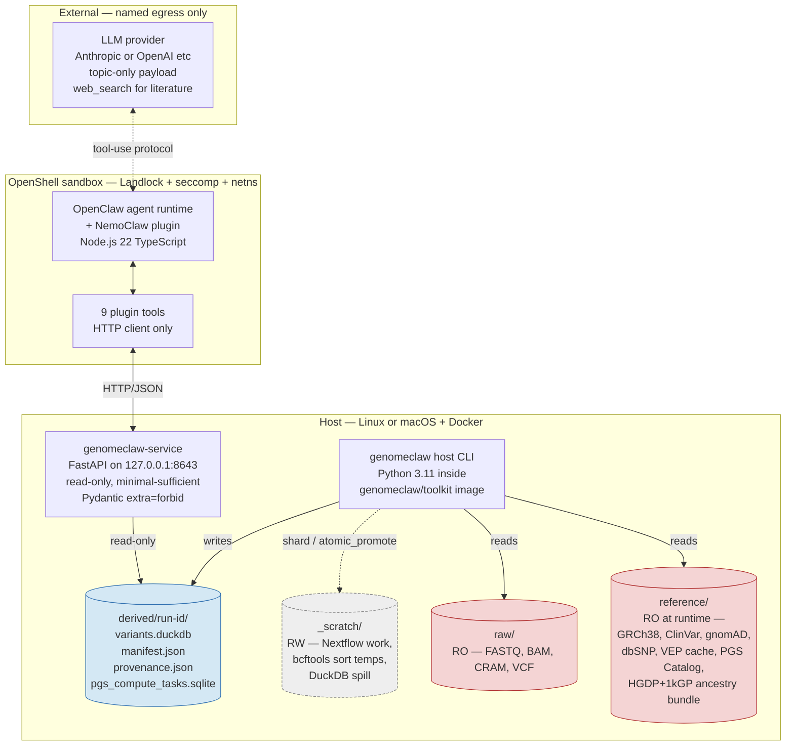
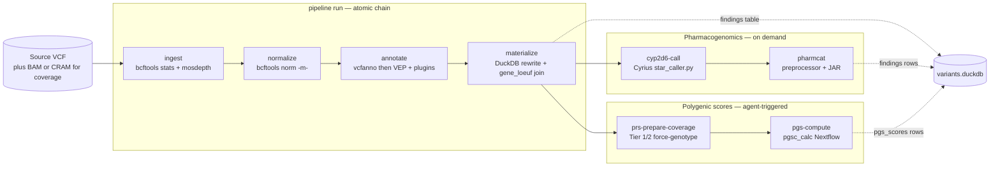
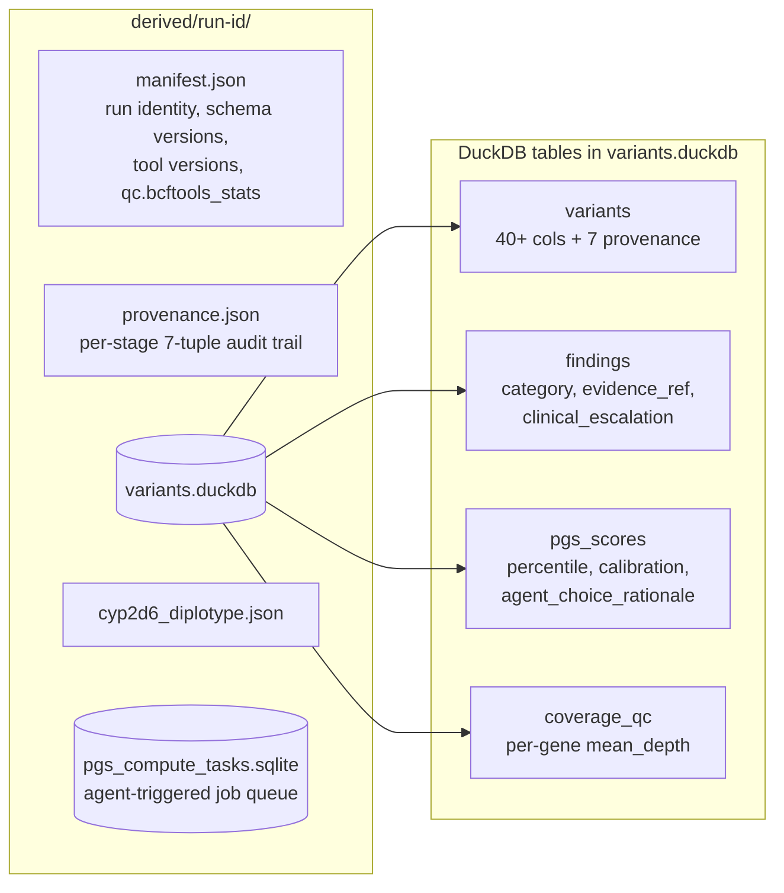
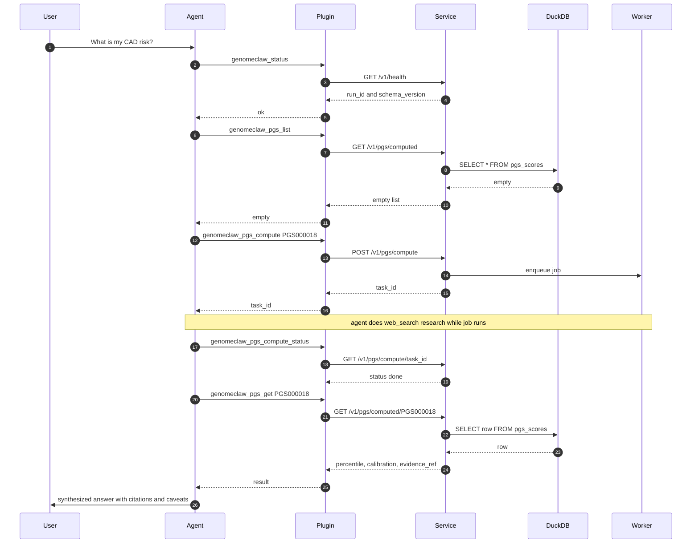
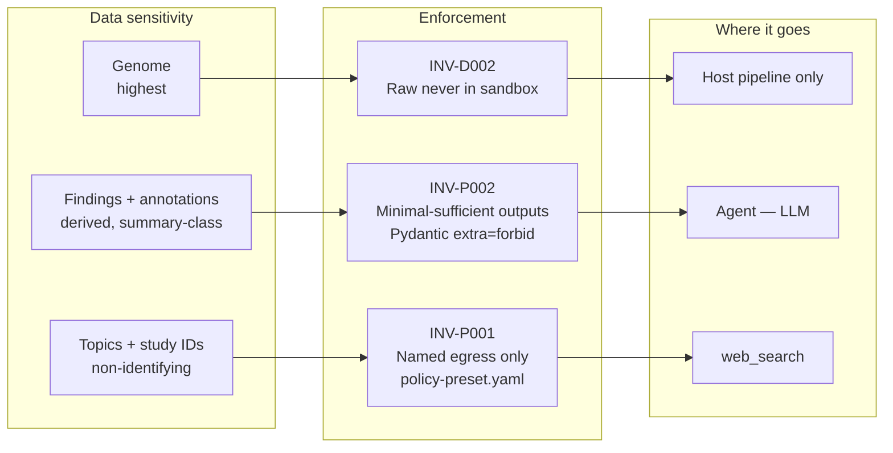

# GenomeClaw — Architecture Overview for Bioinformaticians

**Audience**: A bioinformatician asked to sanity-check what this AI agent actually does.
**Date**: 2026-05-25
**Scope**: End-to-end system shape — host pipeline, derived store, sandboxed agent, privacy boundary.
**Companion docs**: [architecture.md](../reference/architecture.md), [INVARIANTS.md](../reference/INVARIANTS.md).

---

## 1. One-paragraph summary

GenomeClaw is a privacy-first personal-genomics assistant built around a conventional bioinformatics pipeline (`bcftools` / `mosdepth` / `vcfanno` / `VEP+LOFTEE+AlphaMissense` / `Cyrius` / `PharmCAT` / `pgsc_calc`) whose **outputs are queried by an LLM agent through a read-only HTTP service**. Raw genomic files never leave the host; the agent runs in a sandboxed container, calls nine narrow tools against a FastAPI service on `127.0.0.1:8643`, and composes user-facing answers by joining DuckDB-resident annotations with literature it pulls via web search. Every derived row carries seven canonical provenance columns (`source_path`, `source_sha256`, `tool`, `tool_version`, `params_json`, `schema_version`, `created_at`) so any claim the agent makes can be traced back to a specific tool invocation on a specific input.

---

## 2. Deployment shape

Two execution domains, separated by a single HTTP seam.

Source: [docs/reference/architecture.md:76-115](../reference/architecture.md#L76-L115).

**Key boundary facts**
- Raw genomic files are **bind-mounted read-only** into the toolkit container and have no path into the sandbox (`INV-D001`, `INV-D002`).
- The sandbox container has **no bioinformatics tools installed** — only Node.js, the plugin, and an HTTP client. All `bcftools`, VEP, `pgsc_calc`, etc. live in the host-side `genomeclaw/toolkit` image.
- The agent's only network egress is `host.openshell.internal:8643` (whitelisted in `packages/nemoclaw-plugin/policy-preset.yaml`) plus the LLM provider and `web_search`. Anything else is denied at the OS level.

---

## 3. Storage layout

Four directories, each with a different lifecycle. See [README.md:57-64](../../README.md#L57-L64).

| Mount | R/W | Lifecycle | Typical size (30× WGS) |
|---|---|---|---|
| `raw/` | RO everywhere | Permanent source-of-truth; toolkit never writes | 50–80 GB |
| `reference/` | RO at runtime; written only by `refs fetch` | Slowly versioned (e.g. ClinVar monthly) | 50–100 GB once VEP cache + gnomAD + PGS Catalog are present |
| `derived/<run-id>/` | RW; pipeline writes per run | Additive; user prunes manually | 1–2 GB / run |
| `_scratch/<step>/<run-id>/` | RW; ephemeral | Wipe between runs is normal hygiene | Tens of GB during `pgsc_calc`; hundreds for CRAM-scale |

`_scratch/` is **physically separate** from `derived/` (`INV-D003`); a `shard_scratch()` → `atomic_promote()` pair is the only sanctioned crossing. The host shim refuses to start if `_scratch/` nests under `derived/`.

---

## 4. The pipeline — tool order and per-stage details

The host CLI exposes nine pipeline subcommands. `genomeclaw pipeline run` chains the first four; the remaining five are invoked on demand (typically by the agent for `pgs-compute`, or manually for `cyp2d6-call` / `pharmcat`).

### 4.1 `ingest` — orchestration entry point

[packages/toolkit/src/genomeclaw_toolkit/prep/ingest.py:63](../../packages/toolkit/src/genomeclaw_toolkit/prep/ingest.py#L63)

- Reads source VCF, computes SHA256, detects reference build.
- Runs **`bcftools stats`** (wrapper at [prep/_bcftools_stats.py](../../packages/toolkit/src/genomeclaw_toolkit/prep/_bcftools_stats.py)) → stores QC in `manifest.json` under `qc.bcftools_stats`.
- Runs **`mosdepth`** ([prep/_mosdepth.py:80](../../packages/toolkit/src/genomeclaw_toolkit/prep/_mosdepth.py#L80)) over the bundled `coverage_panel_default_v1.bed.gz` (per-gene panel; override with `--bed`). Populates the `coverage_qc` table (per-gene `mean_depth`, `low_coverage_exons`).
- Creates `derived/<run-id>/` and writes initial `variants.duckdb` + `manifest.json`.

### 4.2 `normalize`

[prep/normalize.py:63](../../packages/toolkit/src/genomeclaw_toolkit/prep/normalize.py#L63)

- **`bcftools norm -m-`** splits multi-allelics. Optional `-f <ref>` for left-alignment.
- Writes `normalized.vcf.gz` + `.tbi`; appends to `provenance.json`.

### 4.3 `annotate` — two-step join

[prep/annotate.py:70](../../packages/toolkit/src/genomeclaw_toolkit/prep/annotate.py#L70)

1. **`vcfanno`** ([prep/annotate_vcfanno.py:194](../../packages/toolkit/src/genomeclaw_toolkit/prep/annotate_vcfanno.py#L194)) overlays ClinVar + gnomAD exomes + dbSNP via tabix-indexed VCFs.
2. **`VEP`** ([prep/annotate_vep.py:137](../../packages/toolkit/src/genomeclaw_toolkit/prep/annotate_vep.py#L137)) with plugins:
   - **LOFTEE** — loss-of-function confidence
   - **AlphaMissense** — pathogenicity prior for missense
   - **MANE Select** transcript pinning
   - **HGVS** notation
   - Auto-skips with an explicit message if the VEP cache is absent (development convenience).
3. Final artifact: `annotated.vcf.gz`.

### 4.4 `materialize`

[prep/materialize.py:115](../../packages/toolkit/src/genomeclaw_toolkit/prep/materialize.py#L115)

- Reads `annotated.vcf.gz` with `cyvcf2`, parses VEP CSQ fields, joins gnomAD constraint TSV to attach `gene_loeuf`.
- Rewrites the canonical `variants` table in DuckDB (~30–40 columns; full schema in [packages/toolkit/src/genomeclaw_toolkit/prep/store.py:99-151](../../packages/toolkit/src/genomeclaw_toolkit/prep/store.py#L99-L151)).
- All seven provenance columns stamped per row.

### 4.5 `cyp2d6-call`

[prep/cyrius.py:125](../../packages/toolkit/src/genomeclaw_toolkit/prep/cyrius.py#L125), CLI at [_cli/commands/pipeline.py:1376](../../packages/toolkit/src/genomeclaw_toolkit/_cli/commands/pipeline.py#L1376).

- Wraps Illumina **Cyrius** (`star_caller.py`) — CYP2D6 star-allele diplotyping from BAM/CRAM.
- Emits `cyp2d6_diplotype.json` with diplotype + filter_status + raw Cyrius JSON + provenance envelope.

### 4.6 `pharmcat`

[prep/pharmcat.py:121](../../packages/toolkit/src/genomeclaw_toolkit/prep/pharmcat.py#L121), CLI at [_cli/commands/pipeline.py:1282](../../packages/toolkit/src/genomeclaw_toolkit/_cli/commands/pipeline.py#L1282).

- Two-stage subprocess: `pharmcat_vcf_preprocessor` → `pharmcat` JAR.
- Consumes the Cyrius diplotype as an "outside call" TSV — this is how PharmCAT integrates non-CPIC callers for CYP2D6.
- Inserts PGx-actionable rows into the `findings` table.

### 4.7 `pgs-compute` — the only stage the agent can trigger

[prep/pgs.py:284](../../packages/toolkit/src/genomeclaw_toolkit/prep/pgs.py#L284), CLI at [_cli/commands/pipeline.py:607](../../packages/toolkit/src/genomeclaw_toolkit/_cli/commands/pipeline.py#L607).

- Wraps the **pgsc_calc** Nextflow pipeline (PGS Catalog Calculator).
- Heavy dependency surface: Nextflow + JRE 17 + mamba + Docker-out-of-Docker (Nextflow spawns sibling containers; the host shim adds identical-path overlay mounts so paths resolve in both — see `INV-D005`/`INV-D006`).
- Continuous-ancestry calibration via `--run_ancestry` against the HGDP + 1000 Genomes ancestry bundle.
- Tier-1 / Tier-2 force-genotyping ([prep/coverage_fill.py](../../packages/toolkit/src/genomeclaw_toolkit/prep/coverage_fill.py)) recovers REF/REF sites missing from a variant-sites-only VCF — important because Nebula-style WGS VCFs only emit non-reference calls and naively scoring them against PGS Catalog weights inflates the missing-site fraction.
- Non-imputed-WGS overrides: `--min_overlap 0.5`, `--keep_ambiguous false`.
- Persists a row to `pgs_scores` with: `pgs_id`, `trait_label`, `percentile_in_user_ancestry`, `raw_score`, `study_population`, `calibration_warning`, and two audit columns required by `INV-A003`: `agent_choice_rationale`, `requested_for_question`.

### 4.8 What gets written where

The `findings` table is the agent-consumable surface — it carries `category ∈ {clinical-actionable, lifestyle, mixed}`, `gene_symbols` (array), `drugs` (array), and an `evidence_ref` that resolves through `GET /v1/evidence/{ref}` to ClinVar / PGS Catalog / PharmGKB identifiers.

---

## 5. Reference data preparation

[packages/toolkit/src/genomeclaw_toolkit/prep/fetch.py](../../packages/toolkit/src/genomeclaw_toolkit/prep/fetch.py) is a small download manager (4 workers, exponential-backoff retries, Content-Length and bgzip-EOF integrity checks) registering a `_LAYOUTS` table per source.

| Source | How obtained | Files |
|---|---|---|
| GRCh38 (`grch38`) | NCBI FTP, single file, `samtools faidx` post-hook | `.fa.gz` + `.fai` |
| ClinVar | NCBI FTP, MD5 sidecar verify | `.vcf.bgz` + `.tbi` |
| gnomAD exomes | gnomAD public, 24 per-chromosome files | `chr*.vcf.bgz` + `.tbi` |
| dbSNP | NCBI FTP, MD5 verify | `.vcf.bgz` + `.tbi` |
| VEP cache (`vep_cache`) | Manual staging (license / size) | Ensembl release dir |
| AlphaMissense | Manual staging | Plugin data under `vep_cache/Plugins/` |
| LOFTEE | Manual staging | Plugin data under `vep_cache/Plugins/` |
| gnomAD constraint | Manual staging | Per-release TSV for `gene_loeuf` join |
| PGS Catalog weights | On-demand by `pgsc_calc` | Per-PGS ID weights files |
| HGDP+1kGP ancestry | Manual staging | `HGDP+1kGP_ancestry_bundle.tar.zst` |

CLI: `genomeclaw refs fetch --source <name>` ([_cli/commands/refs.py:148](../../packages/toolkit/src/genomeclaw_toolkit/_cli/commands/refs.py#L148)).

---

## 6. The agent layer

The agent sees the genome as **nine HTTP tools**. It cannot read DuckDB directly, cannot list files, and cannot execute shell commands against `raw/` or `derived/`.

| Tool | Endpoint | Purpose |
|---|---|---|
| `genomeclaw_status` | `GET /v1/health` | First call — gateway health, active `run-id`, schema version |
| `genomeclaw_findings` | `GET /v1/findings` | Scoped findings list (filters: `category`, `genes`, `drugs`) |
| `genomeclaw_variant` | `GET /v1/variants/{key}` | Single-variant lookup by `chr-pos-ref-alt` |
| `genomeclaw_evidence` | `GET /v1/evidence/{ref}` | Resolve `clinvar:RCV…`, `pgs_catalog:PGS…`, `pharmgkb:PA…` |
| `genomeclaw_gene` | `GET /v1/gene/{symbol}` | Per-gene aggregate: variant count, mean coverage, low-coverage exons |
| `genomeclaw_pgs_list` | `GET /v1/pgs/computed` | List PRSs already computed for this user |
| `genomeclaw_pgs_get` | `GET /v1/pgs/computed/{id}` | One PRS detail incl. calibration warning + rationale |
| `genomeclaw_pgs_compute` | `POST /v1/pgs/compute` | Async PRS compute — requires `agent_choice_rationale` + `requested_for_question` |
| `genomeclaw_pgs_compute_status` | `GET /v1/pgs/compute/{task_id}` | Poll in-flight Nextflow job |

Tools defined in [packages/nemoclaw-plugin/src/index.ts](../../packages/nemoclaw-plugin/src/index.ts). Each is a TypeBox-schemaed wrapper with placeholder-arg guards (rejects literal `"undefined"`, `"null"` strings the LLM occasionally emits).

**Notable design choices**
- **No `genomeclaw_report` tool**: the agent composes report-shaped responses by synthesising `findings` + `evidence` + framing knowledge, rather than rendering a fixed template. This lets it calibrate depth and caution to the user's actual question.
- **Async PRS compute**: `pgsc_calc` takes ~5 minutes. The agent issues `POST /v1/pgs/compute` (returns `task_id`), polls `genomeclaw_pgs_compute_status`, and can answer other sub-questions in the meantime.
- **Two-column audit invariant (`INV-A003`)**: every agent-triggered compute persists `agent_choice_rationale` (why this PGS for this question) + `requested_for_question` (the user's verbatim question). This means the `pgs_scores` table is also a log of agent reasoning.

---

## 7. Privacy and provenance — what enforces what

| Invariant | What it guarantees | How |
|---|---|---|
| `INV-D001` | Raw artifacts never mutate | Read-only bind mounts; tests assert `mtime` |
| `INV-D002` | Raw files have no path into sandbox | Sandbox image contains no bio tools; policy forbids raw routes |
| `INV-D003` | `_scratch/` separated from `derived/` | Shim refuses nested mounts; `atomic_promote()` is the only crossing |
| `INV-D005/D006/T001` | DooD sibling containers see identical paths | Typed `SiblingMountablePath`; identical-path overlay mounts (postmortem-driven) |
| `INV-E001` | Every biomedical statement is evidence-linked | Findings carry `evidence_ref`; resolver tool exposes the underlying record |
| `INV-P001` | One named egress per destination | OpenShell network policy preset; single fetch site in plugin |
| `INV-P002` | Agent only sees summary-class data | Pydantic models with `extra="forbid"`; per-population gnomAD AFs held in DB but stripped from summary views |
| `INV-P003` | Secrets via stdin/env, never argv | Promoted from the Phase-2 onboard fix |
| `INV-R001` | Every derived row is reproducible | Seven canonical provenance columns; `manifest.json` records image digest + tool versions |
| `INV-R002` | No caching of degenerate results | Zero-record VCFs fail fast rather than poisoning the cache |
| `INV-C001` | Research/lifestyle scope, not clinical | Pydantic model validator on findings; agent system prompt; PRS decline rules (top-decile RR < 1.5×, no replication, ancestry-calibration failure) |
| `INV-A002` | Health interpretation runs at model's max reasoning | Agent system prompt §7 |
| `INV-A003` | Agent-triggered computes log rationale + question | Two audit columns on `pgs_scores` |

INVARIANTS.md is the canonical list (20 IDs in total). It is treated as a binding contract: future changes must cite the invariants they touch.

---

## 8. Things a bioinformatics reviewer should specifically check

The team would value scrutiny on these points in particular:

1. **`pgsc_calc` on non-imputed single-sample WGS** — `--min_overlap 0.5` and Tier-1/Tier-2 force-genotyping ([prep/coverage_fill.py](../../packages/toolkit/src/genomeclaw_toolkit/prep/coverage_fill.py)) are the deliberate deviations. Sanity-check whether the resulting overlap fractions and ancestry-calibration warnings are being interpreted correctly. Background: [docs/plans/completed/prs-non-imputed-wgs/](../plans/completed/prs-non-imputed-wgs/), [docs/plans/completed/prs-input-coverage-fill/](../plans/completed/prs-input-coverage-fill/).
2. **Allele orientation for PGS scoring** — strand handling against the reference FASTA is in [docs/plans/completed/pgs-allele-orientation/](../plans/completed/pgs-allele-orientation/). Specifically: are ambiguous (palindromic) SNPs being handled the way you'd expect for a personal-genomics interpretation?
3. **VEP plugin combination** — LOFTEE + AlphaMissense + MANE Select pinning. Plugin ordering and the canonical-transcript selection rules live in [prep/annotate_vep.py:137](../../packages/toolkit/src/genomeclaw_toolkit/prep/annotate_vep.py#L137).
4. **Cyrius → PharmCAT handoff** — CYP2D6 diplotype passed as an outside-call TSV. The handoff format is in [prep/pharmcat.py:121](../../packages/toolkit/src/genomeclaw_toolkit/prep/pharmcat.py#L121).
5. **The PRS decline rules** — `INV-C001 v1.7` declines PRSs with top-decile RR < 1.5×, no replication, ancestry-calibration failure, or no polygenic basis. Decline reasons are persisted to `pgs_scores.decline_reason` and shown to the user. Are these thresholds defensible for general-population research framing?
6. **Coverage QC panel** — the bundled `coverage_panel_default_v1.bed.gz` defines which genes get mean-depth + low-exon counts. Reviewer input on which genes should be in / out of the default panel is welcome.

---

## 9. What this system is *not*

- Not a variant caller. GenomeClaw consumes a VCF (or gVCF) and never re-aligns or re-calls.
- Not a clinical tool. `INV-C001` is enforced structurally (Pydantic validator + agent system prompt). Findings are framed as research / lifestyle / decision-support material, with clinical escalation markers on actionable items.
- Not a fork of `pgsc_calc`, VEP, PharmCAT, or Cyrius. It wraps published tools with conventional argv and reads their canonical outputs; tool-specific quirks live in dedicated wrapper modules ([prep/_bcftools_norm.py](../../packages/toolkit/src/genomeclaw_toolkit/prep/_bcftools_norm.py), [prep/_vep.py](../../packages/toolkit/src/genomeclaw_toolkit/prep/_vep.py), etc.) so the wrappers can be sanity-checked in isolation (`INV-T001`).

---

## 10. Where to read more

- [docs/reference/architecture.md](../reference/architecture.md) — the living deployment document.
- [docs/reference/INVARIANTS.md](../reference/INVARIANTS.md) — the 20 canonical rules.
- [docs/reports/bioinformatics-primer.md](bioinformatics-primer.md) — domain primer.
- [docs/reports/open-source-tool-alignment.md](open-source-tool-alignment.md) — why these specific tools.
- [docs/reports/prs-in-plain-english.md](prs-in-plain-english.md) — PRS choices and caveats.
- [docs/reports/agent-driven-prs-computation.md](agent-driven-prs-computation.md) — async compute design.
- [docs/reports/codebase-functional-review-2026-05-24.md](codebase-functional-review-2026-05-24.md) and [codebase-maintainability-review-2026-05-24.md](codebase-maintainability-review-2026-05-24.md) — internal reviews.
