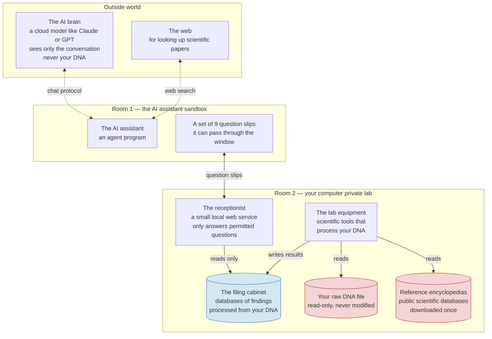
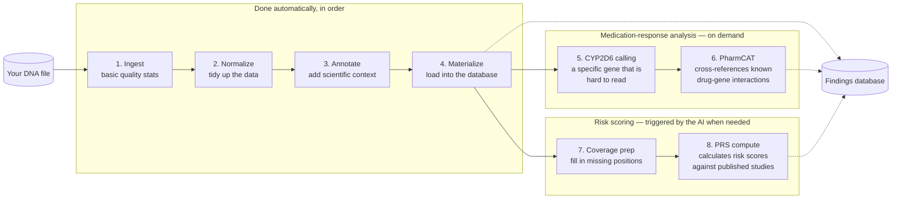
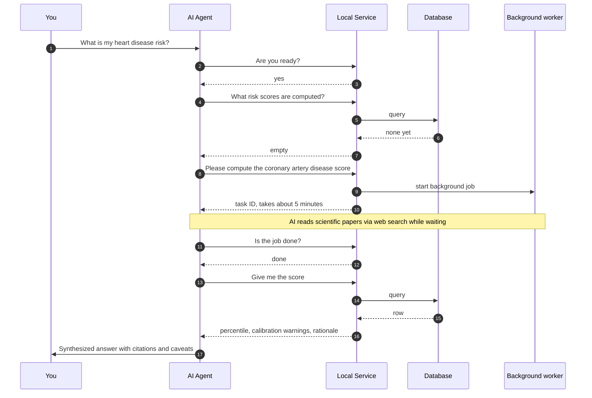
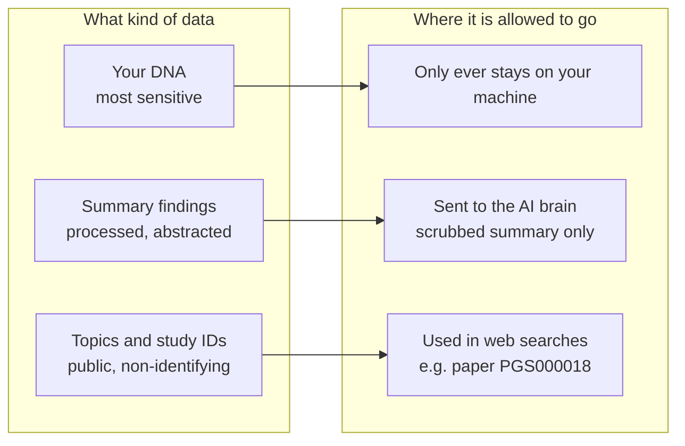

# GenomeClaw — Architecture Overview for Laypeople

**Audience**: A curious non-specialist — comfortable with software ideas, not assumed to know genomics or bioinformatics tooling.
**Date**: 2026-05-25
**Scope**: The same system as the [bioinformatician version](architecture-overview-for-bioinformaticians-2026-05-25.md), explained plainly.
**Companion docs**: [bioinformatics-primer.md](bioinformatics-primer.md) if you want to learn the underlying biology, [architecture.md](../reference/architecture.md) for the deep technical version.

---

## 1. One-paragraph summary

GenomeClaw is a personal-genomics assistant that runs **on your own computer**. You give it your DNA data file, and it lets you ask an AI chatbot questions about your genome — "What does my data say about caffeine metabolism?", "Is there anything in here I should pay attention to?" — without your DNA ever leaving your machine. Under the hood, it works like a small private laboratory: a pipeline of standard scientific tools chews on your raw data and turns it into a tidy database of "findings". A separate AI agent, locked in a sandbox, can only ask narrow questions of that database through a small set of pre-approved queries. Every answer the AI gives can be traced back to a specific row in the database, which can be traced back to a specific tool that produced it. The point is to give you the helpful, conversational interface of a modern AI assistant while keeping the privacy posture of running everything locally.

---

## 2. The big picture: two locked rooms

Think of GenomeClaw as a building with two rooms separated by a thick wall with a single small window.

**The two rooms**
- **Room 1 — the AI's sandbox.** This is where the AI assistant lives. It is deliberately stripped of everything except a chat client and a small list of 9 questions it's allowed to ask. It cannot read your files. It cannot run programs. It cannot reach the internet except for talking to its own brain and doing web searches for scientific literature.
- **Room 2 — your private lab.** This is where your DNA file actually sits, alongside all the scientific tools and the database of findings. None of this is exposed to the AI directly.

**The window** between them is a tiny local web service that only accepts a fixed menu of nine specific queries. The AI can ask "what findings do you have about gene X?" but it cannot say "show me everything" or "run an arbitrary search." The menu is deliberately narrow.

**Why this matters for privacy**
- Your raw DNA file is mounted **read-only** into the lab, so even the tools that process it can't accidentally corrupt it.
- The AI sandbox has **no path** to your raw DNA — not by misconfiguration, not by mistake, not by clever prompting. The sandbox image doesn't even contain the tools that could read it.
- Everything the AI's brain (the cloud LLM) sees is a small, scrubbed summary — never raw genetic data.

---

## 3. The four kinds of files on your disk

GenomeClaw keeps your data in four separate folders, each with a different purpose. The separation isn't decoration — it's a safety boundary.

| Folder | What's in it | Who can change it | How big (typical) |
|---|---|---|---|
| **`raw/`** | Your actual DNA file from your sequencing provider | **Nobody** — read-only everywhere | 50–80 GB |
| **`reference/`** | Public scientific databases (ClinVar, gene catalogs, etc.) downloaded once and reused | Only an explicit "download" command | 50–100 GB |
| **`derived/<run-id>/`** | The processed findings database, one folder per analysis run | The pipeline writes here | 1–2 GB per run |
| **`_scratch/`** | A workshop floor for temporary files the tools create while working | Wiped between runs | Tens to hundreds of GB temporarily |

The "workshop floor" and the "filing cabinet" are kept physically separate so a buggy tool can't accidentally write half-finished garbage into your trusted database of findings. The only way for a result to move from workshop to cabinet is through a single, atomic "promote this" operation.

---

## 4. The pipeline: turning a DNA file into a database of findings

When you first feed GenomeClaw your DNA, it runs your file through a chain of established scientific tools, each one doing one specific job. None of these tools is invented by the GenomeClaw team — they are the standard, peer-reviewed tools the genomics community already uses. GenomeClaw just orchestrates them and parks their outputs in a uniform place.

**The four "always run" steps**

1. **Ingest** — Read your DNA file and check basic quality. How many variants? What's the sequencing depth? Are there parts of important genes that weren't read well enough to trust?
2. **Normalize** — Standardize the way each genetic variant is written down. Different sequencers and labs format things slightly differently; this step puts everything in one consistent form.
3. **Annotate** — Compare each variant in your DNA against a stack of public databases:
   - **ClinVar** — known disease-associated variants
   - **gnomAD** — how common each variant is across human populations
   - **VEP with extra plugins** — predicts the likely effect on protein function (e.g., is this a harmless typo or a damaging mutation?)
4. **Materialize** — Load everything into a local DuckDB database (think: a fast, file-based SQL database) with a tidy schema the rest of the system can query.

**The "on demand" steps**

5. **CYP2D6 calling (Cyrius)** — One specific gene called CYP2D6 is famously hard to read because there are several near-copies of it in the genome that look almost identical. There's a specialist tool for it; we run it only when needed.
6. **PharmCAT** — Takes your gene variants and cross-references them against the curated knowledge base of "if you have this variant, this drug may behave differently for you" (CPIC guidelines).

**Risk scoring (only when the AI judges it relevant)**

7. **Coverage preparation** — Some DNA files only list places where you differ from the reference genome; they omit the (much larger) set of places where you match it. For risk-scoring math to work, those "matching" positions need to be filled back in.
8. **PRS compute** — Calculates a "polygenic risk score" by adding up the contribution of many variants to a trait (e.g., coronary artery disease, height) using formulas from published studies. The agent triggers this only when a user's question actually calls for it.

**Provenance: every row remembers where it came from**

Every single row of derived data carries seven extra columns recording:
- which input file it came from (and a cryptographic checksum of that file)
- which tool produced it
- which version of that tool
- the parameters the tool was run with
- the schema version of the database
- when it was created

So when the AI says "you have a variant of uncertain significance in BRCA2", you can drill down to "...which came from row 124,533 of variants.duckdb, which came from VEP version 110, run with these flags, on the file you uploaded last Tuesday with this checksum." Nothing is just floating in the system.

---

## 5. How the AI assistant actually works

Here's the crucial twist that makes GenomeClaw a privacy story rather than a "send your genome to OpenAI" story.

The AI assistant is a **frontier LLM** (e.g., Claude or GPT). It is good at conversation, reasoning, and knowing scientific context. But it is not allowed to see your DNA. Instead, it sees a menu of nine very specific things it's allowed to ask the local service:

| What the AI can ask | What it gets back |
|---|---|
| "Are you healthy and ready?" | Yes/no plus the active run ID |
| "What findings do you have, filtered by topic?" | A short list of summary rows |
| "Tell me about this one specific variant" | The single row, with its provenance |
| "What's the underlying evidence for this finding?" | The ClinVar / paper / database entry it's based on |
| "Give me a summary for gene X" | Variant count, coverage quality |
| "Which risk scores have you already computed?" | A list |
| "Show me one specific risk score" | The score, its calibration, the rationale |
| "Please compute this new risk score" | Starts the calculation in the background |
| "Is that calculation done yet?" | Status check |

That's the **entire** surface area. The AI cannot:
- read your raw DNA
- list files on disk
- run shell commands
- query arbitrary SQL
- send DNA data over the network
- bypass the menu

When the AI gets your question — say, "What does my data say about my risk for heart disease?" — it composes an answer by calling these tools in sequence, doing web searches for scientific context, and then writing a careful, cited response.

A few design choices worth highlighting:

- **No fixed report template.** The AI doesn't fill in a pre-defined form; it composes the answer to fit your actual question. A question about caffeine deserves a different response than a question about a serious disease risk.
- **Background calculation for risk scores.** Computing a polygenic risk score takes about 5 minutes. The AI starts it, then uses the wait time to do background research on the trait via web search, so by the time the score lands the AI can immediately put it in context.
- **The AI must log its reasoning.** Whenever the AI triggers a risk-score calculation, two extra columns are saved: *why it picked this specific score for this question*, and *the user's verbatim question*. So the database of risk scores is also a transparent log of what the AI was trying to do and why.

---

## 6. Privacy: which data is allowed to go where

Different kinds of data have different sensitivity levels, and the system enforces different rules for each.

**The three concentric circles**

- **Innermost — your DNA.** Stays on your machine, full stop. The architecture is built so that no path exists for this data to escape, even if the AI tries to ask for it.
- **Middle — summary findings.** These are the small, abstracted answers ("you have a variant in gene X with ClinVar classification Y"). These are what the AI sees and reasons about. They're scrubbed of fine-grained details that could re-identify you (e.g., per-population allele frequencies are kept in the database but stripped from what the AI receives).
- **Outermost — topics and public IDs.** Things like "user is asking about heart disease" or "PGS000018 is the score being looked up" — these are non-identifying scientific references and can safely be used in web searches.

**Things the system enforces (not just hopes)**

| Promise | How it's actually guaranteed |
|---|---|
| Raw DNA never changes | The file system mounts your DNA folder read-only; tests verify the file's timestamp doesn't change |
| Raw DNA never reaches the AI sandbox | The AI's sandbox doesn't contain the tools that could read DNA files; the network rules forbid the paths |
| Workshop scratch space stays separate from your trusted findings | The system refuses to even start if you try to nest one inside the other |
| Every claim has evidence behind it | Every finding row has a pointer to the underlying ClinVar entry / paper / database record |
| The AI can only reach approved network destinations | The sandbox's network rules whitelist only the AI brain, the local service, and web search; everything else is blocked at the operating-system level |
| The AI sees summaries, not raw data | The local service uses strict data-shape validation (Pydantic with `extra="forbid"`) that rejects any attempt to leak fields outside the approved summary |
| Risk scores log the AI's reasoning | Two extra audit columns are mandatory; calculations without them are rejected |
| Findings are framed as research, not clinical advice | A structural validator flags any finding wording that crosses into diagnosis/treatment language |

---

## 7. What GenomeClaw is *not*

To set expectations clearly:

- **Not a sequencer.** GenomeClaw does not read your DNA from a saliva sample. You need a DNA file from a sequencing provider (e.g., Nebula, Dante Labs, a clinical lab) as input.
- **Not a variant caller.** It assumes you already have a "VCF" file — a list of how your DNA differs from the reference. It does not re-do the upstream work of figuring out what your variants are.
- **Not a doctor.** This is enforced in the code, not just in the docs. Findings are framed as research and decision-support material. Anything that looks medically actionable is flagged for "please discuss with a clinician".
- **Not a fork of anyone's tool.** The heavy lifting is done by published, peer-reviewed tools (bcftools, VEP, PharmCAT, Cyrius, pgsc_calc). GenomeClaw wraps them, runs them in a consistent way, and tidies up their outputs into a unified database — but the science is theirs.
- **Not a cloud service.** It runs on your machine. The AI brain is in the cloud, but it only ever sees scrubbed conversations, never your DNA.

---

## 8. Why this design

Three things shape the architecture:

1. **Genomic data is durable and identifying.** Unlike a password, you cannot rotate your genome. Once exposed, it's exposed forever — and it identifies not just you but also your relatives. So the default has to be "stays on your machine."
2. **AI is genuinely useful for genomics interpretation.** Modern LLMs are good at synthesizing scientific context, framing uncertainty, and tailoring depth to the question. Giving up that capability would mean a much worse tool. So the question is *how* to use AI safely, not whether to.
3. **The honest answer is: a small, narrow API.** Rather than letting the AI poke around your data freely, GenomeClaw forces every interaction through a tiny menu of nine pre-approved queries. The AI is powerful, but its hands are tied to a specific set of safe moves.

That trade — frontier-grade AI behind a small, locked window — is the whole architectural idea.

---

## 9. Where to read more

- [bioinformatics-primer.md](bioinformatics-primer.md) — what VCF files, variants, and annotations actually are.
- [prs-in-plain-english.md](prs-in-plain-english.md) — what polygenic risk scores really mean (and don't mean).
- [architecture-overview-for-bioinformaticians-2026-05-25.md](architecture-overview-for-bioinformaticians-2026-05-25.md) — the technical version of this same document.
- [architecture.md](../reference/architecture.md) — the living deep-technical reference.
- [INVARIANTS.md](../reference/INVARIANTS.md) — the 20 binding rules the codebase commits to.
