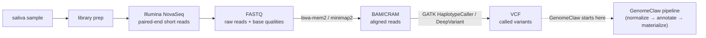

# Bioinformatics & Personal-Genomics Primer for GenomeClaw

**Status**: Reference report
**Created**: 2026-05-10
**Audience**: The project owner — a KTH Biotech grad refreshing genomics knowledge after ~10 years away
**Companion to**: [grand-plan.md](../reference/grand-plan.md), [architecture.md](../reference/architecture.md), [user-stories.md](../reference/user-stories.md)

---

## How to use this document

This is **not** a textbook. It is a working refresher pinned to the exact tools, file formats, databases, and biology that GenomeClaw touches. Each section names the project artifact it's relevant to (Theme letter, Phase number, file path, or tool) so you can jump from "what's this thing again?" to "where in the project does it appear?" without intermediate hops.

What you (probably) still remember from KTH: central dogma, transcription/translation, Mendelian inheritance, restriction enzymes, PCR, Sanger sequencing, basic population genetics. **What's changed in the last decade**: short-read WGS at $200, the ACMG/AMP framework, gnomAD-scale allele-frequency data, deep-learning variant effect predictors (AlphaMissense, SpliceAI), polygenic risk scores becoming clinically meaningful, and the maturation of PharmCAT-style automated PGx pipelines. That delta is what this document tries to close.

A reading order that mirrors a sequencing run, end to end:

1. [Genetics vocabulary refresher](#1-genetics-vocabulary-refresher)
2. [The sequencing pipeline: sample → VCF](#2-the-sequencing-pipeline-sample--vcf)
3. [Variant representation and normalization](#3-variant-representation-and-normalization)
4. [Reference genomes and transcripts](#4-reference-genomes-and-transcripts)
5. [Annotation: what does this variant *do*?](#5-annotation-what-does-this-variant-do)
6. [Population databases and clinical evidence](#6-population-databases-and-clinical-evidence)
7. [The ACMG/AMP framework and clinical actionability](#7-the-acmgamp-framework-and-clinical-actionability)
8. [Pharmacogenomics (PGx)](#8-pharmacogenomics-pgx)
9. [Polygenic risk scores (PRS)](#9-polygenic-risk-scores-prs)
10. [Coverage, false reassurance, and hard regions](#10-coverage-false-reassurance-and-hard-regions)
11. [The genes GenomeClaw actually surfaces](#11-the-genes-genomeclaw-actually-surfaces)
12. [Tooling glossary](#12-tooling-glossary)
13. [What changed since ~2015](#13-what-changed-since-2015)

---

## 1. Genetics vocabulary refresher

**Genome**: the complete DNA sequence — ~3.1 billion base pairs, distributed across 22 autosomes + X + Y + mitochondrial DNA. You inherit one copy from each parent (except the mitochondrial genome — maternal-only).

**Locus**: a specific position in the genome (e.g., `chr17:43,094,464`). A *gene* occupies a locus; a *variant* occupies a position within a locus.

**Allele**: one of the alternative DNA sequences possible at a locus. At a SNP locus where some humans have `A` and others have `G`, those are two alleles.

**Genotype**: the pair of alleles a person carries at a locus. For a biallelic SNP with alleles `A` and `G`:
- `A/A` (or `AA`) — homozygous reference
- `A/G` (or `AG`) — heterozygous
- `G/G` (or `GG`) — homozygous alternate

**Haplotype**: a set of alleles inherited together on a single chromosome. Important for genes like CYP2D6 where the *combination* of variants on one chromosome defines a "star allele" (`*1`, `*2`, `*4`, etc.) — see [§ 8](#8-pharmacogenomics-pgx).

**Diplotype**: the pair of haplotypes a person carries. Notation: `*1/*4` means one `*1` haplotype and one `*4` haplotype.

**Variant types** (what a single observation looks like in a VCF):

| Type | Example | Notes |
|------|---------|-------|
| **SNV** (single-nucleotide variant) | `A → G` | The most common; a SNP is an SNV that's also polymorphic in the population |
| **Indel** | `ATG → A` (deletion) or `A → ATG` (insertion) | Up to ~50bp by convention; longer ranges call into structural-variant territory |
| **MNV** (multi-nucleotide variant) | `AC → GT` | Rare; usually decomposed into adjacent SNVs |
| **CNV** (copy-number variant) | a 2kb region duplicated 3× | Hard to call from short reads; needs SV pipelines |
| **SV** (structural variant) | inversion, large deletion, translocation | Out-of-scope for v0 GenomeClaw — see [Decisions Deferred](../reference/grand-plan.md#decisions-deferred) |
| **Repeat expansion** | `(CAG)n` where `n` jumps from 20 to 50 | Causes Huntington's, Friedreich's, etc.; needs ExpansionHunter, deferred |

**Penetrance**: the probability that someone with a given genotype actually shows the phenotype. *BRCA1* pathogenic variants have high but not complete penetrance for breast cancer; many "predisposing" variants (e.g., APOE ε4 for Alzheimer's) have much lower penetrance.

**Expressivity**: the *severity* of the phenotype when it does manifest. Variable expressivity means different carriers of the same variant get different severities.

**Allele frequency (AF)**: how common an allele is in a population. A SNP at AF 0.30 is a polymorphism; an AF of 0.0001 is rare. AF varies massively across ancestries — *see [§ 6](#6-population-databases-and-clinical-evidence) on gnomAD*.

**Heterozygote / homozygote**:
- *Compound heterozygote* — two different pathogenic variants on the two chromosomes (one on each). Behaves recessively if both are LoF.
- *Carrier* — heterozygous for a recessive pathogenic variant; usually asymptomatic but can transmit it.

---

## 2. The sequencing pipeline: sample → VCF

A modern personal-genomics deliverable (Nebula 30× WGS, the user's input — see [user-stories.md § Story 1](../reference/user-stories.md)) goes through this pipeline. GenomeClaw consumes the **outputs** of this pipeline; it doesn't run the pipeline itself.



### File formats you will keep meeting

**FASTQ** — raw reads. Plain-text (gzipped), four lines per read:
```
@read_id
ACGTACGTACGT...   ← the bases
+
!''*((((***+...   ← per-base quality, Phred-encoded
```
Modern Nebula deliverables often skip FASTQ in the user package and ship CRAM directly, since CRAM losslessly contains the same information referenced against the genome (much smaller).

**SAM / BAM / CRAM** — alignment formats. Same content, three encodings:
- **SAM** — text. Human-readable, huge.
- **BAM** — binary. Compressed, indexed (`.bai`), the workhorse format for the past decade.
- **CRAM** — binary, reference-compressed. ~50% smaller than BAM because it stores only the differences from the reference. Indexed (`.crai`). Modern Nebula ships CRAM. *Requires the reference genome to decode.*

What's in an alignment record: read ID, reference position, CIGAR string (how the read aligns: matches, mismatches, indels, soft-clips), mapping quality, flags (paired? duplicate? secondary alignment?), the bases, the per-base qualities.

**VCF / gVCF** — variants relative to the reference.
- **VCF** — variant call format. One row per variant *position*; lists the reference allele, the alternate allele(s), the per-sample genotype, plus quality scores and filter flags. Header lines (`##`) declare what every column means.
- **gVCF** — genomic VCF. Includes *all* positions, not just variant ones. Crucial for distinguishing "I called the reference allele here" from "I had no coverage here" — the latter is a *false negative risk* a regular VCF can't represent.

A VCF row, simplified:
```
#CHROM  POS       ID         REF  ALT  QUAL  FILTER  INFO          FORMAT   SAMPLE
chr17   43094464  rs80357906 G    A    99    PASS    AF=0.00012    GT:DP    0/1:32
```
The user is `0/1` (heterozygous), the variant is rs80357906, depth at this position was 32×, filter status is PASS. A heterozygous BRCA1 SNV like this would be the start of a *finding* if ClinVar classifies it as P/LP.

**Index files** (`.bai`, `.crai`, `.tbi`, `.csi`) — let tools jump to a region without reading the whole file. Always present alongside their parent file. Generated by `samtools index` or `tabix`.

**Coverage / depth (DP)** — how many reads covered a given position. 30× WGS means the *average* across the genome is 30 reads per base, but the actual depth varies — some regions get 50×, some get 5× or 0×. The DP field on a VCF row is the per-position depth, and it's what `mosdepth` (Theme B / Q7) summarizes for the false-reassurance guardrail.

---

## 3. Variant representation and normalization

The same biological variant can be written multiple ways in a VCF. **Normalization** picks one canonical representation so that joining your VCF against ClinVar (which used its own canonicalization) actually matches up. Without it, you can have a pathogenic variant in your callset and a record for the same variant in ClinVar and miss the join.

The two normalization moves (`bcftools norm` does both):

**Left-alignment of indels.** In a homopolymer run (e.g., `AAAA`), a deletion of one `A` could be reported as deleting any of the four positions. Left-alignment forces the most-leftward representation. Without it, your `chr1:1000 AAAA → AAA` won't match ClinVar's `chr1:1000 AA → A`.

**Splitting multi-allelic sites.** A VCF row can list multiple ALT alleles (`REF=A; ALT=G,T`) — meaning two different SNVs at the same position. Almost every annotation tool wants one ALT per row, so you split this into two rows.

These steps are in [genomeclaw-prep normalize](../reference/architecture.md#1-host-pipeline-cli--genomeclaw-prep) for that reason.

### Variant identifiers

**Coordinate-based (`chr-pos-ref-alt`)**: unambiguous given a reference build, but build-dependent. `chr17-43094464-G-A` on GRCh38 is *not* the same locus as on GRCh37.

**rsID** (`rs80357906`): dbSNP's stable identifier. Build-independent — the same rsID points to the same biological variant across reference builds. Useful for paper-applicability checks ("does the user have the variant the paper studies?" — *see Story 5*).

**HGVS** (Human Genome Variation Society notation):
- **HGVSc** — coding-DNA reference, transcript-level: `NM_007294.4:c.5946delT`
- **HGVSp** — protein-level: `NP_009225.1:p.Ser1982ArgfsTer22`
- **HGVSg** — genomic-level: `NC_000017.11:g.43094464G>A`

HGVS is what clinicians use. ClinVar records carry HGVS. The MVP spec [Q5](../plans/active/mvp/spec.md) mandates server-side HGVS emission via VEP — the LLM **never constructs HGVS** because they're easy to get subtly wrong (and a wrong HGVS can refer to a different variant).

---

## 4. Reference genomes and transcripts

**Reference genome (a.k.a. reference build, assembly)**: a consensus sequence that everything else gets aligned to.

- **GRCh37 / hg19** (2009): the previous default. Many older tools, papers, and databases still use it.
- **GRCh38 / hg38** (2013, refined since): the modern default. **GenomeClaw starts here** ([Decisions Taken](../reference/grand-plan.md#decisions-taken)).
- **CHM13 / T2T-CHM13** (2022): the first complete telomere-to-telomere assembly. Closes the ~5–8% gaps in GRCh38, especially in centromeres and acrocentric short arms. Not the default yet because the annotation databases haven't all migrated.

A reference is a FASTA file (`grch38.fa`) plus an index (`.fai`) plus often a sequence-dictionary (`.dict`). Tools require it to interpret BAM/CRAM and to normalize VCFs.

**Transcripts and MANE Select.** Each gene has multiple transcripts (alternative splicing, alternative start sites). When you say "the variant is in exon 11 of *BRCA1*", *which* transcript's exon 11? Different transcripts number their exons differently.

**MANE (Matched Annotation from NCBI and EMBL-EBI) Select** is a single, agreed-upon "default" transcript per protein-coding gene — joint NCBI+Ensembl curation. Pinned in the MVP spec ([Q5](../plans/active/mvp/spec.md)) so every HGVS string GenomeClaw emits points at the same canonical transcript across runs and tools. Without this, your *BRCA1* variant might get HGVS notation against `NM_007294.4` today and `NM_007294.3` after a tool upgrade — silently breaking ClinVar joins.

---

## 5. Annotation: what does this variant *do*?

A normalized VCF is a list of differences from the reference. By itself it doesn't tell you that `chr17-43094464-G-A` knocks out *BRCA1* exon 11. Annotation is the layer that adds:

- **Consequence** — what the variant does to the gene (synonymous? missense? frameshift? splice donor?).
- **Predicted impact** — for missense variants, is the amino-acid change likely deleterious?
- **Splicing impact** — for variants near splice sites, do they disrupt splicing?
- **Population frequency** — is this rare or common?
- **Clinical interpretation** — has anyone already classified this variant in a clinical context?

GenomeClaw's annotation stack (per [Q5](../plans/active/mvp/spec.md)) is **VEP + LOFTEE + AlphaMissense + SpliceAI + vcfanno**. Here's what each does and why it's there.

### VEP — Variant Effect Predictor (Ensembl)

The base annotator. Walks each variant through every overlapping transcript, computes the consequence (the *Sequence Ontology* term: `missense_variant`, `frameshift_variant`, `splice_acceptor_variant`, etc.), and emits HGVS strings. Output keyed by transcript; with MANE Select pinning, you typically read the MANE Select line and ignore the alternates.

**Why VEP, not SnpEff**: SnpEff is the other major option (you may remember it from grad school), but its consequence calls diverge from VEP's on enough clinically-relevant variants that the project explicitly chose VEP after the [POC pipeline recommendations report](../plans/completed/poc-pipeline-recommendations/spec.md). Adopting VEP also unlocks its plugin ecosystem.

### LOFTEE — Loss-of-Function Transcript Effect Estimator

A VEP plugin. The problem it solves: VEP will happily annotate a variant in the last exon as `stop_gained`, even though stop codons in the last exon often don't trigger nonsense-mediated decay and so don't actually *lose function*. LOFTEE filters putative LoF variants into "high-confidence LoF" vs. "low-confidence LoF" using rules about position-in-transcript, NMD escape, ancestral allele state, and a few more. **Important for the *BRCA1* / *BRCA2* / hereditary-cancer-gene** lane: a heterozygous high-confidence LoF in a tumor-suppressor is the canonical pathogenic finding.

### AlphaMissense — DeepMind's missense pathogenicity score (2023)

A VEP plugin. Uses a transformer trained on protein language modeling + structural context to predict whether a missense variant is likely benign or pathogenic. Per-variant score in `[0, 1]`; thresholds typically `<0.34 = likely benign`, `>0.564 = likely pathogenic`, in between = ambiguous.

This is the kind of tool that didn't exist when you graduated. Older equivalents (SIFT, PolyPhen-2) are still used but are weaker. AlphaMissense scores ~71M possible human missense variants pre-computed.

### SpliceAI — splice-disruption prediction (Illumina, 2019)

A VEP plugin (or run standalone). Takes any variant within ~50bp of a splice site and predicts whether it gains or loses a splice donor/acceptor. Score per consequence in `[0, 1]`.

The reason this matters: a synonymous variant near a splice site can still abolish splicing and be pathogenic. VEP alone would call it `synonymous_variant` (low concern). SpliceAI catches the splicing impact that the consequence-based approach misses.

### vcfanno — fast database overlay

Doesn't predict anything. Joins your normalized VCF against external databases (ClinVar, gnomAD, dbSNP) and copies relevant fields onto each variant row. So after vcfanno, your variant row gains:

- `clinvar_significance=Pathogenic`, `clinvar_review_status=criteria provided, multiple submitters, no conflicts`, `clinvar_id=9999`
- `gnomad_af=0.00012`, `gnomad_af_nfe=0.00018`, ... (per-population AFs from gnomAD v4)
- `rsid=rs80357906`

The annotated VCF then gets materialized into the DuckDB derived store ([architecture.md § Data layout](../reference/architecture.md#data-layout)).

---

## 6. Population databases and clinical evidence

The annotation stack only matters because of the databases it joins against. The ones that show up in GenomeClaw:

### gnomAD — Genome Aggregation Database

The current authoritative reference for population allele frequencies. Successor to ExAC (which you may remember from ~2016). gnomAD v4 (2024) aggregates ~807,000 exomes + ~76,000 genomes from ~1.4M individuals, broken out by genetic ancestry group (NFE = non-Finnish European, AFR, AMR, EAS, SAS, ASJ, FIN, MID, OTH).

**Why per-population AFs matter**: a variant at AF 0.001 globally might be at AF 0.05 in one ancestry — common in that population, not pathogenic, just locally enriched. Using only the global AF would miscalibrate the rarity assessment for non-NFE users. (Same reason European-ancestry-trained PRSs miscalibrate elsewhere — see [§ 9](#9-polygenic-risk-scores-prs).)

The "rule of thumb" thresholds:
- AF > 0.05 — common, almost certainly not a Mendelian-disease cause
- AF 0.01–0.05 — borderline; population-specific
- AF < 0.001 — rare; consistent with possible pathogenicity in a Mendelian-disease gene
- *Absent from gnomAD* (AF 0/100k+) — very rare; common for true pathogenic variants in young genes

### ClinVar

NCBI's public archive of variant-disease assertions. Submitters (clinical labs, expert panels, individual researchers) submit their interpretation of a specific variant; ClinVar aggregates them and computes a **review status**, expressed as a star rating:

| Stars | Review status |
|-------|---------------|
| 0 | No assertion criteria |
| 1 | Criteria provided, single submitter |
| 2 | Criteria provided, multiple submitters, no conflicts |
| 3 | Reviewed by expert panel |
| 4 | Practice guideline |

Plus a clinical-significance call: `Pathogenic`, `Likely pathogenic`, `Uncertain significance` (VUS), `Likely benign`, `Benign`, plus combinations and conflicts. **Stars matter as much as the call** — a 1-star "Pathogenic" from a single lab is much weaker than a 4-star "Pathogenic" from a guideline.

ClinVar releases monthly; reclassification happens (Story 7's *BRCA1* VUS → likely benign demonstrates the reanalysis loop) — and the Theme F reanalysis loop exists because of this.

### dbSNP

NCBI's SNP and short-variant catalog. Mostly used to assign rsIDs (variant identifiers) — see [§ 3](#3-variant-representation-and-normalization). Not authoritative for AF (gnomAD is) or pathogenicity (ClinVar is).

### OMIM — Online Mendelian Inheritance in Man

Per-gene catalog of disease associations and inheritance modes (autosomal dominant, autosomal recessive, X-linked recessive, etc.). Surfaced via `genomeclaw_gene` in the response field `omim_disease` / `omim_inheritance`. Useful for grounding "what condition is this gene associated with, and how does it transmit?"

### gnomAD's gene-level metrics

In addition to per-variant AFs, gnomAD computes **per-gene constraint metrics**:

- **pLI** (probability of being LoF-intolerant) — older metric, range `[0,1]`. `pLI > 0.9` = the gene tolerates very few LoF variants in the population, suggesting LoFs are likely deleterious.
- **LOEUF** (loss-of-function observed/expected upper-bound fraction) — newer, gnomAD v2.1+. Lower = more constrained. `LOEUF < 0.35` is the "highly constrained" threshold most groups use.

Surfaced via `genomeclaw_gene` in the field `gene_loeuf`. A *novel* variant in a high-LOEUF-tolerant gene is much less concerning than in a high-constraint gene like *BRCA1* (`LOEUF ~ 0.43`, just above the strict cutoff but well in the "matters" range).

### PGS Catalog

The polygenic-score-specific database. Stores published PRS models with their training cohort, ancestries used, predictive performance, and the per-variant weights. `pgsc_calc` (Theme G / [Q8](../plans/active/mvp/spec.md)) downloads from here. See [§ 9](#9-polygenic-risk-scores-prs).

---

## 7. The ACMG/AMP framework and clinical actionability

This is the major framework that did not exist when you graduated.

**ACMG** = American College of Medical Genetics and Genomics. **AMP** = Association for Molecular Pathology. In **2015** they jointly published a standard for classifying variants in Mendelian-disease genes into 5 tiers:

| Class | Abbreviation |
|-------|--------------|
| Pathogenic | P |
| Likely pathogenic | LP |
| Uncertain significance | VUS |
| Likely benign | LB |
| Benign | B |

The classification is built from ~28 weighted **evidence codes** combining population data (PM2 = absent from controls), computational predictions (PP3 = multiple lines of computational evidence support deleterious effect), functional data (PS3 = well-established functional studies show damaging effect), segregation data (PP1 = co-segregation in family), and so on. The codes combine via specific rules to produce a tier.

ClinVar interpretations are essentially crowd-sourced ACMG/AMP classifications. A submitter doing P/LP claims they applied the framework and reached that conclusion.

**Why this matters for GenomeClaw**: the agent does not run an ACMG/AMP classifier itself ([Decisions Deferred](../reference/grand-plan.md#decisions-deferred): "Automated ACMG/AMP rule classifier (InterVar, Genebe)"). It reports ClinVar's pre-existing classification, and the LLM weaves prose around the classification + review-status fields the host service emits. If the LLM ever drifts into making P/LP calls itself, that's the trigger for adding a deterministic classifier.

### ACMG Secondary Findings (ACMG SF) list

A separate ACMG product: a curated list of ~80 genes where, if a person has a pathogenic variant *and* they're undergoing clinical sequencing for any reason, the recommendation is to **disclose** the finding even if it wasn't the reason for sequencing. Heavy hitters: *BRCA1*, *BRCA2*, *TP53*, *MLH1*, *MSH2*, *LDLR*, *KCNQ1*, *RYR1*, *TTN*, *PKP2*. The version cited in user-stories is ACMG SF v3.x.

GenomeClaw uses this list as the basis for `category=clinical-actionable` findings (the highest priority lane in [Story 6](../reference/user-stories.md)). A pathogenic ACMG SF variant is automatically `clinical_escalation: true`.

### Penetrance and the "you have the variant" → "you'll get the disease" gap

A common mistake: assuming carrying a pathogenic *BRCA1* variant means you *will* develop breast cancer. Lifetime risk for *BRCA1* P/LP carriers is roughly **65–75%**, not 100%. Many other actionable genes have penetrance in the 30–60% range; APOE ε4 homozygotes have ~3× population risk for Alzheimer's, not certainty.

The agent's framing in Story 2 (*BRCA2* finding → "the kind of finding where confirmation in a clinical context matters" → escalation marker, not "you have cancer") is the operationalization of this distinction.

---

## 8. Pharmacogenomics (PGx)

PGx is the study of how genetic variation affects drug response. The central insight: a small number of liver enzymes (mostly cytochrome P450 family — CYP2D6, CYP2C19, CYP2C9, CYP3A4, CYP3A5, CYP1A2) metabolize a disproportionate fraction of clinically prescribed drugs. Variants in these enzymes change how fast someone metabolizes the drug, which changes the right dose — or sometimes contraindicates the drug entirely.

### Star alleles (`*1`, `*2`, etc.)

The naming convention for haplotypes in PGx genes. `*1` is conventionally "reference / normal function." Each higher number is a defined haplotype with a known functional consequence, curated by [PharmVar](https://www.pharmvar.org/).

A diplotype like `CYP2C19 *1/*2` means: one chromosome carries the *1 (normal) haplotype, the other carries *2 (loss-of-function). PharmCAT translates the diplotype into a **metabolizer phenotype**:

| Phenotype | Roughly |
|-----------|---------|
| Ultra-rapid metabolizer (UM) | Two gain-of-function alleles |
| Rapid metabolizer (RM) | One gain-of-function + one normal |
| Normal metabolizer (NM) | Two normal alleles |
| Intermediate metabolizer (IM) | One normal + one no/decreased function |
| Poor metabolizer (PM) | Two no-function alleles |

### CPIC — Clinical Pharmacogenetics Implementation Consortium

Publishes peer-reviewed prescribing guidelines that map *(gene, phenotype, drug)* triples to recommendations: standard dose, dose adjustment, alternative drug, contraindication. CPIC guidelines are what the `cpic:clopidogrel:v2.0` evidence references in [Story 4](../reference/user-stories.md) point at.

Examples from Story 4:
- *CYP2C19* IM + clopidogrel (post-ACS / PCI) → consider alternative antiplatelet (prasugrel / ticagrelor)
- *CYP2D6* IM + codeine → reduced analgesic effect; CPIC recommends use with caution; non-opioid or alternative-opioid often preferred
- *CYP2D6* IM + tamoxifen → nuanced, depends on indication

### PharmCAT

Pharmacogenomic Clinical Annotation Tool. Open-source pipeline that:
1. Takes a normalized VCF.
2. Calls diplotypes for the major PGx genes.
3. Translates diplotypes → phenotypes → CPIC recommendations.
4. Emits a structured report keyed by drug.

It's the standard, mature PGx pipeline and the one GenomeClaw integrates ([Theme G](../reference/grand-plan.md#theme-g--pharmacogenomics--specialized-panels)).

### The CYP2D6 problem and Cyrius

PharmCAT cannot reliably call CYP2D6 from a VCF. Why: *CYP2D6* shares ~94% sequence homology with the adjacent pseudogene *CYP2D7*. Short reads (150bp Illumina) often align ambiguously between them, so SNV-based calling at *CYP2D6* misassigns reads and produces wrong genotypes. *CYP2D6* also undergoes frequent gene duplication / hybrid-allele events that an SNV pipeline doesn't see at all.

**Cyrius** (Illumina, 2020) is a specialized CYP2D6 caller that operates on the **BAM** (not the VCF). It uses depth-of-coverage signals + targeted read-pair analysis to disambiguate *CYP2D6* / *CYP2D7* and detect copy-number changes, then assigns a star-allele diplotype.

GenomeClaw runs Cyrius at ingest, writes `cyp2d6_diplotype.json`, and feeds that into PharmCAT's **outside-call** interface (which lets you supply pre-computed diplotypes for genes PharmCAT can't call from VCF). Without this, the ~25% of clinically prescribed drugs that touch CYP2D6 are unsafe to comment on. See [Q6](../plans/active/mvp/spec.md) and [Story 4](../reference/user-stories.md).

The ~96.5–99.3% concordance figure (Cyrius vs. the GeT-RM truth set of curated reference samples) is the "validated but not clinical-grade" frame the agent uses in Story 4.

### Other pseudogene-pair gotchas (FYI — not in v0)

Same homology problem hits *PMS2* / *PMS2CL* (Lynch syndrome), *SMN1* / *SMN2* (spinal muscular atrophy), *HBA1* / *HBA2* (alpha-thalassemia), and the *NF1* /*NF1* pseudogenes. These are why the `topic:hard-genes` curated note exists ([Q7](../plans/active/mvp/spec.md)) — the agent can ground "we cannot reliably call this from your short-read WGS" answers in a documented blind-spot list.

---

## 9. Polygenic risk scores (PRS)

The other major framework that didn't exist when you graduated (well: the math existed; clinically meaningful PRSs for common diseases didn't).

### What a PRS is

For Mendelian diseases (cystic fibrosis, Huntington's), a single variant in a single gene drives risk. For *common* diseases (CAD, T2D, breast cancer, schizophrenia), risk is **polygenic** — thousands of variants across the genome each contribute small effects, and only the sum is informative.

A PRS is a weighted sum:

```
PRS = Σᵢ (effect_sizeᵢ × dosageᵢ)
```

where `dosage` is 0, 1, or 2 (number of copies of the risk allele), summed over thousands of SNPs whose effect sizes were estimated in a GWAS (genome-wide association study). The result is a single scalar per person.

To make the scalar interpretable, it gets converted to a **percentile in a reference population**: someone at the 87th percentile has a higher genetic burden than 87% of the reference cohort.

### Why this is recent

PRSs only became clinically meaningful when GWAS sample sizes crossed ~100k–1M (UK Biobank, 23andMe research arm, FinnGen, BBJ, GBMI). Below those sizes, the effect-size estimates are too noisy to produce a useful score. For CAD, T2D, breast cancer, schizophrenia, and a few others, top-decile PRS now confers ~2–4× lifetime risk vs. the median — a clinically meaningful shift.

### The ancestry portability problem

PRSs trained on European-ancestry cohorts (the historical default — UK Biobank is ~95% NFE) **transfer poorly** to other ancestries. Both the variant set and the effect-size estimates are biased toward NFE genetic architecture; on East Asian, African, or admixed individuals, the same model can be off by half its effect or worse.

`pgsc_calc --run_ancestry` runs **continuous-ancestry calibration** against 1000 Genomes + HGDP reference panels: it places the user in genetic-ancestry space and adjusts the percentile to the appropriate ancestry-matched reference distribution. If the user falls outside the calibration training distribution, the response carries a `calibration_warning` (see Story 10's response shape). Without this, a non-NFE user gets a percentile that means something different from what the prose says it means — and in a clinical-adjacent context, that's harmful.

### `clinical-non-actionable` framing

PRS findings in GenomeClaw carry `category: clinical-non-actionable`. Why:

- They're population-level percentile estimates, not pathogenic variant calls.
- A single PRS doesn't tell you to start a medication.
- They're an input to a clinician's risk assessment, not a substitute for one.
- They have no `clinical_escalation` marker — that's reserved for `clinical-actionable`.

Story 10 demonstrates the right frame: "your prior is shifted; what does the rest of your cardiovascular picture look like?" — paired with the standard prevention levers (LDL, BP, smoking, exercise, weight, glycemic control), all of which matter regardless of where the PRS landed.

---

## 10. Coverage, false reassurance, and hard regions

This is the failure mode the project worried about most.

A naïve question — "do I have any pathogenic *BRCA1* variants?" — has a naïve answer: query the VCF for *BRCA1*, return the P/LP variants if any, otherwise say "no." **This is unsafe.** The reason: short-read 30× WGS does not have uniform coverage across the genome. Some regions get 50×; some regions get 5×; some get 0. A P/LP variant in a 4×-coverage region won't show up in your VCF — not because it's not there, but because the variant caller can't confidently call it. "Negative" without coverage context is a **false reassurance**.

### `mosdepth` and the `coverage_qc` table

`mosdepth` (a fast BAM/CRAM coverage tool — Pedersen et al., 2018) computes per-region mean depth from the alignment file. GenomeClaw runs it at ingest against per-gene exon intervals, writes a `coverage_qc` table per [Q7](../plans/active/mvp/spec.md), and the host service exposes the per-gene mean coverage + a `low_coverage_exons` list (exons whose mean depth fell below 10×) via `genomeclaw_gene` / `/v1/gene/{symbol}`.

The agent in Story 3 uses this exactly: when asked about *BRCA1*, it answers `mean_coverage: 28.4` (good) but flags `low_coverage_exons: ["NM_007294.4:exon-11"]` and notes that *BRCA1* exon 11 is also a known systematically-hard region.

### Why exon 11 of *BRCA1* is hard

Exon 11 of *BRCA1* is unusually large (~3.4 kb, encoding ~60% of the protein) and contains multiple repetitive sequences. Short reads can align ambiguously within it, lowering mapping quality and effective coverage. It's also one of the regions where targeted clinical assays (Sanger sequencing, MLPA) are routinely added to WGS workflows in clinical labs precisely because WGS alone doesn't fully cover it.

### Other systematically hard regions

Compiled in the `topic:hard-genes` curated note (per [Q7 / Q9](../plans/active/mvp/spec.md)):

- *PMS2* / *PMS2CL* pseudogene (Lynch syndrome)
- *SMN1* / *SMN2* (spinal muscular atrophy)
- *CYP21A2* (congenital adrenal hyperplasia — high homology with pseudogene)
- *CYP2D6* / *CYP2D7* (PGx — handled by Cyrius)
- *HBA1* / *HBA2* (alpha-thalassemia)
- *GBA* / *GBAP1* (Parkinson's, Gaucher disease)
- The HLA region (extreme polymorphism — needs T1K or similar specialized typer)
- The mitochondrial genome (heteroplasmy + circular topology — needs mt-aware caller like mity)
- Repeat expansions (HD, Friedreich's, Fragile X — needs ExpansionHunter)
- Large structural variants (deletions/duplications/inversions — needs Manta or similar)

These are deferred ([Decisions Deferred](../reference/grand-plan.md#decisions-deferred)). The agent's job in v0 is to *know they exist and disclaim* — "I can't reliably answer this from your data; here's what testing would resolve it" — rather than confidently say "no" to questions where short-read WGS is structurally weak.

### MLPA, Sanger, and clinical confirmation

When the agent recommends "talk to a clinician about Sanger / MLPA" (Story 3, Story 4), it's pointing at:

- **Sanger sequencing** — the original (1977) DNA sequencing method, still the **clinical gold standard** for confirming a single specific variant. Slow per-sample but extremely accurate; used to confirm any variant before clinical action.
- **MLPA (Multiplex Ligation-dependent Probe Amplification)** — targeted assay specifically for detecting deletions/duplications of single exons or whole genes. Catches what short-read WGS misses for SVs.

The agent never *runs* these — they're laboratory-based — but it correctly names them as the right next step when the data limit has been reached.

---

## 11. The genes GenomeClaw actually surfaces

A working knowledge of these is enough to reason about ~95% of v0 conversations. Grouped by lane.

### Lifestyle lane (per [Q9](../plans/active/mvp/spec.md), curated notes)

**LCT / MCM6 — lactase persistence.** *LCT* encodes lactase. Adults of most mammalian species can't digest lactose; in humans, ~35% of adults globally retain lactase activity into adulthood (lactase persistence). The persistence trait is *cis*-regulated by enhancer variants in the upstream *MCM6* gene — the most-studied is **rs4988235 (-13910 C>T)**, where the T allele is associated with persistence in European populations. Different variants in *MCM6* drive persistence in African and Middle Eastern populations (convergent evolution, multiple times).

**CYP1A2 — caffeine metabolism.** ~95% of caffeine is metabolized by CYP1A2. **rs762551 (A>C)** stratifies users into fast (AA), intermediate (AC), slow (CC) metabolizers. Slow metabolizers have ~7–8h caffeine half-life vs. ~4–5h for fast. **Caveat from the curated note**: smoking induces CYP1A2 (smokers metabolize caffeine faster regardless of genotype); oral contraceptives inhibit it. These environmental modifiers often outweigh genotype.

**ADORA2A — caffeine sensitivity (separate axis from metabolism).** *ADORA2A* encodes the A2A adenosine receptor — caffeine's main pharmacological target. **rs5751876 (C>T)**: T-allele carriers report higher caffeine-induced anxiety and sleep disruption *independent* of metabolism rate. Modulated by habituation (chronic users show less of it). Genotype + behavior interact: a CC slow-metabolizer and a TT slow-metabolizer have very different bedtime-coffee profiles.

**ALDH2 — alcohol flushing.** *ALDH2* encodes the enzyme that converts acetaldehyde (toxic) → acetate (harmless) in the second step of alcohol metabolism. **rs671 (G>A, *ALDH2*\*2)**: A-allele is loss-of-function. Heterozygotes (GA) have ~10% enzyme activity → strong flushing reaction, nausea, tachycardia after small amounts. Homozygotes (AA) cannot tolerate alcohol at all. Highly enriched in East Asian populations (~30–50% A-allele frequency); near-absent in Europeans.

**ADH1B — alcohol metabolism, first step.** *ADH1B* encodes the enzyme that converts ethanol → acetaldehyde. **rs1229984 (G>A, *ADH1B*\*48His)** is a gain-of-function variant that converts ethanol ~40× faster. The result: faster acetaldehyde production. Combined with *ALDH2*\*2, you get a dramatic flushing/intolerance phenotype. Highly enriched in East Asian populations and a known protective factor against alcohol-use disorder. Different from *ALDH2* despite operating on the same pathway.

**APOE — Alzheimer's risk.** *APOE* has three common alleles defined by combinations of two SNPs:
- ε2 (rs7412 T, rs429358 T) — protective
- ε3 (rs7412 C, rs429358 T) — neutral, ~75% population frequency
- ε4 (rs7412 C, rs429358 C) — risk

Genotypes: ε3/ε3 is the modal type. ε4/ε4 is associated with ~10–15× increased Alzheimer's risk vs. ε3/ε3 (depending on cohort), and earlier onset. ε2/ε4 partially cancels. **The curated note IS the disclosure protocol** ([Q9](../plans/active/mvp/spec.md)) — APOE is the canonical case where naïve disclosure can do harm; the note encodes the right framing.

**MTHFR — heavily oversold; skeptical framing required.** *MTHFR* encodes methylenetetrahydrofolate reductase. **rs1801133 (C677T)** and **rs1801131 (A1298C)** reduce enzyme activity. The DTC supplement industry sells "MTHFR genotyping" → 5-MTHF supplements aggressively, far beyond what the clinical evidence supports. **ACMG explicitly recommended against routine MTHFR genotyping** for general health purposes (2013 position statement, `acmg:mthfr:2013`). Clinically real situations where *MTHFR* matters (specific recurrent-pregnancy-loss workups, severe homocysteinemia) are narrow and clinician-led. Story 8 is the canonical demonstration: agent answers the genome question, refuses the supplement question, names *why*.

### Genes deliberately dropped from the lifestyle track

- **PER3 / CLOCK (chronotype)** — repeated non-replication; *PER3* in particular is a VNTR that short-read 30× WGS can't reliably call.
- **ACTN3 R577X (athletic performance)** — the elite-cohort effect ("sprinter" vs. "endurance" allele) doesn't transfer to recreational-athlete prediction.

### Clinical-actionable lane

**BRCA1, BRCA2 — hereditary breast/ovarian cancer.** Tumor suppressor genes. Pathogenic variants confer ~65–75% lifetime breast cancer risk for *BRCA1* carriers, ~45% for *BRCA2*; significantly elevated ovarian, prostate (BRCA2), and pancreatic cancer risk. Inheritance: autosomal dominant. ACMG SF list. Story 2 (4-star Pathogenic *BRCA2* finding → escalation marker), Story 3 (familial cascade context, mother's variant) demonstrate the canonical handling.

**LDLR — familial hypercholesterolemia.** Encodes the LDL receptor. P/LP variants cause autosomal-dominant FH, typically with markedly elevated LDL from early in life. ACMG SF. The benign variant in Story 6 demonstrates the *demote* pattern: gene matters, but a benign variant doesn't.

**TP53, MLH1, MSH2, MSH6, PMS2** — Li-Fraumeni and Lynch syndrome genes. Heavy hitters on the ACMG SF list. *PMS2* is one of the systematically-hard genes (pseudogene homology); *MSH2* and *MLH1* are cleanly callable from WGS.

**KCNQ1, KCNH2, SCN5A** — long QT syndrome / cardiac channelopathy genes. ACMG SF list. Pathogenic variants linked to inherited arrhythmia risk.

### Pharmacogenomics lane

**CYP2C19** — clopidogrel, voriconazole, PPIs, some SSRIs. Star alleles `*1` (normal), `*2` (LoF), `*3` (LoF), `*17` (gain-of-function). Story 4's `*1/*2` IM pattern.

**CYP2D6** — codeine, tramadol, oxycodone, tamoxifen, many antidepressants and antipsychotics. ~25% of clinically prescribed drugs. Cyrius-called diplotype, fed into PharmCAT outside-call.

**CYP2C9 + VKORC1** — warfarin dosing (the canonical PGx success story; not in v0 examples but the standard textbook case).

**TPMT, NUDT15** — thiopurines (azathioprine, 6-MP). Important for IBD, leukemia.

**DPYD** — fluoropyrimidines (5-FU, capecitabine). Cancer chemotherapy; PGx testing is now standard before treatment in many guidelines.

**HLA-B\*57:01** — abacavir hypersensitivity. The textbook example of an HLA-PGx association — testing before abacavir is mandatory in HIV care. **Deferred** (HLA typing is its own pipeline, T1K).

---

## 12. Tooling glossary

The toolchain you'll keep meeting in this codebase. All pinned in `manifest.json` per [INV-R001](../reference/INVARIANTS.md).

### Format-handling — the htslib family

- **htslib** — C library for SAM/BAM/CRAM/VCF/BCF I/O. The substrate every other tool sits on.
- **samtools** — operations on BAM/CRAM: view, sort, index, depth, stats, faidx, mpileup. The Swiss army knife.
- **bcftools** — operations on VCF/BCF: view, norm, query, annotate, merge, stats. Used in GenomeClaw for normalization and Ts/Tv stats (per [Q5](../plans/active/mvp/spec.md), `bcftools stats` summary written into `manifest.json` under `qc.bcftools_stats`).
- **tabix / bgzip** — block-gzip + indexing for variant files. The reason `vcf.gz` files have a `.tbi` sidecar.

### Coverage & QC

- **mosdepth** — fast per-region coverage from BAM/CRAM. ~10× faster than `samtools depth` for whole-genome stats. Powers the `coverage_qc` table (per [Q7](../plans/active/mvp/spec.md)).

### Annotation

- **VEP** (Ensembl Variant Effect Predictor) — base annotator. Consequence + HGVS + transcript-level details.
- **LOFTEE** — VEP plugin, high-confidence LoF filter.
- **AlphaMissense** — VEP plugin, deep-learning missense pathogenicity (DeepMind, 2023).
- **SpliceAI** — Illumina deep-learning splice impact predictor (2019).
- **vcfanno** (Brent Pedersen) — fast database overlay. Joins your VCF against ClinVar/gnomAD/dbSNP and copies fields onto each row.

### PGx & specialized callers

- **PharmCAT** — VCF → diplotypes → phenotypes → CPIC recommendations. The mature open-source PGx pipeline.
- **Cyrius** — Illumina's specialized CYP2D6 caller from BAM (handles *CYP2D6/CYP2D7* homology + CNVs).
- **PharmVar** — the curated star-allele registry (data, not a tool, but cited in PharmCAT outputs).

### Polygenic scoring

- **`pgsc_calc`** — Nextflow pipeline. Reads PGS Catalog scoring weights, applies them to a VCF, computes raw scores + ancestry-calibrated percentiles via 1000G + HGDP. Wraps `plink2` + ancestry-projection scripts.
- **PGS Catalog** — the database `pgsc_calc` fetches from.
- **PRSice-2 / LDpred / PRS-CS** — alternative PRS toolchains; not used (`pgsc_calc` is the chosen wrapper, per [Q8](../plans/active/mvp/spec.md)).

### Python ecosystem (toolkit-side)

- **cyvcf2** — fast VCF reader (Brent Pedersen). C-extension over htslib; pandas-friendly.
- **pysam** — Python bindings for samtools/htslib.
- **DuckDB** — embedded analytical SQL engine. The query layer for the derived store. Columnar, vectorized, single-file `.duckdb`. Modern replacement for SQLite for analytics.
- **GenomicSQLite** — SQLite extension for genomic data (range queries on coordinates). An alternative to DuckDB; the project keeps both options open ([Theme C — Open](../reference/grand-plan.md#theme-c--local-queryable-evidence)).

### Variant calling (upstream of GenomeClaw)

These produce the VCF you ingest; GenomeClaw doesn't run them but you'll see their names in BAM headers and provenance:

- **bwa-mem2** / **minimap2** — read aligners.
- **GATK HaplotypeCaller** — Broad Institute's caller. Industry standard for clinical and research WGS.
- **DeepVariant** — Google's deep-learning caller. Very strong on Illumina short reads.
- **DRAGEN** — Illumina's hardware-accelerated pipeline (Nebula uses DRAGEN; you'll see this in the BAM `@PG` headers).
- **Sentieon** — commercial fast reimplementation of GATK pipelines.

### Off-our-path but worth knowing

- **SnpEff** — alternative annotator. Faster than VEP, more aggressive on novel-transcript splicing. Deliberately *not* used (Q5; classified as unsafe for clinical-track findings).
- **InterVar / Genebe** — automated ACMG/AMP rule classifiers. **Deferred** ([trigger](../reference/grand-plan.md#decisions-deferred): LLM observed making wrong P/LP calls).
- **OpenCRAVAT / OakVar** — an alternative annotation framework with its own plugin ecosystem. Orthogonal to VEP; not used.
- **Ensembl, UCSC Genome Browser** — reference web tools for browsing variants/genes/regulation. Useful for manual sanity-checking.

---

## 13. What changed since ~2015

If you graduated around 2015, the field's posture has shifted in roughly these ways:

1. **Cost.** WGS at 30× went from ~$2,000 to ~$200. Personal-genomics ownership of one's own data became feasible.

2. **Reference build.** GRCh37 → GRCh38 is now nearly universal. T2T-CHM13 is the next horizon but not yet the default for clinical pipelines.

3. **Allele frequency reference.** ExAC (2014) → gnomAD (2016, then v2, v3, v4) became the authoritative AF source. v4 gives per-population AFs at usefully low frequencies for clinical interpretation.

4. **Variant interpretation framework.** ACMG/AMP 2015 standardized the P / LP / VUS / LB / B classification. Before that, lab-to-lab interpretation was much more idiosyncratic. ClinVar (which existed earlier) became the central aggregation layer — review-status stars are a 2018+ addition.

5. **Deep-learning pathogenicity.** SIFT and PolyPhen-2 (which you may remember) have been substantially superseded by SpliceAI (2019) for splicing and AlphaMissense (2023) for missense. Effect-size jump is real, not incremental.

6. **PGx maturity.** CPIC guidelines now exist for ~25+ drug-gene pairs with peer-reviewed dosing recommendations. PharmCAT (2018+) automated the pipeline. Cyrius (2020) closed the CYP2D6 gap.

7. **Polygenic risk scores became clinically relevant.** Around 2018, GWAS sample sizes in UK Biobank + commercial cohorts crossed thresholds where PRS for CAD, T2D, breast cancer, schizophrenia etc. became meaningfully predictive. Ancestry-portability problems became visible at the same time. PGS Catalog (2020) standardized score sharing.

8. **CRAM displaced BAM.** Reference-compressed alignment is the modern default for storage-cost reasons.

9. **Long reads got real.** PacBio HiFi and Oxford Nanopore Q20+ are now usable for clinical-grade variant calling, especially in repetitive regions and for SVs / repeat expansions. Short-read 30× is still the dominant *consumer* tier (it's what Nebula ships); long-read consumer products are emerging but not the default.

10. **The agent layer.** Modern frontier LLMs (gpt-5.4, Claude Opus, Gemini) have reached the level where they can reason competently over structured genomic findings if grounded in a proper tool surface — that's the bet GenomeClaw is built on. This category didn't exist at all in 2015.

---

## Appendix — quick lookup for "what's that thing in the doc?"

| You see... | It is... | Section |
|------------|----------|---------|
| FASTQ, BAM, CRAM, VCF, gVCF | Sequencing pipeline file formats | [§ 2](#2-the-sequencing-pipeline-sample--vcf) |
| GRCh38, MANE Select | Reference build + canonical-transcript pinning | [§ 4](#4-reference-genomes-and-transcripts) |
| HGVS / HGVSc / HGVSp | Variant naming conventions | [§ 3](#3-variant-representation-and-normalization) |
| `bcftools norm` | Variant normalization | [§ 3](#3-variant-representation-and-normalization) |
| VEP, LOFTEE, AlphaMissense, SpliceAI, vcfanno | Annotation stack | [§ 5](#5-annotation-what-does-this-variant-do) |
| ClinVar, gnomAD, dbSNP, OMIM | Annotation databases | [§ 6](#6-population-databases-and-clinical-evidence) |
| pLI, LOEUF | gnomAD gene-constraint metrics | [§ 6](#6-population-databases-and-clinical-evidence) |
| ACMG/AMP, P/LP/VUS/LB/B, ACMG SF | Clinical variant classification | [§ 7](#7-the-acmgamp-framework-and-clinical-actionability) |
| PharmCAT, CPIC, star alleles | Pharmacogenomics | [§ 8](#8-pharmacogenomics-pgx) |
| Cyrius, CYP2D6 outside-call | Specialized PGx caller | [§ 8](#8-pharmacogenomics-pgx) |
| `pgsc_calc`, PGS Catalog, percentile_in_user_ancestry | Polygenic risk scores | [§ 9](#9-polygenic-risk-scores-prs) |
| `mosdepth`, `coverage_qc`, low_coverage_exons | Coverage-based false-reassurance prevention | [§ 10](#10-coverage-false-reassurance-and-hard-regions) |
| Sanger, MLPA | Clinical confirmatory assays | [§ 10](#10-coverage-false-reassurance-and-hard-regions) |
| LCT, CYP1A2, ADORA2A, ALDH2, ADH1B, APOE, MTHFR | Lifestyle-lane curated genes | [§ 11](#11-the-genes-genomeclaw-actually-surfaces) |
| BRCA1/2, LDLR, TP53, MLH1, MSH2 | Clinical-actionable / ACMG SF genes | [§ 11](#11-the-genes-genomeclaw-actually-surfaces) |
| samtools, bcftools, htslib | Format-handling toolchain | [§ 12](#12-tooling-glossary) |
| DuckDB, cyvcf2, pysam | Python ecosystem | [§ 12](#12-tooling-glossary) |
