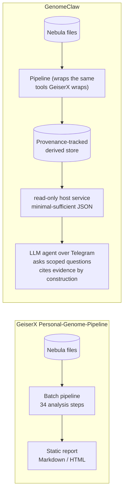

# Open-Source Personal-Genomics CLI Tools — Alignment with GenomeClaw Plans

**Status**: Reference report
**Created**: 2026-05-10
**Audience**: Future-self, future contributors, planning agents
**Companion to**: [grand-plan.md](../reference/grand-plan.md), [architecture.md](../reference/architecture.md), [user-stories.md](../reference/user-stories.md), [active/mvp/spec.md](../plans/active/mvp/spec.md)

---

## Why this report exists

A general-purpose model was asked the same question a Nebula-30× user might ask Google: *"What open-source CLI tools should I use to analyze my Nebula 30× WGS data against current best evidence for health and lifestyle markers?"* — and produced two thorough answers (Answer 1, Answer 2) recommending well-known tooling: **PharmCAT**, **VEP**, **bcftools**, **pgsc_calc**, **OpenCRAVAT/OakVar**, **PRSice-2**, **GeiserX Personal-Genome-Pipeline**, **Just-DNA-Seq**, **GenomeChronicler**, **WGS Extract**, **SnpEff**, **CANVAR**, **PRSKB**, and a few others.

This report cross-references those recommendations against the GenomeClaw stack as currently planned (MVP spec Q1–Q10; grand-plan.md Decisions Taken; architecture.md Component 1) and answers three concrete questions:

1. Are we reinventing the wheel?
2. Where there is a wheel, are we using it?
3. Where there isn't, is the gap real or intentional?

The short version: **GenomeClaw's "Wrappers over rewrites" strategic constraint ([grand-plan.md](../reference/grand-plan.md#wrappers-over-rewrites)) is doing exactly what it promises**. The tools both answers nominate as best-in-class are, with one deliberate exception (SnpEff) and one upgrade (Cyrius on top of PharmCAT), already the tools the MVP plan specifies. The remaining off-the-shelf options are alternative *reports*, not alternative *foundations* — and they're orthogonal to the agent-integration problem GenomeClaw exists to solve.

---

## At-a-glance: tool-by-tool alignment

| Recommended tool | In which answer | Current GenomeClaw status | Resolution doc |
|---|---|---|---|
| **bcftools / samtools / htslib / tabix / bgzip** | Both | ✅ Adopted (Phase 2/3, baked into `genomeclaw/toolkit` image) | [architecture.md § Host pipeline CLI](../reference/architecture.md#1-host-pipeline-cli--genomeclaw) |
| **VEP** | Both | ✅ Adopted as the default annotator (Q5) — with **LOFTEE + AlphaMissense + SpliceAI + vcfanno** plugin stack and **MANE Select** transcript pinning | [spec.md Q5](../plans/active/mvp/spec.md#q5--annotator-stack-vep--loftee--alphamissense--spliceai--vcfanno-supersedes-q1) |
| **vcfanno** *(Answer 1, implicit in VEP plugin discussion)* | Answer 1 | ✅ Adopted (Q5) for ClinVar + gnomAD v4 + dbSNP overlays | [spec.md Q5](../plans/active/mvp/spec.md#q5--annotator-stack-vep--loftee--alphamissense--spliceai--vcfanno-supersedes-q1) |
| **PharmCAT** | Both | ✅ Adopted (Q6) for PGx, **augmented** with Cyrius outside-call for CYP2D6 (which PharmCAT does not call from VCF) | [spec.md Q6](../plans/active/mvp/spec.md#q6--cyp2d6-outside-call-via-cyrius-into-pharmcat) |
| **Cyrius** *(not in either answer)* | — | ✅ Adopted (Q6) — covers the ~25% of clinically prescribed drugs that depend on CYP2D6; closes a gap neither answer flagged | [spec.md Q6](../plans/active/mvp/spec.md#q6--cyp2d6-outside-call-via-cyrius-into-pharmcat) |
| **mosdepth** *(not in either answer)* | — | ✅ Adopted (Q7) — coverage-aware gene queries to prevent false reassurance ("no pathogenic *BRCA1* variants" → "but exon 11 averaged 4×"); neither answer surfaced this failure mode | [spec.md Q7](../plans/active/mvp/spec.md#q7--coverage-aware-gene-queries-mosdepth--genomeclaw_gene-5th-tool) |
| **`pgsc_calc` (PGS Catalog Calculator, nf-core)** | Answer 1 | ✅ Adopted (Q8) — three-trait initial panel (CAD, T2D, breast/prostate); ancestry-normalized via `--run_ancestry` | [spec.md Q8](../plans/active/mvp/spec.md#q8--prs-panel-via-pgsc_calc--genomeclaw_pgs-6th-tool) |
| **PRSice-2** | Answer 2 | ❌ Not adopted | Below — **§ Tools deliberately not adopted** |
| **PRSKB / PolyRiskScore** | Answer 1 | ❌ Not adopted | Below |
| **PLINK 2.0** | Answer 2 | ❌ Not adopted | Below |
| **SnpEff + SnpSift** | Both | ❌ Superseded by Q5 — pathogenicity-call divergence makes clinical-track findings unsafe | [spec.md Q5](../plans/active/mvp/spec.md#q5--annotator-stack-vep--loftee--alphamissense--spliceai--vcfanno-supersedes-q1) |
| **OpenCRAVAT / OakVar** | Both | ❌ Not adopted (modular annotator framework — overlapping with VEP+plugins+vcfanno) | Below |
| **CANVAR** *(2024, ClinVar-focused)* | Answer 1 | ❌ Not adopted — vcfanno+ClinVar covers the same surface | Below |
| **ANNOVAR** | Answer 1 | ❌ Not adopted — license is non-OSI, free for non-commercial only | Below |
| **GeiserX Personal-Genome-Pipeline** | Answer 1 | ⚠️ Adjacent, not adopted — closest competitor in shape | Below — **§ The closest competitor: GeiserX** |
| **Just-DNA-Seq** | Answer 1 | ⚠️ Adjacent, not adopted — built on OakVar | Below |
| **GenomeChronicler** | Answer 1 | ⚠️ Adjacent, not adopted — academic report generator | Below |
| **WGS Extract** | Answer 1 | ❌ Not adopted (Nebula-format helper — covered by our ingest pipeline) | Below |
| **HLA typing (T1K)** *(implicit; mentioned in PGx contexts)* | — | ⏸️ Deferred (Q10 — trigger: user asks about abacavir / carbamazepine / celiac / AS) | [spec.md Q10](../plans/active/mvp/spec.md#q10--defer-by-default-scope-discipline--trigger-list) |
| **ExpansionHunter** *(repeat expansions)* | — | ⏸️ Deferred (Q10 — trigger: user asks about Huntington's / ALS / Friedreich's / Fragile X) | [spec.md Q10](../plans/active/mvp/spec.md#q10--defer-by-default-scope-discipline--trigger-list) |
| **Manta / structural variants** | — | ⏸️ Deferred (Q10) | [spec.md Q10](../plans/active/mvp/spec.md#q10--defer-by-default-scope-discipline--trigger-list) |
| **mity / mtDNA-aware caller** | — | ⏸️ Deferred (Q10) | [spec.md Q10](../plans/active/mvp/spec.md#q10--defer-by-default-scope-discipline--trigger-list) |

Legend: ✅ adopted · ⚠️ adjacent / overlapping shape · ❌ not adopted · ⏸️ explicitly deferred with a trigger

---

## Are we reinventing the wheel?

**No** — at the bioinformatics layer. GenomeClaw orchestrates a stack of community-maintained tools whose individual capabilities the answers correctly identify. The MVP's six host CLI subcommands (`fetch`, `ingest`, `normalize`, `annotate`, `materialize`, `cyp2d6-call`, `pgs-compute`) are wrappers; none of them reimplement the underlying tools' work.

**Yes** — at the agent-integration layer. There is no off-the-shelf project that does what GenomeClaw does at this layer:

- A **two-domain split** ([architecture.md](../reference/architecture.md)) where raw genomic artifacts are physically unreachable from the LLM-facing sandbox (`INV-D002`) — neither GeiserX, Just-DNA-Seq, nor GenomeChronicler enforce this boundary at all; they are batch pipelines that produce static reports.
- **Minimal-sufficient tool outputs** flowing to the LLM (`INV-P002`) — no general-purpose pipeline shapes its output for an agent's tool-call envelope.
- **Coverage-grounded negative answers** (Q7) — no off-the-shelf personal-genomics report joins per-gene coverage to the answer surface; this is the project's most consequential anti-false-reassurance contribution.
- **Evidence-traceable findings with structural escalation markers** (`INV-E001`, `INV-C001`) — report generators surface findings, but not in a schema that constrains an LLM to cite evidence by construction.
- **Single-user curated lifestyle calibration** (Q9) — `reference/curated_notes/<gene>.md` is uniquely suited to a single-user system; multi-user pipelines must build taxonomies instead.
- **Rebuildable derived stores with provenance columns** (`INV-R001`) — pipelines emit reports, not queryable provenance-tracked stores.

So the project is doing exactly what its strategic constraint claims: **wrap the established tools, build only the agent-integration surface that doesn't exist anywhere else**.

---

## Tools deliberately not adopted

### SnpEff + SnpSift (recommended by both answers)

**Status**: Considered (Q1, 2026-05-06), then **superseded by Q5** (2026-05-08).

The earlier decision picked SnpEff because setup cost was the lowest of the three candidate annotators. The supersedure was driven by the [POC pipeline recommendations report](../plans/completed/poc-pipeline-recommendations/work-notes.md): independent benchmarks show LoF-prediction concordance falling to 65–44% under different transcript sets, and standardized testing finds SnpEff downgrades ~67% of pathogenic / likely-pathogenic variants relative to the clinical-grade reference standard. For an agent that emits clinical-track findings with `clinical_escalation` markers, that disagreement rate is unsafe (`INV-C001`). VEP + LOFTEE + AlphaMissense + SpliceAI + vcfanno is the smallest stack that closes the gap.

The answers' inclusion of SnpEff is reasonable for casual exploratory use; it is not safe for agent-driven clinical-track output. Both answers also list VEP, so swapping is consistent with the more cautious half of each recommendation set.

### PRSice-2 / PRSKB / PLINK 2.0 (recommended by Answers 2 and 1)

**Status**: Not adopted; `pgsc_calc` is the choice (Q8).

`pgsc_calc` (PGS Catalog Calculator, the nf-core pipeline maintained by the PGS Catalog team) is the most evidence-traceable PRS tool: each score links back to its source publication via `source_pgs_id`, and `--run_ancestry` provides continuous-ancestry calibration against 1000G + HGDP. PRSice-2 and PLINK 2.0 are foundational engines but require user-side scripting to align scores to the PGS Catalog and to handle ancestry calibration; PRSKB has its own catalog with monthly updates but no equivalent of `pgsc_calc`'s liftover/strand/multi-allelic discipline.

For a single user feeding PRS into an agent that must emit `source_pgs_id` and `study_population` structurally, `pgsc_calc` is the correct choice. Answer 1 ranks it the same way ("most evidence-traceable PRS tool because each score links back to its publication").

### OpenCRAVAT / OakVar / CANVAR / ANNOVAR

**Status**: Not adopted.

- **OpenCRAVAT / OakVar** is a modular annotator framework whose surface area overlaps with VEP+vcfanno. Just-DNA-Seq is built on OakVar; if we wanted to import a specific OakVar annotator module that VEP doesn't cover, that would be a small one-shot integration rather than a foundation switch.
- **CANVAR** (2024) is a focused ClinVar-only annotator. The vcfanno + ClinVar path already covers this surface with the same evidence quality.
- **ANNOVAR** is feature-rich and current (ClinVar 20250721 integrated; 2025 LoF/GoF predictions) but the license is non-OSI — free for non-commercial personal/academic use only. For a self-hosted single-user project the license bar is unimportant; we still prefer OSI-clean alternatives, and VEP + plugins is functionally equivalent for our purposes. Answer 1 flagged the same license caveat.

### WGS Extract

**Status**: Not adopted.

WGS Extract is a vendor-format helper that bridges Nebula/Dante/Sequencing.com files into downstream tools (CRAM→BAM conversion, microarray-style file extraction, Y/mtDNA subsetting). The shape it solves — vendor file handling — is covered by the GenomeClaw ingest pipeline (Phase 2 + the [cram-scratch-strategy plan](../plans/active/cram-scratch-strategy/)). WGS Extract is GUI-first; we would not want it on the agent-callable surface either way.

---

## The closest competitor: GeiserX Personal-Genome-Pipeline

Of all the recommendations, **GeiserX Personal-Genome-Pipeline** is the closest in shape to what GenomeClaw does end-to-end. It explicitly targets Nebula deliverables, runs locally in Docker, covers 34 analysis steps (variant calling, PGx, structural variants, cancer predisposition, polygenic risk, ancestry, telomere length, mtDNA), and produces unified reports. The stated runtime (6–12 hours, 16-core, ~500 GB) is in the same envelope as our personal-host budget.

**Why it isn't a substitute for GenomeClaw**:

The two systems answer different questions:

- **GeiserX** answers *"what's in my genome?"* in one batch run, producing a comprehensive document the user reads end-to-end.
- **GenomeClaw** answers *"what does my genome say about [the specific thing the user is asking right now]?"* over a long-lived, asynchronous Telegram conversation, with privacy and evidence-binding guarantees that a static-report pipeline does not need to make.

GeiserX is a **plausible reference for additional analysis steps to add to the GenomeClaw pipeline** (telomere length, ancestry inference, mtDNA-aware calling) — most of which we have already deferred under Q10 with explicit triggers. None of those triggers depend on building from scratch; when one fires, we'd add the corresponding tool to the toolkit image alongside the existing wrappers.

It is **not a foundation we should rebuild on**: doing so would lose the agent-integration surface, the host/sandbox split, and the provenance/rebuildability guarantees that are the entire reason GenomeClaw exists.

---

## Things both answers missed that GenomeClaw addresses

Two architectural choices in the MVP plan are worth highlighting because they appear in **neither** of the two answers, despite being load-bearing for the project's safety claims:

1. **Coverage-aware false-reassurance prevention** (Q7 / `mosdepth` / `genomeclaw_gene`). Neither answer mentions coverage. The most dangerous failure mode of any personal-genomics report is *"no pathogenic *BRCA1* variants found"* when the relevant exon was undercovered. GenomeClaw materializes per-gene mean coverage at ingest, surfaces it on `/v1/gene/{symbol}`, and the agent grounds negative answers in it (see [Story 3 in user-stories.md](../reference/user-stories.md)). This is the single biggest "wheel that didn't exist" the project is building.
2. **CYP2D6 outside-call via Cyrius** (Q6). Both answers nominate PharmCAT for PGx but neither mentions that PharmCAT does not call CYP2D6 from VCF. Without Cyrius, the PGx track is unsafe for any CYP2D6-relevant prescription — codeine, tramadol, oxycodone, tamoxifen, many SSRIs and antipsychotics, ~25% of clinically prescribed drugs. Cyrius scores 96.5–99.3% concordance on the GeT-RM truth set vs. Aldy 86.8–92.2%. This is a wrapper add-on (~50 lines of glue), not a wheel reinvention, but it's a wheel both answers missed.

If the project later writes user-facing material about *why GenomeClaw exists when so much off-the-shelf tooling is available*, these two are the strongest concrete examples beyond the agent-integration story.

---

## Recommendations to the planning surface

**No changes recommended to the MVP plan.** The plan already adopts every tool both answers identify as best-in-class for the surfaces the project needs, with two superior substitutions (VEP+plugins over SnpEff; `pgsc_calc` over PRSice-2 / PRSKB / PLINK), one critical addition both answers missed (Cyrius for CYP2D6), and one architectural addition neither answer surfaced (coverage-aware queries via `mosdepth`).

**Triggers to keep an eye on** — entries in [spec.md Q10](../plans/active/mvp/spec.md#q10--defer-by-default-scope-discipline--trigger-list)'s deferred list whose triggers map to tools the answers mentioned in passing:

| Deferred tool | Trigger | Reasoning if trigger fires |
|---|---|---|
| HLA typing (T1K) | User asks about abacavir / carbamazepine / celiac / AS | A one-shot integration; HLA typing is structurally similar to the Cyrius CYP2D6 outside-call pattern |
| ExpansionHunter | User asks about Huntington's, ALS, Friedreich's, Fragile X | Trigger likely to fire eventually given user demographics; build when it does |
| Manta (SVs) | User asks about a known familial deletion | Honest answer is often "request MLPA / clinical-grade testing" first |
| mity (mtDNA) | User asks an mtDNA-specific question | Standard small-variant callers handle mtDNA poorly |
| Population-specific reference panels (SweGen, GenomeAsia) | somalier ancestry inference matches a panel population | One-time configuration add per matched population |

Also worth re-examining if usage data ever justifies it:

- **Telomere length / ancestry inference / mtDNA caller** as add-ons inspired by the GeiserX pipeline's coverage. None of these are MVP work.
- **An OakVar annotator module** if a specific evidence type the agent needs is not surfaced by VEP + plugins + vcfanno. We would import the module, not the framework.

---

## Closing summary

| Question | Answer |
|---|---|
| Are we reinventing the wheel at the bioinformatics layer? | No. The MVP wraps the same tools both Answers nominate as best-in-class. |
| Are we using the recommended tools where they exist? | Yes — and we substituted the safer alternative in the one case (SnpEff → VEP+plugins) where the recommended tool's clinical-track failure rate would violate `INV-C001`. |
| Where the tools don't exist, is the gap real or intentional? | Real and intentional. The agent-integration surface (host/sandbox split, minimal-sufficient outputs, evidence-traceable findings, coverage-grounded negative answers, single-user curated lifestyle calibration) is what GenomeClaw is for, and no off-the-shelf tool occupies that surface. |
| Anything missing from the plan that the answers exposed? | No. The plan is more complete than either answer (Cyrius + mosdepth are both load-bearing additions both answers missed). |
| Anything to revisit later? | The deferred triggers in [spec.md Q10](../plans/active/mvp/spec.md#q10--defer-by-default-scope-discipline--trigger-list); GeiserX-inspired analysis types (telomere length, ancestry, mtDNA) as one-shot additions when triggers fire. |

The "Wrappers over rewrites" strategic constraint is doing its job. No plan changes are warranted by this audit.
